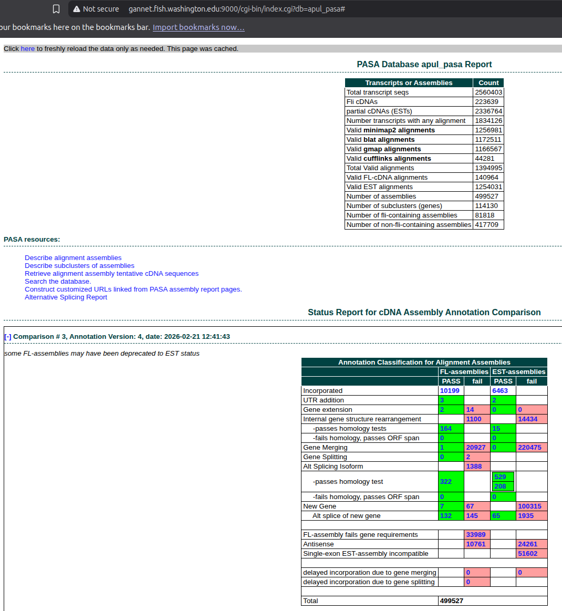

# INTRO

This notebook performs a comprehensive transcriptome assembly and annotation for *A.pulchra* using the [PASA (Program to Assemble Spliced Alignments)](https://github.com/PASApipeline/PASApipeline/wiki), as part of the E5 [timeseries_molecular project](https://github.com/urol-e5/timeseries_molecular). This produced an updated genome annotation that incorporates the RNA-seq data, including alternative splicing information. However, it's important to note that the resulting GFF/BED files will _not_ contain any annotations from the original genome GFF which did not have any support from RNA-seq alignments!

Thus, the resulting PASA annotations will be a _subset_ of the original genome annotations, but with updated gene models based on the RNA-seq data. The PASA pipeline will merge the de novo and genome-guided transcriptome assemblies, clean the transcripts, and update the genome annotations with alternative splicing information where supported by the data.

The markdown below was produced from the original Rmd script:

- [00.30-D-Apul-transcriptome-assembly-Trinity.Rmd](https://github.com/urol-e5/timeseries_molecular/blob/1c9153b836d2ebba3d7aa22e896fa71749f28d8b/D-Apul/code/00.30-D-Apul-transcriptome-assembly-Trinity.Rmd) (GitHub)

Not described below is the access to the PASA web portal, which allows the user to browse the PASA results in a user-friendly interface. This can be accessed here:

- http://gannet.fish.washington.edu:9000/

Enter `apul_pasa` as the database name. If this is your first time using the database, it will take many minutes for the data to load (the MySQL files behind the scenes are ~10GB in size, so it takes a while to process). After initial acces, the data is cached and access is much faster.



---

# 1 BACKGROUND

This notebook performs a comprehensive transcriptome assembly and
annotaiton for *A.pulchra* using the [PASA (Program to Assemble Spliced
Alignments)](https://github.com/PASApipeline/PASApipeline/wiki)
pipeline, as well as alternative isoform identification. This pipeline
relies on both *de novo* and genome-guided transcriptome assemblies with
[Trinity](https://github.com/trinityrnaseq/trinityrnaseq/wiki).

The key steps include: 1. **De Novo Assembly** and **Genome-Guided
Assembly**: Using
[Trinity](https://github.com/trinityrnaseq/trinityrnaseq/wiki) to
assemble transcripts directly from RNA-seq reads. 2. **PASA Pipeline**:
Utilizing [PASA](https://github.com/PASApipeline/PASApipeline/wiki) to
merge the assemblies, clean transcripts, and update genome annotations
with alternative splicing information.

**Programs Used:** -
[Trinity](https://github.com/trinityrnaseq/trinityrnaseq/wiki) -
Transcriptome assembly. -
[PASA](https://github.com/PASApipeline/PASApipeline/wiki) - Annotation
update and transcript assembly refinement. -
[AGAT](https://github.com/NBISweden/AGAT) - GFF/GTF toolkit for
annotation merging and conversion. - [Singularity
(Apptainer)](https://apptainer.org/) - Container platform used to run
assembly pipelines.

## 1.1 Expected outputs

**TRINITY**:

- FastA: *De novo* transcriptome assembly.
- FastA: Genome-guided transcriptome assembly.

**PASA**:

- GFF3: Genome annotations produced by PASA pipeline in GFF3.
- BED: Genome annotations produced by PASA pipeline in BED format.

# 2 SETUP

## 2.1 Libraries and markdown settings

``` r
library(knitr)
knitr::opts_chunk$set(
  echo = TRUE,         # Display code chunks
  eval = FALSE,        # Evaluate code chunks
  warning = FALSE,     # Hide warnings
  message = FALSE,     # Hide messages
  comment = ""         # Prevents appending '##' to beginning of lines in code output
)
```

## 2.2 Set variables

``` r
# DIRECTORIES
top_output_dir <- file.path("..", "output")

output_dir <- file.path(top_output_dir, "00.30-D-Apul-transcriptome-assembly-Trinity")
de_novo_output_dir <- file.path(output_dir, "de_novo_assembly")
genome_guided_output_dir <- file.path(output_dir, "genome_guided_assembly")
pasa_container_dir <- file.path("/home", "shared", "containers")
PASA_HOME <- "/usr/local/src/PASApipeline"
pasa_output_dir <- file.path(output_dir, "PASA")
stringtie_gtf_dir <- file.path(top_output_dir, "02.20-D-Apul-RNAseq-alignment-HiSat2")
trimmed_reads_dir <- file.path(top_output_dir, "01.00-D-Apul-RNAseq-trimming-fastp-FastQC-MultiQC")


# FILES
bam_alignment <- file.path(top_output_dir, "02.20-D-Apul-RNAseq-alignment-HiSat2", "sorted-bams-merged.bam")

## Path for genome will be relative to PASA output dir
genome_fasta <- file.path("..", "..", "..", "data", "Apulchra-genome.fa")
genome_gff <- file.path("..", "data", "Apulchra-genome.gff")
denovo_assembly_name <- "apul-denovo-Trinity"
genome_guided_assembly_name <- "apul-GG-Trinity"
pasa_bed <- "apul-PASA.bed"
pasa_container <- "pasapipeline.v2.5.3.simg"
pasa_gff <- "apul-PASA.gff3"
stringtie_gtf <- file.path(stringtie_gtf_dir, "Apulchra-genome.stringtie.gtf")

#SETTINGS
## THREADS
threads <- "44"

## MAX RAM
max_ram <- "100G"

# PROGRAMS
samtools <- file.path("/home", "shared", "samtools-1.12", "samtools")


# FORMATTING
line <- "-----------------------------------------------"

# Export these as environment variables for bash chunks.
Sys.setenv(
  bam_alignment = bam_alignment,
  denovo_assembly_name = denovo_assembly_name,
  de_novo_output_dir = de_novo_output_dir,
  genome_fasta = genome_fasta,
  genome_gff = genome_gff,
  genome_guided_assembly_name = genome_guided_assembly_name,
  genome_guided_output_dir = genome_guided_output_dir,
  line = line,
  max_ram = max_ram,
  output_dir = output_dir,
  top_output_dir = top_output_dir,
  pasa_container = pasa_container,
  pasa_container_dir = pasa_container_dir,
  pasa_bed = pasa_bed,
  pasa_gff = pasa_gff,
  PASA_HOME = PASA_HOME,
  pasa_output_dir = pasa_output_dir,
  samtools = samtools,
  stringtie_gtf_dir = stringtie_gtf_dir,
  stringtie_gtf = stringtie_gtf,
  threads = threads,
  trimmed_reads_dir = trimmed_reads_dir
)
```

# 3 DE NOVO ASSEMBLY

## 3.1 Run Trinity

Trinity was run using the [Trinity Singularity (Apptainer)
container](https://github.com/trinityrnaseq/trinityrnaseq/wiki/Trinity-in-Docker#running-trinity-using-singularity),
`trinityrnaseq.v2.15.2.simg` from the
`urol-e5/timeseries_molecular/D-Apul/code/` directory.

This was done in a terminal, outside of this notebook.

### 3.1.1 Set Bash variables

``` bash
# Directories
top_output_dir="../output"

output_dir="${top_output_dir}/00.30-D-Apul-transcriptome-assembly-Trinity"
de_novo_output_dir="${output_dir}/de_novo_assembly"
genome_guided_output_dir="${output_dir}/genome_guided_assembly"
trimmed_reads_dir="${top_output_dir}/01.00-D-Apul-RNAseq-trimming-fastp-FastQC-MultiQC"

# PASA INPUT FILES
####### NEED TO BE RELATIVE TO PASA SUBDIRECTORY #######
genome_fasta="../../../data/Apulchra-genome.fa"
genome_gff="../../../data/Apulchra-genome.gff3"
pasa_container="pasapipeline.v2.5.3.simg"
PASA_HOME="/usr/local/src/PASApipeline"
stringtie_gtf="../../02.20-D-Apul-RNAseq-alignment-HiSat2/Apulchra-genome.stringtie.gtf"

## THREADS
threads="44"

## MAX RAM
max_ram="100G"

# Make output directoy, if it doesn't exist
mkdir --parents ${de_novo_output_dir}

## Inititalize arrays
R1_array=()
R2_array=()

# Variables for R1/R2 lists
R1_list=""
R2_list=""

# Create array of fastq R1 files
R1_array=(${trimmed_reads_dir}/*R1_001.fastp-trim.fq.gz)

# Create array of fastq R2 files
R2_array=(${trimmed_reads_dir}/*R2_001.fastp-trim.fq.gz)

# Create list of fastq files used in analysis
## Uses parameter substitution to strip leading path from filename
if [ ! -f "${de_novo_output_dir}/fastq.list.txt" ]; then
  for fastq in ${trimmed_reads_dir}/*.fq.gz
  do
    echo "${fastq##*/}" >> ${de_novo_output_dir}/fastq.list.txt
  done
fi

# Create comma-separated lists of FastQ reads
R1_list=$(echo "${R1_array[@]}" | tr " " ",")
R2_list=$(echo "${R2_array[@]}" | tr " " ",")
```

### 3.1.2 Run Trinity Singularity image.

Used “stranded” setting (–SS_lib_type).

``` bash
singularity exec \
-B /home \
-e trinityrnaseq.v2.15.2.simg \
Trinity \
--seqType fq \
--max_memory ${max_ram} \
--CPU ${threads} \
--SS_lib_type RF \
--left "${R1_list}" \
--right "${R2_list}" \
--output ${de_novo_output_dir}/trinity_out_dir \
--full_cleanup \
> ${de_novo_output_dir}/trinity.log \
2>&1
```

## 3.2 Rename output files

### 3.2.1 Rename FastA

``` bash
# Rename generic assembly FastA
mv ${de_novo_output_dir}/trinity_out_dir.Trinity.fasta \
${de_novo_output_dir}/${denovo_assembly_name}.fasta
```

### 3.2.2 Rename gene map and log

``` bash
mv ${de_novo_output_dir}/trinity_out_dir.Trinity.fasta.gene_trans_map \
${de_novo_output_dir}/${denovo_assembly_name}.gene_trans_map

mv ${de_novo_output_dir}/trinity.log \
${de_novo_output_dir}/${denovo_assembly_name}.log
```

### 3.2.3 Assembly stats

#### 3.2.3.1 Run Trinity Singularity image.

``` bash
singularity exec -B /home \
-e trinityrnaseq.v2.15.2.simg \
/usr/local/bin/util/TrinityStats.pl \
../output/00.30-D-Apul-transcriptome-assembly-Trinity/de_novo_assembly/apul-denovo-Trinity.fasta \
> ../output/00.30-D-Apul-transcriptome-assembly-Trinity/de_novo_assembly/apul-denovo-Trinity.stats
```

## 3.3 Create FastA index

``` bash
${samtools} faidx \
${de_novo_output_dir}/${denovo_assembly_name}.fasta
```

## 3.4 Checksums

``` bash
cd ${de_novo_output_dir}

md5sum ${denovo_assembly_name}.fasta | tee ${denovo_assembly_name}.fasta.md5
```

    f5a8213c889f1fdbd8a48b5047e8d797  apul-denovo-Trinity.fasta

# 4 GENOME-GUIDED ASSEMBLY

Trinity was run using the [Trinity Singularity (Apptainer)
container](https://github.com/trinityrnaseq/trinityrnaseq/wiki/Trinity-in-Docker#running-trinity-using-singularity),
`trinityrnaseq.v2.15.2.simg` from the
`urol-e5/timeseries_molecular/D-Apul/code/` directory.

This was done in a terminal, outside of this notebook.

``` bash
singularity exec \
-B /home -e trinityrnaseq.v2.15.2.simg \
Trinity \
--genome_guided_bam ../output/02.20-D-Apul-RNAseq-alignment-HiSat2/sorted-bams-merged.bam \
--genome_guided_max_intron 10000 \
--max_memory ${max_ram} \
--CPU ${threads} \
--SS_lib_type RF \
--output ${genome_guided_output_dir}/trinity_out_dir \
--full_cleanup \
> ${genome_guided_output_dir}/trinity.log 2>&1
```

## 4.1 Rename output files

### 4.1.1 Rename FastA

``` bash
# Rename generic assembly FastA
mv ${genome_guided_output_dir}/trinity_out_dir.Trinity-GG.fasta \
${genome_guided_output_dir}/${genome_guided_assembly_name}.fasta
```

### 4.1.2 Rename gene map and log

``` bash
mv ${genome_guided_output_dir}/trinity_out_dir.Trinity-GG.fasta.gene_trans_map \
${genome_guided_output_dir}/${genome_guided_assembly_name}.gene_trans_map

mv ${genome_guided_output_dir}/trinity.log \
${genome_guided_output_dir}/${genome_guided_assembly_name}.log
```

## 4.2 Create FastA index

``` bash
${samtools} faidx \
${genome_guided_output_dir}/${genome_guided_assembly_name}.fasta
```

## 4.3 Checksums

``` bash
cd ${genome_guided_output_dir}

md5sum ${genome_guided_assembly_name}.fasta | tee ${genome_guided_assembly_name}.fasta.md5
```

    44c4f7b6493239377cf02d9f9d5fb15f  apul-GG-Trinity.fasta

### 4.3.1 Assembly stats

#### 4.3.1.1 Run Trinity Singularity image.

``` bash
singularity exec -B /home \
-e trinityrnaseq.v2.15.2.simg \
/usr/local/bin/util/TrinityStats.pl \
../output/00.30-D-Apul-transcriptome-assembly-Trinity/genome_guided_assembly/apul-GG-Trinity.fasta \
> ../output/00.30-D-Apul-transcriptome-assembly-Trinity/genome_guided_assembly/apul-GG-Trinity.stats
```

# 5 PASA PIPELINE

## 5.1 Concatenate Trinity assemblies

``` bash
cat ${de_novo_output_dir}/${denovo_assembly_name}.fasta \
${genome_guided_output_dir}/${genome_guided_assembly_name}.fasta \
> ${pasa_output_dir}/transcripts.fasta
```

### 5.1.1 Confirm counts

``` bash
# Count transcripts in each file
denovo_count=$(grep -c "^>" ${de_novo_output_dir}/${denovo_assembly_name}.fasta)
genome_guided_count=$(grep -c "^>" ${genome_guided_output_dir}/${genome_guided_assembly_name}.fasta)
pasa_count=$(grep -c "^>" ${pasa_output_dir}/transcripts.fasta)

# Calculate sum of first two counts
sum=$((denovo_count + genome_guided_count))

# Compare sum to PASA count
echo "De novo count: $denovo_count"
echo "Genome-guided count: $genome_guided_count"
echo "Sum: $sum"
echo "PASA count: $pasa_count"

if [ $sum -eq $pasa_count ]; then
    echo "✓ Counts match: $sum = $pasa_count"
else
    echo "✗ Counts do not match: $sum ≠ $pasa_count (difference: $((pasa_count - sum)))"
fi
```

    De novo count: 1854167
    Genome-guided count: 661982
    Sum: 2516149
    PASA count: 2516149
    ✓ Counts match: 2516149 = 2516149

## 5.2 Extract transcript accessions

``` bash
singularity exec \
-B /home \
-e ${pasa_container_dir}/${pasa_container} \
$PASA_HOME/misc_utilities/accession_extractor.pl \
< ${de_novo_output_dir}/${denovo_assembly_name}.fasta \
> ${pasa_output_dir}/tdn.accs

head ${pasa_output_dir}/tdn.accs
```

## 5.3 Clean transcripts

``` bash
cd ${pasa_output_dir}

singularity exec \
-B /home \
-e \
--env USER="$USER" \
${pasa_container} \
$PASA_HOME/bin/seqclean \
transcripts.fasta \
-c 16
```

## 5.4 PASA Assembly

### 5.4.1 Fix schema key length

``` bash
cd ${pasa_output_dir}

#### Fix schema key length issue ####
singularity exec ${pasa_container} \
cat $PASA_HOME/schema/cdna_alignment_mysqlschema \
> cdna_alignment_mysqlschema

# Fix all variations of gene_id and model_id indexes
sed -i 's/KEY gene_id_idx (gene_id)/KEY gene_id_idx (gene_id(255))/g' cdna_alignment_mysqlschema
sed -i 's/KEY mod_idx (model_id)/KEY mod_idx (model_id(255))/g' cdna_alignment_mysqlschema
sed -i 's/(gene_id)/(gene_id(255))/g' cdna_alignment_mysqlschema
sed -i 's/(model_id)/(model_id(255))/g' cdna_alignment_mysqlschema
sed -i 's/KEY gene_idx (annotation_version,gene_id)/KEY gene_idx (annotation_version,gene_id(255))/g' cdna_alignment_mysqlschema
```

### 5.4.2 Run PASA Assembly Pipeline

This was executed outside of RStudio due to the verbose output, which
will cause RStudio to crash.

``` bash
singularity exec \
-B /home \
-B /var/run/mysqld/mysqld.sock:/var/run/mysqld/mysqld.sock \
-B $PWD/conf.txt:$PASA_HOME/pasa_conf/conf.txt \
-B $PWD/cdna_alignment_mysqlschema:$PASA_HOME/schema/cdna_alignment_mysqlschema \
${pasa_container} \
$PASA_HOME/Launch_PASA_pipeline.pl \
--config alignAssembly.config \
--create \
--run \
--genome ${genome_fasta} \
--transcripts transcripts.fasta.clean \
--trans_gtf ${stringtie_gtf} \
--ALT_SPLICE \
-T \
-u transcripts.fasta \
--ALIGNERS blat,gmap,minimap2 \
--TDN tdn.accs \
--transcribed_is_aligned_orient \
--annot_compare \
-L \
--annots ${genome_gff} \
--TRANSDECODER \
--CPU ${threads}
```

### 5.4.3 Alternative Splicing

This doesn’t seem to have run during the assembly phase, so ran
separately.

``` bash
singularity exec \
-B /home \
-B /var/run/mysqld/mysqld.sock:/var/run/mysqld/mysqld.sock \
-B $PWD/conf.txt:$PASA_HOME/pasa_conf/conf.txt \
-B $PWD/cdna_alignment_mysqlschema:$PASA_HOME/schema/cdna_alignment_mysqlschema \
${pasa_container} \
$PASA_HOME/Launch_PASA_pipeline.pl \
-c alignAssembly.config \
--ALT_SPLICE \
-g ${genome_fasta} \
-t all.transcripts.fasta.clean \
--CPU ${threads}
```

### 5.4.4 Update annotations

Now includes alternative splicing info.

Uses output GFF3 from initial annotations as annotation *input*.

``` bash
singularity exec \
-B /home \
-B /var/run/mysqld/mysqld.sock:/var/run/mysqld/mysqld.sock \
-B $PWD/conf.txt:$PASA_HOME/pasa_conf/conf.txt \
-B $PWD/cdna_alignment_mysqlschema:$PASA_HOME/schema/cdna_alignment_mysqlschema \
${pasa_container} \
$PASA_HOME/Launch_PASA_pipeline.pl \
-c annotCompare.config \
--annot_compare \
-L \
--annots apul_pasa.gene_structures_post_PASA_updates.2550130.gff3 \
-g ${genome_fasta} \
-t all.transcripts.fasta.clean \
--CPU ${threads}
```

# 6 PASA OUTPUTS

## 6.1 Generate checksums

``` bash
cd "${pasa_output_dir}"

md5sum apul_pasa.gene_structures_post_PASA_updates.3761114.gff3 | tee apul_pasa.gene_structures_post_PASA_updates.3761114.gff3.md5

md5sum apul_pasa.gene_structures_post_PASA_updates.3761114.bed | tee apul_pasa.gene_structures_post_PASA_updates.3761114.bed.md5
```

    66809687062caaf68e2a5bf118a77398  apul_pasa.gene_structures_post_PASA_updates.3761114.gff3
    341d5aa495756bafcc5753722e8c93d4  apul_pasa.gene_structures_post_PASA_updates.3761114.bed

## 6.2 Rename outputs

``` bash
cd "${pasa_output_dir}"
cp apul_pasa.gene_structures_post_PASA_updates.3761114.gff3 "${pasa_gff}"

cp apul_pasa.gene_structures_post_PASA_updates.3761114.bed "${pasa_bed}"

md5sum "${pasa_gff}" | tee "${pasa_gff}".md5
md5sum "${pasa_bed}" | tee "${pasa_bed}".md5
```

    66809687062caaf68e2a5bf118a77398  apul-PASA.gff3
    341d5aa495756bafcc5753722e8c93d4  apul-PASA.bed

## 6.3 GFF3 Preview

``` bash
head -n 50 "${pasa_output_dir}"/"${pasa_gff}"
```

    # ORIGINAL: FUN_044110-T1 original gene structure, not modified by PASA
    ptg000092l  funannotate gene    6557    14524   .   +   .   ID=FUN_044110;Name=FUN_044110-T1
    ptg000092l  funannotate mRNA    6557    14524   .   +   .   ID=FUN_044110-T1;Parent=FUN_044110;Name=FUN_044110-T1
    ptg000092l  funannotate exon    6557    6575    .   +   .   ID=FUN_044110-T1.exon1;Parent=FUN_044110-T1
    ptg000092l  funannotate CDS 6557    6575    .   +   0   ID=FUN_044110-T1.cds.1;Parent=FUN_044110-T1
    ptg000092l  funannotate exon    8536    8657    .   +   .   ID=FUN_044110-T1.exon2;Parent=FUN_044110-T1
    ptg000092l  funannotate CDS 8536    8657    .   +   2   ID=FUN_044110-T1.cds.2;Parent=FUN_044110-T1
    ptg000092l  funannotate exon    9330    9410    .   +   .   ID=FUN_044110-T1.exon3;Parent=FUN_044110-T1
    ptg000092l  funannotate CDS 9330    9410    .   +   0   ID=FUN_044110-T1.cds.3;Parent=FUN_044110-T1
    ptg000092l  funannotate exon    10230   10307   .   +   .   ID=FUN_044110-T1.exon4;Parent=FUN_044110-T1
    ptg000092l  funannotate CDS 10230   10307   .   +   0   ID=FUN_044110-T1.cds.4;Parent=FUN_044110-T1
    ptg000092l  funannotate exon    12512   14524   .   +   .   ID=FUN_044110-T1.exon5;Parent=FUN_044110-T1
    ptg000092l  funannotate CDS 12512   14524   .   +   0   ID=FUN_044110-T1.cds.5;Parent=FUN_044110-T1


    #PROT FUN_044110-T1 FUN_044110  MLIFNRGELLFLPIRNVLCMMPQGYKNALPGYKDLYLSQAITEEVHNMFSTGIDCGVSSFKHGPSLSLLALDKKLCVIALIESLFQVRGLPFCARSLNKTALSTQSSLMSPHYLPLQSNQLGQVKPTFQLSEPGRSDENFSDTDPKFICKHPRIHVPTSVGVVQPSVRRRTSDNPVSPTESRSESPLFSLLHEPETSVATTTLGDPTNQLVSRTLAKSNVNQLSAQDIPNDSSVQQNSLESHLTPLNQPVDPDPLLPESIDGTSSIEIDSSKESTKSSRTVTLSESEMSPQLRLDLEEIRKFYSLPINLNRDGGVLQDVSIGKMLERIKGFLWFLKKVKGVEPALTYCINPEVLQQFVEFMMKNRGIKAITCSRYVTSLISACKVPLACTQDEQKEESLEKIRAIQRQLERLSRQEKIDSDSLNPQTDKVVYSELLELCREFKWEVSEKTGADRARSCMNLCLLLMYCAVNPGRVKEYISLRIYKDQSGDQLKDQNFIWFKEDGGIVLLENNYKTRNTYGLNTTDVSSVTYLNYYLQLYKSKMRSLLLHGNDHDFFFVAPRGNRFSHASYNYYISGLFEKYLSRRLTTVDLRKIVVNYFLSLPESGDYSLRESFATLMKHSIRAQQKYYDERPLTQKKDRALDLLTSVARRSLDEDEPEIVSDEDQEGYLDCLPVPGDFVALVAANSTEKVPEVFVAKVLRLSEDKKTAYLADFAEEEPGRFKSKAGKSYKENTNSLIFPIDIVFSHSDGLYELRTPKIDLHLVTVQKKS*

    # ORIGINAL: FUN_044109-T1 original gene structure, not modified by PASA
    ptg000092l  funannotate gene    3791    5008    .   +   .   ID=FUN_044109;Name=FUN_044109-T1
    ptg000092l  funannotate mRNA    3791    5008    .   +   .   ID=FUN_044109-T1;Parent=FUN_044109;Name=FUN_044109-T1
    ptg000092l  funannotate exon    3791    3811    .   +   .   ID=FUN_044109-T1.exon1;Parent=FUN_044109-T1
    ptg000092l  funannotate CDS 3791    3811    .   +   0   ID=FUN_044109-T1.cds.1;Parent=FUN_044109-T1
    ptg000092l  funannotate exon    4856    5008    .   +   .   ID=FUN_044109-T1.exon2;Parent=FUN_044109-T1
    ptg000092l  funannotate CDS 4856    5008    .   +   0   ID=FUN_044109-T1.cds.2;Parent=FUN_044109-T1


    #PROT FUN_044109-T1 FUN_044109  MSNFSIKSEDEPASPLVRTDKNEELPTIPQAFRKLKECYCNCSWGDSLHADPQLTGE*

    # ORIGINAL: FUN_044111-T1 original gene structure, not modified by PASA
    ptg000092l  funannotate gene    17683   22752   .   +   .   ID=FUN_044111;Name=FUN_044111-T1
    ptg000092l  funannotate mRNA    17683   22752   .   +   .   ID=FUN_044111-T1;Parent=FUN_044111;Name=FUN_044111-T1
    ptg000092l  funannotate exon    17683   17881   .   +   .   ID=FUN_044111-T1.exon1;Parent=FUN_044111-T1
    ptg000092l  funannotate CDS 17683   17881   .   +   0   ID=FUN_044111-T1.cds.1;Parent=FUN_044111-T1
    ptg000092l  funannotate exon    18082   18144   .   +   .   ID=FUN_044111-T1.exon2;Parent=FUN_044111-T1
    ptg000092l  funannotate CDS 18082   18144   .   +   2   ID=FUN_044111-T1.cds.2;Parent=FUN_044111-T1
    ptg000092l  funannotate exon    18985   19058   .   +   .   ID=FUN_044111-T1.exon3;Parent=FUN_044111-T1
    ptg000092l  funannotate CDS 18985   19058   .   +   2   ID=FUN_044111-T1.cds.3;Parent=FUN_044111-T1
    ptg000092l  funannotate exon    19708   19968   .   +   .   ID=FUN_044111-T1.exon4;Parent=FUN_044111-T1
    ptg000092l  funannotate CDS 19708   19968   .   +   0   ID=FUN_044111-T1.cds.4;Parent=FUN_044111-T1
    ptg000092l  funannotate exon    20540   21849   .   +   .   ID=FUN_044111-T1.exon5;Parent=FUN_044111-T1
    ptg000092l  funannotate CDS 20540   21849   .   +   0   ID=FUN_044111-T1.cds.5;Parent=FUN_044111-T1
    ptg000092l  funannotate exon    22188   22752   .   +   .   ID=FUN_044111-T1.exon6;Parent=FUN_044111-T1
    ptg000092l  funannotate CDS 22188   22752   .   +   1   ID=FUN_044111-T1.cds.6;Parent=FUN_044111-T1


    #PROT FUN_044111-T1 FUN_044111  MAFVRLPRPLLDEFITLWDQVQSISPTLPEQARHLIHRVDDKVAEIRSQASDTPTTGGHGAESQSTAADQPPQIPCLAMQEETASSSDDQPATPLVRKRKRRVAQKITSSAQGIQLPARPPDIVSEPTPDINFESMEIKYLKQALASVVQPSTKAEVYLKYLAKCDFNTTLEPHSIIKFNQDDVRRMVGIGQNPNGEEEVVGKLHQALQQRLQLAVQQAFSIGEFMSTCIKEHGSTLPDEDHQRRRGRPRVSSLLDTLDSIESLGASSSCLQDQVLIFQAISNFPLLKYVNEPMTHFVCNDVRLAIRHLPAALHHKCDVPENIQDAHINLRPFRSLVSDQESPPLSGDMSYSNVTPCDGDGLVVGINLDHREPLENAEYTRFYGIDAPELSSVHFIKTNDFQHVFCKQVGHISLCAVHLFLQMFLLSGSAKLCEELPREAAPQPRDIYNRALKEYWFKFITPPSQHLEKVFLQSLEELVPPTSESRKRLMSPFPATMATAANPFLLSLNALLVVSGFCHVFTKYCQDGFLLGLQAIARDNKLGPIWCGASRKFIFGCTSGNNTDFFLKHFTPETTSHLARAGFPFKHSNAFLPWHERQMLKQLCSQETTRTAARNHLAQHLPGMEPQFGMYIDIQRSNQGEGYQTVRTGEAYLKVMNSQVVGIGGNSTGLGLFTLKKIPRGTLVCAYAPTATIWEGKLNGDYVLETSFNNKVISVNGKENLFELGLGIYCNDGSFPFSLARARFSNVISHRVNCEYCKCGDGIWLKTVRDVSAGEELLMCYSQDGSYWATIFSREQLNQITAALNSCGPSLQDAERCIRLLQV*

    # PASA_UPDATE: FUN_044120-T1, single gene model update, valid-1, status:[pasa:asmbl_497397,status:12], valid-1
    # PASA_UPDATE: FUN_044120-T1.1.69943284, single gene model update, valid-1, status:[pasa:asmbl_497398,status:12], valid-1
    # PASA_UPDATE: FUN_044120-T1.2.69943284, single gene model update, valid-1, status:[pasa:asmbl_497396,status:12], valid-1

## 6.4 GFF Comparisons

``` bash
printf '%s\n\n' "Original GFF feature counts:"
awk '!/^#/ && !/^[[:space:]]*$/ && NF > 0 && $3 != "" {print $3}' ${genome_gff} \
| sort | uniq -c | sort -rn | awk '{print $2, $1}'

echo ""
echo "${line}"
echo ""

printf "%s\n\n" "Updated GFF feature counts:"
awk -F "\t" '!/^#/ && !/^[[:space:]]*$/ && NF > 0 && $3 != "" {print $3}' "${pasa_output_dir}"/"${pasa_gff}" \
| sort | uniq -c | sort -rn | awk '{print $2, $1}'
```

    Original GFF feature counts:

    exon 209537
    CDS 201613
    gene 44371
    mRNA 36447
    tRNA 7924

    -----------------------------------------------

    Updated GFF feature counts:

    exon 273865
    CDS 268202
    mRNA 42845
    gene 36742
    five_prime_UTR 13538
    three_prime_UTR 13463

# 7 EXTRACT PROTEINS TO FASTA

``` bash
cd "${pasa_output_dir}"

awk '/^#PROT / {print ">" $2 "." $3 "\n" $4}' "${pasa_gff}" > proteins-PASA.fasta

printf "%s\n\n" "Original protein counts:"
grep --count "^#PROT" "${pasa_gff}"

echo ""
echo "${line}"
echo ""

printf "%s\n\n" "Extracted protein counts:"
grep --count "^>" proteins-PASA.fasta

# Create FastA Index
${samtools} faidx proteins-PASA.fasta
```

    Original protein counts:

    42845

    -----------------------------------------------

    Extracted protein counts:

    42845

## 7.1 Checksums

``` bash
cd "${pasa_output_dir}"
md5sum proteins-PASA.fasta | tee proteins-PASA.fasta.md5
```

    b8bcef2f9bc2e19edf908343c07c4448  proteins-PASA.fasta
