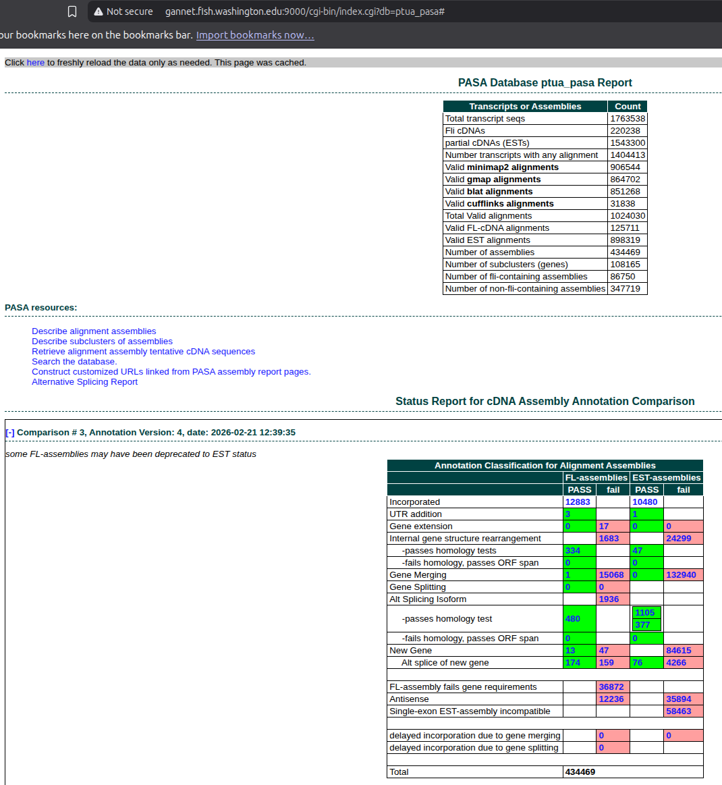

# INTRO

This notebook performs a comprehensive transcriptome assembly and annotation for *P.tuahiensis* using the [PASA (Program to Assemble Spliced Alignments)](https://github.com/PASApipeline/PASApipeline/wiki), as part of the E5 [timeseries_molecular project](https://github.com/urol-e5/timeseries_molecular). This produced an updated genome annotation that incorporates the RNA-seq data, including alternative splicing information. However, it's important to note that the resulting GFF/BED files will _not_ contain any annotations from the original genome GFF which did not have any support from RNA-seq alignments!

Thus, the resulting PASA annotations will be a _subset_ of the original genome annotations, but with updated gene models based on the RNA-seq data. The PASA pipeline will merge the de novo and genome-guided transcriptome assemblies, clean the transcripts, and update the genome annotations with alternative splicing information where supported by the data.

Due to large file sizes, the majority of important output files are _not_ availabe on GitHub, but can be accessed on Gannet here:

[https://gannet.fish.washington.edu/gitrepos/urol-e5/timeseries_molecular/F-Ptua/output/00.30-F-Ptua-transcriptome-assembly-Trinity/](https://gannet.fish.washington.edu/gitrepos/urol-e5/timeseries_molecular/F-Ptua/output/00.30-F-Ptua-transcriptome-assembly-Trinity/)

Primary products:

- Trinity de-novo assembly FastA: https://gannet.fish.washington.edu/gitrepos/urol-e5/timeseries_molecular/F-Ptua/output/00.30-F-Ptua-transcriptome-assembly-Trinity/de_novo_assembly/ptua-denovo-Trinity.fasta
- Trinity genome-guided assembly FastA: https://gannet.fish.washington.edu/gitrepos/urol-e5/timeseries_molecular/F-Ptua/output/00.30-F-Ptua-transcriptome-assembly-Trinity/genome_guided_assembly/ptua-GG-Trinity.fasta
- PASA final GFF: https://gannet.fish.washington.edu/gitrepos/urol-e5/timeseries_molecular/F-Ptua/output/00.30-F-Ptua-transcriptome-assembly-Trinity/PASA/ptua-PASA.gff3
- PASA final BED: https://gannet.fish.washington.edu/gitrepos/urol-e5/timeseries_molecular/F-Ptua/output/00.30-F-Ptua-transcriptome-assembly-Trinity/PASA/ptua-PASA.bed

The markdown below was produced from the original Rmd script:

- [00.30-F-Ptua-transcriptome-assembly-Trinity.Rmd](https://github.com/urol-e5/timeseries_molecular/blob/main/F-Ptua/code/00.30-F-Ptua-transcriptome-assembly-Trinity.Rmd) (GitHub)

Not described below is the access to the PASA web portal, which allows the user to browse the PASA results in a user-friendly interface. This can be accessed here:

- http://gannet.fish.washington.edu:9000/

Enter `ptua_pasa` as the database name. If this is your first time using the database, it will take many minutes for the data to load (the MySQL files behind the scenes are ~10GB in size, so it takes a while to process). After initial acces, the data is cached and access is much faster.



---

# 1 BACKGROUND

This notebook performs a comprehensive transcriptome assembly and
annotaiton for *P.tuahiensis* using the [PASA (Program to Assemble
Spliced Alignments)](https://github.com/PASApipeline/PASApipeline/wiki)
pipeline, as well as alternative isoform identification. This pipeline
relies on both *de novo* and genome-guided transcriptome assemblies with
[Trinity](https://github.com/trinityrnaseq/trinityrnaseq/wiki).

The key steps include: 1. **De Novo Assembly** and **Genome-Guided
Assembly**: Using
[Trinity](https://github.com/trinityrnaseq/trinityrnaseq/wiki) to
assemble transcripts directly from RNA-seq reads. 2. **PASA Pipeline**:
Utilizing [PASA](https://github.com/PASApipeline/PASApipeline/wiki) to
merge the assemblies, clean transcripts, and update genome annotations
with alternative splicing information.

**Programs Used:** -
[Trinity](https://github.com/trinityrnaseq/trinityrnaseq/wiki) -
Transcriptome assembly. -
[PASA](https://github.com/PASApipeline/PASApipeline/wiki) - Annotation
update and transcript assembly refinement. -
[AGAT](https://github.com/NBISweden/AGAT) - GFF/GTF toolkit for
annotation merging and conversion. - [Singularity
(Apptainer)](https://apptainer.org/) - Container platform used to run
assembly pipelines.

## 1.1 Expected outputs

**TRINITY**:

- FastA: *De novo* transcriptome assembly.
- FastA: Genome-guided transcriptome assembly.

**PASA**:

- GFF3: Genome annotations produced by PASA pipeline in GFF3.
- BED: Genome annotations produced by PASA pipeline in BED format.

# 2 SETUP

## 2.1 Libraries and markdown settings

``` r
library(knitr)
library(reticulate)
knitr::opts_chunk$set(
  echo = TRUE,         # Display code chunks
  eval = FALSE,        # Evaluate code chunks
  warning = FALSE,     # Hide warnings
  message = FALSE,     # Hide messages
  comment = ""         # Prevents appending '##' to beginning of lines in code output
)
```

## 2.2 Set variables

``` r
# DIRECTORIES
top_output_dir <- file.path("..", "output")

output_dir <- file.path(top_output_dir, "00.30-F-Ptua-transcriptome-assembly-Trinity")
de_novo_output_dir <- file.path(output_dir, "de_novo_assembly")
genome_guided_output_dir <- file.path(output_dir, "genome_guided_assembly")
pasa_container_dir <- file.path("/home", "shared", "containers")
PASA_HOME <- "/usr/local/src/PASApipeline"
pasa_output_dir <- file.path(output_dir, "PASA")
stringtie_gtf_dir <- file.path(top_output_dir, "02.20-F-Ptua-RNAseq-alignment-HiSat2")
trimmed_reads_dir <- file.path(top_output_dir, "01.00-F-Ptua-RNAseq-trimming-fastp-FastQC-MultiQC")


# FILES
bam_alignment <- file.path(top_output_dir, "02.20-F-Ptua-RNAseq-alignment-HiSat2", "sorted-bams-merged.bam")

## Path for genome will be relative to PASA output dir
genome_fasta <- file.path("..", "..", "..", "data", "Pocillopora_meandrina_HIv1.assembly.fasta")
genome_gff <- file.path("..", "data", "Pocillopora_meandrina_HIv1.genes.gff3")
denovo_assembly_name <- "ptua-denovo-Trinity"
genome_guided_assembly_name <- "ptua-GG-Trinity"
pasa_bed <- "ptua-PASA.bed"
pasa_container <- "pasapipeline.v2.5.3.simg"
pasa_gff <- "ptua-PASA.gff3"
stringtie_gtf <- file.path(stringtie_gtf_dir, "Pocillopora_meandrina_HIv1.assembly.stringtie.gtf")

#SETTINGS
## THREADS
threads <- "44"

## MAX RAM
max_ram <- "100G"

# PROGRAMS
samtools <- file.path("/home", "shared", "samtools-1.12", "samtools")


# FORMATTING
line <- "-----------------------------------------------"

# Export these as environment variables for bash chunks.
Sys.setenv(
  bam_alignment = bam_alignment,
  denovo_assembly_name = denovo_assembly_name,
  de_novo_output_dir = de_novo_output_dir,
  genome_fasta = genome_fasta,
  genome_gff = genome_gff,
  genome_guided_assembly_name = genome_guided_assembly_name,
  genome_guided_output_dir = genome_guided_output_dir,
  line = line,
  max_ram = max_ram,
  output_dir = output_dir,
  top_output_dir = top_output_dir,
  pasa_bed = pasa_bed,
  pasa_container = pasa_container,
  pasa_container_dir = pasa_container_dir,
  pasa_gff = pasa_gff,
  PASA_HOME = PASA_HOME,
  pasa_output_dir = pasa_output_dir,
  samtools = samtools,
  stringtie_gtf_dir = stringtie_gtf_dir,
  stringtie_gtf = stringtie_gtf,
  threads = threads,
  trimmed_reads_dir = trimmed_reads_dir
)
```

# 3 DE NOVO ASSEMBLY

## 3.1 Run Trinity

Trinity was run using the [Trinity Singularity (Apptainer)
container](https://github.com/trinityrnaseq/trinityrnaseq/wiki/Trinity-in-Docker#running-trinity-using-singularity),
`trinityrnaseq.v2.15.2.simg` from the
`urol-e5/timeseries_molecular/F-Ptua/code/` directory.

This was done in a terminal, outside of this notebook.

### 3.1.1 Set Bash variables

``` bash
# Directories
top_output_dir="../output"

output_dir="${top_output_dir}/00.30-F-Ptua-transcriptome-assembly-Trinity"
de_novo_output_dir="${output_dir}/de_novo_assembly"
genome_guided_output_dir="${output_dir}/genome_guided_assembly"
pasa_output_dir="${output_dir}/PASA"
trimmed_reads_dir="${top_output_dir}/01.00-F-Ptua-RNAseq-trimming-fastp-FastQC-MultiQC"

# FILES
bam_alignment="${top_output_dir}/02.20-F-Ptua-RNAseq-alignment-HiSat2/sorted-bams-merged.bam"
denovo_assembly_name="ptua-denovo-Trinity"
genome_guided_assembly_name="ptua-GG-Trinity"

# PASA INPUT FILES
####### NEED TO BE RELATIVE TO PASA SUBDIRECTORY #######
genome_fasta="../../../data/Pocillopora_meandrina_HIv1.assembly.fasta"
genome_gff="../../../data/Pocillopora_meandrina_HIv1.genes-validated.gff3"
pasa_container="pasapipeline.v2.5.3.simg"
PASA_HOME="/usr/local/src/PASApipeline"
stringtie_gtf="../../../output/02.20-F-Ptua-RNAseq-alignment-HiSat2/Pocillopora_meandrina_HIv1.assembly.stringtie.gtf 
"

## THREADS
threads="44"

## MAX RAM
max_ram="100G"

# Make output directoy, if it doesn't exist
mkdir --parents ${de_novo_output_dir}
mkdir --parents ${pasa_output_dir}

## Inititalize arrays
R1_array=()
R2_array=()

# Variables for R1/R2 lists
R1_list=""
R2_list=""

# Create array of fastq R1 files
R1_array=(${trimmed_reads_dir}/*R1_001.fastp-trim.fq.gz)

# Create array of fastq R2 files
R2_array=(${trimmed_reads_dir}/*R2_001.fastp-trim.fq.gz)

# Create list of fastq files used in analysis
## Uses parameter substitution to strip leading path from filename
if [ ! -f "${de_novo_output_dir}/fastq.list.txt" ]; then
  for fastq in ${trimmed_reads_dir}/*.fq.gz
  do
    echo "${fastq##*/}" >> ${de_novo_output_dir}/fastq.list.txt
  done
fi

# Create comma-separated lists of FastQ reads
R1_list=$(echo "${R1_array[@]}" | tr " " ",")
R2_list=$(echo "${R2_array[@]}" | tr " " ",")
```

### 3.1.2 Run Trinity Singularity image.

Used “stranded” setting (–SS_lib_type).

``` bash
singularity exec \
-B /home \
-e trinityrnaseq.v2.15.2.simg \
Trinity \
--seqType fq \
--max_memory ${max_ram} \
--CPU ${threads} \
--SS_lib_type RF \
--left "${R1_list}" \
--right "${R2_list}" \
--output ${de_novo_output_dir}/trinity_out_dir \
--full_cleanup \
> ${de_novo_output_dir}/trinity.log \
2>&1
```

## 3.2 Rename output files

### 3.2.1 Rename FastA

``` bash
# Rename generic assembly FastA
mv ${de_novo_output_dir}/trinity_out_dir.Trinity.fasta \
${de_novo_output_dir}/${denovo_assembly_name}.fasta
```

### 3.2.2 Rename gene map and log

``` bash
mv ${de_novo_output_dir}/trinity_out_dir.Trinity.fasta.gene_trans_map \
${de_novo_output_dir}/${denovo_assembly_name}.gene_trans_map

mv ${de_novo_output_dir}/trinity.log \
${de_novo_output_dir}/${denovo_assembly_name}.log
```

### 3.2.3 Assembly stats

#### 3.2.3.1 Run Trinity Singularity image.

``` bash
singularity exec -B /home \
-e trinityrnaseq.v2.15.2.simg \
/usr/local/bin/util/TrinityStats.pl \
../output/00.30-F-Ptua-transcriptome-assembly-Trinity/de_novo_assembly/ptua-denovo-Trinity.fasta \
> ../output/00.30-F-Ptua-transcriptome-assembly-Trinity/de_novo_assembly/ptua-denovo-Trinity.stats
```

## 3.3 Create FastA index

``` bash
${samtools} faidx \
${de_novo_output_dir}/${denovo_assembly_name}.fasta
```

## 3.4 Checksums

``` bash
cd ${de_novo_output_dir}

md5sum ${denovo_assembly_name}.fasta | tee ${denovo_assembly_name}.fasta.md5
```

    0c3073b02a10eb38893e296ce9d9dfb3  ptua-denovo-Trinity.fasta

# 4 GENOME-GUIDED ASSEMBLY

Trinity was run using the [Trinity Singularity (Apptainer)
container](https://github.com/trinityrnaseq/trinityrnaseq/wiki/Trinity-in-Docker#running-trinity-using-singularity),
`trinityrnaseq.v2.15.2.simg` from the
`urol-e5/timeseries_molecular/F-Ptua/code/` directory.

This was done in a terminal, outside of this notebook.

``` bash
singularity exec \
-B /home -e trinityrnaseq.v2.15.2.simg \
Trinity \
--genome_guided_bam ${bam_alignment} \
--genome_guided_max_intron 10000 \
--max_memory ${max_ram} \
--CPU ${threads} \
--SS_lib_type RF \
--output ${genome_guided_output_dir}/trinity_out_dir \
--full_cleanup \
> ${genome_guided_output_dir}/trinity.log 2>&1
```

## 4.1 Rename output files

### 4.1.1 Rename FastA

``` bash
# Rename generic assembly FastA
mv ${genome_guided_output_dir}/trinity_out_dir.Trinity-GG.fasta \
${genome_guided_output_dir}/${genome_guided_assembly_name}.fasta
```

### 4.1.2 Rename gene map and log

``` bash
mv ${genome_guided_output_dir}/trinity_out_dir.Trinity-GG.fasta.gene_trans_map \
${genome_guided_output_dir}/${genome_guided_assembly_name}.gene_trans_map

mv ${genome_guided_output_dir}/trinity.log \
${genome_guided_output_dir}/${genome_guided_assembly_name}.log
```

## 4.2 Create FastA index

``` bash
${samtools} faidx \
${genome_guided_output_dir}/${genome_guided_assembly_name}.fasta
```

## 4.3 Checksums

``` bash
cd ${de_novo_output_dir}

md5sum ${denovo_assembly_name}.fasta | tee ${denovo_assembly_name}.fasta.md5
```

    0c3073b02a10eb38893e296ce9d9dfb3  ptua-denovo-Trinity.fasta

### 4.3.1 Assembly stats

#### 4.3.1.1 Run Trinity Singularity image.

``` bash
singularity exec -B /home \
-e trinityrnaseq.v2.15.2.simg \
/usr/local/bin/util/TrinityStats.pl \
../output/00.30-F-Ptua-transcriptome-assembly-Trinity/genome_guided_assembly/ptua-GG-Trinity.fasta \
> ../output/00.30-F-Ptua-transcriptome-assembly-Trinity/genome_guided_assembly/ptua-GG-Trinity.stats
```

# 5 PASA PIPELINE

## 5.1 Concatenate Trinity assemblies

``` bash
cat ${de_novo_output_dir}/${denovo_assembly_name}.fasta \
${genome_guided_output_dir}/${genome_guided_assembly_name}.fasta \
> ${pasa_output_dir}/transcripts.fasta
```

### 5.1.1 Confirm counts

``` bash
# Count transcripts in each file
denovo_count=$(grep -c "^>" ${de_novo_output_dir}/${denovo_assembly_name}.fasta)
genome_guided_count=$(grep -c "^>" ${genome_guided_output_dir}/${genome_guided_assembly_name}.fasta)
pasa_count=$(grep -c "^>" ${pasa_output_dir}/transcripts.fasta)

# Calculate sum of first two counts
sum=$((denovo_count + genome_guided_count))

# Compare sum to PASA count
echo "De novo count: $denovo_count"
echo "Genome-guided count: $genome_guided_count"
echo "Sum: $sum"
echo "PASA count: $pasa_count"

if [ $sum -eq $pasa_count ]; then
    echo "✓ Counts match: $sum = $pasa_count"
else
    echo "✗ Counts do not match: $sum ≠ $pasa_count (difference: $((pasa_count - sum)))"
fi
```

    De novo count: 1232241
    Genome-guided count: 499541
    Sum: 1731782
    PASA count: 1731782
    ✓ Counts match: 1731782 = 1731782

## 5.2 Extract transcript accessions

``` bash
singularity exec \
-B /home \
-e ${pasa_container_dir}/${pasa_container} \
$PASA_HOME/misc_utilities/accession_extractor.pl \
< ${de_novo_output_dir}/${denovo_assembly_name}.fasta \
> ${pasa_output_dir}/tdn.accs

head ${pasa_output_dir}/tdn.accs
```

## 5.3 Clean transcripts

``` bash
cd ${pasa_output_dir}

singularity exec \
-B /home \
-e \
--env USER="$USER" \
${pasa_container} \
$PASA_HOME/bin/seqclean \
transcripts.fasta \
-c 16
```

## 5.4 PASA Assembly

### 5.4.1 Fix schema key length

``` bash
cd ${pasa_output_dir}

#### Fix schema key length issue ####
singularity exec ${pasa_container} \
cat /usr/local/src/PASApipeline/schema/cdna_alignment_mysqlschema \
> cdna_alignment_mysqlschema

# Fix all variations of gene_id and model_id indexes
sed -i 's/KEY gene_id_idx (gene_id)/KEY gene_id_idx (gene_id(255))/g' cdna_alignment_mysqlschema
sed -i 's/KEY mod_idx (model_id)/KEY mod_idx (model_id(255))/g' cdna_alignment_mysqlschema
sed -i 's/(gene_id)/(gene_id(255))/g' cdna_alignment_mysqlschema
sed -i 's/(model_id)/(model_id(255))/g' cdna_alignment_mysqlschema
sed -i 's/KEY gene_idx (annotation_version,gene_id)/KEY gene_idx (annotation_version,gene_id(255))/g' cdna_alignment_mysqlschema
```

### 5.4.2 Run PASA Assembly Pipeline

This was executed outside of RStudio due to the verbose output, which
will cause RStudio to crash.

``` bash
singularity exec \
-B /home \
-B /var/run/mysqld/mysqld.sock:/var/run/mysqld/mysqld.sock \
-B $PWD/conf.txt:$PASA_HOME/pasa_conf/conf.txt \
-B $PWD/cdna_alignment_mysqlschema:$PASA_HOME/schema/cdna_alignment_mysqlschema \
${pasa_container} \
$PASA_HOME/Launch_PASA_pipeline.pl \
--config alignAssembly.config \
--create \
--run \
--genome ${genome_fasta} \
--transcripts transcripts.fasta.clean \
--trans_gtf ${stringtie_gtf} \
--ALT_SPLICE \
-T \
-u transcripts.fasta \
--ALIGNERS blat,gmap,minimap2 \
--TDN tdn.accs \
--transcribed_is_aligned_orient \
--annot_compare \
-L \
--annots ${genome_gff} \
--TRANSDECODER \
--CPU ${threads}
```

### 5.4.3 Alternative Splicing

This doesn’t seem to have run during the assembly phase, so ran
separately.

``` bash
singularity exec \
-B /home \
-B /var/run/mysqld/mysqld.sock:/var/run/mysqld/mysqld.sock \
-B $PWD/conf.txt:$PASA_HOME/pasa_conf/conf.txt \
-B $PWD/cdna_alignment_mysqlschema:$PASA_HOME/schema/cdna_alignment_mysqlschema \
${pasa_container} \
$PASA_HOME/Launch_PASA_pipeline.pl \
-c alignAssembly.config \
--ALT_SPLICE \
-g ${genome_fasta} \
-t all.transcripts.fasta.clean \
--CPU ${threads}
```

### 5.4.4 Update annotations

Now includes alternative splicing info.

Uses output GFF3 from initial annotations as annotation *input*.

``` bash
singularity exec \
-B /home \
-B /var/run/mysqld/mysqld.sock:/var/run/mysqld/mysqld.sock \
-B $PWD/conf.txt:$PASA_HOME/pasa_conf/conf.txt \
-B $PWD/cdna_alignment_mysqlschema:$PASA_HOME/schema/cdna_alignment_mysqlschema \
${pasa_container} \
$PASA_HOME/Launch_PASA_pipeline.pl \
-c annotCompare.config \
--annot_compare \
-L \
--annots ptua_pasa.gene_structures_post_PASA_updates.2550175.gff3 \
-g ${genome_fasta} \
-t all.transcripts.fasta.clean \
--CPU ${threads}
```

# 6 PASA OUTPUTS

## 6.1 Generate checksums

``` bash
cd "${pasa_output_dir}"

md5sum ptua_pasa.gene_structures_post_PASA_updates.3761026.gff3 | tee ptua_pasa.gene_structures_post_PASA_updates.3761026.gff3.md5

md5sum ptua_pasa.gene_structures_post_PASA_updates.3761026.bed | tee ptua_pasa.gene_structures_post_PASA_updates.3761026.bed.md5
```

    3f86269b7aec49a2f1aabbfe0786f31a  ptua_pasa.gene_structures_post_PASA_updates.3761026.gff3
    d258401d384efb01543b030a72ec77ac  ptua_pasa.gene_structures_post_PASA_updates.3761026.bed

## 6.2 Rename outputs

``` bash
cd "${pasa_output_dir}"
cp ptua_pasa.gene_structures_post_PASA_updates.3761026.gff3 "${pasa_gff}"

cp ptua_pasa.gene_structures_post_PASA_updates.3761026.bed "${pasa_bed}"

md5sum "${pasa_gff}" | tee "${pasa_gff}".md5
md5sum "${pasa_bed}" | tee "${pasa_bed}".md5
```

    3f86269b7aec49a2f1aabbfe0786f31a  ptua-PASA.gff3
    d258401d384efb01543b030a72ec77ac  ptua-PASA.bed

## 6.3 GFF3 Preview

``` bash
head -n 50 "${pasa_output_dir}"/"${pasa_gff}"
```

    # PASA_UPDATE: mrna-Pocillopora_meandrina_HIv1___TS.g4079.t1, single gene model update, valid-1, status:[pasa:asmbl_433257,status:3], valid-1
    Pocillopora_meandrina_HIv1___xfSc0000885    .   gene    25319   26417   .   +   .   ID=gene-Pocillopora_meandrina_HIv1___TS.g4079.t1;Name=mrna-Pocillopora_meandrina_HIv1___TS.g4079.t1
    Pocillopora_meandrina_HIv1___xfSc0000885    .   mRNA    25319   26417   .   +   .   ID=mrna-Pocillopora_meandrina_HIv1___TS.g4079.t1;Parent=gene-Pocillopora_meandrina_HIv1___TS.g4079.t1;Name=mrna-Pocillopora_meandrina_HIv1___TS.g4079.t1
    Pocillopora_meandrina_HIv1___xfSc0000885    .   exon    25319   25469   .   +   .   ID=mrna-Pocillopora_meandrina_HIv1___TS.g4079.t1.exon1;Parent=mrna-Pocillopora_meandrina_HIv1___TS.g4079.t1
    Pocillopora_meandrina_HIv1___xfSc0000885    .   CDS 25319   25469   .   +   0   ID=mrna-Pocillopora_meandrina_HIv1___TS.g4079.t1.cds.1;Parent=mrna-Pocillopora_meandrina_HIv1___TS.g4079.t1
    Pocillopora_meandrina_HIv1___xfSc0000885    .   exon    26266   26417   .   +   .   ID=mrna-Pocillopora_meandrina_HIv1___TS.g4079.t1.exon2;Parent=mrna-Pocillopora_meandrina_HIv1___TS.g4079.t1
    Pocillopora_meandrina_HIv1___xfSc0000885    .   CDS 26266   26417   .   +   2   ID=mrna-Pocillopora_meandrina_HIv1___TS.g4079.t1.cds.2;Parent=mrna-Pocillopora_meandrina_HIv1___TS.g4079.t1


    #PROT mrna-Pocillopora_meandrina_HIv1___TS.g4079.t1 gene-Pocillopora_meandrina_HIv1___TS.g4079.t1   MAADSDSQKRKRLAGAHYKNTELPQEDEPLTLPKHYIGEQLAGEFGRVDTGPVLIQRKDIRLKKTPKKIGSDWRPSRTKSLQVIAIRAAKLRGGKPDEHG*

    # PASA_UPDATE: mrna-Pocillopora_meandrina_HIv1___RNAseq.g77.t1, single gene model update, valid-1, status:[pasa:asmbl_432824,status:3], valid-1
    Pocillopora_meandrina_HIv1___xfSc0000812    .   gene    9924    23544   .   +   .   ID=gene-Pocillopora_meandrina_HIv1___RNAseq.g77.t1;Name=mrna-Pocillopora_meandrina_HIv1___RNAseq.g77.t1
    Pocillopora_meandrina_HIv1___xfSc0000812    .   mRNA    9924    23544   .   +   .   ID=mrna-Pocillopora_meandrina_HIv1___RNAseq.g77.t1;Parent=gene-Pocillopora_meandrina_HIv1___RNAseq.g77.t1;Name=mrna-Pocillopora_meandrina_HIv1___RNAseq.g77.t1
    Pocillopora_meandrina_HIv1___xfSc0000812    .   exon    9924    9945    .   +   .   ID=mrna-Pocillopora_meandrina_HIv1___RNAseq.g77.t1.exon1;Parent=mrna-Pocillopora_meandrina_HIv1___RNAseq.g77.t1
    Pocillopora_meandrina_HIv1___xfSc0000812    .   CDS 9924    9945    .   +   0   ID=mrna-Pocillopora_meandrina_HIv1___RNAseq.g77.t1.cds.1;Parent=mrna-Pocillopora_meandrina_HIv1___RNAseq.g77.t1
    Pocillopora_meandrina_HIv1___xfSc0000812    .   exon    10159   10230   .   +   .   ID=mrna-Pocillopora_meandrina_HIv1___RNAseq.g77.t1.exon2;Parent=mrna-Pocillopora_meandrina_HIv1___RNAseq.g77.t1
    Pocillopora_meandrina_HIv1___xfSc0000812    .   CDS 10159   10230   .   +   2   ID=mrna-Pocillopora_meandrina_HIv1___RNAseq.g77.t1.cds.2;Parent=mrna-Pocillopora_meandrina_HIv1___RNAseq.g77.t1
    Pocillopora_meandrina_HIv1___xfSc0000812    .   exon    11013   11102   .   +   .   ID=mrna-Pocillopora_meandrina_HIv1___RNAseq.g77.t1.exon3;Parent=mrna-Pocillopora_meandrina_HIv1___RNAseq.g77.t1
    Pocillopora_meandrina_HIv1___xfSc0000812    .   CDS 11013   11102   .   +   2   ID=mrna-Pocillopora_meandrina_HIv1___RNAseq.g77.t1.cds.3;Parent=mrna-Pocillopora_meandrina_HIv1___RNAseq.g77.t1
    Pocillopora_meandrina_HIv1___xfSc0000812    .   exon    13397   13465   .   +   .   ID=mrna-Pocillopora_meandrina_HIv1___RNAseq.g77.t1.exon4;Parent=mrna-Pocillopora_meandrina_HIv1___RNAseq.g77.t1
    Pocillopora_meandrina_HIv1___xfSc0000812    .   CDS 13397   13465   .   +   2   ID=mrna-Pocillopora_meandrina_HIv1___RNAseq.g77.t1.cds.4;Parent=mrna-Pocillopora_meandrina_HIv1___RNAseq.g77.t1
    Pocillopora_meandrina_HIv1___xfSc0000812    .   exon    15786   15809   .   +   .   ID=mrna-Pocillopora_meandrina_HIv1___RNAseq.g77.t1.exon5;Parent=mrna-Pocillopora_meandrina_HIv1___RNAseq.g77.t1
    Pocillopora_meandrina_HIv1___xfSc0000812    .   CDS 15786   15809   .   +   2   ID=mrna-Pocillopora_meandrina_HIv1___RNAseq.g77.t1.cds.5;Parent=mrna-Pocillopora_meandrina_HIv1___RNAseq.g77.t1
    Pocillopora_meandrina_HIv1___xfSc0000812    .   exon    16488   16556   .   +   .   ID=mrna-Pocillopora_meandrina_HIv1___RNAseq.g77.t1.exon6;Parent=mrna-Pocillopora_meandrina_HIv1___RNAseq.g77.t1
    Pocillopora_meandrina_HIv1___xfSc0000812    .   CDS 16488   16556   .   +   2   ID=mrna-Pocillopora_meandrina_HIv1___RNAseq.g77.t1.cds.6;Parent=mrna-Pocillopora_meandrina_HIv1___RNAseq.g77.t1
    Pocillopora_meandrina_HIv1___xfSc0000812    .   exon    17143   17391   .   +   .   ID=mrna-Pocillopora_meandrina_HIv1___RNAseq.g77.t1.exon7;Parent=mrna-Pocillopora_meandrina_HIv1___RNAseq.g77.t1
    Pocillopora_meandrina_HIv1___xfSc0000812    .   CDS 17143   17391   .   +   2   ID=mrna-Pocillopora_meandrina_HIv1___RNAseq.g77.t1.cds.7;Parent=mrna-Pocillopora_meandrina_HIv1___RNAseq.g77.t1
    Pocillopora_meandrina_HIv1___xfSc0000812    .   exon    17592   19513   .   +   .   ID=mrna-Pocillopora_meandrina_HIv1___RNAseq.g77.t1.exon8;Parent=mrna-Pocillopora_meandrina_HIv1___RNAseq.g77.t1
    Pocillopora_meandrina_HIv1___xfSc0000812    .   CDS 17592   19513   .   +   2   ID=mrna-Pocillopora_meandrina_HIv1___RNAseq.g77.t1.cds.8;Parent=mrna-Pocillopora_meandrina_HIv1___RNAseq.g77.t1
    Pocillopora_meandrina_HIv1___xfSc0000812    .   exon    21811   23544   .   +   .   ID=mrna-Pocillopora_meandrina_HIv1___RNAseq.g77.t1.exon9;Parent=mrna-Pocillopora_meandrina_HIv1___RNAseq.g77.t1
    Pocillopora_meandrina_HIv1___xfSc0000812    .   CDS 21811   22104   .   +   0   ID=mrna-Pocillopora_meandrina_HIv1___RNAseq.g77.t1.cds.9;Parent=mrna-Pocillopora_meandrina_HIv1___RNAseq.g77.t1
    Pocillopora_meandrina_HIv1___xfSc0000812    .   three_prime_UTR 22105   23544   .   +   .   ID=mrna-Pocillopora_meandrina_HIv1___RNAseq.g77.t1.utr3p1;Parent=mrna-Pocillopora_meandrina_HIv1___RNAseq.g77.t1


    #PROT mrna-Pocillopora_meandrina_HIv1___RNAseq.g77.t1 gene-Pocillopora_meandrina_HIv1___RNAseq.g77.t1   METAKWEGTSSLTVVPTTGHGRELEESRGGTDTVPLLVSPTSEPEEELEPGELRMELPRMKDISAEEESCKSDDPSENKRRRLADLAEQLITDNSTGEESFKSDDPSENKRRRLAEPLNVEKCQEQLKSYYNTFSKVKIIPWDDSSSIQIDEIYTPLSWVRDHRKPSGVTQEELEDYTDMFKEKPTRMLVYGRPGIGKNKVLLILDGYDEYSFAEEHSPILEIWKGELLRDCHVIVTTRQLKCDELRGPSHVQLEIQGFKSRERKETFARKFMAGEEDLDEFNLYLEEKDLYDMAEIPLLLLMLCSLWKEKRHEGLPKSRADIFTQFIQTMLDHKGGSHQSMPFQKVTSTEAREDLSNLGKAAFEALLQDRLYVRCIKLPGNISRSLEKLSEVGLFQIVNLTSLNPERGAYFIHKSVQEFLAAWHIKEEVLSNKGESTLSLSKVESFEEIVKMKEVLKFACELSTEAACAVFRHVGSVGRKESVSEFDFIELLLEDEELPVNEEVYHELIWHSYFCCSAEKRRDLCSVFPSCTGGGFLYLDSNRVNITANEHLLKSGMIPDFIFFPDYENSSEKSYRDLITVAEDTNAVFLSRSGEKKAADVLKKFPRRPMDEFFLKRERKIVVYVNQIRKGRNVSTFPTEMLRELISPTAESTQVTRLVDPLNEHDRETASSFTQNTDSITGPTPQSLSRVKQIDIVGIERQEIKMLADFLPLFTALRRIDIYGEPFEIIAAQLTETLVSRIIFNDRLHTLVLANINLTAKPAAVIARSLHQANGLQRLGLSWNPLGEGVSVLIQHLSRVPHLEWLWLSEVKMTKQQVNDLSAAVRQSNISWLETDYHDCKGNVKPEEEWPTDEYWSDYWWESEEESDPGSVTDSGEEEEPGSVTNSGDEGDPGSVTDSSDQEDPGLVTDSGGEEDPGSVTDSGDKEEPGSCLET*

    # PASA_UPDATE: mrna-Pocillopora_meandrina_HIv1___RNAseq.g78.t1, single gene model update, valid-1, status:[pasa:asmbl_432858,status:12], valid-1
    # PASA_UPDATE: mrna-Pocillopora_meandrina_HIv1___RNAseq.g78.t1.1.6992b91d, single gene model update, valid-1, status:[pasa:asmbl_432855,status:12], valid-1
    Pocillopora_meandrina_HIv1___xfSc0000812    .   gene    34067   37241   .   +   .   ID=gene-Pocillopora_meandrina_HIv1___RNAseq.g78.t1;Name=mrna-Pocillopora_meandrina_HIv1___RNAseq.g78.t1
    Pocillopora_meandrina_HIv1___xfSc0000812    .   mRNA    34073   35237   .   +   .   ID=mrna-Pocillopora_meandrina_HIv1___RNAseq.g78.t1;Parent=gene-Pocillopora_meandrina_HIv1___RNAseq.g78.t1;Name=mrna-Pocillopora_meandrina_HIv1___RNAseq.g78.t1
    Pocillopora_meandrina_HIv1___xfSc0000812    .   exon    34073   34168   .   +   .   ID=mrna-Pocillopora_meandrina_HIv1___RNAseq.g78.t1.exon1;Parent=mrna-Pocillopora_meandrina_HIv1___RNAseq.g78.t1
    Pocillopora_meandrina_HIv1___xfSc0000812    .   CDS 34073   34168   .   +   0   ID=mrna-Pocillopora_meandrina_HIv1___RNAseq.g78.t1.cds.1;Parent=mrna-Pocillopora_meandrina_HIv1___RNAseq.g78.t1
    Pocillopora_meandrina_HIv1___xfSc0000812    .   exon    34483   34488   .   +   .   ID=mrna-Pocillopora_meandrina_HIv1___RNAseq.g78.t1.exon2;Parent=mrna-Pocillopora_meandrina_HIv1___RNAseq.g78.t1
    Pocillopora_meandrina_HIv1___xfSc0000812    .   CDS 34483   34488   .   +   0   ID=mrna-Pocillopora_meandrina_HIv1___RNAseq.g78.t1.cds.2;Parent=mrna-Pocillopora_meandrina_HIv1___RNAseq.g78.t1
    Pocillopora_meandrina_HIv1___xfSc0000812    .   exon    34894   34988   .   +   .   ID=mrna-Pocillopora_meandrina_HIv1___RNAseq.g78.t1.exon3;Parent=mrna-Pocillopora_meandrina_HIv1___RNAseq.g78.t1
    Pocillopora_meandrina_HIv1___xfSc0000812    .   CDS 34894   34988   .   +   0   ID=mrna-Pocillopora_meandrina_HIv1___RNAseq.g78.t1.cds.3;Parent=mrna-Pocillopora_meandrina_HIv1___RNAseq.g78.t1
    Pocillopora_meandrina_HIv1___xfSc0000812    .   exon    35222   35237   .   +   .   ID=mrna-Pocillopora_meandrina_HIv1___RNAseq.g78.t1.exon4;Parent=mrna-Pocillopora_meandrina_HIv1___RNAseq.g78.t1
    Pocillopora_meandrina_HIv1___xfSc0000812    .   CDS 35222   35237   .   +   1   ID=mrna-Pocillopora_meandrina_HIv1___RNAseq.g78.t1.cds.4;Parent=mrna-Pocillopora_meandrina_HIv1___RNAseq.g78.t1
    Pocillopora_meandrina_HIv1___xfSc0000812    .   mRNA    34067   37241   .   +   .   ID=mrna-Pocillopora_meandrina_HIv1___RNAseq.g78.t1.1.6992b91d;Parent=gene-Pocillopora_meandrina_HIv1___RNAseq.g78.t1;Name=mrna-Pocillopora_meandrina_HIv1___RNAseq.g78.t1

## 6.4 GFF Comparisons

``` bash
printf '%s\n\n' "Original GFF feature counts:"
awk '!/^#/ && !/^[[:space:]]*$/ && NF > 0 && $3 != "" {print $3}' ${genome_gff} \
| sort | uniq -c | sort -rn | awk '{print $2, $1}'

echo ""
echo "${line}"
echo ""

printf "%s\n\n" "Updated GFF feature counts:"
awk -F "\t" '!/^#/ && !/^[[:space:]]*$/ && NF > 0 && $3 != "" {print $3}' "${pasa_output_dir}"/"${pasa_gff}" \
| sort | uniq -c | sort -rn | awk '{print $2, $1}'
```

    Original GFF feature counts:

    exon 208535
    CDS 208535
    transcript 31840

    -----------------------------------------------

    Updated GFF feature counts:

    exon 351589
    CDS 341675
    mRNA 43292
    gene 32019
    five_prime_UTR 22150
    three_prime_UTR 21812

# 7 EXTRACT PROTEINS TO FASTA

``` bash
cd "${pasa_output_dir}"

awk '/^#PROT / {print ">" $2 "." $3 "\n" $4}' "${pasa_gff}" > ptua-proteins-PASA.fasta

printf "%s\n\n" "Original protein counts:"
grep --count "^#PROT" "${pasa_gff}"

echo ""
echo "${line}"
echo ""

printf "%s\n\n" "Extracted protein counts:"
grep --count "^>" ptua-proteins-PASA.fasta

# Create FastA Index
${samtools} faidx ptua-proteins-PASA.fasta
```

    Original protein counts:

    43292

    -----------------------------------------------

    Extracted protein counts:

    43292

## 7.1 Checksums

``` bash
cd "${pasa_output_dir}"
md5sum ptua-proteins-PASA.fasta | tee ptua-proteins-PASA.fasta.md5
```

    d41376d2ac0a8f41b0bbe333ed8cf08b  ptua-proteins-PASA.fasta