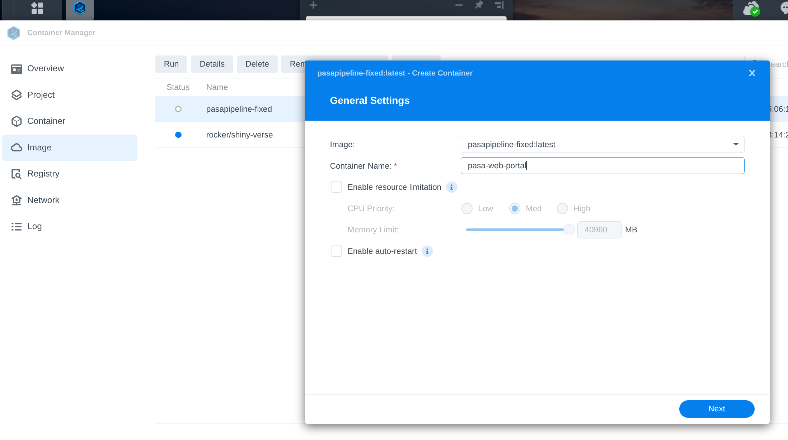
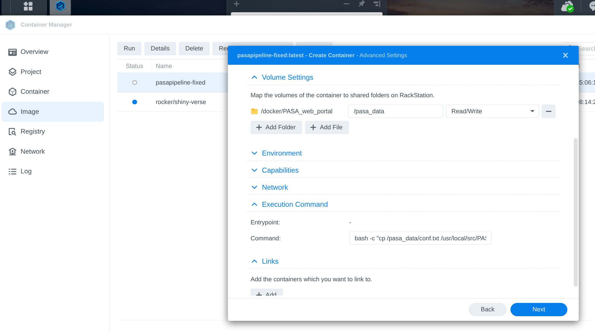

# INTRO

The [PASA pipeline](https://github.com/PASApipeline/PASApipeline/wiki) (GitHub) was used to generate transcriptome annotations using the RNA-seq data for the three coral species in the [`timeseries_molecular project](https://github.com/urol-e5/timeseries_molecular) (GitHub) project. The PASA web portal provides a user-friendly interface to explore and visualize the results of the PASA pipeline, including gene models, alignments, and annotations.

Below, I detail the steps I took to configure the PASA web portal on Gannet using the Synology Container Manager. This includes building a custom Docker image with the necessary Perl modules, transferring it to the Synology, and setting up the container to run the PASA web portal.

# METHODS

::: {.callout-note}
The example below uses the `peve_pasa` database, but you can replace it with your database name as needed.
:::

## Build and Transfer Docker Image

::: {.callout-note}
This doesn't have to be done on a local computer; you can build the image directly on the Synology if you have the necessary tools and permissions. However, building locally and transferring can be faster and more convenient in some cases.
:::

1. Build the image (if not already done)

    ```bash
    cd /home/shared/8TB_HDD_01/sam/gitrepos/urol-e5/timeseries_molecular/E-Peve/output/00.30-E-Peve-transcriptome-assembly-Trinity/PASA
    sudo docker build -t pasapipeline-fixed:latest -f Dockerfile.pasaweb .
    ```

    Here's what's in `Dockerfile.pasaweb`:

    ```bash
    $ cat Dockerfile.pasaweb
    
    FROM pasapipeline/pasapipeline:latest
    
    # Install missing Perl modules required for PasaWeb
    RUN cpan -i CGI GD::Graph
    
    # Keep the original entrypoint
    ```

2. Save the image to a tar file.

    ```bash
    sudo docker save pasapipeline-fixed:latest \
    > /home/sam/pasapipeline-fixed.tar
    ```

3. Transfer to Synology (replace with your Synology details).

    ```bash
    rsync -avP pasapipeline-fixed.tar \
    gannet:/volume2/docker/PASA_web_portal/
    ```


## Synology Configuration Steps

### Command Line Setup

On Synology, via command line:

#### Load the pre-built image

```bash

cd /volume2/docker/PASA_web_portal
sudo docker load -i pasapipeline-fixed.tar
```

#### Grant MySQL permissions (if not already done):

```bash
mysql -u root -p<password>
```

```sql
GRANT SELECT ON peve_pasa.* TO 'pasa_access'@'localhost';
GRANT SELECT ON apul_pasa.* TO 'pasa_access'@'localhost';
GRANT SELECT ON ptua_pasa.* TO 'pasa_access'@'localhost';
FLUSH PRIVILEGES;
```


#### Create/import databases (if not already done):

```bash
mysql -u root -p -h127.0.0.1 -P3307 <<'EOF'
CREATE DATABASE IF NOT EXISTS peve_pasa;
EOF
```

#### Fix collation issue in the SQL dump file (if needed):

```bash
sed -i 's/utf8mb4_0900_ai_ci/utf8mb4_general_ci/g' '/volume2/web/gitrepos/urol-e5/timeseries_molecular/E-Peve/output/00.30-E-Peve-transcriptome-assembly-Trinity/PASA/peve_pasa_backup.sql'
```

#### Load the SQL dump into the database:

```bash
mysql -u root -p<password> -h127.0.0.1 -P3307 peve_pasa \
  < /volume2/web/gitrepos/urol-e5/timeseries_molecular/E-Peve/output/00.30-E-Peve-transcriptome-assembly-Trinity/PASA/peve_pasa_backup.sql
```

### Web Interface

Then, access the Synology via the web interface and set up the container.

In the Container Manager app, create a new container with these settings:

Go to the "Image" tab
You should see pasapipeline-fixed:latest in the list of images.

Click on the image, then click "Launch" or "Run"


This opens the container creation wizard where you configure:
- Container name
- Port mappings
- Volume mounts
- Environment variables
- xecution Command: `bash -c "cp /pasa_data/conf.txt /usr/local/src/PASApipeline/pasa_conf/conf.txt && /usr/local/src/PASApipeline/run_PasaWeb.pl 9000"`
- Port Settings:

    - Local Port: 9000
    - Container Port: 9000
    - Type: TCP
    - Volume Mappings:


- Host: /volume1/path/to/PASA/directory
- Container: /pasa_data
- Network:

- Use bridge mode

- Working Directory:






### Access

::: {.callout-important}
`http` is used instead of `https` because the PASA web portal does not support SSL/TLS. Ensure that your network is secure and consider using a VPN if accessing remotely.
:::

http://gannet.fish.washington.edu:9000
Enter database name when prompted (e.g., peve_pasa)


