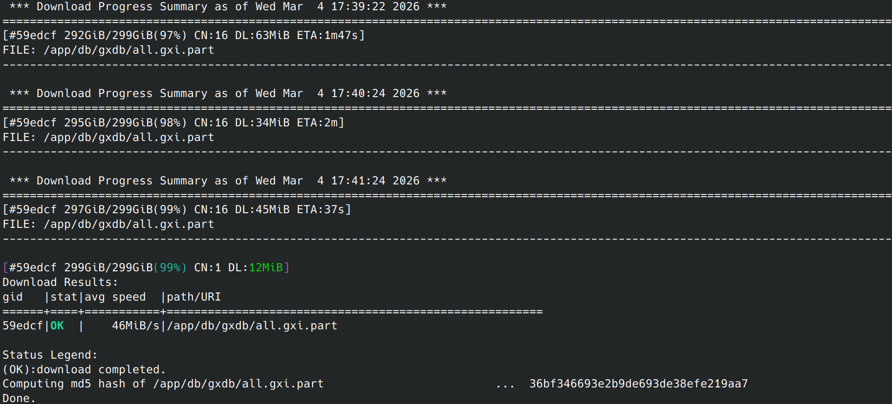

# INTRO

Laura [asked me to install EGAPx and FCS-GX on Klone](https://github.com/RobertsLab/resources/issues/2399) (GitHub Issue) so that she can use them for annotation of some existing snow crab RNA-seq data she is working with.

# METHODS

## [FCS-GX]

The steps below follow those outlined in the [FCS-GX documentation](https://github.com/ncbi/fcs/wiki/FCS-adaptor-quickstart).

### Get FCS Python script

```bash
cd /gscratch/srlab/containers \
&& curl -LO https://github.com/ncbi/fcs/raw/main/dist/fcs.py
```

### Get FCS-GX Singularity image
```bash
curl https://ftp.ncbi.nlm.nih.gov/genomes/TOOLS/FCS/releases/latest/fcs-gx.sif -Lo fcs-gx.sif
```

### Get FCS-GX databases

::: {.callout}
This downloads ~500GB of data, so be sure you have enough storage space before running this command! Additionally, the download may take a while to complete.
:::

`module load coenv/python/3.13.11`

```bash
cd /gscratch/scrubbed/samwhite/databases

SOURCE_DB_MANIFEST="https://ncbi-fcs-gx.s3.amazonaws.com/gxdb/latest/all.manifest"

python3 /gscratch/srlab/containers/fcs.py \
--image /gscratch/srlab/containers/fcs-gx.sif \
db \
get --mft "$SOURCE_DB_MANIFEST" \
--dir "./gxdb"
```

{fig-alt="Screenshot of completed DB downloads"}


Installation was _not_ tested by running an annotation job, but the above steps were successfully completed without issue.


## EGAPx

The steps below follow those outlined in the [EGAPx documentation](https://github.com/ncbi/egapx).

### Containers and scripts

I created an Apptainer (Singularity) container for EGAPx and a script to execute it. 

Container definition file: [srlab-NCBI-EGAPx.def](https://github.com/RobertsLab/code/blob/cc8e19040ee50cb8cbe3bbb0fda6a17619e2beae/apptainer_definition_files/srlab-NCBI-EGAPx.def) (GitHub)

- This container is based on the EGAPx Dockerfile and includes EGAPx and all dependencies.

- Primarily written using Claude Sonnet 4.6 (gAI agent) with some manual edits to ensure it would build correctly.

Execution script: [run_egapx.sh](https://github.com/RobertsLab/code/blob/cc8e19040ee50cb8cbe3bbb0fda6a17619e2beae/apptainer_definition_files/run_egapx.sh) (GitHub).

- This script is designed to execute the `srlab-NCBI-EGAPx.sif` container. It will create a cache directory, set a cache variable, and execute the container.

Both have been added to Klone and can be found in the `/mmfs1/gscratch/srlab/containers` directory.

Container and script have been added to Klone:

- `/mmfs1/gscratch/srlab/containers/run_egapx.sh`: Script to execute `srlab-NCBI-EGAPx.sif` container. This will create a cache directory, set a cache variable, and bind directories to the container.

    Example usage: 
    ```bash
    ./run_egapx.sh \
    /opt/egapx/examples/input_D_farinae_small.yaml \
    -e singularity \
    -w ./work \
    -o ./output
    ```

    This requires that the `srlab-NCBI-EGAPx.sif` container is in the same directory as this script. Both can be copied to other directories, if desired.

- `/mmfs1/gscratch/srlab/containers/srlab-NCBI-EGAPx.sif`: Apptainer (Singularity) container. Can be executed by itself, but is better to use with the `run_egapx.sh` to ensure cache directory is set.

    To see additional help examples for using the `srlab-NCBI-EGAPx.sif` container:

    `singularity run-help srlab-NCBI-EGAPx.sif`

### Test EGAPx container

The built-in test example was used to test the container. The test completed successfully, with all expected output files generated.  

{fig-alt="Screenshot of EGAPx test output"}


# CONCLUSION

EGAPx and FCS-GX have been successfully installed on Klone. Both were tested to ensure they are working correctly, with FCS-GX tested by downloading the databases and EGAPx tested by running the built-in test example.

For info on how to run EGAPx: https://github.com/ncbi/egapx

