# INTRO

Steven asked me to perform resazurin assays on "selected" juvenile _Ruditapes philippinarum_ (Manila clam) exposed to 36<sup>o</sup>C acute heat stress. The goal of the experiment is to compare metabolic activity between the "selected" clams and control clams when exposed to heat stress.

This is the first day of a two day experiment. Day 0 corresponds to the first day of measurements, and Day 1 corresponds to the second day of measurements. The same clams were measured on both days. Day 1 notebook entry is available here:

- [Day 1 Notebook Entry](../2026-04-01-Resazurin-Assays---Selected-Juvenile-Ruditapes-philippinarum-Exposed-to-36C-Acute-Heat-Stress-Day-1/index.qmd)


Data and results are available here:

- [https://github.com/RobertsLab/resazurin-assay-development/tree/main/data/clam/20260331-clam-36C-C-vs-S](https://github.com/RobertsLab/resazurin-assay-development/tree/main/data/clam/20260331-clam-36C-C-vs-S)


The section below was knitted from the R Markdown file [00.00-resazurin-20260331-clam-36C-C-vs-S.Rmd](https://github.com/RobertsLab/resazurin-assay-development/blob/main/scripts/clam/00.00-resazurin-20260331-clam-36C-C-vs-S.Rmd) (GitHub).


---


# 1 Background

Control clams (`C`) compared with selected clams (`S`) at 36°C using a
resazurin metabolic assay. Clams were placed in 12-well plates submerged
in 5.0 mL resazurin working solution. Plate layout was randomized.
Fluorescence was measured every 30 min on a Synergy HTX (Agilent) plate
reader.

**Important notes from this experiment:**

- Inconsistent heating observed; interior wells were typically ~1.5°C
  cooler than the rest.
- The following wells showed volume loss (possibly due to clam spitting)
  and are flagged for exclusion in the layout: Plate A C3, Plate B A3,
  Plate C C4, Plate D B2.

See `data/clam/20260331-clam-36C-C-vs-S/README.md` for full experimental
notes.

## 1.1 Expected inputs

| Path | Description |
|:---|:---|
| `data/clam/20260331-clam-36C-C-vs-S/plate-*-T*.txt` | Plate reader fluorescence exports (one file per plate per timepoint) |
| `data/clam/20260331-clam-36C-C-vs-S/layout.csv` | Well metadata: plate ID, well ID, blank flag, family/treatment groups, size measurements |

## 1.2 Expected outputs

All outputs are written to `output/clam/20260331-clam-36C-C-vs-S/`.

| File | Description |
|:---|:---|
| `figures/` | All plots generated by this script |
| `auc_all_metrics.csv` | Per-individual AUC values for every active measurement metric |
| `auc_summary.csv` | Group-level AUC summary statistics (mean, SD, SE, median) |
| `metabolism.csv` | Full per-well per-timepoint metabolism data frame |
| `pairwise_stats.csv` | Tukey-adjusted pairwise comparisons from AUC linear models |

# 2 Setup

``` r
knitr::opts_chunk$set(
  echo = TRUE,         # Display code chunks
  eval = TRUE,        # Evaluate code chunks
  warning = FALSE,     # Hide warnings
  message = FALSE,     # Hide messages
  comment = "",         # Prevents appending '##' to beginning of lines in code output
  results = 'hold'     # Holds output so it's all printed together after code chunk
)
```

``` r
library(tidyverse)
library(pracma)       # trapz()
library(lme4)
library(lmerTest)
library(emmeans)
library(multcompView)
library(cowplot)
library(colorspace)   # qualitative_hcl() for large palettes
```

# 3 Helper Functions

``` r
normalize_well_id <- function(x) {
  x <- toupper(trimws(x))
  valid <- str_detect(x, "^[A-Z]+[0-9]+$")
  out <- rep(NA_character_, length(x))
  if (!any(valid)) return(out)
  m <- str_match(x[valid], "^([A-Z]+)([0-9]+)$")
  out[valid] <- paste0(m[, 2], as.integer(m[, 3]))
  out
}

parse_time_hr <- function(path) {
  hit <- str_match(basename(path),
                   "(?i)-T([0-9]+(?:\\.[0-9]+)?)\\.txt$")
  as.numeric(hit[, 2])
}

parse_plate_id <- function(path) {
  hit <- str_match(basename(path),
    "(?i)^plate-([A-Za-z0-9-]+)-T[0-9]+(?:\\.[0-9]+)?\\.txt$")
  id <- hit[, 2]
  ifelse(is.na(id), "unknown", id)
}

extract_results_block <- function(lines) {
  results_idx <- which(trimws(lines) == "Results")
  if (length(results_idx) == 0) stop("No Results section found")
  idx <- results_idx[1]
  header_tokens <- str_split(lines[idx + 1], "\\t")[[1]] |> trimws()
  col_ids <- header_tokens[
    header_tokens != "" & str_detect(header_tokens, "^[0-9]+$")]
  j <- idx + 2
  data_lines <- character()
  while (j <= length(lines)) {
    line <- lines[j]
    if (trimws(line) == "") break
    if (!str_detect(line, "^[A-Za-z]\\t")) break
    data_lines <- c(data_lines, line)
    j <- j + 1
  }
  list(col_ids = col_ids, data_lines = data_lines)
}

parse_plate_export <- function(path) {
  lines <- readLines(path, warn = FALSE)
  res <- extract_results_block(lines)

  map_dfr(res$data_lines, function(line) {
    tokens <- str_split(line, "\\t")[[1]] |> trimws()
    tokens <- tokens[tokens != ""]
    row_letter <- tokens[1]
    nums <- suppressWarnings(as.numeric(tokens[-1]))
    valid_idx <- which(!is.na(nums))
    if (length(valid_idx) == 0) return(tibble())
    vals <- nums[valid_idx]
    n <- min(length(vals), length(res$col_ids))
    tibble(
      row_id  = toupper(row_letter),
      col_id  = as.integer(res$col_ids[seq_len(n)]),
      well_id = normalize_well_id(
        paste0(toupper(row_letter), res$col_ids[seq_len(n)])),
      value   = vals[seq_len(n)]
    )
  }) %>%
    mutate(
      plate_id = str_to_lower(parse_plate_id(path)),
      time_hr  = parse_time_hr(path)
    )
}

trapezoid_auc <- function(time_hr, value) {
  ok <- is.finite(time_hr) & is.finite(value)
  t <- time_hr[ok]
  v <- value[ok]
  if (length(t) < 2) return(NA_real_)
  ord <- order(t)
  t <- t[ord]; v <- v[ord]
  sum(diff(t) * (head(v, -1) + tail(v, -1)) / 2)
}

# Shared helper: extract display unit string from a measurement column name.
# e.g. "area_mm2_measurement" -> "mm²", "weight_mg_measurement" -> "mg"
parse_meas_unit <- function(col_name) {
  unit_raw <- col_name |>
    str_remove("^metabolism_per_") |>
    str_remove("_measurement$") |>
    str_extract("[^_]+$")
  case_when(
    unit_raw == "mm2" ~ "mm²",
    unit_raw == "cm2" ~ "cm²",
    unit_raw == "mm3" ~ "mm³",
    unit_raw == "cm3" ~ "cm³",
    TRUE              ~ unit_raw
  )
}

# y-axis label for metabolism line plots: "fold change/mm²"
metabolism_y_label <- function(col_name) {
  paste0("Metabolism (fold change/", parse_meas_unit(col_name), ")")
}

# y-axis label for AUC box plots: "Metabolism (AUC; mm²)"
auc_y_label <- function(metric_name) {
  paste0("Metabolism (AUC; ", parse_meas_unit(metric_name), ")")
}
```

# 4 Load Data

## 4.1 Plate export files

``` r
proj_root <- rprojroot::find_rstudio_root_file()
data_dir  <- file.path(proj_root, "data", "clam",
                        "20260331-clam-36C-C-vs-S")
fig_dir   <- file.path(proj_root, "output", "clam",
                        "20260331-clam-36C-C-vs-S", "figures")
out_dir   <- file.path(proj_root, "output", "clam",
                        "20260331-clam-36C-C-vs-S")

dir.create(fig_dir, recursive = TRUE, showWarnings = FALSE)
dir.create(out_dir, recursive = TRUE, showWarnings = FALSE)

plate_files <- list.files(
  data_dir,
  pattern = "(?i)^plate-.*-T[0-9]+(?:\\.[0-9]+)?\\.txt$",
  full.names = TRUE
)

plate_raw <- map_dfr(plate_files, function(path) {
  tryCatch(parse_plate_export(path),
           error = function(e) {
             message("Parse error in ", basename(path), ": ", e$message)
             tibble()
           })
})

str(plate_raw)
```

    tibble [504 × 6] (S3: tbl_df/tbl/data.frame)
     $ row_id  : chr [1:504] "A" "A" "A" "A" ...
     $ col_id  : int [1:504] 1 2 3 4 1 2 3 4 1 2 ...
     $ well_id : chr [1:504] "A1" "A2" "A3" "A4" ...
     $ value   : num [1:504] 280 224 241 219 241 295 255 237 285 270 ...
     $ plate_id: chr [1:504] "a" "a" "a" "a" ...
     $ time_hr : num [1:504] 0 0 0 0 0 0 0 0 0 0 ...

## 4.2 Plate consistency check

Checks that every plate has the same number of wells at every timepoint.
The expected well count is the mode across all plate × timepoint reads.
Any plate with at least one deviating read is flagged and dropped
entirely before any further analysis — removing only the aberrant
timepoint would break the fold-change baseline calculation.

``` r
well_counts <- plate_raw %>%
  group_by(plate_id, time_hr) %>%
  summarise(n_wells = n_distinct(well_id), .groups = "drop")

expected_n_wells <- as.integer(
  names(which.max(table(well_counts$n_wells)))
)

inconsistent_reads <- well_counts %>%
  filter(n_wells != expected_n_wells) %>%
  arrange(plate_id, time_hr)

inconsistent_plate_ids <- unique(inconsistent_reads$plate_id)

if (nrow(inconsistent_reads) > 0) {
  cat("**Plate consistency check FAILED.**",
      "Expected", expected_n_wells, "wells per plate-timepoint read.",
      length(inconsistent_plate_ids),
      "plate(s) have at least one deviating read and are excluded",
      "from all analyses:\n\n")
  cat(knitr::kable(
    inconsistent_reads,
    col.names = c("Plate", "Time (h)", "Wells read"),
    caption   = paste("Expected:", expected_n_wells, "wells per read")
  ), sep = "\n")
  cat("\n")
  plate_raw <- plate_raw %>%
    filter(!plate_id %in% inconsistent_plate_ids)
  message(length(inconsistent_plate_ids),
          " plate(s) removed from plate_raw: ",
          paste(inconsistent_plate_ids, collapse = ", "))
} else {
  cat("Plate consistency check passed: all",
      n_distinct(well_counts$plate_id), "plates have",
      expected_n_wells, "wells at every timepoint.\n")
}
```

Plate consistency check passed: all 6 plates have 12 wells at every
timepoint.

## 4.3 Layout file

``` r
layout_path <- file.path(data_dir, "layout.csv")

layout_raw <- read_csv(layout_path,
                       col_types = cols(.default = "c"),
                       show_col_types = FALSE)

# Standardise column names to snake_case
names(layout_raw) <- names(layout_raw) |>
  str_to_lower() |>
  str_replace_all("[^a-z0-9]+", "_") |>
  str_replace_all("_+", "_") |>
  str_replace("_$", "")

# Normalise plate_id to match plate file ids (strip "plate-" prefix)
layout_clean <- layout_raw %>%
  mutate(
    plate_id = str_remove(str_to_lower(plate_id), "^plate-"),
    well_id  = normalize_well_id(plate_well),
    is_blank = if ("is_blank" %in% names(layout_raw))
      toupper(trimws(is_blank)) %in% c("TRUE", "T", "1", "YES", "Y")
    else
      FALSE
  )

found_exclude_col <- intersect(
  c("exclude_from_analysis", "exclude", "omit", "not_analyzed"),
  names(layout_clean)
)[1]
layout_clean <- layout_clean %>%
  mutate(
    exclude_from_analysis = if (!is.na(found_exclude_col))
      toupper(trimws(.data[[found_exclude_col]])) %in%
        c("TRUE", "T", "1", "YES", "Y")
    else
      FALSE
  )

# Identify measurement columns and group columns
measurement_cols <- names(layout_clean)[
  str_detect(names(layout_clean), "_measurement$")]
group_cols <- names(layout_clean)[
  str_detect(names(layout_clean), "_group$")]

# Cast measurement columns to numeric
layout_clean <- layout_clean %>%
  mutate(across(all_of(measurement_cols),
                ~ suppressWarnings(as.numeric(.x))))

# Determine which measurement columns actually contain finite data
active_meas_cols <- measurement_cols[
  sapply(measurement_cols, function(col)
    any(is.finite(layout_clean[[col]]), na.rm = TRUE))]

# Normalise group values to lowercase so they match colour scale definitions
layout_clean <- layout_clean %>%
  mutate(across(all_of(group_cols),
                ~ str_to_lower(trimws(as.character(.x)))))

message("Group columns: ", paste(group_cols, collapse = ", "))
message("Active measurement columns: ",
        paste(active_meas_cols, collapse = ", "))

str(layout_clean)
```

    tibble [72 × 13] (S3: tbl_df/tbl/data.frame)
     $ plate_id             : chr [1:72] "a" "a" "a" "a" ...
     $ plate_well           : chr [1:72] "A01" "A02" "A03" "A04" ...
     $ is_blank             : logi [1:72] FALSE FALSE FALSE FALSE FALSE FALSE ...
     $ family_id_group      : chr [1:72] "tweed" "blue" "tweed" "blue" ...
     $ sample_id_group      : chr [1:72] NA NA NA NA ...
     $ treatment_group      : chr [1:72] "selected" "selected" "control" "control" ...
     $ width_mm_measurement : num [1:72] NA NA NA NA NA NA NA NA NA NA ...
     $ length_mm_measurement: num [1:72] NA NA NA NA NA NA NA NA NA NA ...
     $ weight_mg_measurement: num [1:72] NA NA NA NA NA NA NA NA NA NA ...
     $ area_cm2_measurement : num [1:72] 1.47 0.847 1.01 0.789 1.062 ...
     $ imagej_id            : chr [1:72] "1" "4" "3" "2" ...
     $ well_id              : chr [1:72] "A1" "A2" "A3" "A4" ...
     $ exclude_from_analysis: logi [1:72] FALSE FALSE FALSE FALSE FALSE FALSE ...

# 5 Merge Plate Data with Layout

``` r
dat <- plate_raw %>%
  left_join(
    layout_clean %>%
      select(plate_id, well_id, is_blank, exclude_from_analysis,
             any_of("exclude_reason"),
             all_of(group_cols), all_of(measurement_cols)),
    by = c("plate_id", "well_id")
  ) %>%
  mutate(
    is_blank = replace_na(is_blank, FALSE),
    exclude_from_analysis = replace_na(exclude_from_analysis, FALSE)
  )

str(dat)
```

    tibble [504 × 15] (S3: tbl_df/tbl/data.frame)
     $ row_id               : chr [1:504] "A" "A" "A" "A" ...
     $ col_id               : int [1:504] 1 2 3 4 1 2 3 4 1 2 ...
     $ well_id              : chr [1:504] "A1" "A2" "A3" "A4" ...
     $ value                : num [1:504] 280 224 241 219 241 295 255 237 285 270 ...
     $ plate_id             : chr [1:504] "a" "a" "a" "a" ...
     $ time_hr              : num [1:504] 0 0 0 0 0 0 0 0 0 0 ...
     $ is_blank             : logi [1:504] FALSE FALSE FALSE FALSE FALSE FALSE ...
     $ exclude_from_analysis: logi [1:504] FALSE FALSE FALSE FALSE FALSE FALSE ...
     $ family_id_group      : chr [1:504] "tweed" "blue" "tweed" "blue" ...
     $ sample_id_group      : chr [1:504] NA NA NA NA ...
     $ treatment_group      : chr [1:504] "selected" "selected" "control" "control" ...
     $ width_mm_measurement : num [1:504] NA NA NA NA NA NA NA NA NA NA ...
     $ length_mm_measurement: num [1:504] NA NA NA NA NA NA NA NA NA NA ...
     $ weight_mg_measurement: num [1:504] NA NA NA NA NA NA NA NA NA NA ...
     $ area_cm2_measurement : num [1:504] 1.47 0.847 1.01 0.789 1.062 ...

# 6 Raw Fluorescence

## 6.1 Data frame

``` r
# Wells in the plate reader output that have no layout entry get all-NA group
# columns after the join. Keep only wells assigned to at least one group.
active_gc <- intersect(group_cols, names(dat))

raw_df <- dat %>%
  filter(
    !is_blank,
    if (length(active_gc) > 0)
      if_any(all_of(active_gc), ~ !is.na(.))
    else
      TRUE
  ) %>%
  mutate(
    trace_id = if_else(
      !is.na(sample_id_group) & trimws(as.character(sample_id_group)) != "",
      as.character(sample_id_group),
      paste(plate_id, well_id, sep = "_")
    )
  )

families   <- sort(unique(na.omit(raw_df$family_id_group)))
treatments <- sort(unique(na.omit(raw_df$treatment_group)))

n_fam <- length(families)
n_trt <- length(treatments)

# Palette strategy:
#   <= 7 groups : Okabe-Ito (gold standard for colorblind-safe figures).
#   >  7 groups : colorspace::qualitative_hcl("Dynamic") scales to any N
#                 using perceptually uniform HCL space — no colour collisions.
# Black (#000000) is excluded from both and reserved for blank wells.
okabe_ito_7 <- c(
  "#E69F00", "#56B4E9", "#009E73", "#F0E442",
  "#0072B2", "#D55E00", "#CC79A7"
)
make_palette <- function(n) {
  if (n == 0L) return(character(0))
  if (n <= length(okabe_ito_7)) return(okabe_ito_7[seq_len(n)])
  colorspace::qualitative_hcl(n, palette = "Dynamic")
}

all_colours   <- make_palette(n_fam + n_trt)
fam_colours   <- setNames(all_colours[seq_len(n_fam)], families)
trt_colours   <- setNames(all_colours[n_fam + seq_len(n_trt)], treatments)

lty_pool <- c("solid", "dashed", "dotted", "dotdash", "longdash")
trt_linetypes <- setNames(
  lty_pool[(seq_len(n_trt) - 1L) %% length(lty_pool) + 1L],
  treatments
)
plate_well_colours <- c(blank = "black", fam_colours)

str(raw_df)
```

    tibble [462 × 16] (S3: tbl_df/tbl/data.frame)
     $ row_id               : chr [1:462] "A" "A" "A" "A" ...
     $ col_id               : int [1:462] 1 2 3 4 1 2 3 4 1 2 ...
     $ well_id              : chr [1:462] "A1" "A2" "A3" "A4" ...
     $ value                : num [1:462] 280 224 241 219 241 295 255 237 285 270 ...
     $ plate_id             : chr [1:462] "a" "a" "a" "a" ...
     $ time_hr              : num [1:462] 0 0 0 0 0 0 0 0 0 0 ...
     $ is_blank             : logi [1:462] FALSE FALSE FALSE FALSE FALSE FALSE ...
     $ exclude_from_analysis: logi [1:462] FALSE FALSE FALSE FALSE FALSE FALSE ...
     $ family_id_group      : chr [1:462] "tweed" "blue" "tweed" "blue" ...
     $ sample_id_group      : chr [1:462] NA NA NA NA ...
     $ treatment_group      : chr [1:462] "selected" "selected" "control" "control" ...
     $ width_mm_measurement : num [1:462] NA NA NA NA NA NA NA NA NA NA ...
     $ length_mm_measurement: num [1:462] NA NA NA NA NA NA NA NA NA NA ...
     $ weight_mg_measurement: num [1:462] NA NA NA NA NA NA NA NA NA NA ...
     $ area_cm2_measurement : num [1:462] 1.47 0.847 1.01 0.789 1.062 ...
     $ trace_id             : chr [1:462] "a_A1" "a_A2" "a_A3" "a_A4" ...

## 6.2 Raw fluorescence by plate (including blanks)

``` r
p_raw_plates <- dat %>%
  filter(is.finite(time_hr), is.finite(value)) %>%
  mutate(
    colour_group = if_else(is_blank, "blank",
                           coalesce(family_id_group, "sample")),
    trace_id     = paste(plate_id, well_id, sep = "_")
  ) %>%
  ggplot(aes(x = time_hr, y = value,
             group = trace_id, colour = colour_group)) +
  geom_line(alpha = 0.6) +
  geom_point(size = 1, alpha = 0.7) +
  facet_wrap(~ plate_id) +
  scale_colour_manual(
    values   = plate_well_colours,
    name     = "Group",
    breaks   = names(plate_well_colours),
    na.value = "grey80"
  ) +
  labs(x = "Time (h)", y = "Raw fluorescence (RFU)") +
  theme_classic(base_size = 12) +
  theme(strip.background = element_blank(),
        strip.text       = element_text(face = "bold"))

p_raw_plates
```

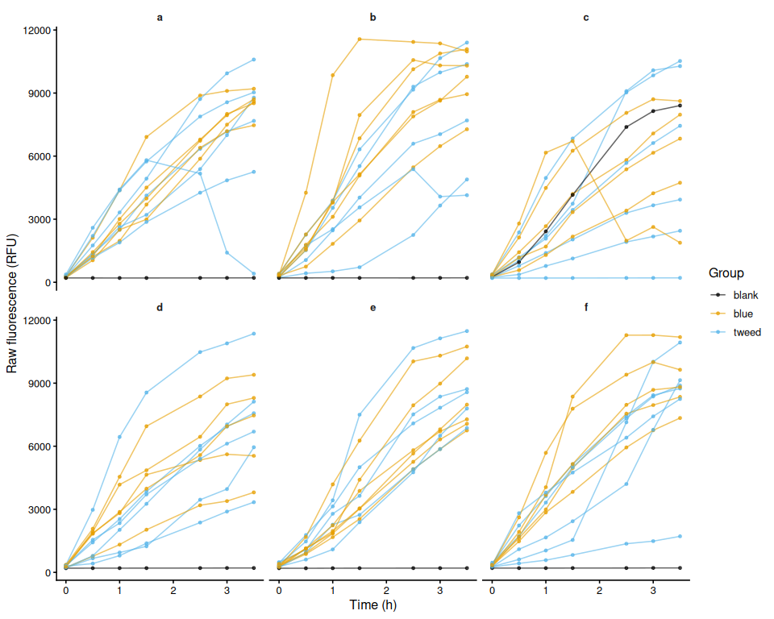<!-- -->

``` r
ggsave(file.path(fig_dir, "raw_fluor_by_plate.png"),
       p_raw_plates, width = 10, height = 8)
```

## 6.3 Mean raw fluorescence by family

``` r
raw_family_summary <- raw_df %>%
  group_by(family_id_group, treatment_group, time_hr) %>%
  summarise(
    mean_fluor = mean(value, na.rm = TRUE),
    se_fluor   = sd(value, na.rm = TRUE) /
      sqrt(sum(!is.na(value))),
    n          = sum(!is.na(value)),
    .groups    = "drop"
  )

p_raw_mean <- ggplot(raw_family_summary,
    aes(x = time_hr, y = mean_fluor,
        colour = family_id_group, linetype = treatment_group,
        group = interaction(family_id_group, treatment_group))) +
  geom_ribbon(aes(ymin = mean_fluor - se_fluor,
                  ymax = mean_fluor + se_fluor,
                  fill = family_id_group),
              alpha = 0.15, colour = NA) +
  geom_line(linewidth = 1) +
  geom_point(size = 2) +
  scale_colour_manual(values = fam_colours, name = "Family") +
  scale_fill_manual(values = fam_colours, name = "Family") +
  scale_linetype_manual(values = trt_linetypes, name = "Treatment") +
  labs(x = "Time (h)", y = "Mean raw fluorescence (RFU ± SE)") +
  theme_classic(base_size = 13)

p_raw_mean
```

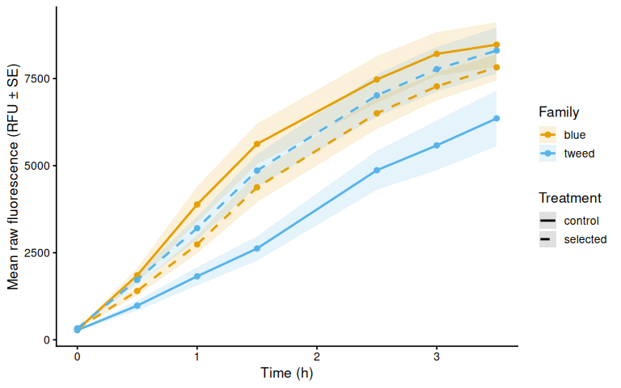<!-- -->

``` r
ggsave(file.path(fig_dir, "raw_mean_by_family.png"),
       p_raw_mean, width = 8, height = 5)
```

## 6.4 Individual raw fluorescence traces by family

``` r
p_raw_by_family <- raw_df %>%
  ggplot(aes(x = time_hr, y = value,
             group = trace_id, colour = treatment_group)) +
  geom_line(alpha = 0.6) +
  geom_point(size = 1.2, alpha = 0.7) +
  facet_wrap(~ family_id_group) +
  scale_colour_manual(values = trt_colours, name = "Treatment") +
  labs(x = "Time (h)", y = "Raw fluorescence (RFU)") +
  theme_classic(base_size = 12) +
  theme(strip.background = element_blank(),
        strip.text       = element_text(face = "bold"))

p_raw_by_family
```

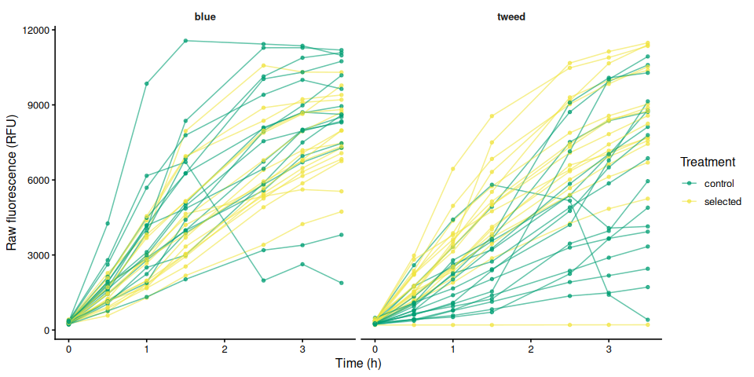<!-- -->

``` r
ggsave(file.path(fig_dir, "raw_individual_by_family.png"),
       p_raw_by_family, width = 10, height = 5)
```

## 6.5 Individual raw fluorescence traces by treatment

``` r
p_raw_by_treatment <- raw_df %>%
  ggplot(aes(x = time_hr, y = value,
             group = trace_id, colour = family_id_group)) +
  geom_line(alpha = 0.6) +
  geom_point(size = 1.2, alpha = 0.7) +
  facet_wrap(~ treatment_group) +
  scale_colour_manual(values = fam_colours, name = "Family") +
  labs(x = "Time (h)", y = "Raw fluorescence (RFU)") +
  theme_classic(base_size = 12) +
  theme(strip.background = element_blank(),
        strip.text       = element_text(face = "bold"))

p_raw_by_treatment
```

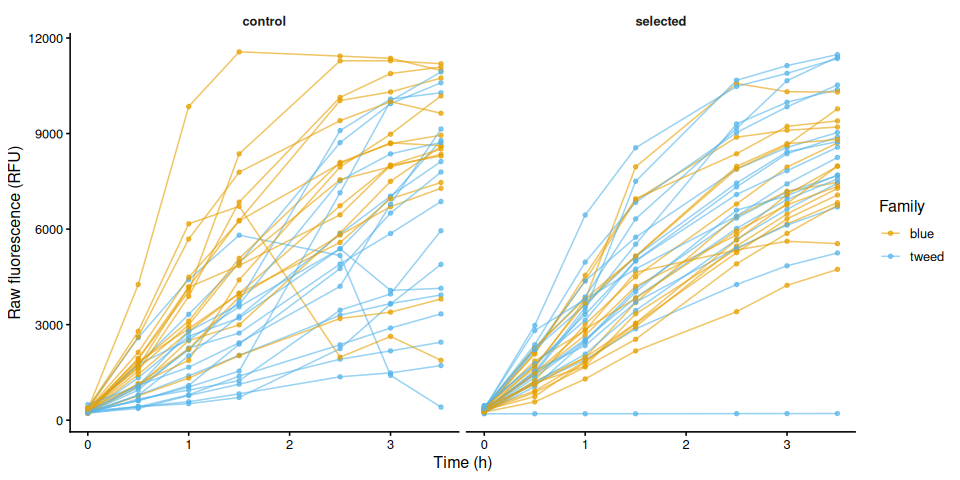<!-- -->

``` r
ggsave(file.path(fig_dir, "raw_individual_by_treatment.png"),
       p_raw_by_treatment, width = 10, height = 5)
```

## 6.6 Excluded samples

Wells flagged `exclude_from_analysis = TRUE` appear in the raw
fluorescence plots above but are omitted from all analyses that follow.

``` r
excluded_wells <- dat %>%
  filter(!is_blank, exclude_from_analysis) %>%
  mutate(
    sample = if_else(
      !is.na(sample_id_group) & trimws(as.character(sample_id_group)) != "",
      as.character(sample_id_group),
      paste(plate_id, well_id, sep = "_")
    )
  ) %>%
  select(plate_id, well_id, sample, family_id_group, treatment_group,
         any_of("exclude_reason")) %>%
  distinct() %>%
  arrange(plate_id, well_id)

if (nrow(excluded_wells) > 0) {
  col_names <- c("Plate", "Well", "Sample", "Family", "Treatment")
  if ("exclude_reason" %in% names(excluded_wells))
    col_names <- c(col_names, "Reason")
  cat(knitr::kable(excluded_wells, col.names = col_names), sep = "\n")
} else {
  cat("No wells are excluded from analysis.\n")
}
```

No wells are excluded from analysis.

# 7 Blank Correction via Fold-Change Normalization

Following Huffmyer et al.: fluorescence is first expressed as
fold-change relative to each well’s own T0 reading (applied to samples
and blanks alike), the mean fold-change of blank wells (per plate, per
timepoint) is then subtracted. All samples therefore start at exactly 0
at T0 by construction, eliminating the risk of negative starting values
from pipetting variance.

## 7.1 Step 1 – Fold-change relative to T0 for all wells

``` r
t0_all <- dat %>%
  filter(is.finite(time_hr), is.finite(value)) %>%
  group_by(plate_id, well_id) %>%
  slice_min(time_hr, n = 1, with_ties = FALSE) %>%
  select(plate_id, well_id, value_t0 = value) %>%
  ungroup()

dat_fc <- dat %>%
  left_join(t0_all, by = c("plate_id", "well_id")) %>%
  mutate(fold_change = if_else(
    is.finite(value_t0) & value_t0 > 0,
    value / value_t0,
    NA_real_
  ))

str(dat_fc)
```

    tibble [504 × 17] (S3: tbl_df/tbl/data.frame)
     $ row_id               : chr [1:504] "A" "A" "A" "A" ...
     $ col_id               : int [1:504] 1 2 3 4 1 2 3 4 1 2 ...
     $ well_id              : chr [1:504] "A1" "A2" "A3" "A4" ...
     $ value                : num [1:504] 280 224 241 219 241 295 255 237 285 270 ...
     $ plate_id             : chr [1:504] "a" "a" "a" "a" ...
     $ time_hr              : num [1:504] 0 0 0 0 0 0 0 0 0 0 ...
     $ is_blank             : logi [1:504] FALSE FALSE FALSE FALSE FALSE FALSE ...
     $ exclude_from_analysis: logi [1:504] FALSE FALSE FALSE FALSE FALSE FALSE ...
     $ family_id_group      : chr [1:504] "tweed" "blue" "tweed" "blue" ...
     $ sample_id_group      : chr [1:504] NA NA NA NA ...
     $ treatment_group      : chr [1:504] "selected" "selected" "control" "control" ...
     $ width_mm_measurement : num [1:504] NA NA NA NA NA NA NA NA NA NA ...
     $ length_mm_measurement: num [1:504] NA NA NA NA NA NA NA NA NA NA ...
     $ weight_mg_measurement: num [1:504] NA NA NA NA NA NA NA NA NA NA ...
     $ area_cm2_measurement : num [1:504] 1.47 0.847 1.01 0.789 1.062 ...
     $ value_t0             : num [1:504] 280 224 241 219 241 295 255 237 285 270 ...
     $ fold_change          : num [1:504] 1 1 1 1 1 1 1 1 1 1 ...

## 7.2 Step 2 – Mean blank fold-change per plate per timepoint

``` r
blank_fc_ref <- dat_fc %>%
  filter(is_blank) %>%
  group_by(plate_id, time_hr) %>%
  summarise(mean_blank_fc = mean(fold_change, na.rm = TRUE),
            .groups = "drop")

str(blank_fc_ref)
```

    tibble [42 × 3] (S3: tbl_df/tbl/data.frame)
     $ plate_id     : chr [1:42] "a" "a" "a" "a" ...
     $ time_hr      : num [1:42] 0 0.5 1 1.5 2.5 3 3.5 0 0.5 1 ...
     $ mean_blank_fc: num [1:42] 1 0.995 0.981 0.99 1.005 ...

## 7.3 Step 3 – Subtract blank fold-change from sample fold-change

``` r
samples <- dat_fc %>%
  filter(!is_blank, !exclude_from_analysis) %>%
  mutate(
    trace_id = if_else(
      !is.na(sample_id_group) & trimws(as.character(sample_id_group)) != "",
      as.character(sample_id_group),
      paste(plate_id, well_id, sep = "_")
    )
  ) %>%
  left_join(blank_fc_ref, by = c("plate_id", "time_hr")) %>%
  mutate(corrected_fc = fold_change - mean_blank_fc)

str(samples)
```

    tibble [462 × 20] (S3: tbl_df/tbl/data.frame)
     $ row_id               : chr [1:462] "A" "A" "A" "A" ...
     $ col_id               : int [1:462] 1 2 3 4 1 2 3 4 1 2 ...
     $ well_id              : chr [1:462] "A1" "A2" "A3" "A4" ...
     $ value                : num [1:462] 280 224 241 219 241 295 255 237 285 270 ...
     $ plate_id             : chr [1:462] "a" "a" "a" "a" ...
     $ time_hr              : num [1:462] 0 0 0 0 0 0 0 0 0 0 ...
     $ is_blank             : logi [1:462] FALSE FALSE FALSE FALSE FALSE FALSE ...
     $ exclude_from_analysis: logi [1:462] FALSE FALSE FALSE FALSE FALSE FALSE ...
     $ family_id_group      : chr [1:462] "tweed" "blue" "tweed" "blue" ...
     $ sample_id_group      : chr [1:462] NA NA NA NA ...
     $ treatment_group      : chr [1:462] "selected" "selected" "control" "control" ...
     $ width_mm_measurement : num [1:462] NA NA NA NA NA NA NA NA NA NA ...
     $ length_mm_measurement: num [1:462] NA NA NA NA NA NA NA NA NA NA ...
     $ weight_mg_measurement: num [1:462] NA NA NA NA NA NA NA NA NA NA ...
     $ area_cm2_measurement : num [1:462] 1.47 0.847 1.01 0.789 1.062 ...
     $ value_t0             : num [1:462] 280 224 241 219 241 295 255 237 285 270 ...
     $ fold_change          : num [1:462] 1 1 1 1 1 1 1 1 1 1 ...
     $ trace_id             : chr [1:462] "a_A1" "a_A2" "a_A3" "a_A4" ...
     $ mean_blank_fc        : num [1:462] 1 1 1 1 1 1 1 1 1 1 ...
     $ corrected_fc         : num [1:462] 0 0 0 0 0 0 0 0 0 0 ...

# 8 Blank-Corrected Fold-Change

## 8.1 Mean by family

``` r
bc_fc_summary <- samples %>%
  group_by(family_id_group, treatment_group, time_hr) %>%
  summarise(
    mean_val = mean(corrected_fc, na.rm = TRUE),
    se_val   = sd(corrected_fc, na.rm = TRUE) /
      sqrt(sum(!is.na(corrected_fc))),
    n        = sum(!is.na(corrected_fc)),
    .groups  = "drop"
  )

p_bc_fc_mean <- ggplot(bc_fc_summary,
    aes(x = time_hr, y = mean_val,
        colour = family_id_group, linetype = treatment_group,
        group = interaction(family_id_group, treatment_group))) +
  geom_ribbon(aes(ymin = mean_val - se_val,
                  ymax = mean_val + se_val,
                  fill = family_id_group),
              alpha = 0.15, colour = NA) +
  geom_line(linewidth = 1) +
  geom_point(size = 2) +
  scale_colour_manual(values = fam_colours, name = "Family") +
  scale_fill_manual(values = fam_colours, name = "Family") +
  scale_linetype_manual(values = trt_linetypes, name = "Treatment") +
  labs(x = "Time (h)",
       y = "Mean blank-corrected fold-change (± SE)") +
  theme_classic(base_size = 13)

p_bc_fc_mean
```

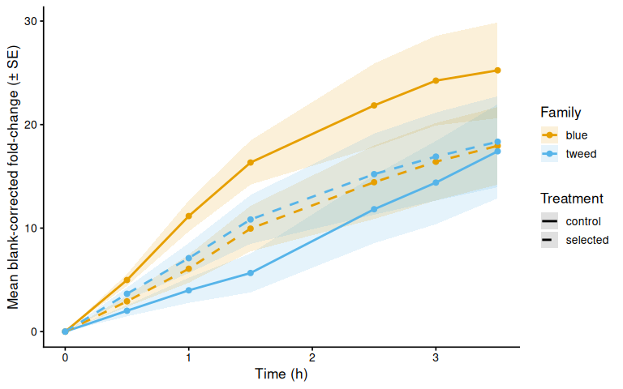<!-- -->

``` r
ggsave(file.path(fig_dir, "blank_corrected_fc_mean_by_family.png"),
       p_bc_fc_mean, width = 8, height = 5)
```

## 8.2 Individual traces by family

``` r
p_bc_fc_by_family <- samples %>%
  ggplot(aes(x = time_hr, y = corrected_fc,
             group = trace_id, colour = treatment_group)) +
  geom_line(alpha = 0.6) +
  geom_point(size = 1.2, alpha = 0.7) +
  facet_wrap(~ family_id_group) +
  scale_colour_manual(values = trt_colours, name = "Treatment") +
  labs(x = "Time (h)", y = "Blank-corrected fold-change") +
  theme_classic(base_size = 12) +
  theme(strip.background = element_blank(),
        strip.text       = element_text(face = "bold"))

p_bc_fc_by_family
```

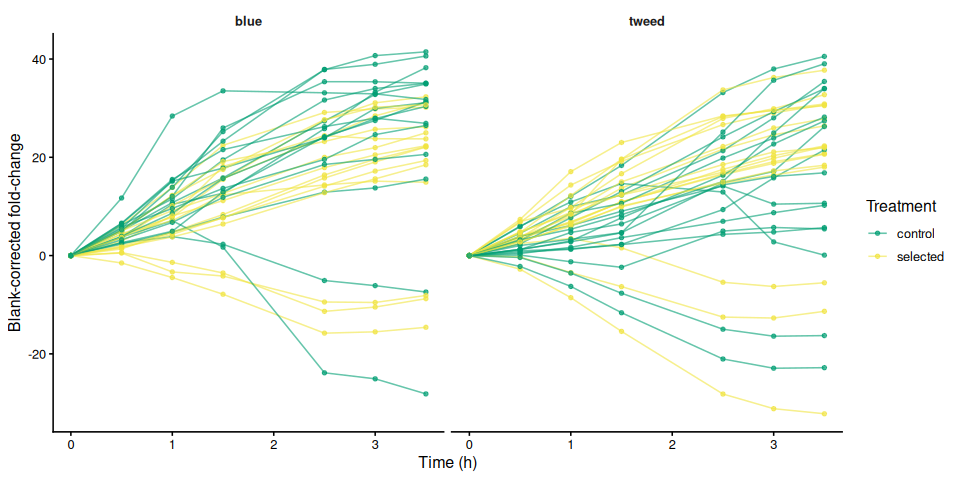<!-- -->

``` r
ggsave(file.path(fig_dir, "blank_corrected_fc_by_family.png"),
       p_bc_fc_by_family, width = 10, height = 5)
```

## 8.3 Individual blank-corrected fold-change traces by treatment

``` r
p_bc_fc_by_treatment <- samples %>%
  ggplot(aes(x = time_hr, y = corrected_fc,
             group = trace_id, colour = family_id_group)) +
  geom_line(alpha = 0.6) +
  geom_point(size = 1.2, alpha = 0.7) +
  facet_wrap(~ treatment_group) +
  scale_colour_manual(values = fam_colours, name = "Family") +
  labs(x = "Time (h)", y = "Blank-corrected fold-change") +
  theme_classic(base_size = 12) +
  theme(strip.background = element_blank(),
        strip.text       = element_text(face = "bold"))

p_bc_fc_by_treatment
```

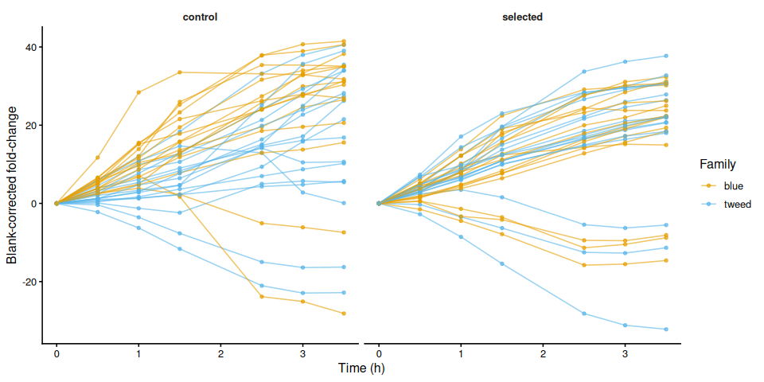<!-- -->

``` r
ggsave(file.path(fig_dir, "blank_corrected_fc_by_treatment.png"),
       p_bc_fc_by_treatment, width = 10, height = 5)
```

# 9 Metabolism (Size-Normalised Fold-Change)

Blank-corrected fold-change divided by each active measurement column.
This is “metabolism” as defined in Huffmyer et al.

``` r
if (length(active_meas_cols) == 0) {
  message("No active measurement columns: skipping metabolism calculation.")
  metabolism_df <- tibble()
} else {
  metabolism_df <- samples
  for (mc in active_meas_cols) {
    out_col <- paste0("metabolism_per_", mc)
    metabolism_df <- metabolism_df %>%
      mutate(!!out_col := if_else(
        is.finite(.data[[mc]]) & .data[[mc]] > 0 &
          is.finite(corrected_fc),
        corrected_fc / .data[[mc]],
        NA_real_
      ))
  }
}

str(metabolism_df)
```

    tibble [462 × 21] (S3: tbl_df/tbl/data.frame)
     $ row_id                             : chr [1:462] "A" "A" "A" "A" ...
     $ col_id                             : int [1:462] 1 2 3 4 1 2 3 4 1 2 ...
     $ well_id                            : chr [1:462] "A1" "A2" "A3" "A4" ...
     $ value                              : num [1:462] 280 224 241 219 241 295 255 237 285 270 ...
     $ plate_id                           : chr [1:462] "a" "a" "a" "a" ...
     $ time_hr                            : num [1:462] 0 0 0 0 0 0 0 0 0 0 ...
     $ is_blank                           : logi [1:462] FALSE FALSE FALSE FALSE FALSE FALSE ...
     $ exclude_from_analysis              : logi [1:462] FALSE FALSE FALSE FALSE FALSE FALSE ...
     $ family_id_group                    : chr [1:462] "tweed" "blue" "tweed" "blue" ...
     $ sample_id_group                    : chr [1:462] NA NA NA NA ...
     $ treatment_group                    : chr [1:462] "selected" "selected" "control" "control" ...
     $ width_mm_measurement               : num [1:462] NA NA NA NA NA NA NA NA NA NA ...
     $ length_mm_measurement              : num [1:462] NA NA NA NA NA NA NA NA NA NA ...
     $ weight_mg_measurement              : num [1:462] NA NA NA NA NA NA NA NA NA NA ...
     $ area_cm2_measurement               : num [1:462] 1.47 0.847 1.01 0.789 1.062 ...
     $ value_t0                           : num [1:462] 280 224 241 219 241 295 255 237 285 270 ...
     $ fold_change                        : num [1:462] 1 1 1 1 1 1 1 1 1 1 ...
     $ trace_id                           : chr [1:462] "a_A1" "a_A2" "a_A3" "a_A4" ...
     $ mean_blank_fc                      : num [1:462] 1 1 1 1 1 1 1 1 1 1 ...
     $ corrected_fc                       : num [1:462] 0 0 0 0 0 0 0 0 0 0 ...
     $ metabolism_per_area_cm2_measurement: num [1:462] 0 0 0 0 0 0 0 0 0 0 ...

## 9.1 Mean metabolism by family

``` r
if (nrow(metabolism_df) > 0) {

  metab_cols <- paste0("metabolism_per_", active_meas_cols)

  for (col in metab_cols) {
    if (!col %in% names(metabolism_df)) next
    mc_label <- str_remove(col, "^metabolism_per_")

    metab_summary <- metabolism_df %>%
      group_by(family_id_group, treatment_group, time_hr) %>%
      summarise(
        mean_val = mean(.data[[col]], na.rm = TRUE),
        se_val   = sd(.data[[col]], na.rm = TRUE) /
          sqrt(sum(!is.na(.data[[col]]))),
        .groups  = "drop"
      )

    p_metab_mean <- ggplot(metab_summary,
        aes(x = time_hr, y = mean_val,
            colour = family_id_group, linetype = treatment_group,
            group = interaction(family_id_group, treatment_group))) +
      geom_ribbon(aes(ymin = mean_val - se_val,
                      ymax = mean_val + se_val,
                      fill = family_id_group),
                  alpha = 0.15, colour = NA) +
      geom_line(linewidth = 1) +
      geom_point(size = 2) +
      scale_colour_manual(values = fam_colours, name = "Family") +
      scale_fill_manual(values = fam_colours, name = "Family") +
      scale_linetype_manual(values = trt_linetypes, name = "Treatment") +
      labs(x = "Time (h)",
           y = paste0(metabolism_y_label(col), " (± SE)")) +
      theme_classic(base_size = 13)

    print(p_metab_mean)
    ggsave(
      file.path(fig_dir,
                paste0("metabolism_mean_", mc_label, ".png")),
      p_metab_mean, width = 8, height = 5)
  }
}
```

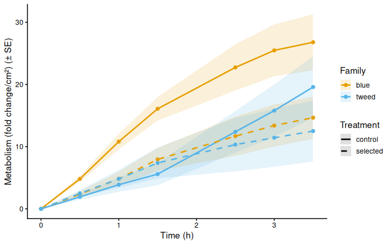<!-- -->

## 9.2 Individual metabolism traces by family

``` r
if (nrow(metabolism_df) > 0) {

  for (col in metab_cols) {
    if (!col %in% names(metabolism_df)) next
    mc_label <- str_remove(col, "^metabolism_per_")

    p_metab_by_family <- ggplot(metabolism_df,
        aes(x = time_hr, y = .data[[col]],
            group = trace_id, colour = treatment_group)) +
      geom_line(alpha = 0.6) +
      geom_point(size = 1.2, alpha = 0.7) +
      facet_wrap(~ family_id_group) +
      scale_colour_manual(values = trt_colours, name = "Treatment") +
      labs(x = "Time (h)", y = metabolism_y_label(col)) +
      theme_classic(base_size = 12) +
      theme(strip.background = element_blank(),
            strip.text       = element_text(face = "bold"))

    print(p_metab_by_family)
    ggsave(
      file.path(fig_dir,
                paste0("metabolism_individual_", mc_label, "_by_family.png")),
      p_metab_by_family, width = 10, height = 5)

    p_metab_by_treatment <- ggplot(metabolism_df,
        aes(x = time_hr, y = .data[[col]],
            group = trace_id, colour = family_id_group)) +
      geom_line(alpha = 0.6) +
      geom_point(size = 1.2, alpha = 0.7) +
      facet_wrap(~ treatment_group) +
      scale_colour_manual(values = fam_colours, name = "Family") +
      labs(x = "Time (h)", y = metabolism_y_label(col)) +
      theme_classic(base_size = 12) +
      theme(strip.background = element_blank(),
            strip.text       = element_text(face = "bold"))

    print(p_metab_by_treatment)
    ggsave(
      file.path(fig_dir,
                paste0("metabolism_individual_", mc_label, "_by_treatment.png")),
      p_metab_by_treatment, width = 10, height = 5)
  }
}
```

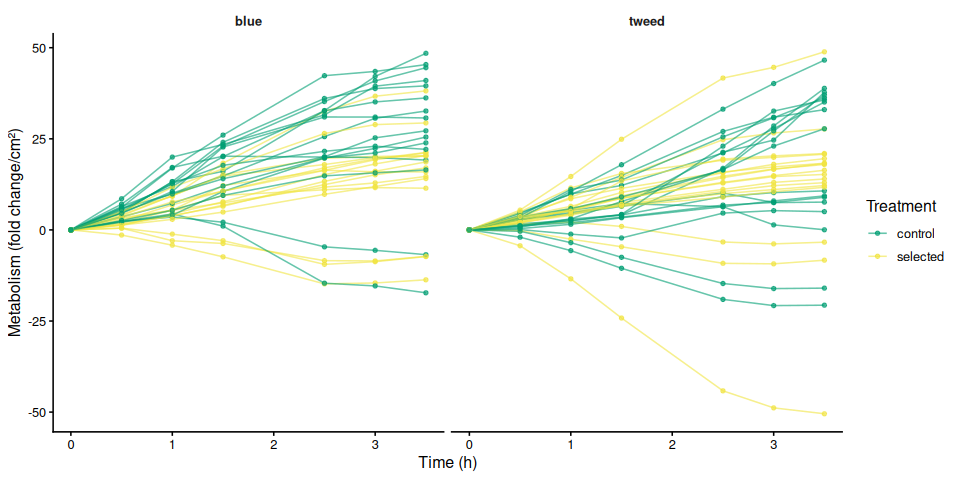<!-- -->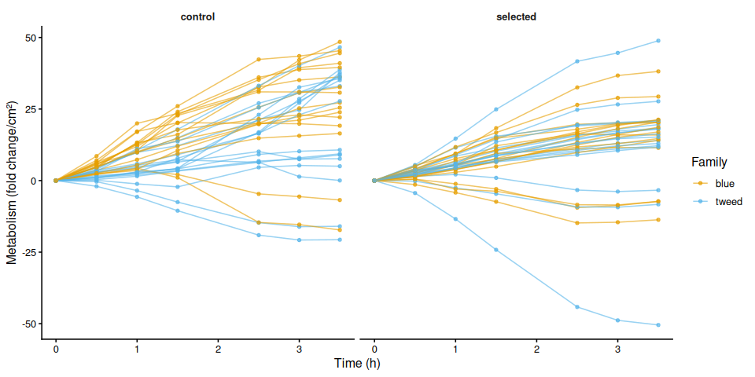<!-- -->

# 10 Time-Series Statistical Analysis

Linear mixed effects models test the effect of experimental variables on
metabolism over time. Individual (`sample_id_group`) is included as a
random intercept to account for repeated measures across timepoints.
Type III ANOVA with Satterthwaite’s approximation (lmerTest) assesses
significance; post-hoc pairwise comparisons use estimated marginal means
(emmeans, Tukey adjustment).

``` r
run_ts_stats <- function(df, value_col) {
  has_family    <- "family_id_group" %in% names(df) &&
    length(unique(na.omit(df$family_id_group))) > 1
  has_treatment <- "treatment_group" %in% names(df) &&
    length(unique(na.omit(df$treatment_group))) > 1

  if (!has_family && !has_treatment) return(NULL)

  df <- df %>%
    filter(is.finite(.data[[value_col]]), is.finite(time_hr)) %>%
    mutate(
      time_f     = factor(time_hr),
      individual = factor(trace_id)
    )

  if (nrow(df) == 0) return(NULL)

  if (has_family)    df <- df %>% mutate(family    = factor(family_id_group))
  if (has_treatment) df <- df %>% mutate(treatment = factor(treatment_group))

  if (has_family    && length(unique(na.omit(df$family)))    < 2) return(NULL)
  if (has_treatment && length(unique(na.omit(df$treatment))) < 2) return(NULL)

  fixed <- if (has_family && has_treatment)
    paste0(value_col, " ~ time_f * family * treatment")
  else if (has_family)
    paste0(value_col, " ~ time_f * family")
  else
    paste0(value_col, " ~ time_f * treatment")

  model <- lmer(
    as.formula(paste0(fixed, " + (1 | individual)")),
    data = df
  )

  anova_res <- anova(model, type = 3, ddf = "Satterthwaite")

  # Pairwise comparisons of group combinations at each timepoint
  emm_spec <- if (has_family && has_treatment)
    ~ family * treatment | time_f
  else if (has_family)
    ~ family | time_f
  else
    ~ treatment | time_f

  emm       <- emmeans(model, emm_spec)
  pairs_res <- as.data.frame(pairs(emm, adjust = "tukey"))

  # Main-effect marginal means (collapsed across time)
  emm_main <- if (has_family && has_treatment)
    emmeans(model, ~ family * treatment)
  else if (has_family)
    emmeans(model, ~ family)
  else
    emmeans(model, ~ treatment)

  pairs_main <- as.data.frame(pairs(emm_main, adjust = "tukey"))

  list(
    model         = model,
    anova         = anova_res,
    pairs_by_time = pairs_res,
    pairs_main    = pairs_main,
    has_family    = has_family,
    has_treatment = has_treatment
  )
}

ts_stats <- list()
if (nrow(metabolism_df) > 0) {
  for (mc in active_meas_cols) {
    col <- paste0("metabolism_per_", mc)
    if (col %in% names(metabolism_df))
      ts_stats[[col]] <- run_ts_stats(metabolism_df, col)
  }
}
```

## 10.1 Results

``` r
for (col in names(ts_stats)) {
  res <- ts_stats[[col]]
  if (is.null(res)) next

  cat("\n\n----\n### Metric:", col, "\n\n")

  cat("**Type III ANOVA (Satterthwaite approximation):**\n")
  print(res$anova)

  cat("\n**Marginal means – main effects (collapsed across time):**\n")
  print(res$pairs_main)

  cat("\n**Pairwise comparisons by timepoint (Tukey):**\n")
  print(res$pairs_by_time)
}
```

### Metric: metabolism_per_area_cm2_measurement

Signif. codes: 0 ‘***’ 0.001 ’**’ 0.01 ’*’ 0.05 ‘.’ 0.1 ’ ’ 1

**Marginal means – main effects (collapsed across time):** contrast estimate SE df t.ratio p.value blue control - tweed control 6.793623 3.174362 62 2.140 0.1519 blue control - blue selected 7.406867 3.222099 62 2.299 0.1094 blue control - tweed selected 8.251319 3.174362 62 2.599 0.0552 tweed control - blue selected 0.613244 3.174362 62 0.193 0.9974 tweed control - tweed selected 1.457696 3.125895 62 0.466 0.9661 blue selected - tweed selected 0.844452 3.174362 62 0.266 0.9933

Results are averaged over the levels of: time_f Degrees-of-freedom method: kenward-roger P value adjustment: tukey method for comparing a family of 4 estimates

**Pairwise comparisons by timepoint (Tukey):** time_f = 0: contrast estimate SE df t.ratio p.value blue control - tweed control 0.000000 4.036973 152.49 0.000 1.0000 blue control - blue selected 0.000000 4.097683 152.49 0.000 1.0000 blue control - tweed selected 0.000000 4.036973 152.49 0.000 1.0000 tweed control - blue selected 0.000000 4.036973 152.49 0.000 1.0000 tweed control - tweed selected 0.000000 3.975336 152.49 0.000 1.0000 blue selected - tweed selected 0.000000 4.036973 152.49 0.000 1.0000

time_f = 0.5: contrast estimate SE df t.ratio p.value blue control - tweed control 2.890837 4.036973 152.49 0.716 0.8906 blue control - blue selected 2.458084 4.097683 152.49 0.600 0.9320 blue control - tweed selected 2.322904 4.036973 152.49 0.575 0.9393 tweed control - blue selected -0.432752 4.036973 152.49 -0.107 0.9996 tweed control - tweed selected -0.567933 3.975336 152.49 -0.143 0.9990 blue selected - tweed selected -0.135180 4.036973 152.49 -0.033 1.0000

time_f = 1: contrast estimate SE df t.ratio p.value blue control - tweed control 6.929365 4.036973 152.49 1.716 0.3187 blue control - blue selected 5.978033 4.097683 152.49 1.459 0.4649 blue control - tweed selected 5.981791 4.036973 152.49 1.482 0.4510 tweed control - blue selected -0.951332 4.036973 152.49 -0.236 0.9954 tweed control - tweed selected -0.947574 3.975336 152.49 -0.238 0.9952 blue selected - tweed selected 0.003758 4.036973 152.49 0.001 1.0000

time_f = 1.5: contrast estimate SE df t.ratio p.value blue control - tweed control 10.501549 4.036973 152.49 2.601 0.0495 blue control - blue selected 8.139586 4.097683 152.49 1.986 0.1976 blue control - tweed selected 8.705560 4.036973 152.49 2.156 0.1403 tweed control - blue selected -2.361964 4.036973 152.49 -0.585 0.9365 tweed control - tweed selected -1.795990 3.975336 152.49 -0.452 0.9692 blue selected - tweed selected 0.565974 4.036973 152.49 0.140 0.9990

time_f = 2.5: contrast estimate SE df t.ratio p.value blue control - tweed control 10.352552 4.036973 152.49 2.564 0.0544 blue control - blue selected 11.051266 4.097683 152.49 2.697 0.0386 blue control - tweed selected 12.417058 4.036973 152.49 3.076 0.0132 tweed control - blue selected 0.698713 4.036973 152.49 0.173 0.9981 tweed control - tweed selected 2.064506 3.975336 152.49 0.519 0.9543 blue selected - tweed selected 1.365792 4.036973 152.49 0.338 0.9866

time_f = 3: contrast estimate SE df t.ratio p.value blue control - tweed control 9.681967 4.036973 152.49 2.398 0.0817 blue control - blue selected 12.090801 4.097683 152.49 2.951 0.0190 blue control - tweed selected 14.047943 4.036973 152.49 3.480 0.0036 tweed control - blue selected 2.408834 4.036973 152.49 0.597 0.9329 tweed control - tweed selected 4.365976 3.975336 152.49 1.098 0.6911 blue selected - tweed selected 1.957142 4.036973 152.49 0.485 0.9624

time_f = 3.5: contrast estimate SE df t.ratio p.value blue control - tweed control 7.199089 4.036973 152.49 1.783 0.2853 blue control - blue selected 12.130298 4.097683 152.49 2.960 0.0185 blue control - tweed selected 14.283978 4.036973 152.49 3.538 0.0030 tweed control - blue selected 4.931210 4.036973 152.49 1.222 0.6142 tweed control - tweed selected 7.084890 3.975336 152.49 1.782 0.2859 blue selected - tweed selected 2.153680 4.036973 152.49 0.533 0.9508

Degrees-of-freedom method: kenward-roger P value adjustment: tukey method for comparing a family of 4 estimates

# Area Under the Curve (AUC)

AUC computed per individual via the trapezoid rule across all timepoints. `metabolism_per_*` is the primary metric matching the paper; `corrected_fc` and `raw_fluorescence` are retained for reference.

``` r
compute_auc <- function(df, value_col, group_vars) { df %>% filter(is.finite(time_hr), is.finite(.data[[value_col]])) %>% group_by(across(all_of(group_vars))) %>% summarise( AUC = trapezoid_auc(time_hr, .data[[value_col]]), n_timepoints = n(), .groups = “drop” ) %>% filter(is.finite(AUC)) }
\# Only include grouping columns that are actually present in the data individual_vars <- intersect( c(“trace_id”, “family_id_group”, “treatment_group”), names(metabolism_df) )
auc_metab_list <- list() if (nrow(metabolism_df) > 0) { for (mc in active_meas_cols) { col <- paste0(“metabolism_per_”, mc) if (col %in% names(metabolism_df)) { auc_metab_list[[col]] <- compute_auc(metabolism_df, col, individual_vars) %>% mutate(metric = col) } } }
auc_all <- bind_rows(auc_metab_list)
str(auc_all)
```

    tibble [66 × 6] (S3: tbl_df/tbl/data.frame) $ trace_id       : chr [1:66] "a_A1" "a_A2" "a_A3" "a_A4" ... $ family_id_group: chr [1:66] "tweed" "blue" "tweed" "blue" ... $ treatment_group: chr [1:66] "selected" "selected" "control" "control" ... $ AUC            : num [1:66] 34.9 73.3 54.8 78.8 38.4 ... $ n_timepoints   : int [1:66] 7 7 7 7 7 7 7 7 7 7 ... $ metric         : chr [1:66] "metabolism_per_area_cm2_measurement" "metabolism_per_area_cm2_measurement" "metabolism_per_area_cm2_measurement" "metabolism_per_area_cm2_measurement" ...

## AUC summary tables

``` r
sum_vars <- intersect( c(“metric”, “family_id_group”, “treatment_group”), names(auc_all) ) auc_summary <- auc_all %>% group_by(across(all_of(sum_vars))) %>% summarise( n = n(), mean = mean(AUC, na.rm = TRUE), sd = sd(AUC, na.rm = TRUE), se = sd / sqrt(n), median = median(AUC, na.rm = TRUE), .groups = “drop” )
print(auc_summary)
```

    # A tibble: 4 × 8 metric          family_id_group treatment_group     n  mean    sd    se median <chr>           <chr>           <chr>           <int> <dbl> <dbl> <dbl>  <dbl> 1 metabolism_per… blue            control            16  56.4  31.7  7.92   59.1 2 metabolism_per… blue            selected           16  28.7  27.9  6.99   32.3 3 metabolism_per… tweed           control            17  29.2  31.8  7.72   38.8 4 metabolism_per… tweed           selected           17  25.8  39.5  9.59   32.1

# Statistical Analysis

Each individual clam (`sample_id_group`) is the observational unit. The model is built from whichever grouping factors are present: both family and treatment (with interaction) when both exist, or a one-way model when only one factor is available. Each plate maps to a unique family × treatment combination, so plate-level and group-level variance are confounded; interpret accordingly.

has_treatment <- "treatment_group" %in% names(auc_df) &&
length(unique(na.omit(auc_df$treatment_group))) > 1
if (!has_family && !has_treatment) { return(list(model = NULL, anova = NULL, pairs_full = empty, pairs_family = empty, pairs_trt = empty, has_family = FALSE, has_treatment = FALSE)) }
if (has_family) auc_df <- auc_df %>% mutate(family = factor(family_id_group)) if (has_treatment) auc_df <- auc_df %>% mutate(treatment = factor(treatment_group))
formula_str <- if (has_family && has_treatment) “AUC ~ family * treatment” else if (has_family) “AUC ~ family” else “AUC ~ treatment” model <- lm(as.formula(formula_str), data = auc_df) anova_res <- anova(model)
if (has_family && has_treatment) { pairs_full <- as.data.frame(pairs(emmeans(model, ~ family * treatment), adjust = “tukey”)) pairs_family <- as.data.frame(pairs(emmeans(model, ~ family), adjust = “tukey”)) pairs_trt <- as.data.frame(pairs(emmeans(model, ~ treatment), adjust = “tukey”)) } else if (has_family) { pairs_family <- as.data.frame(pairs(emmeans(model, ~ family), adjust = “tukey”)) pairs_full <- pairs_family pairs_trt <- empty } else { pairs_trt <- as.data.frame(pairs(emmeans(model, ~ treatment), adjust = “tukey”)) pairs_full <- pairs_trt pairs_family <- empty }
list( model = model, anova = anova_res, pairs_full = pairs_full, pairs_family = pairs_family, pairs_trt = pairs_trt, has_family = has_family, has_treatment = has_treatment ) }
metrics_to_test <- unique(auc_all$metric) stats_results <- map( set_names(metrics_to_test), ~ run_auc_stats(auc_all %>% filter(metric == .x)) ) \`\`\`
## Results by metric


### 10.1.1 Metric: metabolism_per_area_cm2_measurement

**ANOVA:** Analysis of Variance Table

Response: AUC Df Sum Sq Mean Sq F value Pr(\>F)  
family 1 3732 3731.8 3.4040 0.06982 . treatment 1 3800 3799.9 3.4661
0.06738 . family:treatment 1 2432 2431.8 2.2182 0.14146  
Residuals 62 67969 1096.3  
— Signif. codes: 0 ‘***’ 0.001 ’**’ 0.01 ’*’ 0.05 ‘.’ 0.1 ’ ’ 1

**Pairwise: family × treatment (Tukey):** contrast estimate SE df
t.ratio p.value blue control - tweed control 27.191433 11.53277 62 2.358
0.0962 blue control - blue selected 27.689173 11.70620 62 2.365 0.0946
blue control - tweed selected 30.589277 11.53277 62 2.652 0.0485 tweed
control - blue selected 0.497739 11.53277 62 0.043 1.0000 tweed
control - tweed selected 3.397844 11.35669 62 0.299 0.9906 blue
selected - tweed selected 2.900104 11.53277 62 0.251 0.9944

P value adjustment: tukey method for comparing a family of 4 estimates

**Pairwise: family main effect:** contrast estimate SE df t.ratio
p.value blue - tweed 15.04577 8.154899 62 1.845 0.0698

Results are averaged over the levels of: treatment

**Pairwise: treatment main effect:** contrast estimate SE df t.ratio
p.value control - selected 15.54351 8.154899 62 1.906 0.0613

Results are averaged over the levels of: family

# 11 AUC Box Plots with Statistical Annotations

Significance labels: `***` p \< 0.001, `**` p \< 0.01, `*` p \< 0.05.
Brackets are drawn only for significant pairs (p \< 0.05). Plots are
generated for whichever grouping factors are present: treatment-only,
family-only, all-groups, within-family, and within-treatment.

``` r
sig_label <- function(p) {
  case_when(p < 0.001 ~ "***", p < 0.01 ~ "**", p < 0.05 ~ "*",
            TRUE ~ "ns")
}

# Add significance brackets to an existing ggplot.
# pairs_df   : data frame with $contrast and $p.value columns
# group_levels: ordered character vector matching x-axis factor levels
# y_vals     : numeric vector of AUC values used to set bracket heights
add_sig_brackets <- function(p, pairs_df, group_levels, y_vals) {
  sig_pairs <- pairs_df %>%
    mutate(label = sig_label(p.value)) %>%
    filter(label != "ns")
  if (nrow(sig_pairs) == 0) return(p)

  y_max   <- max(y_vals, na.rm = TRUE)
  y_range <- diff(range(y_vals, na.rm = TRUE))
  step    <- y_range * 0.12

  for (i in seq_len(nrow(sig_pairs))) {
    parts <- str_split(as.character(sig_pairs$contrast[i]), " - ", 2)[[1]]
    g1 <- trimws(parts[1])
    g2 <- trimws(parts[2])
    x1 <- match(g1, group_levels)
    x2 <- match(g2, group_levels)
    if (is.na(x1) || is.na(x2)) next
    bar_y <- y_max + i * step
    p <- p +
      annotate("segment", x = x1, xend = x2,
               y = bar_y, yend = bar_y,
               colour = "black", linewidth = 0.6) +
      annotate("segment", x = x1, xend = x1,
               y = bar_y, yend = bar_y - step * 0.3,
               colour = "black", linewidth = 0.6) +
      annotate("segment", x = x2, xend = x2,
               y = bar_y, yend = bar_y - step * 0.3,
               colour = "black", linewidth = 0.6) +
      annotate("text", x = (x1 + x2) / 2,
               y = bar_y + step * 0.15,
               label = sig_pairs$label[i], size = 4.5)
  }
  p
}
```

``` r
for (met in metrics_to_test) {
  df      <- auc_all %>% filter(metric == met)
  stats   <- stats_results[[met]]
  y_lab   <- auc_y_label(met)
  has_fam <- stats$has_family
  has_trt <- stats$has_treatment

  # ── Treatment main effect (x = treatment, tick = treatment name) ───────
  if (has_trt) {
    df_p <- df %>%
      mutate(x = factor(treatment_group, levels = sort(unique(treatment_group))))
    grps <- levels(df_p$x)
    p <- ggplot(df_p, aes(x = x, y = AUC, fill = x)) +
      geom_boxplot(alpha = 0.6, outlier.shape = NA) +
      geom_jitter(width = 0.15, alpha = 0.4, size = 1.5) +
      scale_fill_manual(values = trt_colours[grps], guide = "none") +
      labs(x = "Treatment", y = y_lab) +
      theme_classic(base_size = 13)
    p <- add_sig_brackets(p, stats$pairs_trt, grps, df_p$AUC)
    print(p)
    ggsave(file.path(fig_dir, paste0("auc_treatment_", met, ".png")),
           p, width = 5, height = 5)
  }

  # ── Family main effect (x = family, tick = family name) ───────────────
  if (has_fam) {
    df_p <- df %>%
      mutate(x = factor(family_id_group, levels = sort(unique(family_id_group))))
    grps <- levels(df_p$x)
    p <- ggplot(df_p, aes(x = x, y = AUC, fill = x)) +
      geom_boxplot(alpha = 0.6, outlier.shape = NA) +
      geom_jitter(width = 0.15, alpha = 0.4, size = 1.5) +
      scale_fill_manual(values = fam_colours[grps], guide = "none") +
      labs(x = "Family", y = y_lab) +
      theme_classic(base_size = 13)
    p <- add_sig_brackets(p, stats$pairs_family, grps, df_p$AUC)
    print(p)
    ggsave(file.path(fig_dir, paste0("auc_family_", met, ".png")),
           p, width = 5, height = 5)
  }

  # Remaining plots require both factors
  if (!has_fam || !has_trt) next

  # ── All family:treatment groups (x = family:treatment) ─────────────────
  # emmeans contrasts use spaces; convert to colon to match tick labels
  pairs_fc <- stats$pairs_full %>%
    mutate(contrast = str_replace_all(
      contrast,
      "([a-z]+) ([a-z]+)( - )([a-z]+) ([a-z]+)",
      "\\1:\\2\\3\\4:\\5"
    ))
  df_p <- df %>%
    mutate(x = factor(
      paste(family_id_group, treatment_group, sep = ":"),
      levels = sort(unique(paste(family_id_group, treatment_group, sep = ":")))
    ))
  grps     <- levels(df_p$x)
  fill_map <- setNames(make_palette(length(grps)), grps)
  p <- ggplot(df_p, aes(x = x, y = AUC, fill = x)) +
    geom_boxplot(alpha = 0.6, outlier.shape = NA) +
    geom_jitter(width = 0.15, alpha = 0.4, size = 1.5) +
    scale_fill_manual(values = fill_map, guide = "none") +
    labs(x = "Family : Treatment", y = y_lab) +
    theme_classic(base_size = 13) +
    theme(axis.text.x = element_text(angle = 20, hjust = 1))
  p <- add_sig_brackets(p, pairs_fc, grps, df_p$AUC)
  print(p)
  ggsave(file.path(fig_dir, paste0("auc_all_groups_", met, ".png")),
         p, width = 6, height = 5)

  # ── Within each family: treatment comparison (x = family:treatment) ────
  # Tick labels are family:treatment so these plots are visually distinct
  # from the treatment main-effect plot above.
  for (fam in sort(unique(df$family_id_group))) {
    df_p <- df %>%
      filter(family_id_group == fam) %>%
      mutate(x = factor(
        paste(family_id_group, treatment_group, sep = ":"),
        levels = sort(unique(paste(family_id_group, treatment_group, sep = ":")))
      ))
    grps     <- levels(df_p$x)
    pairs_sub <- pairs_fc %>%
      filter(str_count(contrast, paste0(fam, ":")) == 2)
    p <- ggplot(df_p, aes(x = x, y = AUC, fill = x)) +
      geom_boxplot(alpha = 0.6, outlier.shape = NA) +
      geom_jitter(width = 0.15, alpha = 0.4, size = 1.5) +
      scale_fill_manual(values = fill_map[grps], guide = "none") +
      labs(x = "Family : Treatment", y = y_lab) +
      theme_classic(base_size = 13)
    p <- add_sig_brackets(p, pairs_sub, grps, df_p$AUC)
    print(p)
    ggsave(file.path(fig_dir, paste0("auc_", fam, "_trt_", met, ".png")),
           p, width = 5, height = 5)
  }

  # ── Within each treatment: family comparison (x = family:treatment) ────
  # Tick labels are family:treatment so these plots are visually distinct
  # from the family main-effect plot above.
  for (trt in sort(unique(df$treatment_group))) {
    df_p <- df %>%
      filter(treatment_group == trt) %>%
      mutate(x = factor(
        paste(family_id_group, treatment_group, sep = ":"),
        levels = sort(unique(paste(family_id_group, treatment_group, sep = ":")))
      ))
    grps      <- levels(df_p$x)
    pairs_sub <- pairs_fc %>%
      filter(str_count(contrast, paste0(":", trt)) == 2)
    p <- ggplot(df_p, aes(x = x, y = AUC, fill = x)) +
      geom_boxplot(alpha = 0.6, outlier.shape = NA) +
      geom_jitter(width = 0.15, alpha = 0.4, size = 1.5) +
      scale_fill_manual(values = fill_map[grps], guide = "none") +
      labs(x = "Family : Treatment", y = y_lab) +
      theme_classic(base_size = 13)
    p <- add_sig_brackets(p, pairs_sub, grps, df_p$AUC)
    print(p)
    ggsave(file.path(fig_dir, paste0("auc_", trt, "_fam_", met, ".png")),
           p, width = 5, height = 5)
  }
}
```

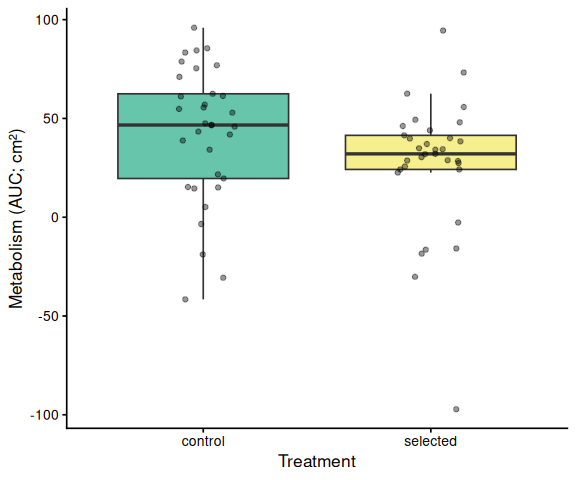<!-- -->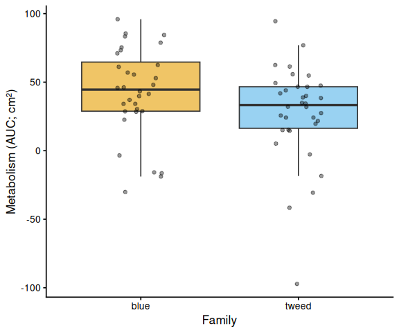<!-- --><!-- -->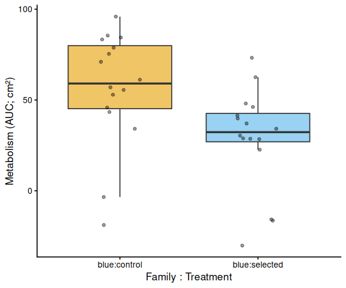<!-- -->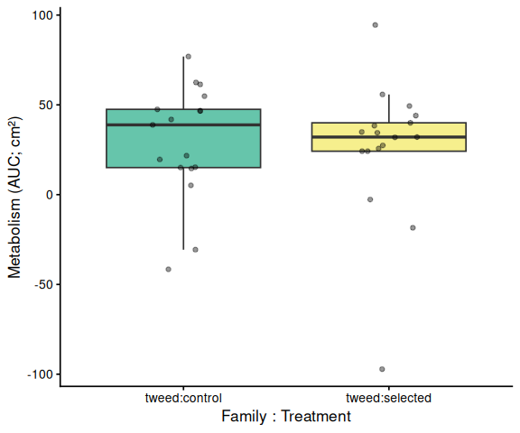<!-- -->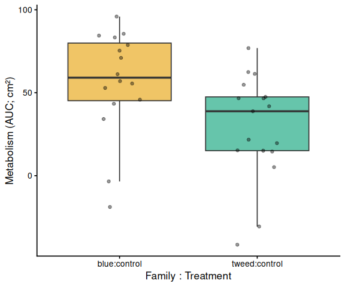<!-- -->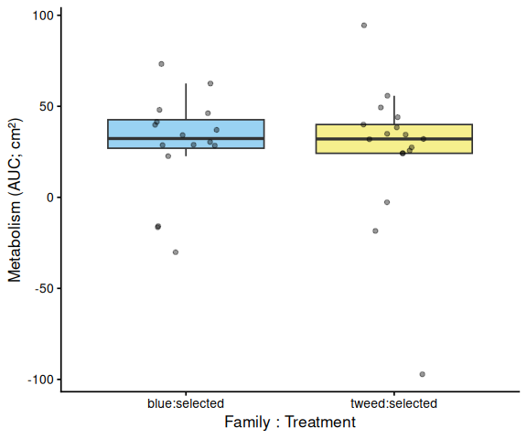<!-- -->

# 12 Save Output Data

``` r
write_csv(auc_all,      file.path(out_dir, "auc_all_metrics.csv"))
write_csv(auc_summary,  file.path(out_dir, "auc_summary.csv"))

if (nrow(metabolism_df) > 0)
  write_csv(metabolism_df,
            file.path(out_dir, "metabolism.csv"))

stats_compiled <- map_dfr(metrics_to_test, function(met) {
  bind_rows(
    stats_results[[met]]$pairs_full %>%
      mutate(comparison = "family:treatment"),
    stats_results[[met]]$pairs_family %>%
      mutate(comparison = "family"),
    stats_results[[met]]$pairs_trt %>%
      mutate(comparison = "treatment")
  ) %>% mutate(metric = met)
})

write_csv(stats_compiled,
          file.path(out_dir, "pairwise_stats.csv"))

message("Output files written to: ", out_dir)
```

---

# MATERIALS & METHODS

Control clams (`C`) compared with selected clams (`S`) at 36<sup>o</sup>C.

Clams were processed in 12-well plates and submerged in `5.0mL` of resazurin working solution stored at 4<sup>o</sup>C,prepared on [20260330](../2026-03-30-Resazurin-Assays---Selected-Juvenile-Ruditapes-philippinarum-Exposed-to-40C-Acute-Heat-Stress/index.qmd) (notebook entry).

Plates were measured every 30mins on a Synergy HTX (Agilent) plate reader.

Plate layout was randomized; Steven is currently the only person who knows the treatment assignments.


::: {.callout-important}
- Seemed to be inconsistent heating, with interior wells usually ~1.5<sup>o</sup>C lower than rest of wells.

The following wells lost volume - possibly due to clam spitting?

- Plate A, C3
- Plate C, C4
- Plate B, A3
- Plate D, B2
:::

After 3.5hrs, Steven removed the resazurin working solution from the wells and replaced it with 5.0mL of seawater. Plates were returned to the cold room and will be measured again tomorrow.

# RESULTS

All six plates passed the consistency check (12 wells per plate at every timepoint). Although four wells were flagged for potential volume loss in the experimental notes (Plate A C3, Plate B A3, Plate C C4, Plate D B2), the layout file did not mark them for exclusion, so no wells were removed from analysis.

Metabolic activity (AUC of blank-corrected, size-normalised fold-change per cm² shell area) showed marginal but non-significant trends for both **family** (F = 3.40, p = 0.070) and **treatment** (F = 3.47, p = 0.067).

The only significant pairwise contrast in the AUC analysis was **blue control vs. tweed selected** (estimate = 30.6, p = 0.048). Blue control clams had the highest mean AUC (56.4 ± 7.9 SE), roughly double that of blue selected (28.7 ± 7.0), tweed control (29.2 ± 7.7), and tweed selected (25.8 ± 9.6).

The time-series mixed-effects model revealed a clear temporal divergence: **blue control clams showed progressively higher metabolism** than other groups from 1.5 h onward. Significant pairwise differences (Tukey-adjusted) were:

- t = 1.5 h: blue control > tweed control (p = 0.050)
- t = 2.5 h: blue control > blue selected (p = 0.039) and > tweed selected (p = 0.013)
- t = 3.0 h: blue control > blue selected (p = 0.019) and > tweed selected (p = 0.004)
- t = 3.5 h: blue control > blue selected (p = 0.019) and > tweed selected (p = 0.003)

In summary, selected clams did not show higher metabolic activity than control clams under 36°C acute heat stress on Day 0. The dominant pattern was elevated metabolism specifically in **blue-family control clams**, which diverged from all other groups by mid-assay. The treatment effect (control vs. selected) was not significant in either the AUC or time-series analysis.

