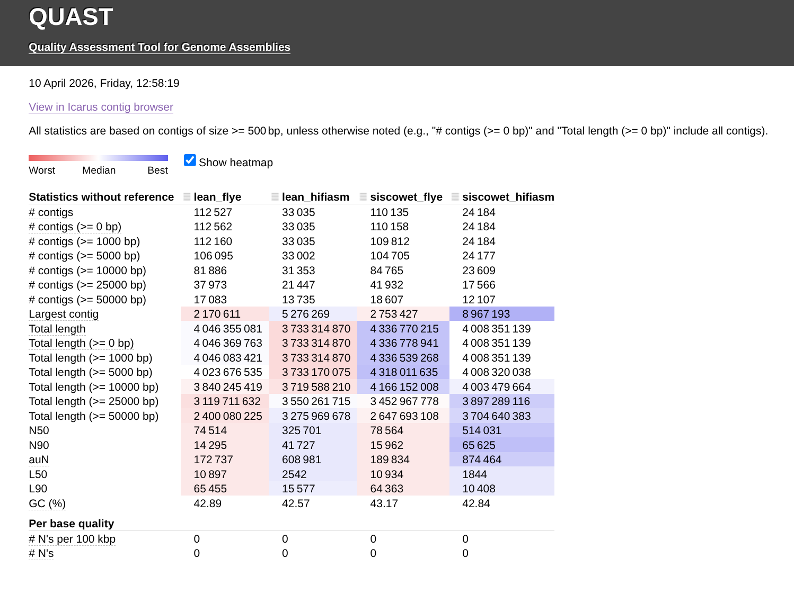
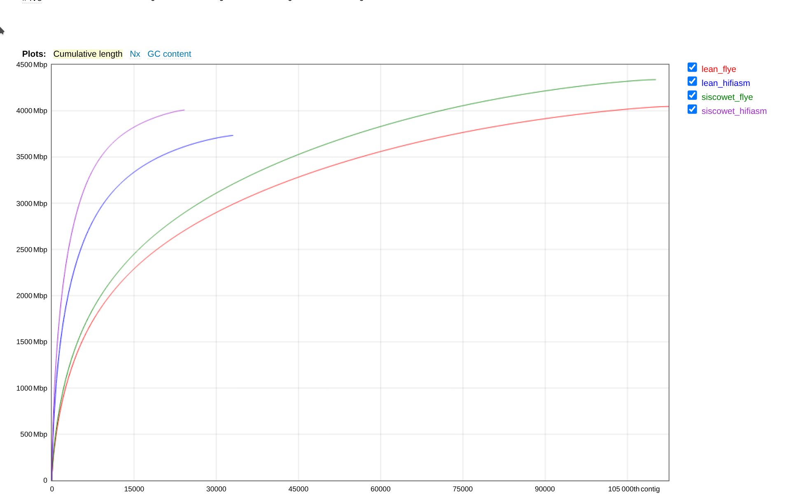

# INTRO

I previously assembled the Lake Trout [genomes for the lean and siscowet ecotypes using both Flye and hifiasm with PacBio data](https://github.com/RobertsLab/resources/issues/2409) (GitHub Issue). I wanted to compare the two assemblies to see which one was better. I used [QUAST](https://quast.sourceforge.net/docs/manual.html) to compare the assemblies for some basic stats.


Notebook links to assemblies:

- [Flye - Lean Ecotype](../2026-03-26-Genome-Assembly---S.namaycush-Lean-Ecotype-with-PacBio-HiFi-Reads-Using-Flye/index.qmd)

- [Flye - Siscowet Ecotype](../2026-03-26-Genome-Assembly---S.namaycush-Siscowet-Ecotype-with-PacBio-HiFi-Reads-Using-Flye/index.qmd)

- [hifiasm - Lean Ecotype](../2026-03-31-Genome-Assembly---S.namaycush-Lean-Ecotype-with-PacBio-HiFi-Reads-Using-hifiasm-on-Hyak/index.qmd)

- [hifiasm - Siscowet Ecotype](../2026-03-31-Genome-Assembly---S.namaycush-Siscowet-Ecotype-with-PacBio-HiFi-Reads-Using-hifiasm-on-Hyak/index.qmd)

Below is the rendered markdown from `13.2-genome-assembly-comparisons.Rmd`.

---

# 1 BACKGROUND

This will use [QUAST](https://quast.sourceforge.net/docs/manual.html)
(Mikheenko et al. 2018, 2023) to evaluate the two sets of PacBio genome
assemblies produced with
[Flye](https://github.com/mikolmogorov/Flye)(GitHub) and
[hifiasm](https://github.com/chhylp123/hifiasm) (GitHub) for both
ecotypes.

# 2 SETUP

## 2.1 Libraries

``` r
library(knitr)
library(tidyverse)
```

    ## ── Attaching core tidyverse packages ──────────────────────── tidyverse 2.0.0 ──
    ## ✔ dplyr     1.1.4     ✔ readr     2.1.5
    ## ✔ forcats   1.0.0     ✔ stringr   1.5.1
    ## ✔ ggplot2   3.5.2     ✔ tibble    3.2.1
    ## ✔ lubridate 1.9.4     ✔ tidyr     1.3.1
    ## ✔ purrr     1.0.4     
    ## ── Conflicts ────────────────────────────────────────── tidyverse_conflicts() ──
    ## ✖ dplyr::filter() masks stats::filter()
    ## ✖ dplyr::lag()    masks stats::lag()
    ## ℹ Use the conflicted package (<http://conflicted.r-lib.org/>) to force all conflicts to become errors

``` r
library(reticulate)

knitr::opts_chunk$set(
  echo = TRUE,         # Display code chunks
    eval = FALSE,        # Evaluate code chunks
    results = "hold",   # Hold outputs and show them after the full code chunk
  warning = FALSE,     # Hide warnings
        collapse = FALSE,    # Keep code and output in separate blocks
        warning = FALSE,     # Hide warnings
        message = FALSE,     # Hide messages
        comment = "##"      # Prefix output lines with '##' so output is visually distinct
)
```

## 2.2 Set R variables

``` r
# OUTPUT DIRECTORY
output_dir <- "../output/13.2-genome-assembly-comparisons"

# INPUT FILES
flye_lean_fasta <- "../output/13.1-genome-assembly-lean/snam-lean-pb-flye-assembly.fasta"
flye_siscowet_fasta <- "../output/13.1-genome-assembly-siscowet/snam-siscowet-pb-flye-assembly.fasta"
hifiasm_lean_fasta <- "../output/13.1-hifiasm-genome-assembly-lean/pb-hifiasm-lean-assembly.fa"
hifiasm_siscowet_fasta <- "../output/13.1-hifiasm-genome-assembly-siscowet/pb-hifiasm-siscowet-assembly.fa"

# SETTINGS
threads <- "40"


# Export these as environment variables for bash chunks.
Sys.setenv(
  flye_lean_fasta = flye_lean_fasta,
  flye_siscowet_fasta = flye_siscowet_fasta,
  hifiasm_lean_fasta = hifiasm_lean_fasta,
  hifiasm_siscowet_fasta = hifiasm_siscowet_fasta,
  output_dir = output_dir,
  threads = threads
)
```

# 3 Run QUAST

``` bash
# Make output directory, if it doesn't exist
mkdir --parents "${output_dir}"

quast.py \
"${flye_lean_fasta}" \
"${hifiasm_lean_fasta}" \
"${flye_siscowet_fasta}" \
"${hifiasm_siscowet_fasta}" \
--output-dir "${output_dir}" \
--threads "${threads}" \
--labels "lean_flye, lean_hifiasm, siscowet_flye, siscowet_hifiasm"
```

    ## /srlab/programs/miniforge3-24.7.1-0/bin/quast.py:4: DeprecationWarning: pkg_resources is deprecated as an API. See https://setuptools.pypa.io/en/latest/pkg_resources.html
    ##   __import__('pkg_resources').run_script('quast==5.3.0', 'quast.py')
    ## /srlab/programs/miniforge3-24.7.1-0/lib/python3.12/site-packages/quast-5.3.0-py3.12.egg/EGG-INFO/scripts/quast.py ../output/13.1-genome-assembly-lean/snam-lean-pb-flye-assembly.fasta ../output/13.1-hifiasm-genome-assembly-lean/pb-hifiasm-lean-assembly.fa ../output/13.1-genome-assembly-siscowet/snam-siscowet-pb-flye-assembly.fasta ../output/13.1-hifiasm-genome-assembly-siscowet/pb-hifiasm-siscowet-assembly.fa --output-dir ../output/13.2-genome-assembly-comparisons --threads 40 --labels lean_flye, lean_hifiasm, siscowet_flye, siscowet_hifiasm
    ## 
    ## Version: 5.3.0
    ## 
    ## System information:
    ##   OS: Linux-4.18.0-513.18.1.el8_9.x86_64-x86_64-with-glibc2.39 (linux_64)
    ##   Python version: 3.12.5
    ##   CPUs number: 192
    ## 
    ## Started: 2026-04-10 12:49:08
    ## 
    ## Logging to /mmfs1/gscratch/scrubbed/samwhite/gitrepos/RobertsLab/project-lake-trout/output/13.2-genome-assembly-comparisons/quast.log
    ## 
    ## CWD: /mmfs1/gscratch/scrubbed/samwhite/gitrepos/RobertsLab/project-lake-trout/code
    ## Main parameters: 
    ##   MODE: default, threads: 40, min contig length: 500, min alignment length: 65, min alignment IDY: 95.0, \
    ##   ambiguity: one, min local misassembly length: 200, min extensive misassembly length: 1000
    ## 
    ## WARNING: Can't draw plots: python-matplotlib is missing or corrupted.
    ## 
    ## Contigs:
    ##   Pre-processing...
    ##   1  ../output/13.1-genome-assembly-lean/snam-lean-pb-flye-assembly.fasta ==> lean_flye
    ##   2  ../output/13.1-hifiasm-genome-assembly-lean/pb-hifiasm-lean-assembly.fa ==> lean_hifiasm
    ##   3  ../output/13.1-genome-assembly-siscowet/snam-siscowet-pb-flye-assembly.fasta ==> siscowet_flye
    ##   4  ../output/13.1-hifiasm-genome-assembly-siscowet/pb-hifiasm-siscowet-assembly.fa ==> siscowet_hifiasm
    ## 
    ## 2026-04-10 12:51:06
    ## Running Basic statistics processor...
    ##   Contig files: 
    ##     1  lean_flye
    ##     2  lean_hifiasm
    ##     3  siscowet_flye
    ##     4  siscowet_hifiasm
    ##   Calculating N50 and L50...
    ##     1  lean_flye, N50 = 74514, L50 = 10897, auN = 172736.7, Total length = 4046355081, GC % = 42.89, # N's per 100 kbp =  0.00
    ##     2  lean_hifiasm, N50 = 325701, L50 = 2542, auN = 608980.5, Total length = 3733314870, GC % = 42.57, # N's per 100 kbp =  0.00
    ##     3  siscowet_flye, N50 = 78564, L50 = 10934, auN = 189833.9, Total length = 4336770215, GC % = 43.17, # N's per 100 kbp =  0.00
    ##     4  siscowet_hifiasm, N50 = 514031, L50 = 1844, auN = 874464.1, Total length = 4008351139, GC % = 42.84, # N's per 100 kbp =  0.00
    ## Done.
    ## 
    ## NOTICE: Genes are not predicted by default. Use --gene-finding or --glimmer option to enable it.
    ## 
    ## 2026-04-10 12:56:51
    ## Creating large visual summaries...
    ## This may take a while: press Ctrl-C to skip this step..
    ##   1 of 1: Creating Icarus viewers...
    ## Done
    ## 
    ## 2026-04-10 12:58:19
    ## RESULTS:
    ##   Text versions of total report are saved to /mmfs1/gscratch/scrubbed/samwhite/gitrepos/RobertsLab/project-lake-trout/output/13.2-genome-assembly-comparisons/report.txt, report.tsv, and report.tex
    ##   Text versions of transposed total report are saved to /mmfs1/gscratch/scrubbed/samwhite/gitrepos/RobertsLab/project-lake-trout/output/13.2-genome-assembly-comparisons/transposed_report.txt, transposed_report.tsv, and transposed_report.tex
    ##   HTML version (interactive tables and plots) is saved to /mmfs1/gscratch/scrubbed/samwhite/gitrepos/RobertsLab/project-lake-trout/output/13.2-genome-assembly-comparisons/report.html
    ##   Icarus (contig browser) is saved to /mmfs1/gscratch/scrubbed/samwhite/gitrepos/RobertsLab/project-lake-trout/output/13.2-genome-assembly-comparisons/icarus.html
    ##   Log is saved to /mmfs1/gscratch/scrubbed/samwhite/gitrepos/RobertsLab/project-lake-trout/output/13.2-genome-assembly-comparisons/quast.log
    ## 
    ## Finished: 2026-04-10 12:58:19
    ## Elapsed time: 0:09:10.519647
    ## NOTICEs: 1; WARNINGs: 1; non-fatal ERRORs: 0
    ## 
    ## Thank you for using QUAST!


---

# RESULTS

All output files are here:

- [https://gannet.fish.washington.edu/gitrepos/project-lake-trout/output/13.2-genome-assembly-comparisons/](https://gannet.fish.washington.edu/gitrepos/project-lake-trout/output/13.2-genome-assembly-comparisons/)


QUAST Report (HTML):

- [13.2-genome-assembly-comparisons/report.html](https://gannet.fish.washington.edu/gitrepos/project-lake-trout/output/13.2-genome-assembly-comparisons/report.html)


| Assembly                   | lean_flye    | lean_hifiasm | siscowet_flye | siscowet_hifiasm |
|----------------------------|--------------|--------------|---------------|------------------|
| # contigs (>= 0 bp)        | 112562       | 33035        | 110158        | 24184            |
| # contigs (>= 1000 bp)     | 112160       | 33035        | 109812        | 24184            |
| # contigs (>= 5000 bp)     | 106095       | 33002        | 104705        | 24177            |
| # contigs (>= 10000 bp)    | 81886        | 31353        | 84765         | 23609            |
| # contigs (>= 25000 bp)    | 37973        | 21447        | 41932         | 17566            |
| # contigs (>= 50000 bp)    | 17083        | 13735        | 18607         | 12107            |
| Total length (>= 0 bp)     | 4046369763   | 3733314870   | 4336778941    | 4008351139       |
| Total length (>= 1000 bp)  | 4046083421   | 3733314870   | 4336539268    | 4008351139       |
| Total length (>= 5000 bp)  | 4023676535   | 3733170075   | 4318011635    | 4008320038       |
| Total length (>= 10000 bp) | 3840245419   | 3719588210   | 4166152008    | 4003479664       |
| Total length (>= 25000 bp) | 3119711632   | 3550261715   | 3452967778    | 3897289116       |
| Total length (>= 50000 bp) | 2400080225   | 3275969678   | 2647693108    | 3704640383       |
| # contigs                  | **112527**     | 33035        | **110135**      | 24184            |
| Largest contig             | 2170611      | **5276269**    | 2753427       | **8967193**        |
| Total length               | **4046355081** | 3733314870   | **4336770215**  | 4008351139       |
| GC (%)                     | 42.89        | 42.57        | 43.17         | 42.84            |
| N50                        | 74514        | **325701**     | 78564         | **514031**          |
| N90                        | 14295        | 41727        | 15962         | 65625            |
| auN                        | 172736.7     | 608980.5     | 189833.9      | 874464.1         |
| L50                        | 10897        | 2542         | 10934         | 1844             |
| L90                        | 65455        | 15577        | 64363         | 10408            |
| # N's per 100 kbp          | 0            | 0            | 0             | 0                |








# DISCUSSION

In general, it appears that the hifiasm assemblies are better than the flye assemblies, with higher N50 and larger contigs. However, the Flye assemblies have a higher total length (~7% more).


# REFERENCES

<div id="refs" class="references csl-bib-body hanging-indent">

<div id="ref-mikheenko2018" class="csl-entry">

Mikheenko, Alla, Andrey Prjibelski, Vladislav Saveliev, Dmitry Antipov,
and Alexey Gurevich. 2018. “Versatile Genome Assembly Evaluation with
QUAST-LG.” *Bioinformatics* 34 (13): i142–50.
<https://doi.org/10.1093/bioinformatics/bty266>.

</div>

<div id="ref-mikheenko2023" class="csl-entry">

Mikheenko, Alla, Vladislav Saveliev, Pascal Hirsch, and Alexey Gurevich.
2023. “WebQUAST: Online Evaluation of Genome Assemblies.” *Nucleic Acids
Research* 51 (W1): W601–6. <https://doi.org/10.1093/nar/gkad406>.

</div>

</div>