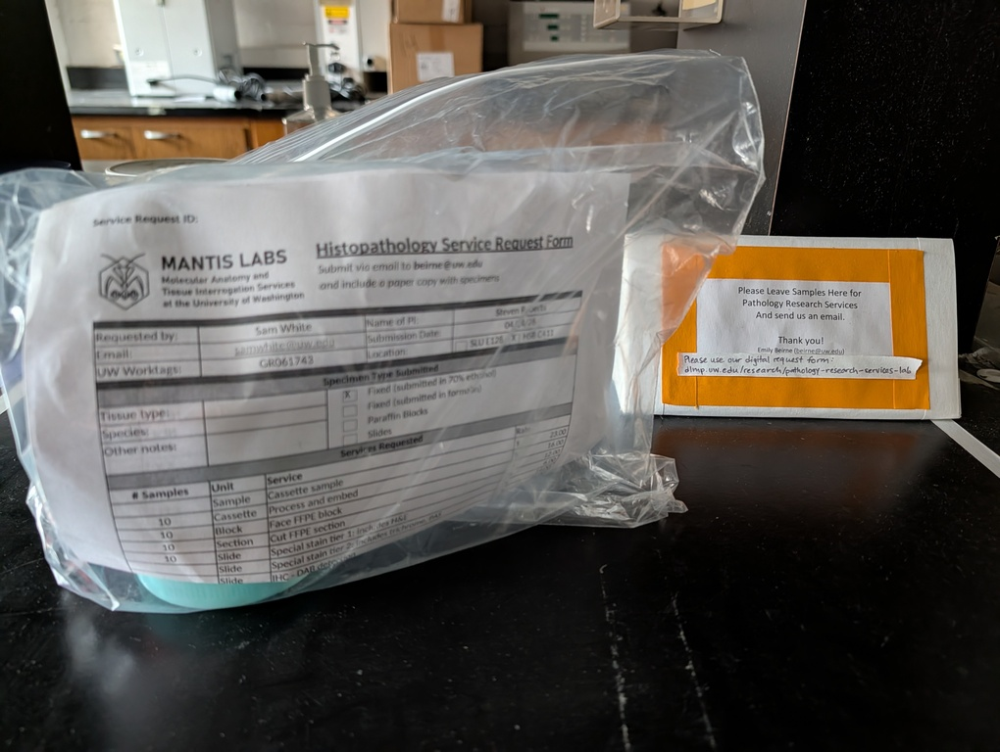

# INTRO

Submitted 10 geoduck gonad samples for histological processing. These samples were collected in lab on 20260401 by Steven and people from Washington Fish & Wildlife. Gonad tissue was sample, placed in histology cassettes, and fixed in 10% formalin in filtered seawater for 24hrs. After fixation, samples were transferred to 70% ethanol for storage until processing.

Cassettes were submitted to the University of Washington Pathology Research Services Laboratory in Health Sciences Building C411 for processing and histological sectioning. The lab will embed the samples in paraffin, section them, and stain with hematoxylin and eosin (H&E) for microscopic examination. The goal of this histological analysis is to assess the reproductive status and gonadal development of the geoducks, which will provide insights into their reproductive biology and potential impacts of environmental factors on their reproduction.

Here's the list of samples submitted:

- 4-M-IN
- 3-M-X
- 4-A-X
- 2-A-X
- 1-A-X
- 2-P-IN
- 4-P-IN
- 3-M-IN
- 1-P-IN
- 3-P-IN

