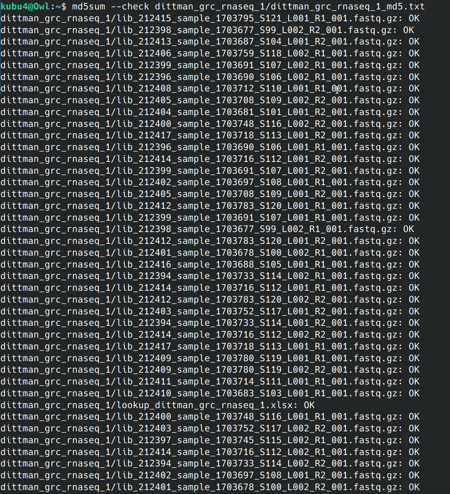
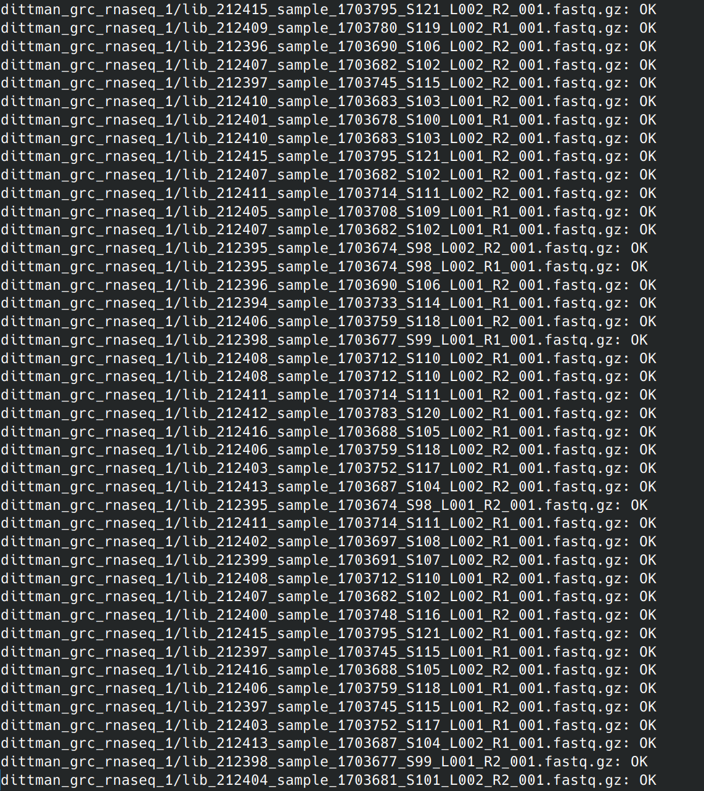
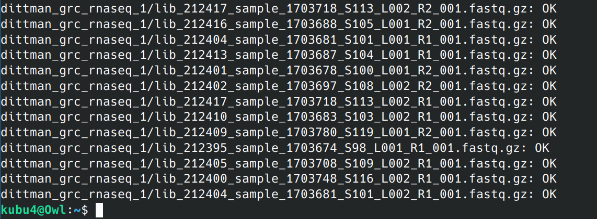

# INTRO

Received RNA-seq data subset for Andy Dittman at NOAA from UW's Northwest Genomics Center. [This is part of a project initiated a while ago](https://github.com/RobertsLab/resources/issues/2397) (GitHub Issue). The initial RNA submitted was potentially questionable, based on Bionalyzer RIN scores. So, this subset will be QC'd to determine if the data is usable for downstream analyses and determine if the remainder of samples should be sequenced.

# DATA

Data was downloaded to our server, Owl, via GlobusConnect.

Data is currently available at:

- [https://owl.fish.washington.edu/nightingales/dittman_grc_rnaseq_1/](https://owl.fish.washington.edu/nightingales/dittman_grc_rnaseq_1/)

MD5 checksums were verified:







```bash
md5sum --check dittman_grc_rnaseq_1/dittman_grc_rnaseq_1_md5.txt 
dittman_grc_rnaseq_1/lib_212415_sample_1703795_S121_L001_R1_001.fastq.gz: OK
dittman_grc_rnaseq_1/lib_212398_sample_1703677_S99_L002_R2_001.fastq.gz: OK
dittman_grc_rnaseq_1/lib_212413_sample_1703687_S104_L001_R2_001.fastq.gz: OK
dittman_grc_rnaseq_1/lib_212406_sample_1703759_S118_L002_R1_001.fastq.gz: OK
dittman_grc_rnaseq_1/lib_212399_sample_1703691_S107_L002_R1_001.fastq.gz: OK
dittman_grc_rnaseq_1/lib_212396_sample_1703690_S106_L002_R1_001.fastq.gz: OK
dittman_grc_rnaseq_1/lib_212408_sample_1703712_S110_L001_R1_001.fastq.gz: OK
dittman_grc_rnaseq_1/lib_212405_sample_1703708_S109_L002_R2_001.fastq.gz: OK
dittman_grc_rnaseq_1/lib_212404_sample_1703681_S101_L001_R2_001.fastq.gz: OK
dittman_grc_rnaseq_1/lib_212400_sample_1703748_S116_L002_R2_001.fastq.gz: OK
dittman_grc_rnaseq_1/lib_212417_sample_1703718_S113_L001_R2_001.fastq.gz: OK
dittman_grc_rnaseq_1/lib_212396_sample_1703690_S106_L001_R1_001.fastq.gz: OK
dittman_grc_rnaseq_1/lib_212414_sample_1703716_S112_L001_R2_001.fastq.gz: OK
dittman_grc_rnaseq_1/lib_212399_sample_1703691_S107_L001_R2_001.fastq.gz: OK
dittman_grc_rnaseq_1/lib_212402_sample_1703697_S108_L001_R1_001.fastq.gz: OK
dittman_grc_rnaseq_1/lib_212405_sample_1703708_S109_L001_R2_001.fastq.gz: OK
dittman_grc_rnaseq_1/lib_212412_sample_1703783_S120_L001_R1_001.fastq.gz: OK
dittman_grc_rnaseq_1/lib_212399_sample_1703691_S107_L001_R1_001.fastq.gz: OK
dittman_grc_rnaseq_1/lib_212398_sample_1703677_S99_L002_R1_001.fastq.gz: OK
dittman_grc_rnaseq_1/lib_212412_sample_1703783_S120_L001_R2_001.fastq.gz: OK
dittman_grc_rnaseq_1/lib_212401_sample_1703678_S100_L002_R1_001.fastq.gz: OK
dittman_grc_rnaseq_1/lib_212416_sample_1703688_S105_L001_R1_001.fastq.gz: OK
dittman_grc_rnaseq_1/lib_212394_sample_1703733_S114_L002_R1_001.fastq.gz: OK
dittman_grc_rnaseq_1/lib_212414_sample_1703716_S112_L001_R1_001.fastq.gz: OK
dittman_grc_rnaseq_1/lib_212412_sample_1703783_S120_L002_R2_001.fastq.gz: OK
dittman_grc_rnaseq_1/lib_212403_sample_1703752_S117_L001_R2_001.fastq.gz: OK
dittman_grc_rnaseq_1/lib_212394_sample_1703733_S114_L001_R2_001.fastq.gz: OK
dittman_grc_rnaseq_1/lib_212414_sample_1703716_S112_L002_R2_001.fastq.gz: OK
dittman_grc_rnaseq_1/lib_212417_sample_1703718_S113_L001_R1_001.fastq.gz: OK
dittman_grc_rnaseq_1/lib_212409_sample_1703780_S119_L001_R1_001.fastq.gz: OK
dittman_grc_rnaseq_1/lib_212409_sample_1703780_S119_L002_R2_001.fastq.gz: OK
dittman_grc_rnaseq_1/lib_212411_sample_1703714_S111_L001_R1_001.fastq.gz: OK
dittman_grc_rnaseq_1/lib_212410_sample_1703683_S103_L001_R1_001.fastq.gz: OK
dittman_grc_rnaseq_1/lookup_dittman_grc_rnaseq_1.xlsx: OK
dittman_grc_rnaseq_1/lib_212400_sample_1703748_S116_L001_R1_001.fastq.gz: OK
dittman_grc_rnaseq_1/lib_212403_sample_1703752_S117_L002_R2_001.fastq.gz: OK
dittman_grc_rnaseq_1/lib_212397_sample_1703745_S115_L002_R1_001.fastq.gz: OK
dittman_grc_rnaseq_1/lib_212414_sample_1703716_S112_L002_R1_001.fastq.gz: OK
dittman_grc_rnaseq_1/lib_212394_sample_1703733_S114_L002_R2_001.fastq.gz: OK
dittman_grc_rnaseq_1/lib_212402_sample_1703697_S108_L001_R2_001.fastq.gz: OK
dittman_grc_rnaseq_1/lib_212401_sample_1703678_S100_L002_R2_001.fastq.gz: OK
dittman_grc_rnaseq_1/lib_212415_sample_1703795_S121_L002_R2_001.fastq.gz: OK
dittman_grc_rnaseq_1/lib_212409_sample_1703780_S119_L002_R1_001.fastq.gz: OK
dittman_grc_rnaseq_1/lib_212396_sample_1703690_S106_L002_R2_001.fastq.gz: OK
dittman_grc_rnaseq_1/lib_212407_sample_1703682_S102_L002_R2_001.fastq.gz: OK
dittman_grc_rnaseq_1/lib_212397_sample_1703745_S115_L002_R2_001.fastq.gz: OK
dittman_grc_rnaseq_1/lib_212410_sample_1703683_S103_L001_R2_001.fastq.gz: OK
dittman_grc_rnaseq_1/lib_212401_sample_1703678_S100_L001_R1_001.fastq.gz: OK
dittman_grc_rnaseq_1/lib_212410_sample_1703683_S103_L002_R2_001.fastq.gz: OK
dittman_grc_rnaseq_1/lib_212415_sample_1703795_S121_L001_R2_001.fastq.gz: OK
dittman_grc_rnaseq_1/lib_212407_sample_1703682_S102_L001_R2_001.fastq.gz: OK
dittman_grc_rnaseq_1/lib_212411_sample_1703714_S111_L002_R2_001.fastq.gz: OK
dittman_grc_rnaseq_1/lib_212405_sample_1703708_S109_L001_R1_001.fastq.gz: OK
dittman_grc_rnaseq_1/lib_212407_sample_1703682_S102_L001_R1_001.fastq.gz: OK
dittman_grc_rnaseq_1/lib_212395_sample_1703674_S98_L002_R2_001.fastq.gz: OK
dittman_grc_rnaseq_1/lib_212395_sample_1703674_S98_L002_R1_001.fastq.gz: OK
dittman_grc_rnaseq_1/lib_212396_sample_1703690_S106_L001_R2_001.fastq.gz: OK
dittman_grc_rnaseq_1/lib_212394_sample_1703733_S114_L001_R1_001.fastq.gz: OK
dittman_grc_rnaseq_1/lib_212406_sample_1703759_S118_L001_R2_001.fastq.gz: OK
dittman_grc_rnaseq_1/lib_212398_sample_1703677_S99_L001_R1_001.fastq.gz: OK
dittman_grc_rnaseq_1/lib_212408_sample_1703712_S110_L002_R1_001.fastq.gz: OK
dittman_grc_rnaseq_1/lib_212408_sample_1703712_S110_L002_R2_001.fastq.gz: OK
dittman_grc_rnaseq_1/lib_212411_sample_1703714_S111_L001_R2_001.fastq.gz: OK
dittman_grc_rnaseq_1/lib_212412_sample_1703783_S120_L002_R1_001.fastq.gz: OK
dittman_grc_rnaseq_1/lib_212416_sample_1703688_S105_L002_R1_001.fastq.gz: OK
dittman_grc_rnaseq_1/lib_212406_sample_1703759_S118_L002_R2_001.fastq.gz: OK
dittman_grc_rnaseq_1/lib_212403_sample_1703752_S117_L002_R1_001.fastq.gz: OK
dittman_grc_rnaseq_1/lib_212413_sample_1703687_S104_L002_R2_001.fastq.gz: OK
dittman_grc_rnaseq_1/lib_212395_sample_1703674_S98_L001_R2_001.fastq.gz: OK
dittman_grc_rnaseq_1/lib_212411_sample_1703714_S111_L002_R1_001.fastq.gz: OK
dittman_grc_rnaseq_1/lib_212402_sample_1703697_S108_L002_R1_001.fastq.gz: OK
dittman_grc_rnaseq_1/lib_212399_sample_1703691_S107_L002_R2_001.fastq.gz: OK
dittman_grc_rnaseq_1/lib_212408_sample_1703712_S110_L001_R2_001.fastq.gz: OK
dittman_grc_rnaseq_1/lib_212407_sample_1703682_S102_L002_R1_001.fastq.gz: OK
dittman_grc_rnaseq_1/lib_212400_sample_1703748_S116_L001_R2_001.fastq.gz: OK
dittman_grc_rnaseq_1/lib_212415_sample_1703795_S121_L002_R1_001.fastq.gz: OK
dittman_grc_rnaseq_1/lib_212397_sample_1703745_S115_L001_R1_001.fastq.gz: OK
dittman_grc_rnaseq_1/lib_212416_sample_1703688_S105_L002_R2_001.fastq.gz: OK
dittman_grc_rnaseq_1/lib_212406_sample_1703759_S118_L001_R1_001.fastq.gz: OK
dittman_grc_rnaseq_1/lib_212397_sample_1703745_S115_L001_R2_001.fastq.gz: OK
dittman_grc_rnaseq_1/lib_212403_sample_1703752_S117_L001_R1_001.fastq.gz: OK
dittman_grc_rnaseq_1/lib_212413_sample_1703687_S104_L002_R1_001.fastq.gz: OK
dittman_grc_rnaseq_1/lib_212398_sample_1703677_S99_L001_R2_001.fastq.gz: OK
dittman_grc_rnaseq_1/lib_212404_sample_1703681_S101_L002_R2_001.fastq.gz: OK
dittman_grc_rnaseq_1/lib_212417_sample_1703718_S113_L002_R2_001.fastq.gz: OK
dittman_grc_rnaseq_1/lib_212416_sample_1703688_S105_L001_R2_001.fastq.gz: OK
dittman_grc_rnaseq_1/lib_212404_sample_1703681_S101_L001_R1_001.fastq.gz: OK
dittman_grc_rnaseq_1/lib_212413_sample_1703687_S104_L001_R1_001.fastq.gz: OK
dittman_grc_rnaseq_1/lib_212401_sample_1703678_S100_L001_R2_001.fastq.gz: OK
dittman_grc_rnaseq_1/lib_212402_sample_1703697_S108_L002_R2_001.fastq.gz: OK
dittman_grc_rnaseq_1/lib_212417_sample_1703718_S113_L002_R1_001.fastq.gz: OK
dittman_grc_rnaseq_1/lib_212410_sample_1703683_S103_L002_R1_001.fastq.gz: OK
dittman_grc_rnaseq_1/lib_212409_sample_1703780_S119_L001_R2_001.fastq.gz: OK
dittman_grc_rnaseq_1/lib_212395_sample_1703674_S98_L001_R1_001.fastq.gz: OK
dittman_grc_rnaseq_1/lib_212405_sample_1703708_S109_L002_R1_001.fastq.gz: OK
dittman_grc_rnaseq_1/lib_212400_sample_1703748_S116_L002_R1_001.fastq.gz: OK
dittman_grc_rnaseq_1/lib_212404_sample_1703681_S101_L002_R1_001.fastq.gz: OK
```