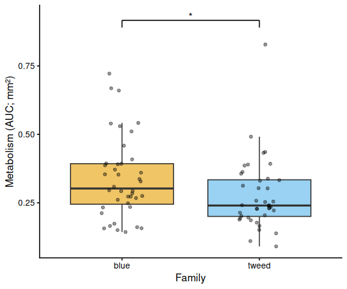
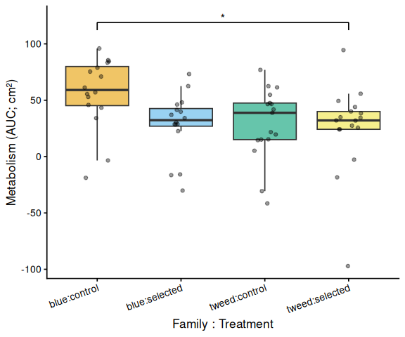

# INTRO

As part of the resazurin assay development process, a series of experiments was conducted to evaluate heat stress effects on metabolic activity in juvenile *Ruditapes philippinarum* (Manila clam). Two shell-coloration groups—BLUE and TWEED—were compared across CONTROL and SELECTED (low-salinity-selected) breeding lines. This document summarizes the experimental designs, methods, results, and cross-experiment patterns.

Three heat stress experiments were conducted:

- **Experiment 1**: Acute heat stress at 40°C for 2 hours (20260330)
- **Experiment 2**: Recovery experiment — 36°C for 3.5 hours (Day 0; 20260331) on the same clams, followed by overnight cold recovery, then 36°C for 4 hours (Day 1; 20260401)
- **Experiment 3**: Acute heat stress at 36°C for 4 hours on a separate cohort of larger clams (20260401)

All data are available at:

- [https://github.com/RobertsLab/resazurin-assay-development/tree/main/data/clam](https://github.com/RobertsLab/resazurin-assay-development/tree/main/data/clam)

# MATERIALS & METHODS

## Clam Measurements

Clams were photographed from below in their respective plates. Shell area was measured using ImageJ:

1. Open image in ImageJ.
2. Convert to 8-bit grayscale (Image > Type > 8-bit).
3. Flip horizontally (Image > Transform > Flip Horizontally).
4. Set scale by drawing a line to a known distance (10 mm) (Analyze > Set Scale).
5. Adjust threshold to isolate shell (Image > Adjust > Threshold > Apply).
6. Fill holes (Process > Binary > Fill Holes).
7. Analyze particles (Analyze > Analyze Particles).

## Resazurin Assay

All experiments used resazurin working solution prepared 20260330 by SJW:

- 986.66 mL filtered seawater (4°C, from 11/19/2025)
- 2.22 mL resazurin stock solution
- 1.00 mL DMSO
- 10.00 mL antibiotic solution (100× Penn/Strep & 100× Fungizone)

Fluorescence was measured on a Synergy HTX (Agilent) plate reader (excitation 530 nm, emission 590 nm). Key experimental parameters differed across experiments:

| Experiment | Date | Temp | Duration | Plate type | Volume/well | Size metric |
|---|---|---|---|---|---|---|
| 1 | 20260330 | 40°C | 2 h | 24-well | 2.2 mL | area (mm²) |
| 2 – Day 0 | 20260331 | 36°C | 3.5 h | 12-well | 5.0 mL | area (cm²) |
| 2 – Day 1 | 20260401 | 36°C | 4 h (hourly) | 12-well | 5.0 mL | area (mm²) |
| 3 | 20260401 | 36°C | 4 h | 12-well | 5.0 mL | area (cm²) |

Metabolic activity was quantified as the area under the curve (AUC) of blank-corrected, size-normalized fluorescence fold-change over time (trapezoidal rule), following @huffmyer2025. Linear models with Tukey-adjusted pairwise comparisons (emmeans) were used for statistical inference.

## Experiment 1: Acute Heat Stress @ 40°C for 2 Hours

Control (`C`) and selected (`S`) clams from both coloration groups (BLUE, TWEED) were placed in 24-well plates. Blanks (resazurin only, no clam) occupied column 6 of each plate. Plates were incubated at 40°C in a tabletop fan-powered incubator and measured every 30 minutes.

::: {.callout-note}
Resazurin working solution was cold (stored at 4°C) when introduced to clams.
:::

## Experiment 2: Recovery from Heat Stress

### Day 0: Heat Stress at 36°C for 3.5 Hours (20260331)

Control and selected clams were placed in 12-well plates with randomized layout. Plates were incubated at 36°C and measured every 30 minutes.

::: {.callout-caution}
Inconsistent heating was observed; interior wells were typically ~1.5°C cooler than peripheral wells. The following wells showed volume loss (possibly due to clam spitting): Plate A C3, Plate B A3, Plate C C4, Plate D B2. These wells were not excluded from analysis.
:::

After 3.5 hours, resazurin solution was replaced with seawater and plates were returned to the cold room (10°C) overnight.

### Day 1: Heat Stress at 36°C for 4 Hours (20260401)

The same clams were re-assayed the following day in fresh resazurin working solution. Measurements were taken hourly.

| Plate | Time (h) | Temp |
|-------|----------|------|
| A     | 0        | 11–12°C |
| A     | 1        | 29°C |
| A     | 2        | 31°C |
| A     | 3        | 32–33°C |
| A     | 4        | 33–34°C |

::: {.callout-caution}
Four wells showed low volume (D A1, B A3, D B2, E C2) and were not excluded from analysis. Plate A experienced a slow warm-up and its data should be interpreted with caution.
:::

## Experiment 3: Acute Heat Stress @ 36°C for 4 Hours (20260401)

A separate cohort of larger clams was used. Plates (12-well) had randomized layout and were measured every 30 minutes.

| Plate | Time (h) | Temp |
|-------|----------|------|
| G     | 0        | 11–12°C |
| G     | 0.5      | 14–16°C |
| G     | 1        | 24–30°C |
| G     | 1.5      | 27–30°C |
| G     | 2–3.5    | 31–32°C |
| G     | 4        | 33°C |

::: {.callout-caution}
Plate G was automatically excluded from all analyses: its T0 read was accidentally exported as a 24-well plate, causing it to fail the plate consistency check. Three additional wells were excluded due to volume loss: J B1 (sample 41, tweed selected), K A2 (sample 50, blue selected), L A4 (sample 64, blue control).
:::

# RESULTS

AUC analyses are based on blank-corrected, size-normalized fold-change (metabolism per shell area) computed via the trapezoidal rule [@huffmyer2025]. Significance is assessed by linear model ANOVA with Tukey-adjusted pairwise comparisons. Plots are included only for comparisons where at least one pairwise contrast reached p < 0.05.

## Experiment 1: Acute Heat Stress @ 40°C for 2 Hours

All four plates passed the consistency check (24 wells per plate at every timepoint). No wells were excluded from analysis.

**Shell-coloration family was a significant predictor of AUC** (ANOVA: F = 4.05, p = 0.048), with BLUE clams showing higher metabolic activity than TWEED clams (Tukey: estimate = 0.062 per mm², p = 0.048). Treatment (control vs. selected) was not significant (F = 1.34, p = 0.251), nor was the family × treatment interaction (F = 0.47, p = 0.495). No significant pairwise contrasts were detected among the four family × treatment combinations (all Tukey-adjusted p > 0.12).

The time-series mixed-effects model corroborated the family pattern: blue control clams diverged from tweed selected clams at t = 1.5 h (p = 0.010) and t = 2.0 h (p = 0.014).

---

---

## Experiment 2: Recovery from Heat Stress

### Day 0: Heat Stress at 36°C for 3.5 Hours

All six plates passed the consistency check (12 wells per plate). Although four wells were noted for volume loss, none were excluded from analysis.

The AUC ANOVA showed marginal trends for family (F = 3.40, p = 0.070) and treatment (F = 3.47, p = 0.067) that did not reach significance. Among the four family × treatment combinations, the only significant pairwise contrast was **blue control vs. tweed selected** (estimate = 30.6 per cm², Tukey p = 0.048). Blue control clams had the highest mean AUC (56.4 ± 7.9 SE), roughly double that of blue selected (28.7 ± 7.0), tweed control (29.2 ± 7.7), and tweed selected (25.8 ± 9.6).

The time-series model revealed a progressive divergence of blue control clams beginning at 1.5 h:

- t = 1.5 h: blue control > tweed control (p = 0.050)
- t = 2.5 h: blue control > blue selected (p = 0.039); blue control > tweed selected (p = 0.013)
- t = 3.0 h: blue control > blue selected (p = 0.019); blue control > tweed selected (p = 0.004)
- t = 3.5 h: blue control > blue selected (p = 0.019); blue control > tweed selected (p = 0.003)

---

---

### Day 1: Heat Stress at 36°C for 4 Hours (Post-Recovery)

All six plates passed the consistency check. **No significant effects were detected** in AUC analyses: family (F = 0.33, p = 0.570), treatment (F = 0.82, p = 0.370), family × treatment (F = 0.07, p = 0.788). Group mean AUCs were similar across all four groups: blue control (0.346 ± 0.049 SE per mm²), tweed control (0.331 ± 0.046), blue selected (0.316 ± 0.048), and tweed selected (0.277 ± 0.040). No pairwise contrasts were significant (all Tukey-adjusted p > 0.33). The time-series model likewise detected no significant pairwise differences at any timepoint (all p > 0.14).

## Experiment 3: Acute Heat Stress @ 36°C for 4 Hours

After exclusion of Plate G and three volume-loss wells, **no significant effects were detected** in AUC analyses: family (F = 2.03, p = 0.161), treatment (F = 1.91, p = 0.174), family × treatment (F = 2.95, p = 0.092). Blue control clams had the highest mean AUC (66.6 ± 6.8 SE per cm²), while other groups were lower: tweed control (49.0 ± 4.7), tweed selected (50.5 ± 6.4), and blue selected (48.4 ± 4.7). No pairwise contrast reached significance after Tukey adjustment (all p > 0.13).

The time-series model identified a transient elevation of blue control clams at mid-assay timepoints:

- t = 1.5 h: blue control > tweed control (p = 0.013); blue control > blue selected (p = 0.035)
- t = 2.0 h: blue control > tweed control (p = 0.042)
- t = 2.5 h: blue control > tweed control (p = 0.043)

No significant differences were detected at any other timepoints (all Tukey-adjusted p > 0.09).

# SUMMARY

## Similarities Across Experiments

**Blue-family control clams consistently showed elevated metabolic activity.** In all three experiments (Experiments 1, 2 Day 0, and 3), BLUE CONTROL clams exhibited the highest mean AUC and produced the most statistically supported pairwise contrasts in both AUC and time-series analyses. This pattern held at both 40°C and 36°C, and across two different clam size cohorts, suggesting a reproducible biological tendency.

**Shell-coloration family was a stronger predictor of metabolic activity than selection status.** In every experiment, the treatment effect (control vs. selected) was non-significant, while the family effect (BLUE vs. TWEED) was either significant (Experiment 1, p = 0.048) or trended toward significance (Experiment 2 Day 0, p = 0.070; Experiment 3, p = 0.161). Selected clams did not show higher metabolic activity than control clams under heat stress in any assay.

**Time-series divergence was progressive.** In experiments where the blue control elevation was detected, the effect became more pronounced at later timepoints rather than appearing immediately at the start of heat stress, suggesting a cumulative metabolic response.

## Notable Differences

**Recovery abolished metabolic differences.** After overnight cold recovery (Experiment 2, Day 1), no significant differences were detected between any groups, including those that had diverged on Day 0. This indicates the 36°C heat stress effects on measurable metabolic activity were transient and reversible within overnight cold storage.

**Temperature shifted which contrasts were significant.** At 40°C (Experiment 1), the family main effect was significant but no individual family × treatment contrasts crossed the p < 0.05 threshold. At 36°C (Experiments 2 Day 0 and 3), the family main effect did not reach significance, but the blue control group specifically elevated above individual other groups, with the family × treatment interaction approaching significance in Experiment 3 (p = 0.092).

**Statistical power was reduced by recurrent experimental confounders.** Volume loss from clam spitting affected multiple experiments. Uneven plate heating was noted in Experiments 2 Day 0 (interior wells ~1.5°C cooler) and during warm-up phases in Experiments 2 Day 1 and 3. In Experiment 3, one entire plate (Plate G) was excluded due to a scan error. These issues reduced effective sample sizes and likely contributed to marginal rather than fully significant effects in some experiments.

**Size normalization units differed across experiments.** Experiments 1 and 2 Day 1 normalized by mm² shell area, while Experiments 2 Day 0 and 3 used cm² shell area. AUC magnitudes are therefore not directly comparable across experiments; relative patterns (i.e., which group ranked highest) are interpretable, but absolute values are not.

# REFERENCES
