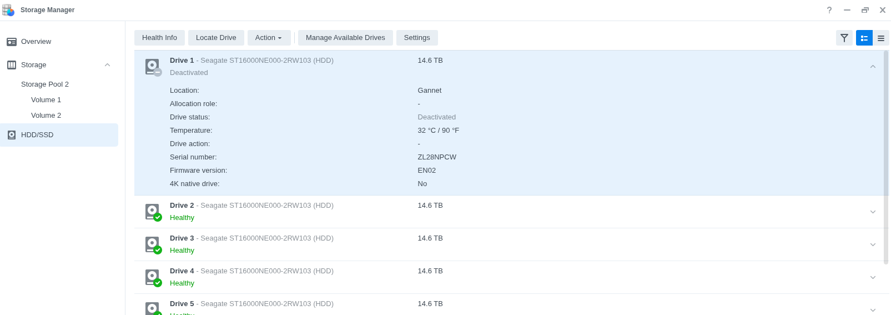
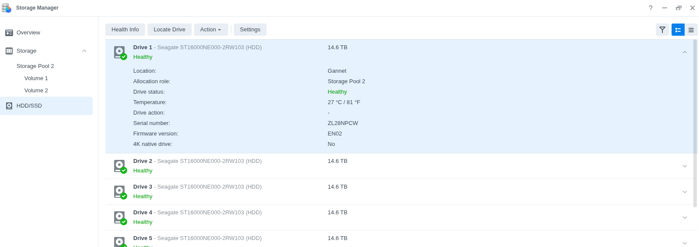
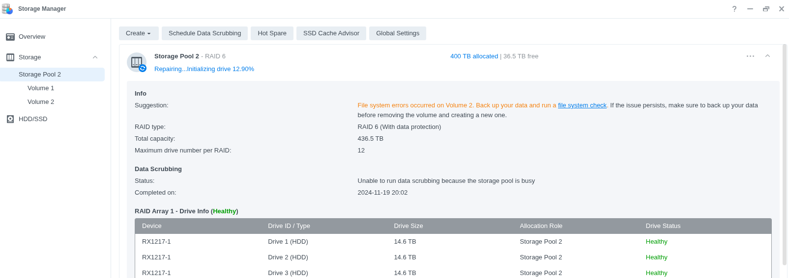

# INTRO

Received notification from Gannet (our Synology RS3618xs server) that one of the hard drives (HDDs) had failed and was in critical condition.

After deactivating the faulty drive, I realized we don't have a replacement drive on hand. I reinstalled the "faulty" drive (hot swapped)and initiated the Storage Pool 2 repair. It seems to be working for now, but I need to order a few backup HDDs to have on hand in case of future failures.

# MATERIALS & METHODS

