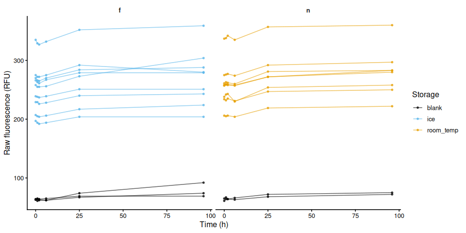
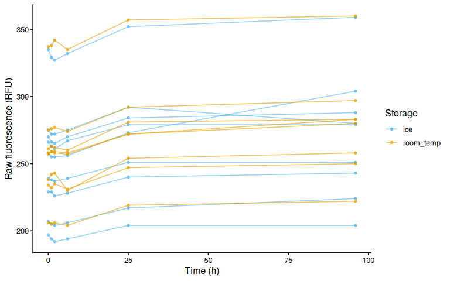
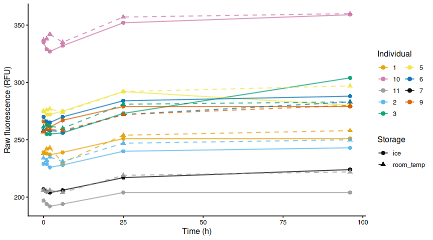
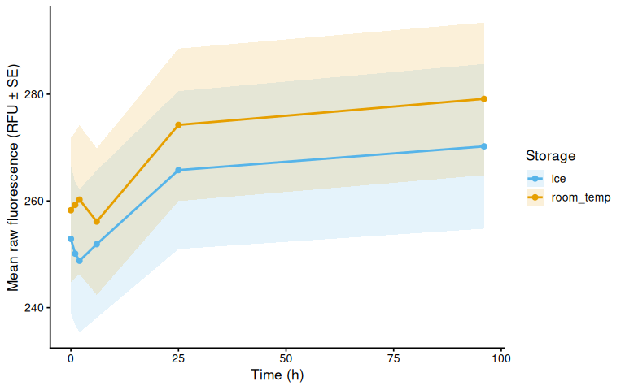
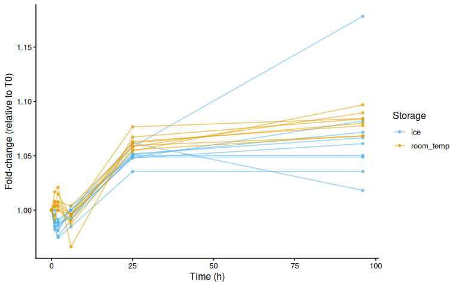
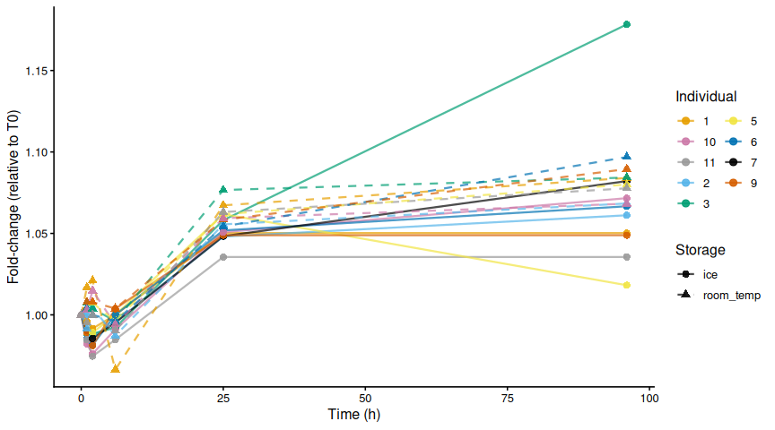
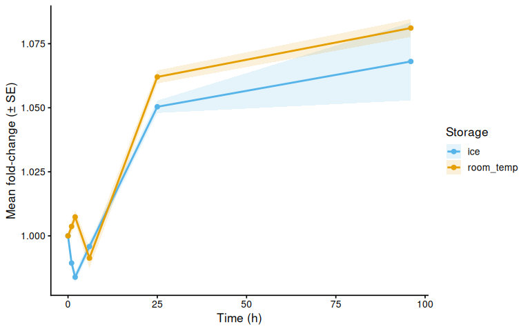
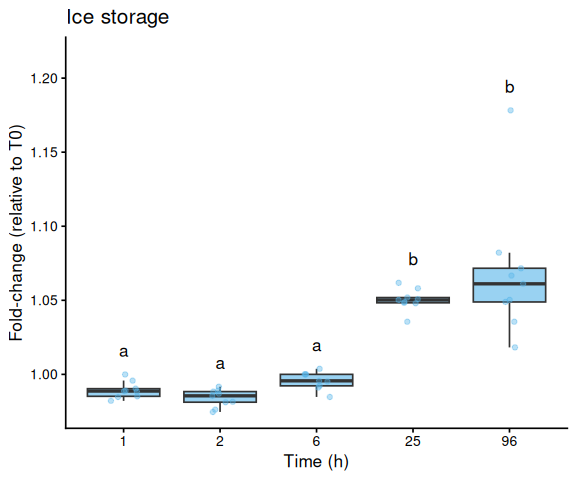
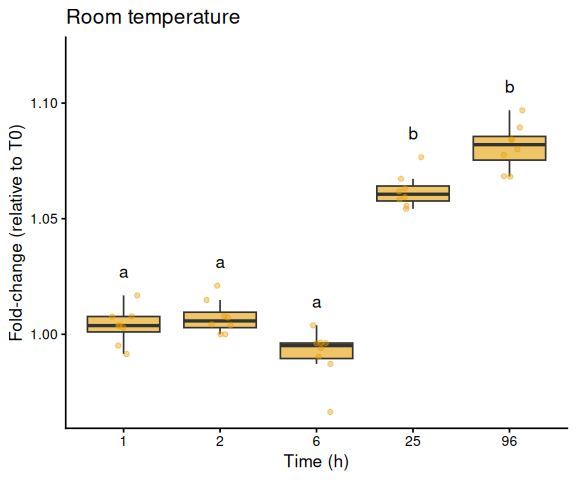
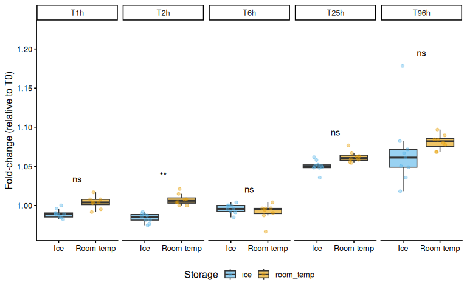

# INTRO

Maddy Bernstein ran a trial to assess resazurin fluorescence stability over time to assess the viability of performing resazurin assays in the field, without the need to bring a portable plate reader, per this [GitHub Issue](https://github.com/RobertsLab/resources/issues/2432).

# MATERIALS & METHODS

## EXPERIMENTAL DESIGN

Nine Pacific oysters were incubated at 36°C for 3 hours in 5 mL resazurin
working solution in a 12-well plate, including three blank wells. This time period was chosen because previous work showed that 3 hours at 36°C induces a detectable increase in fluorescence relative to pre-heat-stress values.

After the heat stress, the working solution from each well was split evenly and transferred
to 15 mL conicals (~2.5 mL per conical). One set was stored at room
temperature; the other was stored on ice.

Resazurin fluorescence wasmeasured periodically using 1.5 mL from each conical in a 12-well plate;
the solution was returned to the conicals after each measurement. T0.0
corresponded to the first measurement taken at the end of the heat
stress.

Plate label:storage:

- F:Ice

- N:RT

## ANALYSIS

Data was analyzed in R: [00.00-fluorescence_stability-20260528.Rmd](https://github.com/RobertsLab/resazurin-assay-development/blob/main/scripts/fluorescence_stability/00.00-fluorescence_stability-20260528.Rmd)

See the rendered R Markdown below for details on data processing, visualisation, and statistical analysis.


# RESULTS/SUMMARY

Resazurin fluorescence ws stable for at least 6 hours regardless of whether samples were stored on ice or at room temperature after organism removal.


---

# 1 Background

9 Pacific oysters were incubated at 36°C for 3 hours in 5 mL resazurin
working solution in a 12-well plate, including three blank wells. After
the heat stress, the working solution was split evenly and transferred
to 15 mL conicals (~2.5 mL per conical). One set was stored at room
temperature; the other was stored on ice. Resazurin fluorescence was
measured periodically using 1.5 mL from each conical in a 12-well plate;
the solution was returned to the conicals after each measurement. T0.0
corresponds to the first measurement taken at the end of the heat
stress.

Plate label:storage:

- F Ice

- N RT

See `data/fluorescence_stability/05_28_2026/README.md` for full
experimental notes.

## 1.1 Expected inputs

| Path | Description |
|:---|:---|
| `data/fluorescence_stability/05_28_2026/plate-*-T*.txt` | Plate reader fluorescence exports (one file per plate per timepoint) |
| `data/fluorescence_stability/05_28_2026/layout.csv` | Well metadata: plate ID, well ID, blank flag, sample IDs, exclusion flags |

## 1.2 Expected outputs

All outputs are written to `output/fluorescence_stability/05_28_2026/`.

| File | Description |
|:---|:---|
| `figures/` | All plots generated by this script |
| `fold_change.csv` | Per-well per-timepoint fold-change data (relative to T0) |
| `pairwise_timepoints.csv` | Tukey-adjusted pairwise timepoint comparisons within each storage condition |
| `pairwise_storage.csv` | Tukey-adjusted ice vs room-temperature comparisons at each timepoint |

# 2 Setup

``` r
knitr::opts_chunk$set(
  echo = TRUE,         # Display code chunks
  eval = TRUE,        # Evaluate code chunks
  warning = FALSE,     # Hide warnings
  message = FALSE,     # Hide messages
  comment = "",         # Prevents appending '##' to beginning of lines in code output
  results = 'hold'     # Holds output so it's all printed together after code chunk
)
```

``` r
library(tidyverse)
library(cowplot)
library(lme4)
library(lmerTest)
library(emmeans)
library(multcompView)
```

# 3 Helper Functions

``` r
normalize_well_id <- function(x) {
  x <- toupper(trimws(x))
  valid <- str_detect(x, "^[A-Z]+[0-9]+$")
  out <- rep(NA_character_, length(x))
  if (!any(valid)) return(out)
  m <- str_match(x[valid], "^([A-Z]+)([0-9]+)$")
  out[valid] <- paste0(m[, 2], as.integer(m[, 3]))
  out
}

parse_time_hr <- function(path) {
  hit <- str_match(basename(path),
                   "(?i)-T([0-9]+(?:\\.[0-9]+)?)\\.txt$")
  as.numeric(hit[, 2])
}

parse_plate_id <- function(path) {
  hit <- str_match(basename(path),
    "(?i)^plate-([A-Za-z0-9-]+)-T[0-9]+(?:\\.[0-9]+)?\\.txt$")
  id <- hit[, 2]
  ifelse(is.na(id), "unknown", id)
}

extract_results_block <- function(lines) {
  results_idx <- which(trimws(lines) == "Results")
  if (length(results_idx) == 0) stop("No Results section found")
  idx <- results_idx[1]
  header_tokens <- str_split(lines[idx + 1], "\\t")[[1]] |> trimws()
  col_ids <- header_tokens[
    header_tokens != "" & str_detect(header_tokens, "^[0-9]+$")]
  j <- idx + 2
  data_lines <- character()
  while (j <= length(lines)) {
    line <- lines[j]
    if (trimws(line) == "") break
    if (!str_detect(line, "^[A-Za-z]\\t")) break
    data_lines <- c(data_lines, line)
    j <- j + 1
  }
  list(col_ids = col_ids, data_lines = data_lines)
}

parse_plate_export <- function(path) {
  lines <- readLines(path, warn = FALSE)
  res <- extract_results_block(lines)

  map_dfr(res$data_lines, function(line) {
    tokens <- str_split(line, "\\t")[[1]] |> trimws()
    tokens <- tokens[tokens != ""]
    row_letter <- tokens[1]
    nums <- suppressWarnings(as.numeric(tokens[-1]))
    valid_idx <- which(!is.na(nums))
    if (length(valid_idx) == 0) return(tibble())
    vals <- nums[valid_idx]
    n <- min(length(vals), length(res$col_ids))
    tibble(
      row_id  = toupper(row_letter),
      col_id  = as.integer(res$col_ids[seq_len(n)]),
      well_id = normalize_well_id(
        paste0(toupper(row_letter), res$col_ids[seq_len(n)])),
      value   = vals[seq_len(n)]
    )
  }) %>%
    mutate(
      plate_id = str_to_lower(parse_plate_id(path)),
      time_hr  = parse_time_hr(path)
    )
}
```

# 4 Load Data

## 4.1 Plate export files

``` r
proj_root <- rprojroot::find_rstudio_root_file()
data_dir  <- file.path(proj_root, "data", "fluorescence_stability",
                        "05_28_2026")
fig_dir   <- file.path(proj_root, "output", "fluorescence_stability",
                        "05_28_2026", "figures")
out_dir   <- file.path(proj_root, "output", "fluorescence_stability",
                        "05_28_2026")

dir.create(fig_dir, recursive = TRUE, showWarnings = FALSE)
dir.create(out_dir, recursive = TRUE, showWarnings = FALSE)

plate_files <- list.files(
  data_dir,
  pattern = "(?i)^plate-.*-T[0-9]+(?:\\.[0-9]+)?\\.txt$",
  full.names = TRUE
)

plate_raw <- map_dfr(plate_files, function(path) {
  tryCatch(parse_plate_export(path),
           error = function(e) {
             message("Parse error in ", basename(path), ": ", e$message)
             tibble()
           })
})

str(plate_raw)
```

    tibble [144 × 6] (S3: tbl_df/tbl/data.frame)
     $ row_id  : chr [1:144] "A" "A" "A" "A" ...
     $ col_id  : int [1:144] 1 2 3 4 1 2 3 4 1 2 ...
     $ well_id : chr [1:144] "A1" "A2" "A3" "A4" ...
     $ value   : num [1:144] 239 229 258 63 275 270 207 64 266 335 ...
     $ plate_id: chr [1:144] "f" "f" "f" "f" ...
     $ time_hr : num [1:144] 0 0 0 0 0 0 0 0 0 0 ...

## 4.2 Plate consistency check

Checks that every plate has the same number of wells at every timepoint.
The expected well count is the mode across all plate × timepoint reads.
Any plate with at least one deviating read is flagged and dropped
entirely before any further analysis — removing only the aberrant
timepoint would break the fold-change baseline calculation.

``` r
well_counts <- plate_raw %>%
  group_by(plate_id, time_hr) %>%
  summarise(n_wells = n_distinct(well_id), .groups = "drop")

expected_n_wells <- as.integer(
  names(which.max(table(well_counts$n_wells)))
)

inconsistent_reads <- well_counts %>%
  filter(n_wells != expected_n_wells) %>%
  arrange(plate_id, time_hr)

inconsistent_plate_ids <- unique(inconsistent_reads$plate_id)

if (nrow(inconsistent_reads) > 0) {
  cat("**Plate consistency check FAILED.**",
      "Expected", expected_n_wells, "wells per plate-timepoint read.",
      length(inconsistent_plate_ids),
      "plate(s) have at least one deviating read and are excluded",
      "from all analyses:\n\n")
  cat(knitr::kable(
    inconsistent_reads,
    col.names = c("Plate", "Time (h)", "Wells read"),
    caption   = paste("Expected:", expected_n_wells, "wells per read")
  ), sep = "\n")
  cat("\n")
  plate_raw <- plate_raw %>%
    filter(!plate_id %in% inconsistent_plate_ids)
  message(length(inconsistent_plate_ids),
          " plate(s) removed from plate_raw: ",
          paste(inconsistent_plate_ids, collapse = ", "))
} else {
  cat("Plate consistency check passed: all",
      n_distinct(well_counts$plate_id), "plates have",
      expected_n_wells, "wells at every timepoint.\n")
}
```

Plate consistency check passed: all 2 plates have 12 wells at every
timepoint.

## 4.3 Layout file

Storage condition is derived from plate ID: plate `F` = ice, plate `N` =
room temperature.

``` r
layout_path <- file.path(data_dir, "layout.csv")

layout_raw <- read_csv(layout_path,
                       col_types = cols(.default = "c"),
                       show_col_types = FALSE)

names(layout_raw) <- names(layout_raw) |>
  str_to_lower() |>
  str_replace_all("[^a-z0-9]+", "_") |>
  str_replace_all("_+", "_") |>
  str_replace("_$", "")

layout_clean <- layout_raw %>%
  mutate(
    plate_id = str_remove(str_to_lower(plate_id), "^plate-"),
    well_id  = normalize_well_id(plate_well),
    is_blank = toupper(trimws(is_blank)) %in% c("TRUE", "T", "1", "YES", "Y"),
    storage  = case_when(
      plate_id == "f" ~ "ice",
      plate_id == "n" ~ "room_temp",
      TRUE            ~ plate_id
    )
  )

found_exclude_col <- intersect(
  c("exclude_from_analysis", "exclude", "omit", "not_analyzed"),
  names(layout_clean)
)[1]
layout_clean <- layout_clean %>%
  mutate(
    exclude_from_analysis = if (!is.na(found_exclude_col))
      toupper(trimws(.data[[found_exclude_col]])) %in%
        c("TRUE", "T", "1", "YES", "Y")
    else
      FALSE
  )

str(layout_clean)
```

    tibble [24 × 15] (S3: tbl_df/tbl/data.frame)
     $ plate_id             : chr [1:24] "f" "f" "f" "f" ...
     $ plate_well           : chr [1:24] "A01" "A02" "A03" "A04" ...
     $ is_blank             : logi [1:24] FALSE FALSE FALSE TRUE FALSE FALSE ...
     $ family_id_group      : chr [1:24] NA NA NA NA ...
     $ sample_id_group      : chr [1:24] "1" "2" "3" NA ...
     $ treatment_group      : chr [1:24] NA NA NA NA ...
     $ exclude_from_analysis: logi [1:24] FALSE FALSE FALSE FALSE FALSE FALSE ...
     $ exclude_reason       : chr [1:24] NA NA NA NA ...
     $ width_mm_measurement : chr [1:24] NA NA NA NA ...
     $ length_mm_measurement: chr [1:24] NA NA NA NA ...
     $ weight_mg_measurement: chr [1:24] NA NA NA NA ...
     $ area_cm2_measurement : chr [1:24] NA NA NA NA ...
     $ imagej_id            : chr [1:24] NA NA NA NA ...
     $ well_id              : chr [1:24] "A1" "A2" "A3" "A4" ...
     $ storage              : chr [1:24] "ice" "ice" "ice" "ice" ...

# 5 Merge Plate Data with Layout

``` r
dat <- plate_raw %>%
  left_join(
    layout_clean %>%
      dplyr::select(plate_id, well_id, is_blank, exclude_from_analysis,
                    any_of("exclude_reason"), any_of("sample_id_group"),
                    storage),
    by = c("plate_id", "well_id")
  ) %>%
  mutate(
    is_blank              = replace_na(is_blank, FALSE),
    exclude_from_analysis = replace_na(exclude_from_analysis, FALSE)
  )

str(dat)
```

    tibble [144 × 11] (S3: tbl_df/tbl/data.frame)
     $ row_id               : chr [1:144] "A" "A" "A" "A" ...
     $ col_id               : int [1:144] 1 2 3 4 1 2 3 4 1 2 ...
     $ well_id              : chr [1:144] "A1" "A2" "A3" "A4" ...
     $ value                : num [1:144] 239 229 258 63 275 270 207 64 266 335 ...
     $ plate_id             : chr [1:144] "f" "f" "f" "f" ...
     $ time_hr              : num [1:144] 0 0 0 0 0 0 0 0 0 0 ...
     $ is_blank             : logi [1:144] FALSE FALSE FALSE TRUE FALSE FALSE ...
     $ exclude_from_analysis: logi [1:144] FALSE FALSE FALSE FALSE FALSE FALSE ...
     $ exclude_reason       : chr [1:144] NA NA NA NA ...
     $ sample_id_group      : chr [1:144] "1" "2" "3" NA ...
     $ storage              : chr [1:144] "ice" "ice" "ice" "ice" ...

# 6 Excluded Wells

Wells flagged `exclude_from_analysis = TRUE` are omitted from all plots
and analyses.

``` r
excluded_wells <- dat %>%
  filter(exclude_from_analysis) %>%
  mutate(
    sample = if_else(
      "sample_id_group" %in% names(dat) &
        !is.na(sample_id_group) &
        trimws(as.character(sample_id_group)) != "",
      paste(plate_id, sample_id_group, sep = "_"),
      paste(plate_id, well_id, sep = "_")
    )
  ) %>%
  dplyr::select(plate_id, well_id, is_blank, sample, storage,
                any_of("exclude_reason")) %>%
  distinct() %>%
  arrange(plate_id, well_id)

if (nrow(excluded_wells) > 0) {
  col_names <- c("Plate", "Well", "Blank", "Sample", "Storage")
  if ("exclude_reason" %in% names(excluded_wells))
    col_names <- c(col_names, "Reason")
  cat(knitr::kable(excluded_wells, col.names = col_names), sep = "\n")
} else {
  cat("No wells are excluded from analysis.\n")
}
```

| Plate | Well | Blank | Sample | Storage   | Reason            |
|:------|:-----|:------|:-------|:----------|:------------------|
| n     | B3   | FALSE | n_7    | room_temp | mixed up with B04 |
| n     | B4   | TRUE  | n_B4   | room_temp | mixed up with B03 |

# 7 Raw Fluorescence

## 7.1 Data frame

``` r
storage_colours <- c(ice = "#56B4E9", room_temp = "#E69F00")

individual_colours <- c(
  "1"  = "#E69F00",
  "2"  = "#56B4E9",
  "3"  = "#009E73",
  "5"  = "#F0E442",
  "6"  = "#0072B2",
  "9"  = "#D55E00",
  "10" = "#CC79A7",
  "11" = "#999999"
)
storage_shapes    <- c(ice = 16, room_temp = 17)
storage_linetypes <- c(ice = "solid", room_temp = "dashed")

raw_df <- dat %>%
  filter(!is_blank, !exclude_from_analysis, !is.na(storage)) %>%
  mutate(
    trace_id = if_else(
      "sample_id_group" %in% names(dat) &
        !is.na(sample_id_group) &
        trimws(as.character(sample_id_group)) != "",
      paste(plate_id, sample_id_group, sep = "_"),
      paste(plate_id, well_id, sep = "_")
    )
  )

str(raw_df)
```

    tibble [102 × 12] (S3: tbl_df/tbl/data.frame)
     $ row_id               : chr [1:102] "A" "A" "A" "B" ...
     $ col_id               : int [1:102] 1 2 3 1 2 3 1 2 3 1 ...
     $ well_id              : chr [1:102] "A1" "A2" "A3" "B1" ...
     $ value                : num [1:102] 239 229 258 275 270 207 266 335 197 238 ...
     $ plate_id             : chr [1:102] "f" "f" "f" "f" ...
     $ time_hr              : num [1:102] 0 0 0 0 0 0 0 0 0 1 ...
     $ is_blank             : logi [1:102] FALSE FALSE FALSE FALSE FALSE FALSE ...
     $ exclude_from_analysis: logi [1:102] FALSE FALSE FALSE FALSE FALSE FALSE ...
     $ exclude_reason       : chr [1:102] NA NA NA NA ...
     $ sample_id_group      : chr [1:102] "1" "2" "3" "5" ...
     $ storage              : chr [1:102] "ice" "ice" "ice" "ice" ...
     $ trace_id             : chr [1:102] "f_1" "f_2" "f_3" "f_5" ...

## 7.2 Raw fluorescence by plate (including blanks)

``` r
p_raw_plates <- dat %>%
  filter(is.finite(time_hr), is.finite(value), !exclude_from_analysis) %>%
  mutate(
    colour_group = if_else(is_blank, "blank", coalesce(storage, "sample")),
    trace_id     = paste(plate_id, well_id, sep = "_")
  ) %>%
  ggplot(aes(x = time_hr, y = value,
             group = trace_id, colour = colour_group)) +
  geom_line(alpha = 0.6) +
  geom_point(size = 1, alpha = 0.7) +
  facet_wrap(~ plate_id) +
  scale_colour_manual(
    values   = c(blank = "black", storage_colours),
    name     = "Storage",
    na.value = "grey80"
  ) +
  labs(x = "Time (h)", y = "Raw fluorescence (RFU)") +
  theme_classic(base_size = 12) +
  theme(strip.background = element_blank(),
        strip.text       = element_text(face = "bold"))

p_raw_plates
```

<!-- -->

``` r
ggsave(file.path(fig_dir, "raw_fluor_by_plate.png"),
       p_raw_plates, width = 10, height = 5)
```

## 7.3 Individual raw fluorescence traces by storage condition

``` r
p_raw_by_storage <- raw_df %>%
  ggplot(aes(x = time_hr, y = value,
             group = trace_id, colour = storage)) +
  geom_line(alpha = 0.6) +
  geom_point(size = 1.2, alpha = 0.7) +
  scale_colour_manual(values = storage_colours, name = "Storage") +
  labs(x = "Time (h)", y = "Raw fluorescence (RFU)") +
  theme_classic(base_size = 12)

p_raw_by_storage
```

<!-- -->

``` r
ggsave(file.path(fig_dir, "raw_individual_by_storage.png"),
       p_raw_by_storage, width = 8, height = 5)
```

## 7.4 Paired individual raw fluorescence traces (both storage conditions)

``` r
p_raw_paired <- raw_df %>%
  mutate(sample_id_group = as.character(sample_id_group)) %>%
  ggplot(aes(x = time_hr, y = value,
             group = trace_id,
             colour = sample_id_group,
             shape  = storage,
             linetype = storage)) +
  geom_line(alpha = 0.7, linewidth = 0.8) +
  geom_point(size = 2.5, alpha = 0.9) +
  scale_colour_manual(values = individual_colours, name = "Individual") +
  scale_shape_manual(values = storage_shapes,    name = "Storage") +
  scale_linetype_manual(values = storage_linetypes, name = "Storage") +
  labs(x = "Time (h)", y = "Raw fluorescence (RFU)") +
  theme_classic(base_size = 12) +
  guides(colour = guide_legend(order = 1, ncol = 2),
         shape  = guide_legend(order = 2),
         linetype = guide_legend(order = 2))

p_raw_paired
```

<!-- -->

``` r
ggsave(file.path(fig_dir, "raw_paired_individuals.png"),
       p_raw_paired, width = 9, height = 5)
```

## 7.5 Mean raw fluorescence by storage condition

``` r
raw_storage_summary <- raw_df %>%
  group_by(storage, time_hr) %>%
  summarise(
    mean_fluor = mean(value, na.rm = TRUE),
    se_fluor   = sd(value, na.rm = TRUE) / sqrt(sum(!is.na(value))),
    n          = sum(!is.na(value)),
    .groups    = "drop"
  )

p_raw_mean <- ggplot(raw_storage_summary,
    aes(x = time_hr, y = mean_fluor,
        colour = storage, fill = storage, group = storage)) +
  geom_ribbon(aes(ymin = mean_fluor - se_fluor,
                  ymax = mean_fluor + se_fluor),
              alpha = 0.15, colour = NA) +
  geom_line(linewidth = 1) +
  geom_point(size = 2) +
  scale_colour_manual(values = storage_colours, name = "Storage") +
  scale_fill_manual(values = storage_colours, name = "Storage") +
  labs(x = "Time (h)", y = "Mean raw fluorescence (RFU ± SE)") +
  theme_classic(base_size = 13)

p_raw_mean
```

<!-- -->

``` r
ggsave(file.path(fig_dir, "raw_mean_by_storage.png"),
       p_raw_mean, width = 8, height = 5)
```

# 8 Fold-Change Normalization

Each well’s fluorescence is expressed as fold-change relative to its own
T0 reading, normalising out well-to-well pipetting differences without
subtracting a blank baseline. Blank correction is not applied here
because the blank wells contain fresh (unreduced) resazurin at a much
lower starting fluorescence (~60 RFU) than the post-heat-stress samples
(~200–340 RFU). Their proportional rate of spontaneous reduction is
therefore higher, so subtracting their fold-change would artificially
depress sample values below zero. For a stability question — does
fluorescence hold steady after organism removal? — a fold-change of 1
across all timepoints is the expected result.

``` r
t0_all <- dat %>%
  filter(is.finite(time_hr), is.finite(value)) %>%
  group_by(plate_id, well_id) %>%
  slice_min(time_hr, n = 1, with_ties = FALSE) %>%
  dplyr::select(plate_id, well_id, value_t0 = value) %>%
  ungroup()

samples <- dat %>%
  filter(!is_blank, !exclude_from_analysis) %>%
  left_join(t0_all, by = c("plate_id", "well_id")) %>%
  mutate(
    fold_change = if_else(
      is.finite(value_t0) & value_t0 > 0,
      value / value_t0,
      NA_real_
    ),
    trace_id = if_else(
      "sample_id_group" %in% names(dat) &
        !is.na(sample_id_group) &
        trimws(as.character(sample_id_group)) != "",
      paste(plate_id, sample_id_group, sep = "_"),
      paste(plate_id, well_id, sep = "_")
    )
  )

str(samples)
```

    tibble [102 × 14] (S3: tbl_df/tbl/data.frame)
     $ row_id               : chr [1:102] "A" "A" "A" "B" ...
     $ col_id               : int [1:102] 1 2 3 1 2 3 1 2 3 1 ...
     $ well_id              : chr [1:102] "A1" "A2" "A3" "B1" ...
     $ value                : num [1:102] 239 229 258 275 270 207 266 335 197 238 ...
     $ plate_id             : chr [1:102] "f" "f" "f" "f" ...
     $ time_hr              : num [1:102] 0 0 0 0 0 0 0 0 0 1 ...
     $ is_blank             : logi [1:102] FALSE FALSE FALSE FALSE FALSE FALSE ...
     $ exclude_from_analysis: logi [1:102] FALSE FALSE FALSE FALSE FALSE FALSE ...
     $ exclude_reason       : chr [1:102] NA NA NA NA ...
     $ sample_id_group      : chr [1:102] "1" "2" "3" "5" ...
     $ storage              : chr [1:102] "ice" "ice" "ice" "ice" ...
     $ value_t0             : num [1:102] 239 229 258 275 270 207 266 335 197 239 ...
     $ fold_change          : num [1:102] 1 1 1 1 1 ...
     $ trace_id             : chr [1:102] "f_1" "f_2" "f_3" "f_5" ...

# 9 Fold-Change

## 9.1 Individual traces by storage condition

``` r
p_fc_by_storage <- samples %>%
  ggplot(aes(x = time_hr, y = fold_change,
             group = trace_id, colour = storage)) +
  geom_line(alpha = 0.6) +
  geom_point(size = 1.2, alpha = 0.7) +
  scale_colour_manual(values = storage_colours, name = "Storage") +
  labs(x = "Time (h)", y = "Fold-change (relative to T0)") +
  theme_classic(base_size = 12)

p_fc_by_storage
```

<!-- -->

``` r
ggsave(file.path(fig_dir, "fold_change_by_storage.png"),
       p_fc_by_storage, width = 8, height = 5)
```

## 9.2 Paired individual traces (both storage conditions)

``` r
p_fc_paired <- samples %>%
  mutate(sample_id_group = as.character(sample_id_group)) %>%
  ggplot(aes(x = time_hr, y = fold_change,
             group = trace_id,
             colour = sample_id_group,
             shape  = storage,
             linetype = storage)) +
  geom_line(alpha = 0.7, linewidth = 0.8) +
  geom_point(size = 2.5, alpha = 0.9) +
  scale_colour_manual(values = individual_colours, name = "Individual") +
  scale_shape_manual(values = storage_shapes,    name = "Storage") +
  scale_linetype_manual(values = storage_linetypes, name = "Storage") +
  labs(x = "Time (h)", y = "Fold-change (relative to T0)") +
  theme_classic(base_size = 12) +
  guides(colour = guide_legend(order = 1, ncol = 2),
         shape  = guide_legend(order = 2),
         linetype = guide_legend(order = 2))

p_fc_paired
```

<!-- -->

``` r
ggsave(file.path(fig_dir, "fold_change_paired_individuals.png"),
       p_fc_paired, width = 9, height = 5)
```

## 9.3 Mean fold-change by storage condition

``` r
fc_summary <- samples %>%
  group_by(storage, time_hr) %>%
  summarise(
    mean_val = mean(fold_change, na.rm = TRUE),
    se_val   = sd(fold_change, na.rm = TRUE) /
      sqrt(sum(!is.na(fold_change))),
    n        = sum(!is.na(fold_change)),
    .groups  = "drop"
  )

p_fc_mean <- ggplot(fc_summary,
    aes(x = time_hr, y = mean_val,
        colour = storage, fill = storage, group = storage)) +
  geom_ribbon(aes(ymin = mean_val - se_val,
                  ymax = mean_val + se_val),
              alpha = 0.15, colour = NA) +
  geom_line(linewidth = 1) +
  geom_point(size = 2) +
  scale_colour_manual(values = storage_colours, name = "Storage") +
  scale_fill_manual(values = storage_colours, name = "Storage") +
  labs(x = "Time (h)",
       y = "Mean fold-change (± SE)") +
  theme_classic(base_size = 13)

p_fc_mean
```

<!-- -->

``` r
ggsave(file.path(fig_dir, "fold_change_mean_by_storage.png"),
       p_fc_mean, width = 8, height = 5)
```

# 10 Statistical Analysis

Blank-corrected fold-change (`corrected_fc`) is used as the response
variable. This normalises each well to its own T0 baseline and subtracts
blank drift, so a value of 0 means no change from the start of the
experiment. If resazurin fluorescence is stable after organism removal,
`fold_change` should remain near 1 across all post-T0 timepoints. Raw
fluorescence is not appropriate here because between-well differences in
starting volume would confound comparisons.

T0 is excluded from the model: all `fold_change` values are exactly 1 at
T0 by construction, so there is no variance to model at that timepoint.

A linear mixed effects model tests whether fluorescence changes over
time and whether that change differs between storage conditions:

- Fixed effects: `time_f * storage` (timepoint as factor, storage
  condition, and their interaction)
- Random intercept: `individual` (trace ID), to account for repeated
  measures on the same well across timepoints
- Type III ANOVA with Satterthwaite’s approximation (`lmerTest`)

Post-hoc pairwise comparisons use `emmeans` with Tukey adjustment:

1.  Timepoint comparisons within each storage condition — does
    fluorescence drift at all, and if so, when?
2.  Storage condition comparison at each timepoint — do ice and
    room-temperature samples diverge?

``` r
model_df <- samples %>%
  filter(time_hr > 0, is.finite(fold_change)) %>%
  mutate(
    time_f     = factor(time_hr),
    storage    = factor(storage),
    individual = factor(trace_id)
  )

model <- lmer(
  fold_change ~ time_f * storage + (1 | individual),
  data = model_df
)

anova_res <- anova(model, type = 3, ddf = "Satterthwaite")
```

## 10.1 ANOVA table

``` r
knitr::kable(
  as.data.frame(anova_res),
  digits  = c(0, 0, 2, 2, 4),
  caption = "Type III ANOVA (Satterthwaite approximation). Key terms: **storage** = overall ice vs. room-temp difference; **time_f:storage** interaction = whether trajectories diverged between conditions."
)
```

|                | Sum Sq | Mean Sq | NumDF | DenDF | F value | Pr(\>F) |
|----------------|-------:|--------:|------:|------:|--------:|--------:|
| time_f         |      0 |       0 |     4 |    60 | 97.5763 |       0 |
| storage        |      0 |       0 |     1 |    15 |  8.9738 |       0 |
| time_f:storage |      0 |       0 |     4 |    60 |  1.6498 |       0 |

Type III ANOVA (Satterthwaite approximation). Key terms: **storage** =
overall ice vs. room-temp difference; **time_f:storage** interaction =
whether trajectories diverged between conditions.

## 10.2 Timepoint pairwise comparisons (within each storage condition)

``` r
# Timepoint comparisons within each storage condition
emm_time_by_storage <- emmeans(model, ~ time_f | storage)
pairs_time <- as.data.frame(pairs(emm_time_by_storage, adjust = "tukey"))

knitr::kable(pairs_time, digits = 4,
  caption = "Tukey-adjusted pairwise comparisons between timepoints, within each storage condition.")
```

| contrast            | storage   | estimate |     SE |  df |  t.ratio | p.value |
|:--------------------|:----------|---------:|-------:|----:|---------:|--------:|
| time_f1 - time_f2   | ice       |   0.0055 | 0.0077 |  60 |   0.7176 |  0.9517 |
| time_f1 - time_f6   | ice       |  -0.0065 | 0.0077 |  60 |  -0.8449 |  0.9154 |
| time_f1 - time_f25  | ice       |  -0.0610 | 0.0077 |  60 |  -7.9665 |  0.0000 |
| time_f1 - time_f96  | ice       |  -0.0787 | 0.0077 |  60 | -10.2754 |  0.0000 |
| time_f2 - time_f6   | ice       |  -0.0120 | 0.0077 |  60 |  -1.5625 |  0.5269 |
| time_f2 - time_f25  | ice       |  -0.0665 | 0.0077 |  60 |  -8.6841 |  0.0000 |
| time_f2 - time_f96  | ice       |  -0.0842 | 0.0077 |  60 | -10.9929 |  0.0000 |
| time_f6 - time_f25  | ice       |  -0.0545 | 0.0077 |  60 |  -7.1216 |  0.0000 |
| time_f6 - time_f96  | ice       |  -0.0722 | 0.0077 |  60 |  -9.4304 |  0.0000 |
| time_f25 - time_f96 | ice       |  -0.0177 | 0.0077 |  60 |  -2.3088 |  0.1563 |
| time_f1 - time_f2   | room_temp |  -0.0037 | 0.0081 |  60 |  -0.4566 |  0.9908 |
| time_f1 - time_f6   | room_temp |   0.0124 | 0.0081 |  60 |   1.5212 |  0.5530 |
| time_f1 - time_f25  | room_temp |  -0.0584 | 0.0081 |  60 |  -7.1858 |  0.0000 |
| time_f1 - time_f96  | room_temp |  -0.0775 | 0.0081 |  60 |  -9.5355 |  0.0000 |
| time_f2 - time_f6   | room_temp |   0.0161 | 0.0081 |  60 |   1.9779 |  0.2892 |
| time_f2 - time_f25  | room_temp |  -0.0547 | 0.0081 |  60 |  -6.7291 |  0.0000 |
| time_f2 - time_f96  | room_temp |  -0.0738 | 0.0081 |  60 |  -9.0788 |  0.0000 |
| time_f6 - time_f25  | room_temp |  -0.0707 | 0.0081 |  60 |  -8.7070 |  0.0000 |
| time_f6 - time_f96  | room_temp |  -0.0898 | 0.0081 |  60 | -11.0567 |  0.0000 |
| time_f25 - time_f96 | room_temp |  -0.0191 | 0.0081 |  60 |  -2.3497 |  0.1438 |

Tukey-adjusted pairwise comparisons between timepoints, within each
storage condition.

## 10.3 Storage condition comparisons (ice vs. room-temp at each timepoint)

``` r
# Storage condition at each timepoint
emm_storage_by_time <- emmeans(model, ~ storage | time_f)
pairs_storage <- as.data.frame(pairs(emm_storage_by_time, adjust = "tukey"))

knitr::kable(pairs_storage, digits = 4,
  caption = "Tukey-adjusted pairwise comparisons between ice and room-temperature storage at each timepoint.")
```

| contrast        | time_f | estimate |     SE |      df | t.ratio | p.value |
|:----------------|:-------|---------:|-------:|--------:|--------:|--------:|
| ice - room_temp | 1      |  -0.0143 | 0.0081 | 74.5553 | -1.7748 |  0.0800 |
| ice - room_temp | 2      |  -0.0235 | 0.0081 | 74.5553 | -2.9181 |  0.0047 |
| ice - room_temp | 6      |   0.0045 | 0.0081 | 74.5553 |  0.5637 |  0.5747 |
| ice - room_temp | 25     |  -0.0116 | 0.0081 | 74.5553 | -1.4468 |  0.1522 |
| ice - room_temp | 96     |  -0.0131 | 0.0081 | 74.5553 | -1.6212 |  0.1092 |

Tukey-adjusted pairwise comparisons between ice and room-temperature
storage at each timepoint.

## 10.4 Box plots with letter annotations

Boxes sharing a letter are not significantly different from one another
(Tukey-adjusted, p ≥ 0.05). Letters are derived from the same mixed
model used for the ANOVA above.

``` r
cld_df <- bind_rows(lapply(c("ice", "room_temp"), function(stor) {
  pvec <- pairs_time %>%
    filter(as.character(storage) == stor) %>%
    mutate(contrast = str_remove_all(contrast, "time_f") %>%
                      str_replace_all(" - ", "-")) %>%
    { setNames(.$p.value, .$contrast) }
  ltrs <- multcompLetters(pvec)$Letters
  tibble(storage = stor, time_f = factor(names(ltrs)), .group = ltrs)
}))

for (stor in c("ice", "room_temp")) {
  df_p  <- model_df %>% filter(storage == stor)
  cld_p <- cld_df   %>% filter(storage == stor)

  y_offset <- diff(range(df_p$fold_change, na.rm = TRUE)) * 0.08
  label_df <- df_p %>%
    group_by(time_f) %>%
    summarise(y_pos = max(fold_change, na.rm = TRUE) + y_offset,
              .groups = "drop") %>%
    left_join(dplyr::select(cld_p, time_f, .group), by = "time_f")

  p <- ggplot(df_p, aes(x = time_f, y = fold_change)) +
    geom_boxplot(fill = storage_colours[stor], alpha = 0.6,
                 outlier.shape = NA) +
    geom_jitter(width = 0.15, alpha = 0.4, size = 1.5,
                colour = storage_colours[stor]) +
    geom_text(data = label_df,
              aes(x = time_f, y = y_pos, label = .group),
              size = 4.5) +
    scale_y_continuous(expand = expansion(mult = c(0.05, 0.15))) +
    labs(x     = "Time (h)",
         y     = "Fold-change (relative to T0)",
         title = if (stor == "ice") "Ice storage" else "Room temperature") +
    theme_classic(base_size = 13)

  print(p)
  ggsave(
    file.path(fig_dir, paste0("boxplot_timepoints_", stor, ".png")),
    p, width = 6, height = 5
  )
}
```

<!-- --><!-- -->

## 10.5 Ice vs. room-temp comparison at each timepoint

Significance brackets indicate Tukey-adjusted p-values from
`pairs_storage`. Stars: \*\*\* p \< 0.001, \*\* p \< 0.01, \* p \< 0.05,
ns = not significant.

``` r
sig_label <- function(p) {
  case_when(p < 0.001 ~ "***", p < 0.01 ~ "**", p < 0.05 ~ "*", TRUE ~ "ns")
}

# y positions for brackets: just above the max per timepoint
bracket_df <- pairs_storage %>%
  mutate(
    time_f = factor(time_f),
    sig    = sig_label(p.value)
  ) %>%
  left_join(
    model_df %>%
      group_by(time_f) %>%
      summarise(y_max = max(fold_change, na.rm = TRUE), .groups = "drop"),
    by = "time_f"
  ) %>%
  mutate(
    y_bracket = y_max + diff(range(model_df$fold_change, na.rm = TRUE)) * 0.08
  )

p_storage_compare <- ggplot(model_df,
    aes(x = storage, y = fold_change, fill = storage)) +
  geom_boxplot(alpha = 0.6, outlier.shape = NA) +
  geom_jitter(aes(colour = storage), width = 0.15, alpha = 0.4, size = 1.5) +
  geom_text(
    data = bracket_df,
    aes(x = 1.5, y = y_bracket, label = sig),
    inherit.aes = FALSE, size = 4
  ) +
  facet_wrap(~ time_f, nrow = 1,
             labeller = labeller(time_f = function(x) paste0("T", x, "h"))) +
  scale_fill_manual(values   = storage_colours, name = "Storage") +
  scale_colour_manual(values = storage_colours, name = "Storage") +
  scale_x_discrete(labels = c(ice = "Ice", room_temp = "Room temp")) +
  scale_y_continuous(expand = expansion(mult = c(0.05, 0.18))) +
  labs(x = NULL, y = "Fold-change (relative to T0)") +
  theme_classic(base_size = 12) +
  theme(legend.position = "bottom")

p_storage_compare
```

<!-- -->

``` r
ggsave(file.path(fig_dir, "boxplot_storage_by_timepoint.png"),
       p_storage_compare, width = 8, height = 5)
```

# 11 Save Output Data

``` r
write_csv(samples,       file.path(out_dir, "fold_change.csv"))
write_csv(pairs_time,    file.path(out_dir, "pairwise_timepoints.csv"))
write_csv(pairs_storage, file.path(out_dir, "pairwise_storage.csv"))
message("Output files written to: ", out_dir)
```