# INTRO

This post presents the results of resazurin assays conducted on low-salinity selected juvenile *Ruditapes phillippinarum* exposed to acute heat stress at 36°C. Additionally, this compared two families of clams, Tweed and Blue, across selected and control treatments.

# MATERIALS & METHODS

## Experimental design
Manila clams (Ruditapes phillippinarum) from both tweed/blue control/selected (low salinity tolerance) were distributed across six 12-well plates. Clams were photographed. Clams were submerged in 4mL of resazurin working solution (prepared 20260528 by SJW) and incubated at 36°C. Resazurin fluorescence was measured every 30mins using a Synergy HTX (Agilent) plate reader.

## ImageJ Analysis

Clam images were analysed in ImageJ to obtain area measurements. Briefly, images were converted to 8-bit, and thresholded. Then images were converted to binary, applying the "fill holes" operation. The clams were selected using a the rectangular selection tool. The "Analyze Particles" function was used to identify and measure clams.

## Data Analysis

Data analysis was performed in R. See [00.00-resazurin-20260528-clam-36C.Rmd](https://github.com/RobertsLab/resazurin-assay-development/blob/main/scripts/clam/00.00-resazurin-20260528-clam-36C.Rmd).

[https://github.com/RobertsLab/resazurin-assay-development/tree/main/data/clam/20260528-rphi-36C](https://github.com/RobertsLab/resazurin-assay-development/tree/main/data/clam/20260528-rphi-36C)

Results are here:

[https://github.com/RobertsLab/resazurin-assay-development/tree/main/output/clam/20260528-rphi-36C](https://github.com/RobertsLab/resazurin-assay-development/tree/main/output/clam/20260528-rphi-36C)

The section below was knitted from the R Markdown file: [00.00-resazurin-20260528-clam-36C.Rmd](https://github.com/RobertsLab/resazurin-assay-development/blob/main/scripts/clam/00.00-resazurin-20260528-clam-36C.Rmd)

# SUMMARY

No statistical differences in metabolic activity (AUC) were detected between selected and control clams at 36°C, nor between the two families.

---


# 1 Background

Control clams (`C`) compared with selected clams (`S`) at 36°C using a
resazurin metabolic assay. Clams were placed in 12-well plates submerged
in 4.0 mL resazurin working solution (prepared 2026-05-28 by SJW). Plate
layout was randomised. Fluorescence was measured every 30 min on a
Synergy HTX (Agilent) plate reader.

See `data/clam/20260528-rphi-36C/README.md` for full experimental notes
including per-timepoint temperature spot checks.

## 1.1 Expected inputs

| Path | Description |
|:---|:---|
| `data/clam/20260528-rphi-36C/plate-*-T*.txt` | Plate reader fluorescence exports (one file per plate per timepoint) |
| `data/clam/20260528-rphi-36C/layout.csv` | Well metadata: plate ID, well ID, blank flag, family/treatment groups, size measurements, exclusion flags |

## 1.2 Expected outputs

All outputs are written to `output/clam/20260528-rphi-36C/`.

| File | Description |
|:---|:---|
| `figures/` | All plots generated by this script |
| `auc_all_metrics.csv` | Per-individual AUC values for every active measurement metric |
| `auc_summary.csv` | Group-level AUC summary statistics (mean, SD, SE, median) |
| `metabolism.csv` | Full per-well per-timepoint metabolism data frame |
| `pairwise_stats.csv` | Tukey-adjusted pairwise comparisons from AUC linear models |

# 2 Setup

``` r
knitr::opts_chunk$set(
  echo = TRUE,         # Display code chunks
  eval = TRUE,        # Evaluate code chunks
  warning = FALSE,     # Hide warnings
  message = FALSE,     # Hide messages
  comment = "",         # Prevents appending '##' to beginning of lines in code output
  results = 'hold'     # Holds output so it's all printed together after code chunk
)
```

``` r
library(tidyverse)
library(pracma)       # trapz()
library(lme4)
library(lmerTest)
library(emmeans)
library(multcompView)
library(cowplot)
library(colorspace)   # qualitative_hcl() for large palettes
```

# 3 Helper Functions

``` r
normalize_well_id <- function(x) {
  x <- toupper(trimws(x))
  valid <- str_detect(x, "^[A-Z]+[0-9]+$")
  out <- rep(NA_character_, length(x))
  if (!any(valid)) return(out)
  m <- str_match(x[valid], "^([A-Z]+)([0-9]+)$")
  out[valid] <- paste0(m[, 2], as.integer(m[, 3]))
  out
}

parse_time_hr <- function(path) {
  hit <- str_match(basename(path),
                   "(?i)-T([0-9]+(?:\\.[0-9]+)?)\\.txt$")
  as.numeric(hit[, 2])
}

parse_plate_id <- function(path) {
  hit <- str_match(basename(path),
    "(?i)^plate-([A-Za-z0-9-]+)-T[0-9]+(?:\\.[0-9]+)?\\.txt$")
  id <- hit[, 2]
  ifelse(is.na(id), "unknown", id)
}

extract_results_block <- function(lines) {
  results_idx <- which(trimws(lines) == "Results")
  if (length(results_idx) == 0) stop("No Results section found")
  idx <- results_idx[1]
  header_tokens <- str_split(lines[idx + 1], "\\t")[[1]] |> trimws()
  col_ids <- header_tokens[
    header_tokens != "" & str_detect(header_tokens, "^[0-9]+$")]
  j <- idx + 2
  data_lines <- character()
  while (j <= length(lines)) {
    line <- lines[j]
    if (trimws(line) == "") break
    if (!str_detect(line, "^[A-Za-z]\\t")) break
    data_lines <- c(data_lines, line)
    j <- j + 1
  }
  list(col_ids = col_ids, data_lines = data_lines)
}

parse_plate_export <- function(path) {
  lines <- readLines(path, warn = FALSE)
  res <- extract_results_block(lines)

  map_dfr(res$data_lines, function(line) {
    tokens <- str_split(line, "\\t")[[1]] |> trimws()
    tokens <- tokens[tokens != ""]
    row_letter <- tokens[1]
    nums <- suppressWarnings(as.numeric(tokens[-1]))
    valid_idx <- which(!is.na(nums))
    if (length(valid_idx) == 0) return(tibble())
    vals <- nums[valid_idx]
    n <- min(length(vals), length(res$col_ids))
    tibble(
      row_id  = toupper(row_letter),
      col_id  = as.integer(res$col_ids[seq_len(n)]),
      well_id = normalize_well_id(
        paste0(toupper(row_letter), res$col_ids[seq_len(n)])),
      value   = vals[seq_len(n)]
    )
  }) %>%
    mutate(
      plate_id = str_to_lower(parse_plate_id(path)),
      time_hr  = parse_time_hr(path)
    )
}

trapezoid_auc <- function(time_hr, value) {
  ok <- is.finite(time_hr) & is.finite(value)
  t <- time_hr[ok]
  v <- value[ok]
  if (length(t) < 2) return(NA_real_)
  ord <- order(t)
  t <- t[ord]; v <- v[ord]
  sum(diff(t) * (head(v, -1) + tail(v, -1)) / 2)
}

# Shared helper: extract display unit string from a measurement column name.
# e.g. "area_mm2_measurement" -> "mm²", "weight_mg_measurement" -> "mg"
parse_meas_unit <- function(col_name) {
  unit_raw <- col_name |>
    str_remove("^metabolism_per_") |>
    str_remove("_measurement$") |>
    str_extract("[^_]+$")
  case_when(
    unit_raw == "mm2" ~ "mm²",
    unit_raw == "cm2" ~ "cm²",
    unit_raw == "mm3" ~ "mm³",
    unit_raw == "cm3" ~ "cm³",
    TRUE              ~ unit_raw
  )
}

# y-axis label for metabolism line plots: "fold change/mm²"
metabolism_y_label <- function(col_name) {
  paste0("Metabolism (fold change/", parse_meas_unit(col_name), ")")
}

# y-axis label for AUC box plots: "Metabolism (AUC; mm²)"
auc_y_label <- function(metric_name) {
  paste0("Metabolism (AUC; ", parse_meas_unit(metric_name), ")")
}
```

# 4 Load Data

## 4.1 Plate export files

``` r
proj_root <- rprojroot::find_rstudio_root_file()
data_dir  <- file.path(proj_root, "data", "clam",
                        "20260528-rphi-36C")
fig_dir   <- file.path(proj_root, "output", "clam",
                        "20260528-rphi-36C", "figures")
out_dir   <- file.path(proj_root, "output", "clam",
                        "20260528-rphi-36C")

dir.create(fig_dir, recursive = TRUE, showWarnings = FALSE)
dir.create(out_dir, recursive = TRUE, showWarnings = FALSE)

plate_files <- list.files(
  data_dir,
  pattern = "(?i)^plate-.*-T[0-9]+(?:\\.[0-9]+)?\\.txt$",
  full.names = TRUE
)

plate_raw <- map_dfr(plate_files, function(path) {
  tryCatch(parse_plate_export(path),
           error = function(e) {
             message("Parse error in ", basename(path), ": ", e$message)
             tibble()
           })
})

str(plate_raw)
```

    tibble [648 × 6] (S3: tbl_df/tbl/data.frame)
     $ row_id  : chr [1:648] "A" "A" "A" "A" ...
     $ col_id  : int [1:648] 1 2 3 4 1 2 3 4 1 2 ...
     $ well_id : chr [1:648] "A1" "A2" "A3" "A4" ...
     $ value   : num [1:648] 178 183 192 149 224 149 161 164 114 178 ...
     $ plate_id: chr [1:648] "b" "b" "b" "b" ...
     $ time_hr : num [1:648] 0 0 0 0 0 0 0 0 0 0 ...

## 4.2 Plate consistency check

Checks that every plate has the same number of wells at every timepoint.
The expected well count is the mode across all plate × timepoint reads.
Any plate with at least one deviating read is flagged and dropped
entirely before any further analysis — removing only the aberrant
timepoint would break the fold-change baseline calculation.

``` r
well_counts <- plate_raw %>%
  group_by(plate_id, time_hr) %>%
  summarise(n_wells = n_distinct(well_id), .groups = "drop")

expected_n_wells <- as.integer(
  names(which.max(table(well_counts$n_wells)))
)

inconsistent_reads <- well_counts %>%
  filter(n_wells != expected_n_wells) %>%
  arrange(plate_id, time_hr)

inconsistent_plate_ids <- unique(inconsistent_reads$plate_id)

if (nrow(inconsistent_reads) > 0) {
  cat("**Plate consistency check FAILED.**",
      "Expected", expected_n_wells, "wells per plate-timepoint read.",
      length(inconsistent_plate_ids),
      "plate(s) have at least one deviating read and are excluded",
      "from all analyses:\n\n")
  cat(knitr::kable(
    inconsistent_reads,
    col.names = c("Plate", "Time (h)", "Wells read"),
    caption   = paste("Expected:", expected_n_wells, "wells per read")
  ), sep = "\n")
  cat("\n")
  plate_raw <- plate_raw %>%
    filter(!plate_id %in% inconsistent_plate_ids)
  message(length(inconsistent_plate_ids),
          " plate(s) removed from plate_raw: ",
          paste(inconsistent_plate_ids, collapse = ", "))
} else {
  cat("Plate consistency check passed: all",
      n_distinct(well_counts$plate_id), "plates have",
      expected_n_wells, "wells at every timepoint.\n")
}
```

Plate consistency check passed: all 6 plates have 12 wells at every
timepoint.

## 4.3 Layout file

``` r
layout_path <- file.path(data_dir, "layout.csv")

layout_raw <- read_csv(layout_path,
                       col_types = cols(.default = "c"),
                       show_col_types = FALSE)

# Standardise column names to snake_case
names(layout_raw) <- names(layout_raw) |>
  str_to_lower() |>
  str_replace_all("[^a-z0-9]+", "_") |>
  str_replace_all("_+", "_") |>
  str_replace("_$", "")

# Normalise plate_id to match plate file ids (strip "plate-" prefix)
layout_clean <- layout_raw %>%
  mutate(
    plate_id = str_remove(str_to_lower(plate_id), "^plate-"),
    well_id  = normalize_well_id(plate_well),
    is_blank = if ("is_blank" %in% names(layout_raw))
      toupper(trimws(is_blank)) %in% c("TRUE", "T", "1", "YES", "Y")
    else
      FALSE
  )

found_exclude_col <- intersect(
  c("exclude_from_analysis", "exclude", "omit", "not_analyzed"),
  names(layout_clean)
)[1]
layout_clean <- layout_clean %>%
  mutate(
    exclude_from_analysis = if (!is.na(found_exclude_col))
      toupper(trimws(.data[[found_exclude_col]])) %in%
        c("TRUE", "T", "1", "YES", "Y")
    else
      FALSE
  )

# Identify measurement columns and group columns
measurement_cols <- names(layout_clean)[
  str_detect(names(layout_clean), "_measurement$")]
group_cols <- names(layout_clean)[
  str_detect(names(layout_clean), "_group$")]

# Cast measurement columns to numeric
layout_clean <- layout_clean %>%
  mutate(across(all_of(measurement_cols),
                ~ suppressWarnings(as.numeric(.x))))

# Determine which measurement columns actually contain finite data
active_meas_cols <- measurement_cols[
  sapply(measurement_cols, function(col)
    any(is.finite(layout_clean[[col]]), na.rm = TRUE))]

# Normalise group values to lowercase so they match colour scale definitions
layout_clean <- layout_clean %>%
  mutate(across(all_of(group_cols),
                ~ str_to_lower(trimws(as.character(.x)))))

message("Group columns: ", paste(group_cols, collapse = ", "))
message("Active measurement columns: ",
        paste(active_meas_cols, collapse = ", "))

str(layout_clean)
```

    tibble [72 × 14] (S3: tbl_df/tbl/data.frame)
     $ plate_id             : chr [1:72] "b" "b" "b" "b" ...
     $ plate_well           : chr [1:72] "A01" "A02" "A03" "A04" ...
     $ is_blank             : logi [1:72] FALSE FALSE FALSE FALSE FALSE FALSE ...
     $ family_id_group      : chr [1:72] "tweed" "blue" "tweed" "blue" ...
     $ sample_id_group      : chr [1:72] "1" "2" "3" "4" ...
     $ treatment_group      : chr [1:72] "selected" "selected" "control" "control" ...
     $ exclude_from_analysis: logi [1:72] FALSE FALSE FALSE FALSE FALSE FALSE ...
     $ exclude_reason       : chr [1:72] NA NA NA NA ...
     $ width_mm_measurement : num [1:72] NA NA NA NA NA NA NA NA NA NA ...
     $ length_mm_measurement: num [1:72] NA NA NA NA NA NA NA NA NA NA ...
     $ weight_mg_measurement: num [1:72] NA NA NA NA NA NA NA NA NA NA ...
     $ area_mm2_measurement : num [1:72] 212 194 184 125 298 ...
     $ imagej_id            : chr [1:72] "1" "3" "2" "4" ...
     $ well_id              : chr [1:72] "A1" "A2" "A3" "A4" ...

# 5 Merge Plate Data with Layout

``` r
dat <- plate_raw %>%
  left_join(
    layout_clean %>%
      select(plate_id, well_id, is_blank, exclude_from_analysis,
             any_of("exclude_reason"),
             all_of(group_cols), all_of(measurement_cols)),
    by = c("plate_id", "well_id")
  ) %>%
  mutate(
    is_blank = replace_na(is_blank, FALSE),
    exclude_from_analysis = replace_na(exclude_from_analysis, FALSE)
  )

str(dat)
```

    tibble [648 × 16] (S3: tbl_df/tbl/data.frame)
     $ row_id               : chr [1:648] "A" "A" "A" "A" ...
     $ col_id               : int [1:648] 1 2 3 4 1 2 3 4 1 2 ...
     $ well_id              : chr [1:648] "A1" "A2" "A3" "A4" ...
     $ value                : num [1:648] 178 183 192 149 224 149 161 164 114 178 ...
     $ plate_id             : chr [1:648] "b" "b" "b" "b" ...
     $ time_hr              : num [1:648] 0 0 0 0 0 0 0 0 0 0 ...
     $ is_blank             : logi [1:648] FALSE FALSE FALSE FALSE FALSE FALSE ...
     $ exclude_from_analysis: logi [1:648] FALSE FALSE FALSE FALSE FALSE FALSE ...
     $ exclude_reason       : chr [1:648] NA NA NA NA ...
     $ family_id_group      : chr [1:648] "tweed" "blue" "tweed" "blue" ...
     $ sample_id_group      : chr [1:648] "1" "2" "3" "4" ...
     $ treatment_group      : chr [1:648] "selected" "selected" "control" "control" ...
     $ width_mm_measurement : num [1:648] NA NA NA NA NA NA NA NA NA NA ...
     $ length_mm_measurement: num [1:648] NA NA NA NA NA NA NA NA NA NA ...
     $ weight_mg_measurement: num [1:648] NA NA NA NA NA NA NA NA NA NA ...
     $ area_mm2_measurement : num [1:648] 212 194 184 125 298 ...

# 6 Raw Fluorescence

## 6.1 Data frame

``` r
# Wells in the plate reader output that have no layout entry get all-NA group
# columns after the join. Keep only wells assigned to at least one group.
active_gc <- intersect(group_cols, names(dat))

raw_df <- dat %>%
  filter(
    !is_blank,
    if (length(active_gc) > 0)
      if_any(all_of(active_gc), ~ !is.na(.))
    else
      TRUE
  ) %>%
  mutate(
    trace_id = if_else(
      !is.na(sample_id_group) & trimws(as.character(sample_id_group)) != "",
      as.character(sample_id_group),
      paste(plate_id, well_id, sep = "_")
    )
  )

families   <- sort(unique(na.omit(raw_df$family_id_group)))
treatments <- sort(unique(na.omit(raw_df$treatment_group)))

n_fam <- length(families)
n_trt <- length(treatments)

# Palette strategy:
#   <= 7 groups : Okabe-Ito (gold standard for colorblind-safe figures).
#   >  7 groups : colorspace::qualitative_hcl("Dynamic") scales to any N
#                 using perceptually uniform HCL space — no colour collisions.
# Black (#000000) is excluded from both and reserved for blank wells.
okabe_ito_7 <- c(
  "#E69F00", "#56B4E9", "#009E73", "#F0E442",
  "#0072B2", "#D55E00", "#CC79A7"
)
make_palette <- function(n) {
  if (n == 0L) return(character(0))
  if (n <= length(okabe_ito_7)) return(okabe_ito_7[seq_len(n)])
  colorspace::qualitative_hcl(n, palette = "Dynamic")
}

all_colours   <- make_palette(n_fam + n_trt)
fam_colours   <- setNames(all_colours[seq_len(n_fam)], families)
trt_colours   <- setNames(all_colours[n_fam + seq_len(n_trt)], treatments)

lty_pool <- c("solid", "dashed", "dotted", "dotdash", "longdash")
trt_linetypes <- setNames(
  lty_pool[(seq_len(n_trt) - 1L) %% length(lty_pool) + 1L],
  treatments
)
plate_well_colours <- c(blank = "black", fam_colours)

str(raw_df)
```

    tibble [594 × 17] (S3: tbl_df/tbl/data.frame)
     $ row_id               : chr [1:594] "A" "A" "A" "A" ...
     $ col_id               : int [1:594] 1 2 3 4 1 2 3 4 2 3 ...
     $ well_id              : chr [1:594] "A1" "A2" "A3" "A4" ...
     $ value                : num [1:594] 178 183 192 149 224 149 161 164 178 164 ...
     $ plate_id             : chr [1:594] "b" "b" "b" "b" ...
     $ time_hr              : num [1:594] 0 0 0 0 0 0 0 0 0 0 ...
     $ is_blank             : logi [1:594] FALSE FALSE FALSE FALSE FALSE FALSE ...
     $ exclude_from_analysis: logi [1:594] FALSE FALSE FALSE FALSE FALSE FALSE ...
     $ exclude_reason       : chr [1:594] NA NA NA NA ...
     $ family_id_group      : chr [1:594] "tweed" "blue" "tweed" "blue" ...
     $ sample_id_group      : chr [1:594] "1" "2" "3" "4" ...
     $ treatment_group      : chr [1:594] "selected" "selected" "control" "control" ...
     $ width_mm_measurement : num [1:594] NA NA NA NA NA NA NA NA NA NA ...
     $ length_mm_measurement: num [1:594] NA NA NA NA NA NA NA NA NA NA ...
     $ weight_mg_measurement: num [1:594] NA NA NA NA NA NA NA NA NA NA ...
     $ area_mm2_measurement : num [1:594] 212 194 184 125 298 ...
     $ trace_id             : chr [1:594] "1" "2" "3" "4" ...

## 6.2 Raw fluorescence by plate (including blanks)

``` r
p_raw_plates <- dat %>%
  filter(is.finite(time_hr), is.finite(value)) %>%
  mutate(
    colour_group = if_else(is_blank, "blank",
                           coalesce(family_id_group, "sample")),
    trace_id     = paste(plate_id, well_id, sep = "_")
  ) %>%
  ggplot(aes(x = time_hr, y = value,
             group = trace_id, colour = colour_group)) +
  geom_line(alpha = 0.6) +
  geom_point(size = 1, alpha = 0.7) +
  facet_wrap(~ plate_id) +
  scale_colour_manual(
    values   = plate_well_colours,
    name     = "Group",
    breaks   = names(plate_well_colours),
    na.value = "grey80"
  ) +
  labs(x = "Time (h)", y = "Raw fluorescence (RFU)") +
  theme_classic(base_size = 12) +
  theme(strip.background = element_blank(),
        strip.text       = element_text(face = "bold"))

p_raw_plates
```

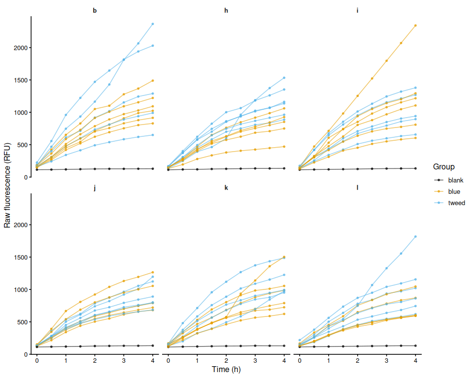<!-- -->

``` r
ggsave(file.path(fig_dir, "raw_fluor_by_plate.png"),
       p_raw_plates, width = 10, height = 8)
```

## 6.3 Mean raw fluorescence by family

``` r
raw_family_summary <- raw_df %>%
  group_by(family_id_group, treatment_group, time_hr) %>%
  summarise(
    mean_fluor = mean(value, na.rm = TRUE),
    se_fluor   = sd(value, na.rm = TRUE) /
      sqrt(sum(!is.na(value))),
    n          = sum(!is.na(value)),
    .groups    = "drop"
  )

p_raw_mean <- ggplot(raw_family_summary,
    aes(x = time_hr, y = mean_fluor,
        colour = family_id_group, linetype = treatment_group,
        group = interaction(family_id_group, treatment_group))) +
  geom_ribbon(aes(ymin = mean_fluor - se_fluor,
                  ymax = mean_fluor + se_fluor,
                  fill = family_id_group),
              alpha = 0.15, colour = NA) +
  geom_line(linewidth = 1) +
  geom_point(size = 2) +
  scale_colour_manual(values = fam_colours, name = "Family") +
  scale_fill_manual(values = fam_colours, name = "Family") +
  scale_linetype_manual(values = trt_linetypes, name = "Treatment") +
  labs(x = "Time (h)", y = "Mean raw fluorescence (RFU ± SE)") +
  theme_classic(base_size = 13)

p_raw_mean
```

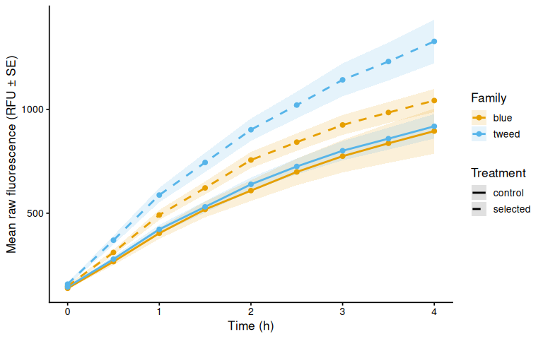<!-- -->

``` r
ggsave(file.path(fig_dir, "raw_mean_by_family.png"),
       p_raw_mean, width = 8, height = 5)
```

## 6.4 Individual raw fluorescence traces by family

``` r
p_raw_by_family <- raw_df %>%
  ggplot(aes(x = time_hr, y = value,
             group = trace_id, colour = treatment_group)) +
  geom_line(alpha = 0.6) +
  geom_point(size = 1.2, alpha = 0.7) +
  facet_wrap(~ family_id_group) +
  scale_colour_manual(values = trt_colours, name = "Treatment") +
  labs(x = "Time (h)", y = "Raw fluorescence (RFU)") +
  theme_classic(base_size = 12) +
  theme(strip.background = element_blank(),
        strip.text       = element_text(face = "bold"))

p_raw_by_family
```

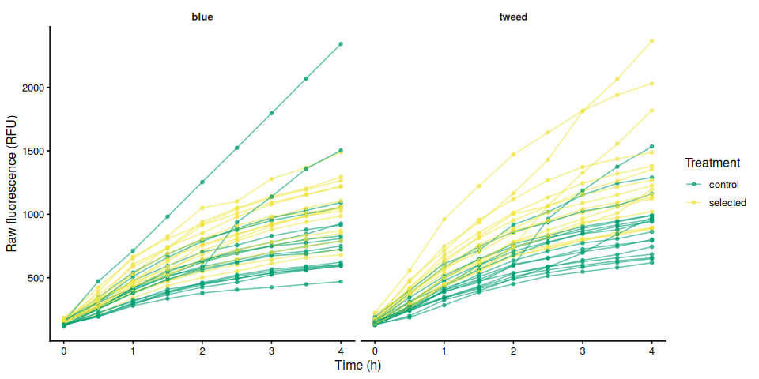<!-- -->

``` r
ggsave(file.path(fig_dir, "raw_individual_by_family.png"),
       p_raw_by_family, width = 10, height = 5)
```

## 6.5 Individual raw fluorescence traces by treatment

``` r
p_raw_by_treatment <- raw_df %>%
  ggplot(aes(x = time_hr, y = value,
             group = trace_id, colour = family_id_group)) +
  geom_line(alpha = 0.6) +
  geom_point(size = 1.2, alpha = 0.7) +
  facet_wrap(~ treatment_group) +
  scale_colour_manual(values = fam_colours, name = "Family") +
  labs(x = "Time (h)", y = "Raw fluorescence (RFU)") +
  theme_classic(base_size = 12) +
  theme(strip.background = element_blank(),
        strip.text       = element_text(face = "bold"))

p_raw_by_treatment
```

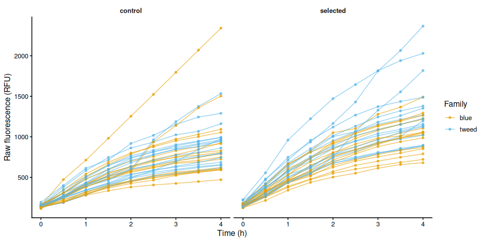<!-- -->

``` r
ggsave(file.path(fig_dir, "raw_individual_by_treatment.png"),
       p_raw_by_treatment, width = 10, height = 5)
```

## 6.6 Excluded samples

Wells flagged `exclude_from_analysis = TRUE` appear in the raw
fluorescence plots above but are omitted from all analyses that follow.

``` r
excluded_wells <- dat %>%
  filter(!is_blank, exclude_from_analysis) %>%
  mutate(
    sample = if_else(
      !is.na(sample_id_group) & trimws(as.character(sample_id_group)) != "",
      as.character(sample_id_group),
      paste(plate_id, well_id, sep = "_")
    )
  ) %>%
  select(plate_id, well_id, sample, family_id_group, treatment_group,
         any_of("exclude_reason")) %>%
  distinct() %>%
  arrange(plate_id, well_id)

if (nrow(excluded_wells) > 0) {
  col_names <- c("Plate", "Well", "Sample", "Family", "Treatment")
  if ("exclude_reason" %in% names(excluded_wells))
    col_names <- c(col_names, "Reason")
  cat(knitr::kable(excluded_wells, col.names = col_names), sep = "\n")
} else {
  cat("No wells are excluded from analysis.\n")
}
```

No wells are excluded from analysis.

# 7 Blank Correction via Fold-Change Normalization

Following Huffmyer et al.: fluorescence is first expressed as
fold-change relative to each well’s own T0 reading (applied to samples
and blanks alike), the mean fold-change of blank wells (per plate, per
timepoint) is then subtracted. All samples therefore start at exactly 0
at T0 by construction, eliminating the risk of negative starting values
from pipetting variance.

## 7.1 Step 1 – Fold-change relative to T0 for all wells

``` r
t0_all <- dat %>%
  filter(is.finite(time_hr), is.finite(value)) %>%
  group_by(plate_id, well_id) %>%
  slice_min(time_hr, n = 1, with_ties = FALSE) %>%
  select(plate_id, well_id, value_t0 = value) %>%
  ungroup()

dat_fc <- dat %>%
  left_join(t0_all, by = c("plate_id", "well_id")) %>%
  mutate(fold_change = if_else(
    is.finite(value_t0) & value_t0 > 0,
    value / value_t0,
    NA_real_
  ))

str(dat_fc)
```

    tibble [648 × 18] (S3: tbl_df/tbl/data.frame)
     $ row_id               : chr [1:648] "A" "A" "A" "A" ...
     $ col_id               : int [1:648] 1 2 3 4 1 2 3 4 1 2 ...
     $ well_id              : chr [1:648] "A1" "A2" "A3" "A4" ...
     $ value                : num [1:648] 178 183 192 149 224 149 161 164 114 178 ...
     $ plate_id             : chr [1:648] "b" "b" "b" "b" ...
     $ time_hr              : num [1:648] 0 0 0 0 0 0 0 0 0 0 ...
     $ is_blank             : logi [1:648] FALSE FALSE FALSE FALSE FALSE FALSE ...
     $ exclude_from_analysis: logi [1:648] FALSE FALSE FALSE FALSE FALSE FALSE ...
     $ exclude_reason       : chr [1:648] NA NA NA NA ...
     $ family_id_group      : chr [1:648] "tweed" "blue" "tweed" "blue" ...
     $ sample_id_group      : chr [1:648] "1" "2" "3" "4" ...
     $ treatment_group      : chr [1:648] "selected" "selected" "control" "control" ...
     $ width_mm_measurement : num [1:648] NA NA NA NA NA NA NA NA NA NA ...
     $ length_mm_measurement: num [1:648] NA NA NA NA NA NA NA NA NA NA ...
     $ weight_mg_measurement: num [1:648] NA NA NA NA NA NA NA NA NA NA ...
     $ area_mm2_measurement : num [1:648] 212 194 184 125 298 ...
     $ value_t0             : num [1:648] 178 183 192 149 224 149 161 164 114 178 ...
     $ fold_change          : num [1:648] 1 1 1 1 1 1 1 1 1 1 ...

## 7.2 Step 2 – Mean blank fold-change per plate per timepoint

``` r
blank_fc_ref <- dat_fc %>%
  filter(is_blank) %>%
  group_by(plate_id, time_hr) %>%
  summarise(mean_blank_fc = mean(fold_change, na.rm = TRUE),
            .groups = "drop")

str(blank_fc_ref)
```

    tibble [54 × 3] (S3: tbl_df/tbl/data.frame)
     $ plate_id     : chr [1:54] "b" "b" "b" "b" ...
     $ time_hr      : num [1:54] 0 0.5 1 1.5 2 2.5 3 3.5 4 0 ...
     $ mean_blank_fc: num [1:54] 1 1.01 1.04 1.07 1.1 ...

## 7.3 Step 3 – Subtract blank fold-change from sample fold-change

``` r
samples <- dat_fc %>%
  filter(!is_blank, !exclude_from_analysis) %>%
  mutate(
    trace_id = if_else(
      !is.na(sample_id_group) & trimws(as.character(sample_id_group)) != "",
      as.character(sample_id_group),
      paste(plate_id, well_id, sep = "_")
    )
  ) %>%
  left_join(blank_fc_ref, by = c("plate_id", "time_hr")) %>%
  mutate(corrected_fc = fold_change - mean_blank_fc)

str(samples)
```

    tibble [594 × 21] (S3: tbl_df/tbl/data.frame)
     $ row_id               : chr [1:594] "A" "A" "A" "A" ...
     $ col_id               : int [1:594] 1 2 3 4 1 2 3 4 2 3 ...
     $ well_id              : chr [1:594] "A1" "A2" "A3" "A4" ...
     $ value                : num [1:594] 178 183 192 149 224 149 161 164 178 164 ...
     $ plate_id             : chr [1:594] "b" "b" "b" "b" ...
     $ time_hr              : num [1:594] 0 0 0 0 0 0 0 0 0 0 ...
     $ is_blank             : logi [1:594] FALSE FALSE FALSE FALSE FALSE FALSE ...
     $ exclude_from_analysis: logi [1:594] FALSE FALSE FALSE FALSE FALSE FALSE ...
     $ exclude_reason       : chr [1:594] NA NA NA NA ...
     $ family_id_group      : chr [1:594] "tweed" "blue" "tweed" "blue" ...
     $ sample_id_group      : chr [1:594] "1" "2" "3" "4" ...
     $ treatment_group      : chr [1:594] "selected" "selected" "control" "control" ...
     $ width_mm_measurement : num [1:594] NA NA NA NA NA NA NA NA NA NA ...
     $ length_mm_measurement: num [1:594] NA NA NA NA NA NA NA NA NA NA ...
     $ weight_mg_measurement: num [1:594] NA NA NA NA NA NA NA NA NA NA ...
     $ area_mm2_measurement : num [1:594] 212 194 184 125 298 ...
     $ value_t0             : num [1:594] 178 183 192 149 224 149 161 164 178 164 ...
     $ fold_change          : num [1:594] 1 1 1 1 1 1 1 1 1 1 ...
     $ trace_id             : chr [1:594] "1" "2" "3" "4" ...
     $ mean_blank_fc        : num [1:594] 1 1 1 1 1 1 1 1 1 1 ...
     $ corrected_fc         : num [1:594] 0 0 0 0 0 0 0 0 0 0 ...

# 8 Blank-Corrected Fold-Change

## 8.1 Mean by family

``` r
bc_fc_summary <- samples %>%
  group_by(family_id_group, treatment_group, time_hr) %>%
  summarise(
    mean_val = mean(corrected_fc, na.rm = TRUE),
    se_val   = sd(corrected_fc, na.rm = TRUE) /
      sqrt(sum(!is.na(corrected_fc))),
    n        = sum(!is.na(corrected_fc)),
    .groups  = "drop"
  )

p_bc_fc_mean <- ggplot(bc_fc_summary,
    aes(x = time_hr, y = mean_val,
        colour = family_id_group, linetype = treatment_group,
        group = interaction(family_id_group, treatment_group))) +
  geom_ribbon(aes(ymin = mean_val - se_val,
                  ymax = mean_val + se_val,
                  fill = family_id_group),
              alpha = 0.15, colour = NA) +
  geom_line(linewidth = 1) +
  geom_point(size = 2) +
  scale_colour_manual(values = fam_colours, name = "Family") +
  scale_fill_manual(values = fam_colours, name = "Family") +
  scale_linetype_manual(values = trt_linetypes, name = "Treatment") +
  labs(x = "Time (h)",
       y = "Mean blank-corrected fold-change (± SE)") +
  theme_classic(base_size = 13)

p_bc_fc_mean
```

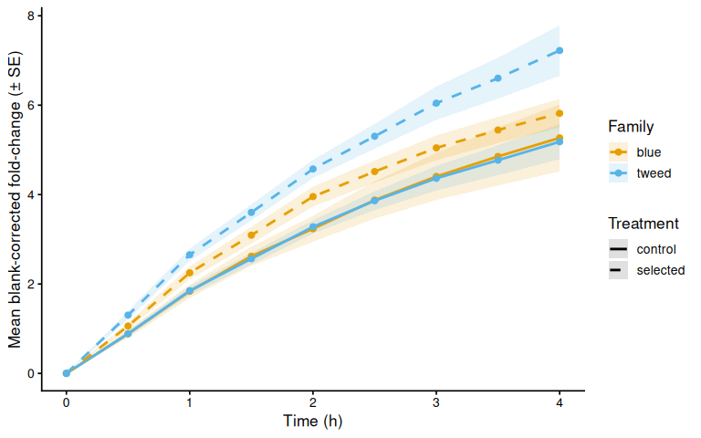<!-- -->

``` r
ggsave(file.path(fig_dir, "blank_corrected_fc_mean_by_family.png"),
       p_bc_fc_mean, width = 8, height = 5)
```

## 8.2 Individual traces by family

``` r
p_bc_fc_by_family <- samples %>%
  ggplot(aes(x = time_hr, y = corrected_fc,
             group = trace_id, colour = treatment_group)) +
  geom_line(alpha = 0.6) +
  geom_point(size = 1.2, alpha = 0.7) +
  facet_wrap(~ family_id_group) +
  scale_colour_manual(values = trt_colours, name = "Treatment") +
  labs(x = "Time (h)", y = "Blank-corrected fold-change") +
  theme_classic(base_size = 12) +
  theme(strip.background = element_blank(),
        strip.text       = element_text(face = "bold"))

p_bc_fc_by_family
```

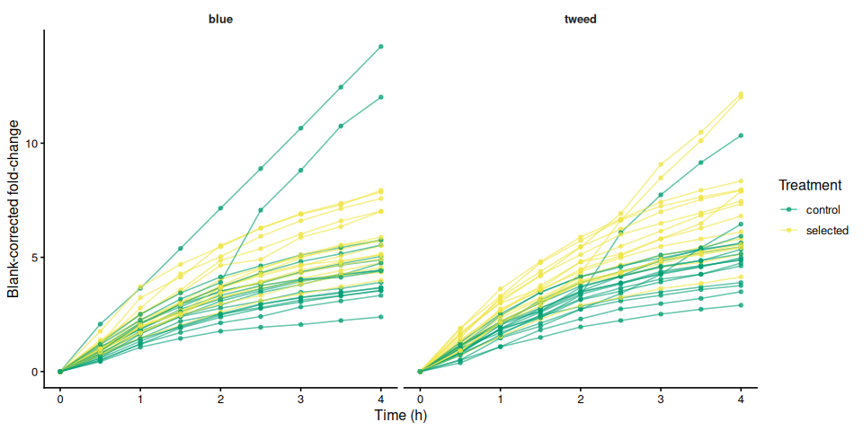<!-- -->

``` r
ggsave(file.path(fig_dir, "blank_corrected_fc_by_family.png"),
       p_bc_fc_by_family, width = 10, height = 5)
```

## 8.3 Individual blank-corrected fold-change traces by treatment

``` r
p_bc_fc_by_treatment <- samples %>%
  ggplot(aes(x = time_hr, y = corrected_fc,
             group = trace_id, colour = family_id_group)) +
  geom_line(alpha = 0.6) +
  geom_point(size = 1.2, alpha = 0.7) +
  facet_wrap(~ treatment_group) +
  scale_colour_manual(values = fam_colours, name = "Family") +
  labs(x = "Time (h)", y = "Blank-corrected fold-change") +
  theme_classic(base_size = 12) +
  theme(strip.background = element_blank(),
        strip.text       = element_text(face = "bold"))

p_bc_fc_by_treatment
```

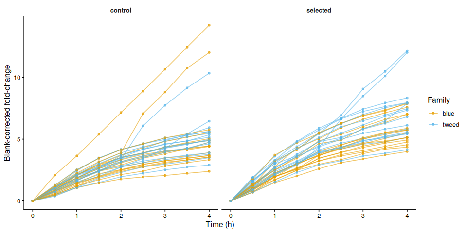<!-- -->

``` r
ggsave(file.path(fig_dir, "blank_corrected_fc_by_treatment.png"),
       p_bc_fc_by_treatment, width = 10, height = 5)
```

# 9 Metabolism (Size-Normalised Fold-Change)

Blank-corrected fold-change divided by each active measurement column.
This is “metabolism” as defined in Huffmyer et al.

``` r
if (length(active_meas_cols) == 0) {
  message("No active measurement columns: skipping metabolism calculation.")
  metabolism_df <- tibble()
} else {
  metabolism_df <- samples
  for (mc in active_meas_cols) {
    out_col <- paste0("metabolism_per_", mc)
    metabolism_df <- metabolism_df %>%
      mutate(!!out_col := if_else(
        is.finite(.data[[mc]]) & .data[[mc]] > 0 &
          is.finite(corrected_fc),
        corrected_fc / .data[[mc]],
        NA_real_
      ))
  }
}

str(metabolism_df)
```

    tibble [594 × 22] (S3: tbl_df/tbl/data.frame)
     $ row_id                             : chr [1:594] "A" "A" "A" "A" ...
     $ col_id                             : int [1:594] 1 2 3 4 1 2 3 4 2 3 ...
     $ well_id                            : chr [1:594] "A1" "A2" "A3" "A4" ...
     $ value                              : num [1:594] 178 183 192 149 224 149 161 164 178 164 ...
     $ plate_id                           : chr [1:594] "b" "b" "b" "b" ...
     $ time_hr                            : num [1:594] 0 0 0 0 0 0 0 0 0 0 ...
     $ is_blank                           : logi [1:594] FALSE FALSE FALSE FALSE FALSE FALSE ...
     $ exclude_from_analysis              : logi [1:594] FALSE FALSE FALSE FALSE FALSE FALSE ...
     $ exclude_reason                     : chr [1:594] NA NA NA NA ...
     $ family_id_group                    : chr [1:594] "tweed" "blue" "tweed" "blue" ...
     $ sample_id_group                    : chr [1:594] "1" "2" "3" "4" ...
     $ treatment_group                    : chr [1:594] "selected" "selected" "control" "control" ...
     $ width_mm_measurement               : num [1:594] NA NA NA NA NA NA NA NA NA NA ...
     $ length_mm_measurement              : num [1:594] NA NA NA NA NA NA NA NA NA NA ...
     $ weight_mg_measurement              : num [1:594] NA NA NA NA NA NA NA NA NA NA ...
     $ area_mm2_measurement               : num [1:594] 212 194 184 125 298 ...
     $ value_t0                           : num [1:594] 178 183 192 149 224 149 161 164 178 164 ...
     $ fold_change                        : num [1:594] 1 1 1 1 1 1 1 1 1 1 ...
     $ trace_id                           : chr [1:594] "1" "2" "3" "4" ...
     $ mean_blank_fc                      : num [1:594] 1 1 1 1 1 1 1 1 1 1 ...
     $ corrected_fc                       : num [1:594] 0 0 0 0 0 0 0 0 0 0 ...
     $ metabolism_per_area_mm2_measurement: num [1:594] 0 0 0 0 0 0 0 0 0 0 ...

## 9.1 Mean metabolism by family

``` r
if (nrow(metabolism_df) > 0) {

  metab_cols <- paste0("metabolism_per_", active_meas_cols)

  for (col in metab_cols) {
    if (!col %in% names(metabolism_df)) next
    mc_label <- str_remove(col, "^metabolism_per_")

    metab_summary <- metabolism_df %>%
      group_by(family_id_group, treatment_group, time_hr) %>%
      summarise(
        mean_val = mean(.data[[col]], na.rm = TRUE),
        se_val   = sd(.data[[col]], na.rm = TRUE) /
          sqrt(sum(!is.na(.data[[col]]))),
        .groups  = "drop"
      )

    p_metab_mean <- ggplot(metab_summary,
        aes(x = time_hr, y = mean_val,
            colour = family_id_group, linetype = treatment_group,
            group = interaction(family_id_group, treatment_group))) +
      geom_ribbon(aes(ymin = mean_val - se_val,
                      ymax = mean_val + se_val,
                      fill = family_id_group),
                  alpha = 0.15, colour = NA) +
      geom_line(linewidth = 1) +
      geom_point(size = 2) +
      scale_colour_manual(values = fam_colours, name = "Family") +
      scale_fill_manual(values = fam_colours, name = "Family") +
      scale_linetype_manual(values = trt_linetypes, name = "Treatment") +
      labs(x = "Time (h)",
           y = paste0(metabolism_y_label(col), " (± SE)")) +
      theme_classic(base_size = 13)

    print(p_metab_mean)
    ggsave(
      file.path(fig_dir,
                paste0("metabolism_mean_", mc_label, ".png")),
      p_metab_mean, width = 8, height = 5)
  }
}
```

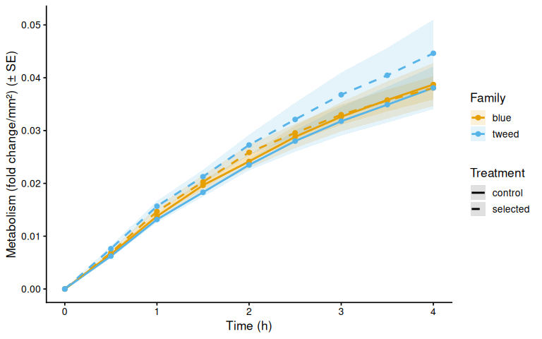<!-- -->

## 9.2 Individual metabolism traces by family

``` r
if (nrow(metabolism_df) > 0) {

  for (col in metab_cols) {
    if (!col %in% names(metabolism_df)) next
    mc_label <- str_remove(col, "^metabolism_per_")

    p_metab_by_family <- ggplot(metabolism_df,
        aes(x = time_hr, y = .data[[col]],
            group = trace_id, colour = treatment_group)) +
      geom_line(alpha = 0.6) +
      geom_point(size = 1.2, alpha = 0.7) +
      facet_wrap(~ family_id_group) +
      scale_colour_manual(values = trt_colours, name = "Treatment") +
      labs(x = "Time (h)", y = metabolism_y_label(col)) +
      theme_classic(base_size = 12) +
      theme(strip.background = element_blank(),
            strip.text       = element_text(face = "bold"))

    print(p_metab_by_family)
    ggsave(
      file.path(fig_dir,
                paste0("metabolism_individual_", mc_label, "_by_family.png")),
      p_metab_by_family, width = 10, height = 5)

    p_metab_by_treatment <- ggplot(metabolism_df,
        aes(x = time_hr, y = .data[[col]],
            group = trace_id, colour = family_id_group)) +
      geom_line(alpha = 0.6) +
      geom_point(size = 1.2, alpha = 0.7) +
      facet_wrap(~ treatment_group) +
      scale_colour_manual(values = fam_colours, name = "Family") +
      labs(x = "Time (h)", y = metabolism_y_label(col)) +
      theme_classic(base_size = 12) +
      theme(strip.background = element_blank(),
            strip.text       = element_text(face = "bold"))

    print(p_metab_by_treatment)
    ggsave(
      file.path(fig_dir,
                paste0("metabolism_individual_", mc_label, "_by_treatment.png")),
      p_metab_by_treatment, width = 10, height = 5)
  }
}
```

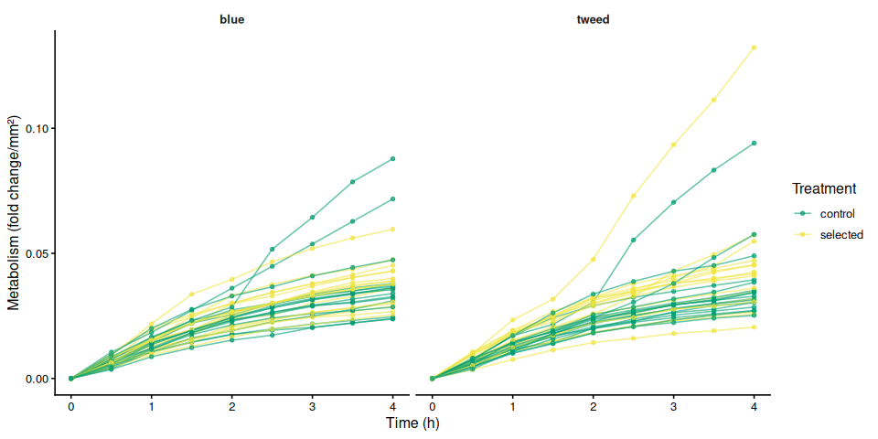<!-- -->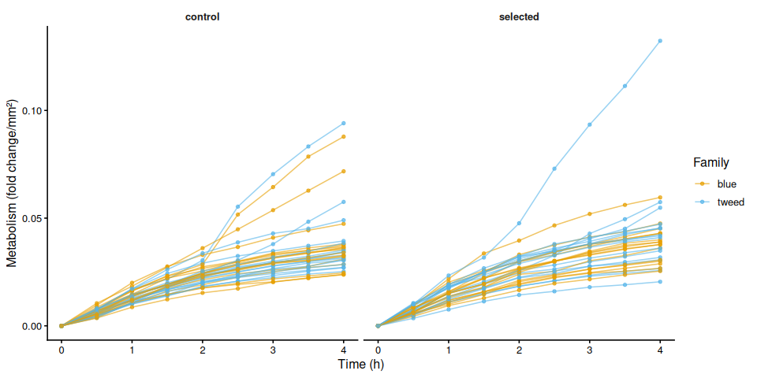<!-- -->

# 10 Time-Series Statistical Analysis

Linear mixed effects models test the effect of experimental variables on
metabolism over time. Individual (`sample_id_group`) is included as a
random intercept to account for repeated measures across timepoints.
Type III ANOVA with Satterthwaite’s approximation (lmerTest) assesses
significance; post-hoc pairwise comparisons use estimated marginal means
(emmeans, Tukey adjustment).

``` r
run_ts_stats <- function(df, value_col) {
  has_family    <- "family_id_group" %in% names(df) &&
    length(unique(na.omit(df$family_id_group))) > 1
  has_treatment <- "treatment_group" %in% names(df) &&
    length(unique(na.omit(df$treatment_group))) > 1

  if (!has_family && !has_treatment) return(NULL)

  df <- df %>%
    filter(is.finite(.data[[value_col]]), is.finite(time_hr)) %>%
    mutate(
      time_f     = factor(time_hr),
      individual = factor(trace_id)
    )

  if (nrow(df) == 0) return(NULL)

  if (has_family)    df <- df %>% mutate(family    = factor(family_id_group))
  if (has_treatment) df <- df %>% mutate(treatment = factor(treatment_group))

  if (has_family    && length(unique(na.omit(df$family)))    < 2) return(NULL)
  if (has_treatment && length(unique(na.omit(df$treatment))) < 2) return(NULL)

  fixed <- if (has_family && has_treatment)
    paste0(value_col, " ~ time_f * family * treatment")
  else if (has_family)
    paste0(value_col, " ~ time_f * family")
  else
    paste0(value_col, " ~ time_f * treatment")

  model <- lmer(
    as.formula(paste0(fixed, " + (1 | individual)")),
    data = df
  )

  anova_res <- anova(model, type = 3, ddf = "Satterthwaite")

  # Pairwise comparisons of group combinations at each timepoint
  emm_spec <- if (has_family && has_treatment)
    ~ family * treatment | time_f
  else if (has_family)
    ~ family | time_f
  else
    ~ treatment | time_f

  emm       <- emmeans(model, emm_spec)
  pairs_res <- as.data.frame(pairs(emm, adjust = "tukey"))

  # Main-effect marginal means (collapsed across time)
  emm_main <- if (has_family && has_treatment)
    emmeans(model, ~ family * treatment)
  else if (has_family)
    emmeans(model, ~ family)
  else
    emmeans(model, ~ treatment)

  pairs_main <- as.data.frame(pairs(emm_main, adjust = "tukey"))

  list(
    model         = model,
    anova         = anova_res,
    pairs_by_time = pairs_res,
    pairs_main    = pairs_main,
    has_family    = has_family,
    has_treatment = has_treatment
  )
}

ts_stats <- list()
if (nrow(metabolism_df) > 0) {
  for (mc in active_meas_cols) {
    col <- paste0("metabolism_per_", mc)
    if (col %in% names(metabolism_df))
      ts_stats[[col]] <- run_ts_stats(metabolism_df, col)
  }
}
```

## 10.1 Results

``` r
for (col in names(ts_stats)) {
  res <- ts_stats[[col]]
  if (is.null(res)) next

  cat("\n\n----\n### Metric:", col, "\n\n")

  cat("**Type III ANOVA (Satterthwaite approximation):**\n")
  print(res$anova)

  cat("\n**Marginal means – main effects (collapsed across time):**\n")
  print(res$pairs_main)

  cat("\n**Pairwise comparisons by timepoint (Tukey):**\n")
  print(res$pairs_by_time)
}
```

| \### Metric: metabolism_per_area_mm2_measurement |
|:---|
| Signif. codes: 0 ‘***’ 0.001 ’**’ 0.01 ’*’ 0.05 ‘.’ 0.1 ’ ’ 1 |
| **Marginal means – main effects (collapsed across time):** contrast estimate SE df t.ratio p.value blue control - tweed control 0.000680895 0.002543685 62 0.268 0.9932 blue control - blue selected -0.000437304 0.002583124 62 -0.169 0.9983 blue control - tweed selected -0.002860697 0.002583124 62 -1.107 0.6863 tweed control - blue selected -0.001118199 0.002583124 62 -0.433 0.9726 tweed control - tweed selected -0.003541592 0.002583124 62 -1.371 0.5221 blue selected - tweed selected -0.002423393 0.002621970 62 -0.924 0.7920 |
| Results are averaged over the levels of: time_f Degrees-of-freedom method: kenward-roger P value adjustment: tukey method for comparing a family of 4 estimates |
| **Pairwise comparisons by timepoint (Tukey):** time_f = 0: contrast estimate SE df t.ratio p.value blue control - tweed control 0.000000000 0.003339923 172.95 0.000 1.0000 blue control - blue selected 0.000000000 0.003391708 172.95 0.000 1.0000 blue control - tweed selected 0.000000000 0.003391708 172.95 0.000 1.0000 tweed control - blue selected 0.000000000 0.003391708 172.95 0.000 1.0000 tweed control - tweed selected 0.000000000 0.003391708 172.95 0.000 1.0000 blue selected - tweed selected 0.000000000 0.003442714 172.95 0.000 1.0000 |
| time_f = 0.5: contrast estimate SE df t.ratio p.value blue control - tweed control 0.000344532 0.003339923 172.95 0.103 0.9996 blue control - blue selected -0.000290340 0.003391708 172.95 -0.086 0.9998 blue control - tweed selected -0.001054881 0.003391708 172.95 -0.311 0.9895 tweed control - blue selected -0.000634871 0.003391708 172.95 -0.187 0.9977 tweed control - tweed selected -0.001399413 0.003391708 172.95 -0.413 0.9762 blue selected - tweed selected -0.000764541 0.003442714 172.95 -0.222 0.9961 |
| time_f = 1: contrast estimate SE df t.ratio p.value blue control - tweed control 0.000605307 0.003339923 172.95 0.181 0.9979 blue control - blue selected -0.000917146 0.003391708 172.95 -0.270 0.9931 blue control - tweed selected -0.001910684 0.003391708 172.95 -0.563 0.9428 tweed control - blue selected -0.001522453 0.003391708 172.95 -0.449 0.9698 tweed control - tweed selected -0.002515992 0.003391708 172.95 -0.742 0.8800 blue selected - tweed selected -0.000993538 0.003442714 172.95 -0.289 0.9916 |
| time_f = 1.5: contrast estimate SE df t.ratio p.value blue control - tweed control 0.001339686 0.003339923 172.95 0.401 0.9781 blue control - blue selected -0.000638811 0.003391708 172.95 -0.188 0.9976 blue control - tweed selected -0.001623578 0.003391708 172.95 -0.479 0.9637 tweed control - blue selected -0.001978497 0.003391708 172.95 -0.583 0.9370 tweed control - tweed selected -0.002963264 0.003391708 172.95 -0.874 0.8185 blue selected - tweed selected -0.000984767 0.003442714 172.95 -0.286 0.9918 |
| time_f = 2: contrast estimate SE df t.ratio p.value blue control - tweed control 0.000658167 0.003339923 172.95 0.197 0.9973 blue control - blue selected -0.001709140 0.003391708 172.95 -0.504 0.9581 blue control - tweed selected -0.003119752 0.003391708 172.95 -0.920 0.7943 tweed control - blue selected -0.002367307 0.003391708 172.95 -0.698 0.8977 tweed control - tweed selected -0.003777919 0.003391708 172.95 -1.114 0.6815 blue selected - tweed selected -0.001410612 0.003442714 172.95 -0.410 0.9767 |
| time_f = 2.5: contrast estimate SE df t.ratio p.value blue control - tweed control 0.000808764 0.003339923 172.95 0.242 0.9950 blue control - blue selected -0.000739850 0.003391708 172.95 -0.218 0.9963 blue control - tweed selected -0.003282586 0.003391708 172.95 -0.968 0.7679 tweed control - blue selected -0.001548615 0.003391708 172.95 -0.457 0.9683 tweed control - tweed selected -0.004091351 0.003391708 172.95 -1.206 0.6237 blue selected - tweed selected -0.002542736 0.003442714 172.95 -0.739 0.8814 |
| time_f = 3: contrast estimate SE df t.ratio p.value blue control - tweed control 0.000848650 0.003339923 172.95 0.254 0.9942 blue control - blue selected -0.000388090 0.003391708 172.95 -0.114 0.9995 blue control - tweed selected -0.004165918 0.003391708 172.95 -1.228 0.6098 tweed control - blue selected -0.001236740 0.003391708 172.95 -0.365 0.9834 tweed control - tweed selected -0.005014568 0.003391708 172.95 -1.478 0.4527 blue selected - tweed selected -0.003777828 0.003442714 172.95 -1.097 0.6916 |
| time_f = 3.5: contrast estimate SE df t.ratio p.value blue control - tweed control 0.000889021 0.003339923 172.95 0.266 0.9934 blue control - blue selected 0.000115348 0.003391708 172.95 0.034 1.0000 blue control - tweed selected -0.004672041 0.003391708 172.95 -1.377 0.5152 tweed control - blue selected -0.000773674 0.003391708 172.95 -0.228 0.9958 tweed control - tweed selected -0.005561063 0.003391708 172.95 -1.640 0.3592 blue selected - tweed selected -0.004787389 0.003442714 172.95 -1.391 0.5069 |
| time_f = 4: contrast estimate SE df t.ratio p.value blue control - tweed control 0.000633928 0.003339923 172.95 0.190 0.9976 blue control - blue selected 0.000632290 0.003391708 172.95 0.186 0.9977 blue control - tweed selected -0.005916831 0.003391708 172.95 -1.744 0.3040 tweed control - blue selected -0.000001638 0.003391708 172.95 0.000 1.0000 tweed control - tweed selected -0.006550759 0.003391708 172.95 -1.931 0.2188 blue selected - tweed selected -0.006549121 0.003442714 172.95 -1.902 0.2309 |
| Degrees-of-freedom method: kenward-roger P value adjustment: tukey method for comparing a family of 4 estimates |
| \# Area Under the Curve (AUC) |
| AUC computed per individual via the trapezoid rule across all timepoints. `metabolism_per_*` is the primary metric matching the paper; `corrected_fc` and `raw_fluorescence` are retained for reference. |
| \`\`\` r compute_auc \<- function(df, value_col, group_vars) { df %\>% filter(is.finite(time_hr), is.finite(.data$$\[value_col$$\])) %\>% group_by(across(all_of(group_vars))) %\>% summarise( AUC = trapezoid_auc(time_hr, .data$$\[value_col$$\]), n_timepoints = n(), .groups = “drop” ) %\>% filter(is.finite(AUC)) } |
| \# Only include grouping columns that are actually present in the data individual_vars \<- intersect( c(“trace_id”, “family_id_group”, “treatment_group”), names(metabolism_df) ) |
| auc_metab_list \<- list() if (nrow(metabolism_df) \> 0) { for (mc in active_meas_cols) { col \<- paste0(“metabolism_per\_”, mc) if (col %in% names(metabolism_df)) { auc_metab_list$$\[col$$\] \<- compute_auc(metabolism_df, col, individual_vars) %\>% mutate(metric = col) } } } |
| auc_all \<- bind_rows(auc_metab_list) |
| str(auc_all) \`\`\` |
| `tibble [66 × 6] (S3: tbl_df/tbl/data.frame) $ trace_id       : chr [1:66] "1" "10" "11" "12" ... $ family_id_group: chr [1:66] "tweed" "blue" "tweed" "blue" ... $ treatment_group: chr [1:66] "selected" "selected" "control" "control" ... $ AUC            : num [1:66] 0.1109 0.0737 0.0778 0.0963 0.1092 ... $ n_timepoints   : int [1:66] 9 9 9 9 9 9 9 9 9 9 ... $ metric         : chr [1:66] "metabolism_per_area_mm2_measurement" "metabolism_per_area_mm2_measurement" "metabolism_per_area_mm2_measurement" "metabolism_per_area_mm2_measurement" ...` |
| \## AUC summary tables |
| \`\`\` r sum_vars \<- intersect( c(“metric”, “family_id_group”, “treatment_group”), names(auc_all) ) auc_summary \<- auc_all %\>% group_by(across(all_of(sum_vars))) %\>% summarise( n = n(), mean = mean(AUC, na.rm = TRUE), sd = sd(AUC, na.rm = TRUE), se = sd / sqrt(n), median = median(AUC, na.rm = TRUE), .groups = “drop” ) |
| print(auc_summary) \`\`\` |
| `# A tibble: 4 × 8 metric      family_id_group treatment_group     n   mean     sd      se median <chr>       <chr>           <chr>           <int>  <dbl>  <dbl>   <dbl>  <dbl> 1 metabolism… blue            control            17 0.0904 0.0275 0.00667 0.0870 2 metabolism… blue            selected           16 0.0925 0.0212 0.00531 0.0936 3 metabolism… tweed           control            17 0.0875 0.0248 0.00601 0.0801 4 metabolism… tweed           selected           16 0.102  0.0396 0.00991 0.106` |
| \# Statistical Analysis |
| Each individual clam (`sample_id_group`) is the observational unit. The model is built from whichever grouping factors are present: both family and treatment (with interaction) when both exist, or a one-way model when only one factor is available. Each plate maps to a unique family × treatment combination, so plate-level and group-level variance are confounded; interpret accordingly. |
| \`\`\` r run_auc_stats \<- function(auc_df) { empty \<- tibble() |
| has_family \<- “family_id_group” %in% names(auc_df) && length(unique(na.omit(auc_df$family_id_group))) > 1
has_treatment <- "treatment_group" %in% names(auc_df) &&
length(unique(na.omit(auc_df$treatment_group))) \> 1 |
| if (!has_family && !has_treatment) { return(list(model = NULL, anova = NULL, pairs_full = empty, pairs_family = empty, pairs_trt = empty, has_family = FALSE, has_treatment = FALSE)) } |
| if (has_family) auc_df \<- auc_df %\>% mutate(family = factor(family_id_group)) if (has_treatment) auc_df \<- auc_df %\>% mutate(treatment = factor(treatment_group)) |
| formula_str \<- if (has_family && has_treatment) “AUC ~ family \* treatment” else if (has_family) “AUC ~ family” else “AUC ~ treatment” model \<- lm(as.formula(formula_str), data = auc_df) anova_res \<- anova(model) |
| if (has_family && has_treatment) { pairs_full \<- as.data.frame(pairs(emmeans(model, ~ family \* treatment), adjust = “tukey”)) pairs_family \<- as.data.frame(pairs(emmeans(model, ~ family), adjust = “tukey”)) pairs_trt \<- as.data.frame(pairs(emmeans(model, ~ treatment), adjust = “tukey”)) } else if (has_family) { pairs_family \<- as.data.frame(pairs(emmeans(model, ~ family), adjust = “tukey”)) pairs_full \<- pairs_family pairs_trt \<- empty } else { pairs_trt \<- as.data.frame(pairs(emmeans(model, ~ treatment), adjust = “tukey”)) pairs_full \<- pairs_trt pairs_family \<- empty } |
| list( model = model, anova = anova_res, pairs_full = pairs_full, pairs_family = pairs_family, pairs_trt = pairs_trt, has_family = has_family, has_treatment = has_treatment ) } |
| metrics_to_test \<- unique(auc_all\$metric) stats_results \<- map( set_names(metrics_to_test), ~ run_auc_stats(auc_all %\>% filter(metric == .x)) ) \`\`\` |
| \## Results by metric |
| `r for (met in metrics_to_test) { stats <- stats_results[[met]] cat("\n\n----\n### Metric:", met, "\n\n") cat("**ANOVA:**\n") print(stats$anova) if (stats$has_family && stats$has_treatment) { cat("\n**Pairwise: family × treatment (Tukey):**\n") print(stats$pairs_full) cat("\n**Pairwise: family main effect:**\n") print(stats$pairs_family) cat("\n**Pairwise: treatment main effect:**\n") print(stats$pairs_trt) } else if (stats$has_family) { cat("\n**Pairwise: family (Tukey):**\n") print(stats$pairs_family) } else if (stats$has_treatment) { cat("\n**Pairwise: treatment (Tukey):**\n") print(stats$pairs_trt) } }` |

### 10.1.1 Metric: metabolism_per_area_mm2_measurement

**ANOVA:** Analysis of Variance Table

Response: AUC Df Sum Sq Mean Sq F value Pr(\>F) family 1 0.000148
0.00014818 0.1758 0.6764 treatment 1 0.001112 0.00111188 1.3194 0.2551
family:treatment 1 0.000611 0.00061074 0.7247 0.3979 Residuals 62
0.052248 0.00084271

**Pairwise: family × treatment (Tukey):** contrast estimate SE df
t.ratio p.value blue control - tweed control 0.002905546 0.009957039 62
0.292 0.9913 blue control - blue selected -0.002125942 0.010111421 62
-0.210 0.9967 blue control - tweed selected -0.011393928 0.010111421 62
-1.127 0.6745 tweed control - blue selected -0.005031488 0.010111421 62
-0.498 0.9593 tweed control - tweed selected -0.014299474 0.010111421 62
-1.414 0.4954 blue selected - tweed selected -0.009267986 0.010263481 62
-0.903 0.8033

P value adjustment: tukey method for comparing a family of 4 estimates

**Pairwise: family main effect:** contrast estimate SE df t.ratio
p.value blue - tweed -0.00318122 0.007149854 62 -0.445 0.6579

Results are averaged over the levels of: treatment

**Pairwise: treatment main effect:** contrast estimate SE df t.ratio
p.value control - selected -0.008212708 0.007149854 62 -1.149 0.2551

Results are averaged over the levels of: family

# 11 AUC Box Plots with Statistical Annotations

Significance labels: `***` p \< 0.001, `**` p \< 0.01, `*` p \< 0.05.
Brackets are drawn only for significant pairs (p \< 0.05). Plots are
generated for whichever grouping factors are present: treatment-only,
family-only, all-groups, within-family, and within-treatment.

``` r
sig_label <- function(p) {
  case_when(p < 0.001 ~ "***", p < 0.01 ~ "**", p < 0.05 ~ "*",
            TRUE ~ "ns")
}

# Add significance brackets to an existing ggplot.
# pairs_df   : data frame with $contrast and $p.value columns
# group_levels: ordered character vector matching x-axis factor levels
# y_vals     : numeric vector of AUC values used to set bracket heights
add_sig_brackets <- function(p, pairs_df, group_levels, y_vals) {
  sig_pairs <- pairs_df %>%
    mutate(label = sig_label(p.value)) %>%
    filter(label != "ns")
  if (nrow(sig_pairs) == 0) return(p)

  y_max   <- max(y_vals, na.rm = TRUE)
  y_range <- diff(range(y_vals, na.rm = TRUE))
  step    <- y_range * 0.12

  for (i in seq_len(nrow(sig_pairs))) {
    parts <- str_split(as.character(sig_pairs$contrast[i]), " - ", 2)[[1]]
    g1 <- trimws(parts[1])
    g2 <- trimws(parts[2])
    x1 <- match(g1, group_levels)
    x2 <- match(g2, group_levels)
    if (is.na(x1) || is.na(x2)) next
    bar_y <- y_max + i * step
    p <- p +
      annotate("segment", x = x1, xend = x2,
               y = bar_y, yend = bar_y,
               colour = "black", linewidth = 0.6) +
      annotate("segment", x = x1, xend = x1,
               y = bar_y, yend = bar_y - step * 0.3,
               colour = "black", linewidth = 0.6) +
      annotate("segment", x = x2, xend = x2,
               y = bar_y, yend = bar_y - step * 0.3,
               colour = "black", linewidth = 0.6) +
      annotate("text", x = (x1 + x2) / 2,
               y = bar_y + step * 0.15,
               label = sig_pairs$label[i], size = 4.5)
  }
  p
}
```

``` r
for (met in metrics_to_test) {
  df      <- auc_all %>% filter(metric == met)
  stats   <- stats_results[[met]]
  y_lab   <- auc_y_label(met)
  has_fam <- stats$has_family
  has_trt <- stats$has_treatment

  # ── Treatment main effect (x = treatment, tick = treatment name) ───────
  if (has_trt) {
    df_p <- df %>%
      mutate(x = factor(treatment_group, levels = sort(unique(treatment_group))))
    grps <- levels(df_p$x)
    p <- ggplot(df_p, aes(x = x, y = AUC, fill = x)) +
      geom_boxplot(alpha = 0.6, outlier.shape = NA) +
      geom_jitter(width = 0.15, alpha = 0.4, size = 1.5) +
      scale_fill_manual(values = trt_colours[grps], guide = "none") +
      labs(x = "Treatment", y = y_lab) +
      theme_classic(base_size = 13)
    p <- add_sig_brackets(p, stats$pairs_trt, grps, df_p$AUC)
    print(p)
    ggsave(file.path(fig_dir, paste0("auc_treatment_", met, ".png")),
           p, width = 5, height = 5)
  }

  # ── Family main effect (x = family, tick = family name) ───────────────
  if (has_fam) {
    df_p <- df %>%
      mutate(x = factor(family_id_group, levels = sort(unique(family_id_group))))
    grps <- levels(df_p$x)
    p <- ggplot(df_p, aes(x = x, y = AUC, fill = x)) +
      geom_boxplot(alpha = 0.6, outlier.shape = NA) +
      geom_jitter(width = 0.15, alpha = 0.4, size = 1.5) +
      scale_fill_manual(values = fam_colours[grps], guide = "none") +
      labs(x = "Family", y = y_lab) +
      theme_classic(base_size = 13)
    p <- add_sig_brackets(p, stats$pairs_family, grps, df_p$AUC)
    print(p)
    ggsave(file.path(fig_dir, paste0("auc_family_", met, ".png")),
           p, width = 5, height = 5)
  }

  # Remaining plots require both factors
  if (!has_fam || !has_trt) next

  # ── All family:treatment groups (x = family:treatment) ─────────────────
  # emmeans contrasts use spaces; convert to colon to match tick labels
  pairs_fc <- stats$pairs_full %>%
    mutate(contrast = str_replace_all(
      contrast,
      "([a-z]+) ([a-z]+)( - )([a-z]+) ([a-z]+)",
      "\\1:\\2\\3\\4:\\5"
    ))
  df_p <- df %>%
    mutate(x = factor(
      paste(family_id_group, treatment_group, sep = ":"),
      levels = sort(unique(paste(family_id_group, treatment_group, sep = ":")))
    ))
  grps     <- levels(df_p$x)
  fill_map <- setNames(make_palette(length(grps)), grps)
  p <- ggplot(df_p, aes(x = x, y = AUC, fill = x)) +
    geom_boxplot(alpha = 0.6, outlier.shape = NA) +
    geom_jitter(width = 0.15, alpha = 0.4, size = 1.5) +
    scale_fill_manual(values = fill_map, guide = "none") +
    labs(x = "Family : Treatment", y = y_lab) +
    theme_classic(base_size = 13) +
    theme(axis.text.x = element_text(angle = 20, hjust = 1))
  p <- add_sig_brackets(p, pairs_fc, grps, df_p$AUC)
  print(p)
  ggsave(file.path(fig_dir, paste0("auc_all_groups_", met, ".png")),
         p, width = 6, height = 5)

  # ── Within each family: treatment comparison (x = family:treatment) ────
  # Tick labels are family:treatment so these plots are visually distinct
  # from the treatment main-effect plot above.
  for (fam in sort(unique(df$family_id_group))) {
    df_p <- df %>%
      filter(family_id_group == fam) %>%
      mutate(x = factor(
        paste(family_id_group, treatment_group, sep = ":"),
        levels = sort(unique(paste(family_id_group, treatment_group, sep = ":")))
      ))
    grps     <- levels(df_p$x)
    pairs_sub <- pairs_fc %>%
      filter(str_count(contrast, paste0(fam, ":")) == 2)
    p <- ggplot(df_p, aes(x = x, y = AUC, fill = x)) +
      geom_boxplot(alpha = 0.6, outlier.shape = NA) +
      geom_jitter(width = 0.15, alpha = 0.4, size = 1.5) +
      scale_fill_manual(values = fill_map[grps], guide = "none") +
      labs(x = "Family : Treatment", y = y_lab) +
      theme_classic(base_size = 13)
    p <- add_sig_brackets(p, pairs_sub, grps, df_p$AUC)
    print(p)
    ggsave(file.path(fig_dir, paste0("auc_", fam, "_trt_", met, ".png")),
           p, width = 5, height = 5)
  }

  # ── Within each treatment: family comparison (x = family:treatment) ────
  # Tick labels are family:treatment so these plots are visually distinct
  # from the family main-effect plot above.
  for (trt in sort(unique(df$treatment_group))) {
    df_p <- df %>%
      filter(treatment_group == trt) %>%
      mutate(x = factor(
        paste(family_id_group, treatment_group, sep = ":"),
        levels = sort(unique(paste(family_id_group, treatment_group, sep = ":")))
      ))
    grps      <- levels(df_p$x)
    pairs_sub <- pairs_fc %>%
      filter(str_count(contrast, paste0(":", trt)) == 2)
    p <- ggplot(df_p, aes(x = x, y = AUC, fill = x)) +
      geom_boxplot(alpha = 0.6, outlier.shape = NA) +
      geom_jitter(width = 0.15, alpha = 0.4, size = 1.5) +
      scale_fill_manual(values = fill_map[grps], guide = "none") +
      labs(x = "Family : Treatment", y = y_lab) +
      theme_classic(base_size = 13)
    p <- add_sig_brackets(p, pairs_sub, grps, df_p$AUC)
    print(p)
    ggsave(file.path(fig_dir, paste0("auc_", trt, "_fam_", met, ".png")),
           p, width = 5, height = 5)
  }
}
```

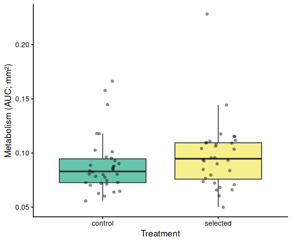<!-- -->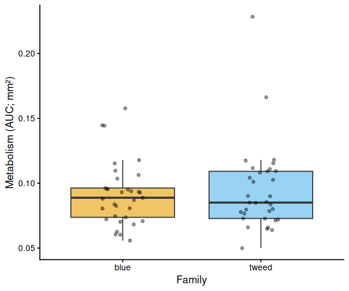<!-- -->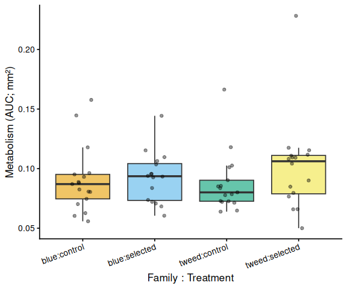<!-- -->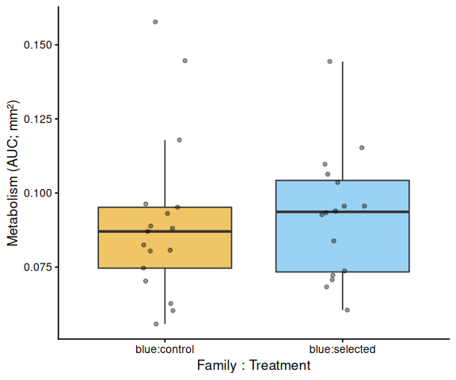<!-- -->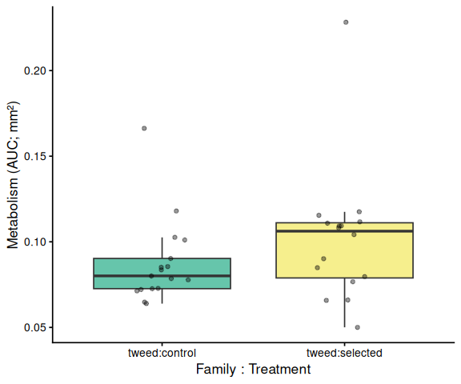<!-- -->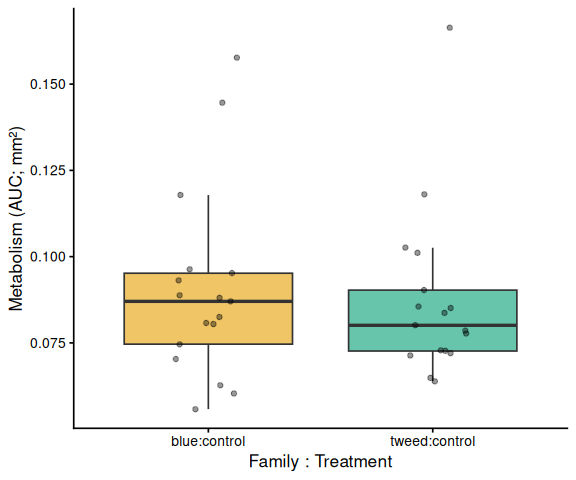<!-- -->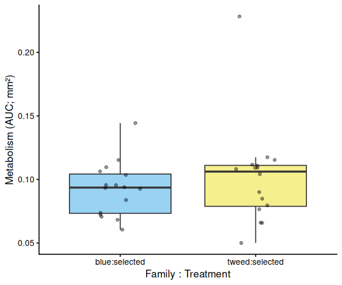<!-- -->

# 12 Save Output Data

``` r
write_csv(auc_all,      file.path(out_dir, "auc_all_metrics.csv"))
write_csv(auc_summary,  file.path(out_dir, "auc_summary.csv"))

if (nrow(metabolism_df) > 0)
  write_csv(metabolism_df,
            file.path(out_dir, "metabolism.csv"))

stats_compiled <- map_dfr(metrics_to_test, function(met) {
  bind_rows(
    stats_results[[met]]$pairs_full %>%
      mutate(comparison = "family:treatment"),
    stats_results[[met]]$pairs_family %>%
      mutate(comparison = "family"),
    stats_results[[met]]$pairs_trt %>%
      mutate(comparison = "treatment")
  ) %>% mutate(metric = met)
})

write_csv(stats_compiled,
          file.path(out_dir, "pairwise_stats.csv"))

message("Output files written to: ", out_dir)
```