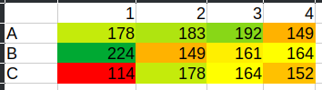
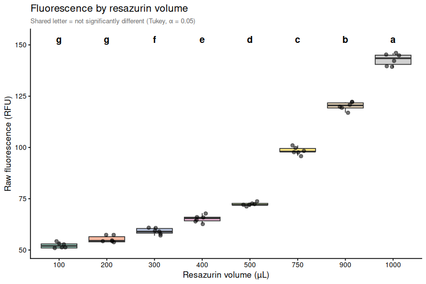
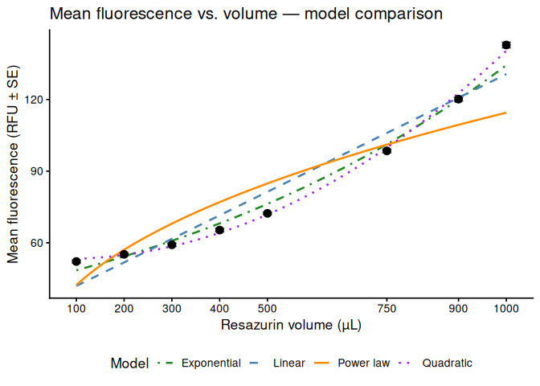
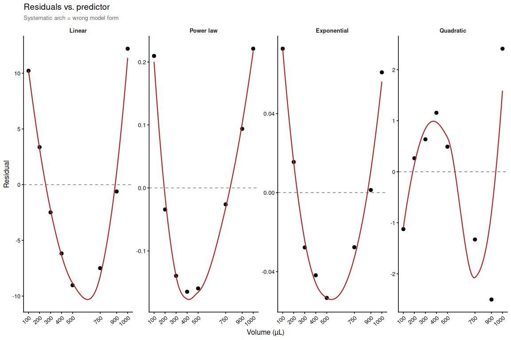
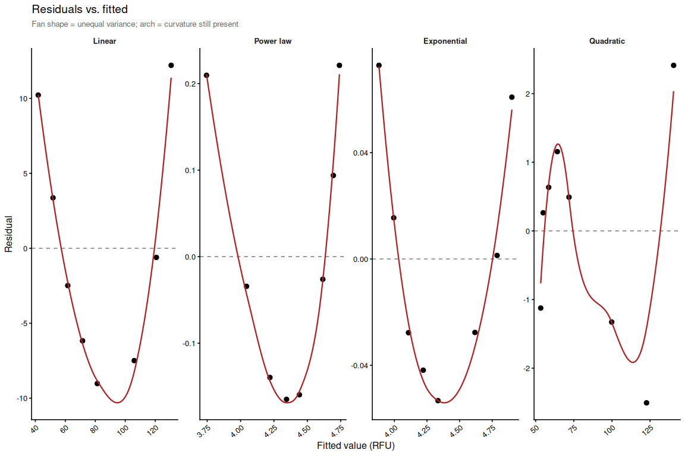

# INTRO

Having run a large number of resazurin assays, I have noticed that the fluorescence readings at time 0 (i.e., immediately after adding the resazurin solution) can vary widely, despite the fact that the resazurin solution should be the same across all wells. Generally, we always add the same volume to all wells, however, those wells with organisms in them (clams, oysters, etc.) have higher fluorescence readings at time 0 than the blank wells (i.e., those with only resazurin solution). 

This observation led me to suspect that the proximity of the resazurin solution to the plate reader detector could be influencing the fluorescence readings. Since the volumes were the same, but the height of the resazurin solution within each well varied due to displacement by the organisms, I suspected that this could be affecting the fluorescence readings. To test this hypothesis, I decided to run a 48-well plate with only resazurin solution, but with varying volumes to simulate the different heights of the solution in the wells. I then measured the fluorescence readings at time 0 to see if there were significant differences between the different volumes (and thus height) of the resazurin solution and the fluorescence readings.

Here's an example data set measured recently that illustrates this point. These are raw fluorescence values measured almost immediately after adding resazurin solution to the plate:

|   | 1   | 2   | 3   | 4   |
|---|-----|-----|-----|-----|
| A | 178 | 183 | 192 | 149 |
| B | 224 | 149 | 161 | 164 |
| C | 114 | 178 | 164 | 152 |




Without telling you, see if you can figure out which well is the blank well and which well has the largest clam in it...

# MATERIALS & METHODS

I prepared a resazurin working solution and loaded it into a 48-well plate at different volumes: 100, 200, 300, 400, 500, 750, 900, and 1000 µL. Each volume was replicated in six wells. I then read the fluorescence at time 0 using a Synergy HTX (Agilent) plate reader. The fluorescence readings were recorded and analyzed to determine if there were significant differences between the different volumes of resazurin solution.

# RESULTS

Data is available here:

[https://github.com/RobertsLab/resazurin-assay-development/tree/main/data/volume_testing/20280528](https://github.com/RobertsLab/resazurin-assay-development/tree/main/data/volume_testing/20280528)


# SUMMARY

The results of the volume testing indicate that the height of the resazurin solution within each well significantly affects the fluorescence readings at time 0. Wells with higher volumes (and thus higher solution heights) exhibited consistently higher fluorescence readings compared to wells with lower volumes.

Other than the 100 µL and 200 µL volumes, which were not significantly different from each other, all other volume groups were significantly different from each other (Tukey-adjusted pairwise comparisons, α = 0.05). The fluorescence readings increased with increasing volume, suggesting a strong positive correlation between the height of the resazurin solution and the fluorescence readings. This finding supports the hypothesis that the proximity of the resazurin solution to the plate reader detector can influence fluorescence readings, and it highlights the importance of considering solution height when designing and interpreting resazurin assays.

This means a couple of things:

1. Raw fluorescence is not a useful metric for comparing metabolic activity across wells with different heights of resazurin solution, as the height itself is a confounding factor that affects the fluorescence readings.

2. Is normalizing to blank wells (i.e., subtracting the mean fluorescence of blank wells from the fluorescence of sample wells) sufficient to account for this effect? This is something that needs to be tested, as it may not fully account for the differences in fluorescence readings due to solution height.

3. Normalization to sample area measurements (e.g., area_mm2_measurement) is necessary to account for differences in organism size and the resulting displacement of the resazurin solution, which affects the height of the solution and thus the fluorescence readings. However, do we need to estimate the volume (i.e. displacement volume) of the organism to fully account for this effect, or is normalizing to area sufficient? This is another question that needs to be tested.

Post below was knitted from the R Markdown file: [01.00-resazurin-20260528-volume_testing.Rmd](https://github.com/RobertsLab/resazurin-assay-development/blob/main/scripts/volume_testing/01.00-resazurin-20260528-volume_testing.Rmd)

---


# 1 BACKGROUND

Comparison of how different resazurin solution volumes affect
fluorescence readings. All wells contain the same resazurin working
solution; only the volume loaded per well differs. Volumes tested: 100,
200, 300, 400, 500, 750, 900, and 1000 µL. Six replicate wells per
volume. Fluorescence was read at T0 on a Synergy HTX (Agilent) plate
reader.

## 1.1 Expected inputs

| Path | Description |
|:---|:---|
| `data/volume_testing/20280528/plate-A-T*.txt` | Plate reader fluorescence exports |
| `data/volume_testing/20280528/layout.csv` | Well metadata: plate ID, well, volume group |

## 1.2 Expected outputs

All outputs are written to `output/volume_testing/20260528/`.

| File                      | Description                                    |
|:--------------------------|:-----------------------------------------------|
| `figures/`                | All plots generated by this script             |
| `volume_fluorescence.csv` | Per-well raw fluorescence with volume metadata |
| `volume_summary.csv`      | Volume-level summary statistics                |
| `pairwise_stats.csv`      | Tukey-adjusted pairwise comparisons            |

# 2 SETUP

## 2.1 Knitr

``` r
knitr::opts_chunk$set(
  echo    = TRUE,
  eval    = TRUE,
  warning = FALSE,
  message = FALSE,
  comment = "",
  results = 'hold'
)
```

## 2.2 Libraries

``` r
library(tidyverse)
library(emmeans)
library(multcompView)
```

## 2.3 Helper Functions

``` r
normalize_well_id <- function(x) {
  x <- toupper(trimws(x))
  valid <- str_detect(x, "^[A-Z]+[0-9]+$")
  out <- rep(NA_character_, length(x))
  if (!any(valid)) return(out)
  m <- str_match(x[valid], "^([A-Z]+)([0-9]+)$")
  out[valid] <- paste0(m[, 2], as.integer(m[, 3]))
  out
}

parse_time_hr <- function(path) {
  hit <- str_match(basename(path),
                   "(?i)-T([0-9]+(?:\\.[0-9]+)?)\\.txt$")
  as.numeric(hit[, 2])
}

parse_plate_id <- function(path) {
  hit <- str_match(basename(path),
    "(?i)^plate-([A-Za-z0-9-]+)-T[0-9]+(?:\\.[0-9]+)?\\.txt$")
  id <- hit[, 2]
  ifelse(is.na(id), "unknown", id)
}

extract_results_block <- function(lines) {
  results_idx <- which(trimws(lines) == "Results")
  if (length(results_idx) == 0) stop("No Results section found")
  idx <- results_idx[1]
  header_tokens <- str_split(lines[idx + 1], "\\t")[[1]] |> trimws()
  col_ids <- header_tokens[
    header_tokens != "" & str_detect(header_tokens, "^[0-9]+$")]
  j <- idx + 2
  data_lines <- character()
  while (j <= length(lines)) {
    line <- lines[j]
    if (trimws(line) == "") break
    if (!str_detect(line, "^[A-Za-z]\\t")) break
    data_lines <- c(data_lines, line)
    j <- j + 1
  }
  list(col_ids = col_ids, data_lines = data_lines)
}

parse_plate_export <- function(path) {
  lines <- readLines(path, warn = FALSE)
  res   <- extract_results_block(lines)

  map_dfr(res$data_lines, function(line) {
    tokens <- str_split(line, "\\t")[[1]] |> trimws()
    tokens <- tokens[tokens != ""]
    row_letter <- tokens[1]
    nums <- suppressWarnings(as.numeric(tokens[-1]))
    valid_idx <- which(!is.na(nums))
    if (length(valid_idx) == 0) return(tibble())
    vals <- nums[valid_idx]
    n    <- min(length(vals), length(res$col_ids))
    tibble(
      row_id  = toupper(row_letter),
      col_id  = as.integer(res$col_ids[seq_len(n)]),
      well_id = normalize_well_id(
        paste0(toupper(row_letter), res$col_ids[seq_len(n)])),
      value   = vals[seq_len(n)]
    )
  }) %>%
    mutate(
      plate_id = str_to_lower(parse_plate_id(path)),
      time_hr  = parse_time_hr(path)
    )
}

sig_label <- function(p) {
  case_when(p < 0.001 ~ "***", p < 0.01 ~ "**", p < 0.05 ~ "*",
            TRUE ~ "ns")
}
```

# 3 LOAD DATA

## 3.1 Plate export files

``` r
proj_root <- rprojroot::find_rstudio_root_file()
data_dir  <- file.path(proj_root, "data", "volume_testing", "20280528")
fig_dir   <- file.path(proj_root, "output", "volume_testing", "20260528", "figures")
out_dir   <- file.path(proj_root, "output", "volume_testing", "20260528")

dir.create(fig_dir, recursive = TRUE, showWarnings = FALSE)
dir.create(out_dir, recursive = TRUE, showWarnings = FALSE)

plate_files <- list.files(
  data_dir,
  pattern   = "(?i)^plate-.*-T[0-9]+(?:\\.[0-9]+)?\\.txt$",
  full.names = TRUE
)

plate_raw <- map_dfr(plate_files, function(path) {
  tryCatch(
    parse_plate_export(path),
    error = function(e) {
      message("Parse error in ", basename(path), ": ", e$message)
      tibble()
    }
  )
})

str(plate_raw)
```

    tibble [48 × 6] (S3: tbl_df/tbl/data.frame)
     $ row_id  : chr [1:48] "A" "A" "A" "A" ...
     $ col_id  : int [1:48] 1 2 3 4 5 6 7 8 1 2 ...
     $ well_id : chr [1:48] "A1" "A2" "A3" "A4" ...
     $ value   : num [1:48] 51 54 59 63 72 98 119 139 51 54 ...
     $ plate_id: chr [1:48] "a" "a" "a" "a" ...
     $ time_hr : num [1:48] 0 0 0 0 0 0 0 0 0 0 ...

## 3.2 Layout file

``` r
layout_path <- file.path(data_dir, "layout.csv")

layout_raw <- read_csv(layout_path,
                       col_types    = cols(.default = "c"),
                       show_col_types = FALSE)

# Standardise column names to snake_case
names(layout_raw) <- names(layout_raw) |>
  str_to_lower() |>
  str_replace_all("[^a-z0-9]+", "_") |>
  str_replace_all("_+", "_") |>
  str_replace("_$", "")

layout_clean <- layout_raw %>%
  mutate(
    plate_id  = str_remove(str_to_lower(plate_id), "^plate-"),
    well_id   = normalize_well_id(plate_well),
    volume_ul = as.integer(family_id_group)
  )

str(layout_clean)
```

    tibble [48 × 15] (S3: tbl_df/tbl/data.frame)
     $ plate_id             : chr [1:48] "a" "a" "a" "a" ...
     $ plate_well           : chr [1:48] "A01" "A02" "A03" "A04" ...
     $ is_blank             : chr [1:48] "TRUE" "TRUE" "TRUE" "TRUE" ...
     $ family_id_group      : chr [1:48] "100" "200" "300" "400" ...
     $ sample_id_group      : chr [1:48] NA NA NA NA ...
     $ treatment_group      : chr [1:48] NA NA NA NA ...
     $ exclude_from_analysis: chr [1:48] NA NA NA NA ...
     $ exclude_reason       : chr [1:48] NA NA NA NA ...
     $ width_mm_measurement : chr [1:48] NA NA NA NA ...
     $ length_mm_measurement: chr [1:48] NA NA NA NA ...
     $ weight_mg_measurement: chr [1:48] NA NA NA NA ...
     $ area_mm2_measurement : chr [1:48] NA NA NA NA ...
     $ imagej_id            : chr [1:48] NA NA NA NA ...
     $ well_id              : chr [1:48] "A1" "A2" "A3" "A4" ...
     $ volume_ul            : int [1:48] 100 200 300 400 500 750 900 1000 100 200 ...

# 4 MERGE DATA

``` r
dat <- plate_raw %>%
  left_join(
    layout_clean %>% dplyr::select(plate_id, well_id, volume_ul),
    by = c("plate_id", "well_id")
  ) %>%
  filter(!is.na(volume_ul)) %>%
  mutate(
    volume_ul = factor(volume_ul,
                       levels = sort(unique(volume_ul)))
  )

str(dat)
```

    tibble [48 × 7] (S3: tbl_df/tbl/data.frame)
     $ row_id   : chr [1:48] "A" "A" "A" "A" ...
     $ col_id   : int [1:48] 1 2 3 4 5 6 7 8 1 2 ...
     $ well_id  : chr [1:48] "A1" "A2" "A3" "A4" ...
     $ value    : num [1:48] 51 54 59 63 72 98 119 139 51 54 ...
     $ plate_id : chr [1:48] "a" "a" "a" "a" ...
     $ time_hr  : num [1:48] 0 0 0 0 0 0 0 0 0 0 ...
     $ volume_ul: Factor w/ 8 levels "100","200","300",..: 1 2 3 4 5 6 7 8 1 2 ...

# 5 SUMMARY STATS

``` r
vol_summary <- dat %>%
  group_by(volume_ul) %>%
  summarise(
    n          = n(),
    mean_rfu   = mean(value, na.rm = TRUE),
    sd_rfu     = sd(value, na.rm = TRUE),
    se_rfu     = sd_rfu / sqrt(n),
    median_rfu = median(value, na.rm = TRUE),
    .groups    = "drop"
  )

print(vol_summary)

str(vol_summary)
```

    # A tibble: 8 × 6
      volume_ul     n mean_rfu sd_rfu se_rfu median_rfu
      <fct>     <int>    <dbl>  <dbl>  <dbl>      <dbl>
    1 100           6     52.2   1.33  0.543       52  
    2 200           6     55.2   1.47  0.601       54.5
    3 300           6     59.2   1.60  0.654       59  
    4 400           6     65.3   1.75  0.715       65.5
    5 500           6     72.3   1.03  0.422       72  
    6 750           6     98.5   1.76  0.719       98  
    7 900           6    120.    1.94  0.792      120. 
    8 1000          6    143.    2.93  1.19       144. 
    tibble [8 × 6] (S3: tbl_df/tbl/data.frame)
     $ volume_ul : Factor w/ 8 levels "100","200","300",..: 1 2 3 4 5 6 7 8
     $ n         : int [1:8] 6 6 6 6 6 6 6 6
     $ mean_rfu  : num [1:8] 52.2 55.2 59.2 65.3 72.3 ...
     $ sd_rfu    : num [1:8] 1.33 1.47 1.6 1.75 1.03 ...
     $ se_rfu    : num [1:8] 0.543 0.601 0.654 0.715 0.422 ...
     $ median_rfu: num [1:8] 52 54.5 59 65.5 72 ...

# 6 STATISTICAL ANALYSIS

One-way ANOVA tests for any volume effect; Tukey-adjusted pairwise
comparisons identify which volume pairs differ significantly (α = 0.05).
Compact letter display (CLD) groups volumes that are not significantly
different.

## 6.1 One-way ANOVA

``` r
model     <- aov(value ~ volume_ul, data = dat)
anova_res <- summary(model)

print(anova_res)

str(anova_res)
```

                Df Sum Sq Mean Sq F value Pr(>F)    
    volume_ul    7  47524    6789    2084 <2e-16 ***
    Residuals   40    130       3                   
    ---
    Signif. codes:  0 '***' 0.001 '**' 0.01 '*' 0.05 '.' 0.1 ' ' 1
    List of 1
     $ :Classes 'anova' and 'data.frame':   2 obs. of  5 variables:
      ..$ Df     : num [1:2] 7 40
      ..$ Sum Sq : num [1:2] 47524 130
      ..$ Mean Sq: num [1:2] 6789.08 3.26
      ..$ F value: num [1:2] 2084 NA
      ..$ Pr(>F) : num [1:2] 3.61e-49 NA
     - attr(*, "class")= chr [1:2] "summary.aov" "listof"

## 6.2 Tukey pairwise comparisons

``` r
tukey_res <- TukeyHSD(model)
pairs_res <- as.data.frame(tukey_res$volume_ul) %>%
  tibble::rownames_to_column("contrast") %>%
  rename(p.value = `p adj`) %>%
  mutate(sig_label = sig_label(p.value))

print(pairs_res)

str(pairs_res)
```

       contrast      diff        lwr       upr      p.value sig_label
    1   200-100  3.000000 -0.3312867  6.331287 1.043796e-01        ns
    2   300-100  7.000000  3.6687133 10.331287 1.242607e-06       ***
    3   400-100 13.166667  9.8353800 16.497953 5.175860e-13       ***
    4   500-100 20.166667 16.8353800 23.497953 4.636291e-13       ***
    5   750-100 46.333333 43.0020466 49.664620 4.636291e-13       ***
    6   900-100 68.000000 64.6687133 71.331287 4.636291e-13       ***
    7  1000-100 90.666667 87.3353800 93.997953 4.636291e-13       ***
    8   300-200  4.000000  0.6687133  7.331287 9.317756e-03        **
    9   400-200 10.166667  6.8353800 13.497953 1.085119e-10       ***
    10  500-200 17.166667 13.8353800 20.497953 4.638512e-13       ***
    11  750-200 43.333333 40.0020466 46.664620 4.636291e-13       ***
    12  900-200 65.000000 61.6687133 68.331287 4.636291e-13       ***
    13 1000-200 87.666667 84.3353800 90.997953 4.636291e-13       ***
    14  400-300  6.166667  2.8353800  9.497953 1.611005e-05       ***
    15  500-300 13.166667  9.8353800 16.497953 5.175860e-13       ***
    16  750-300 39.333333 36.0020466 42.664620 4.636291e-13       ***
    17  900-300 61.000000 57.6687133 64.331287 4.636291e-13       ***
    18 1000-300 83.666667 80.3353800 86.997953 4.636291e-13       ***
    19  500-400  7.000000  3.6687133 10.331287 1.242607e-06       ***
    20  750-400 33.166667 29.8353800 36.497953 4.636291e-13       ***
    21  900-400 54.833333 51.5020466 58.164620 4.636291e-13       ***
    22 1000-400 77.500000 74.1687133 80.831287 4.636291e-13       ***
    23  750-500 26.166667 22.8353800 29.497953 4.636291e-13       ***
    24  900-500 47.833333 44.5020466 51.164620 4.636291e-13       ***
    25 1000-500 70.500000 67.1687133 73.831287 4.636291e-13       ***
    26  900-750 21.666667 18.3353800 24.997953 4.636291e-13       ***
    27 1000-750 44.333333 41.0020466 47.664620 4.636291e-13       ***
    28 1000-900 22.666667 19.3353800 25.997953 4.636291e-13       ***
    'data.frame':   28 obs. of  6 variables:
     $ contrast : chr  "200-100" "300-100" "400-100" "500-100" ...
     $ diff     : num  3 7 13.2 20.2 46.3 ...
     $ lwr      : num  -0.331 3.669 9.835 16.835 43.002 ...
     $ upr      : num  6.33 10.33 16.5 23.5 49.66 ...
     $ p.value  : num  1.04e-01 1.24e-06 5.18e-13 4.64e-13 4.64e-13 ...
     $ sig_label: chr  "ns" "***" "***" "***" ...

## 6.3 Compact letter display

Groups sharing a letter are not significantly different at α = 0.05.

``` r
# multcompLetters4 works directly with TukeyHSD output, so group-name
# alignment is handled internally and reliably.
cld_letters <- multcompView::multcompLetters4(model, tukey_res)$volume_ul$Letters

vols <- levels(dat$volume_ul)

cld_df <- tibble(
  volume_ul = factor(vols, levels = vols),
  .group    = trimws(cld_letters[vols])
)

print(cld_df)

str(cld_df)
```

    # A tibble: 8 × 2
      volume_ul .group
      <fct>     <chr> 
    1 100       g     
    2 200       g     
    3 300       f     
    4 400       e     
    5 500       d     
    6 750       c     
    7 900       b     
    8 1000      a     
    tibble [8 × 2] (S3: tbl_df/tbl/data.frame)
     $ volume_ul: Factor w/ 8 levels "100","200","300",..: 1 2 3 4 5 6 7 8
     $ .group   : Named chr [1:8] "g" "g" "f" "e" ...
      ..- attr(*, "names")= chr [1:8] "100" "200" "300" "400" ...

# 7 PLOTS

## 7.1 Box Plot with Statistical Annotations

``` r
y_max   <- max(dat$value, na.rm = TRUE)
y_range <- diff(range(dat$value, na.rm = TRUE))
label_y <- y_max + y_range * 0.07

p_box <- ggplot(dat, aes(x = volume_ul, y = value, fill = volume_ul)) +
  geom_boxplot(alpha = 0.6, outlier.shape = NA) +
  geom_jitter(width = 0.15, alpha = 0.55, size = 2.2) +
  geom_text(
    data        = cld_df,
    aes(x = volume_ul, y = label_y, label = .group),
    inherit.aes = FALSE,
    size        = 5,
    fontface    = "bold"
  ) +
  scale_fill_brewer(palette = "Set2", guide = "none") +
  labs(
    x        = "Resazurin volume (µL)",
    y        = "Raw fluorescence (RFU)",
    title    = "Fluorescence by resazurin volume",
    subtitle = "Shared letter = not significantly different (Tukey, α = 0.05)"
  ) +
  theme_classic(base_size = 13) +
  theme(plot.subtitle = element_text(size = 10, colour = "grey40"))

p_box
```

<!-- -->

``` r
ggsave(file.path(fig_dir, "boxplot_fluorescence_by_volume.png"),
       p_box, width = 9, height = 6)
```

## 7.2 Fluorescence vs. volume (scatter with regression)

Visualises the relationship between volume and mean fluorescence. Four
candidate models are fit and compared.

``` r
vol_summary_num <- vol_summary %>%
  mutate(volume_num = as.numeric(as.character(volume_ul)))

# Linear: RFU = a + b*volume
lm_fit  <- lm(mean_rfu ~ volume_num, data = vol_summary_num)
lm_r2   <- summary(lm_fit)$r.squared

# Power law (log-log): log(RFU) = log(a) + b*log(volume)  →  RFU = a*volume^b
loglog_fit  <- lm(log(mean_rfu) ~ log(volume_num), data = vol_summary_num)
loglog_r2   <- summary(loglog_fit)$r.squared
a_pow       <- exp(coef(loglog_fit)["(Intercept)"])
b_pow       <- coef(loglog_fit)["log(volume_num)"]

# Exponential (semi-log): log(RFU) = a + b*volume  →  RFU = e^a * e^(b*volume)
exp_fit  <- lm(log(mean_rfu) ~ volume_num, data = vol_summary_num)
exp_r2   <- summary(exp_fit)$r.squared
a_exp    <- exp(coef(exp_fit)["(Intercept)"])
b_exp    <- coef(exp_fit)["volume_num"]

# Quadratic: RFU = a + b*volume + c*volume^2
quad_fit <- lm(mean_rfu ~ volume_num + I(volume_num^2), data = vol_summary_num)
quad_r2  <- summary(quad_fit)$r.squared
quad_coef <- coef(quad_fit)

rmse <- function(fit) sqrt(mean(residuals(fit)^2))

model_compare <- tibble(
  model = c("Linear", "Power law", "Exponential", "Quadratic"),
  r2    = c(lm_r2, loglog_r2, exp_r2, quad_r2),
  RMSE  = c(rmse(lm_fit), rmse(loglog_fit), rmse(exp_fit), rmse(quad_fit)),
  AIC   = c(AIC(lm_fit), AIC(loglog_fit), AIC(exp_fit), AIC(quad_fit))
) %>%
  arrange(AIC)

print(model_compare)

str(model_compare)

# Predicted curves on original scale for plotting
vol_seq <- seq(min(vol_summary_num$volume_num),
               max(vol_summary_num$volume_num),
               length.out = 200)

pred_df <- tibble(volume_num = vol_seq) %>%
  mutate(
    Linear      = predict(lm_fit,   newdata = tibble(volume_num = vol_seq)),
    `Power law` = a_pow * vol_seq ^ b_pow,
    Exponential = a_exp * exp(b_exp * vol_seq),
    Quadratic   = predict(quad_fit, newdata = tibble(volume_num = vol_seq))
  ) %>%
  pivot_longer(-volume_num, names_to = "model", values_to = "mean_rfu")

str(pred_df)

model_colours <- c(
  Linear      = "steelblue",
  `Power law` = "darkorange",
  Exponential = "forestgreen",
  Quadratic   = "purple"
)

p_scatter <- ggplot(vol_summary_num, aes(x = volume_num, y = mean_rfu)) +
  geom_line(data = pred_df,
            aes(colour = model, linetype = model),
            linewidth = 0.9) +
  geom_errorbar(aes(ymin = mean_rfu - se_rfu,
                    ymax = mean_rfu + se_rfu),
                width = 20, colour = "grey40") +
  geom_point(size = 3) +
  scale_colour_manual(values = model_colours, name = "Model") +
  scale_linetype_manual(
    values = c(Linear = "dashed", `Power law` = "solid",
               Exponential = "dotdash", Quadratic = "dotted"),
    name = "Model"
  ) +
  scale_x_continuous(breaks = vol_summary_num$volume_num) +
  labs(
    x        = "Resazurin volume (µL)",
    y        = "Mean fluorescence (RFU ± SE)",
    title    = "Mean fluorescence vs. volume — model comparison"
  ) +
  theme_classic(base_size = 13) +
  theme(legend.position = "bottom")

p_scatter
```

<!-- -->

``` r
ggsave(file.path(fig_dir, "scatter_mean_fluorescence_by_volume.png"),
       p_scatter, width = 7, height = 5)
```

    # A tibble: 4 × 4
      model          r2   RMSE    AIC
      <chr>       <dbl>  <dbl>  <dbl>
    1 Exponential 0.985 0.0438 -21.3 
    2 Power law   0.825 0.148   -1.85
    3 Quadratic   0.998 1.46    36.8 
    4 Linear      0.944 7.48    60.9 
    tibble [4 × 4] (S3: tbl_df/tbl/data.frame)
     $ model: chr [1:4] "Exponential" "Power law" "Quadratic" "Linear"
     $ r2   : num [1:4] 0.985 0.825 0.998 0.944
     $ RMSE : num [1:4] 0.0438 0.1481 1.4647 7.4756
     $ AIC  : num [1:4] -21.33 -1.85 36.81 60.89
    tibble [800 × 3] (S3: tbl_df/tbl/data.frame)
     $ volume_num: num [1:800] 100 100 100 100 105 ...
     $ model     : chr [1:800] "Linear" "Power law" "Exponential" "Quadratic" ...
     $ mean_rfu  : Named num [1:800] 41.9 42.3 48.5 53.3 42.4 ...
      ..- attr(*, "names")= chr [1:800] "1" "" "" "1" ...

## 7.3 Model residuals

Residuals for all four models. The flattest panel indicates the best
functional form for the volume–fluorescence relationship.

``` r
model_levels <- c("Linear", "Power law", "Exponential", "Quadratic")

resid_df <- vol_summary_num %>%
  mutate(
    Linear      = residuals(lm_fit),
    `Power law` = residuals(loglog_fit),
    Exponential = residuals(exp_fit),
    Quadratic   = residuals(quad_fit),
    fitted_Linear      = fitted(lm_fit),
    fitted_Power.law   = fitted(loglog_fit),
    fitted_Exponential = fitted(exp_fit),
    fitted_Quadratic   = fitted(quad_fit)
  ) %>%
  pivot_longer(
    cols      = all_of(model_levels),
    names_to  = "model",
    values_to = "residual"
  ) %>%
  pivot_longer(
    cols      = starts_with("fitted_"),
    names_to  = "fitted_model",
    values_to = "fitted"
  ) %>%
  filter(str_remove(fitted_model, "fitted_") == str_replace(model, " ", ".")) %>%
  mutate(model = factor(model, levels = model_levels))

str(resid_df)

theme_resid <- theme_classic(base_size = 12) +
  theme(
    strip.background = element_blank(),
    strip.text       = element_text(face = "bold"),
    axis.text.x      = element_text(angle = 40, hjust = 1)
  )

# Residuals vs. predictor (volume)
p_resid_vol <- ggplot(resid_df, aes(x = volume_num, y = residual)) +
  geom_hline(yintercept = 0, linetype = "dashed", colour = "grey50") +
  geom_point(size = 2.5) +
  geom_smooth(method = "loess", se = FALSE, colour = "firebrick",
              linewidth = 0.8) +
  facet_wrap(~ model, scales = "free_y", nrow = 1) +
  scale_x_continuous(breaks = vol_summary_num$volume_num) +
  labs(x = "Volume (µL)", y = "Residual",
       title = "Residuals vs. predictor",
       subtitle = "Systematic arch = wrong model form") +
  theme_resid +
  theme(plot.subtitle = element_text(size = 10, colour = "grey40"))

# Residuals vs. fitted values
p_resid_fit <- ggplot(resid_df, aes(x = fitted, y = residual)) +
  geom_hline(yintercept = 0, linetype = "dashed", colour = "grey50") +
  geom_point(size = 2.5) +
  geom_smooth(method = "loess", se = FALSE, colour = "firebrick",
              linewidth = 0.8) +
  facet_wrap(~ model, scales = "free", nrow = 1) +
  labs(x = "Fitted value (RFU)", y = "Residual",
       title = "Residuals vs. fitted",
       subtitle = "Fan shape = unequal variance; arch = curvature still present") +
  theme_resid +
  theme(plot.subtitle = element_text(size = 10, colour = "grey40"))

p_resid_vol
```

<!-- -->

``` r
p_resid_fit
```

<!-- -->

``` r
ggsave(file.path(fig_dir, "residuals_vs_predictor.png"),
       p_resid_vol, width = 12, height = 4)
ggsave(file.path(fig_dir, "residuals_vs_fitted.png"),
       p_resid_fit, width = 12, height = 4)
```

    tibble [32 × 11] (S3: tbl_df/tbl/data.frame)
     $ volume_ul   : Factor w/ 8 levels "100","200","300",..: 1 1 1 1 2 2 2 2 3 3 ...
     $ n           : int [1:32] 6 6 6 6 6 6 6 6 6 6 ...
     $ mean_rfu    : num [1:32] 52.2 52.2 52.2 52.2 55.2 ...
     $ sd_rfu      : num [1:32] 1.33 1.33 1.33 1.33 1.47 ...
     $ se_rfu      : num [1:32] 0.543 0.543 0.543 0.543 0.601 ...
     $ median_rfu  : num [1:32] 52 52 52 52 54.5 54.5 54.5 54.5 59 59 ...
     $ volume_num  : num [1:32] 100 100 100 100 200 200 200 200 300 300 ...
     $ model       : Factor w/ 4 levels "Linear","Power law",..: 1 2 3 4 1 2 3 4 1 2 ...
     $ residual    : Named num [1:32] 10.2213 0.2096 0.0728 -1.1242 3.3674 ...
      ..- attr(*, "names")= chr [1:32] "1" "1" "1" "1" ...
     $ fitted_model: chr [1:32] "fitted_Linear" "fitted_Power.law" "fitted_Exponential" "fitted_Quadratic" ...
     $ fitted      : Named num [1:32] 41.95 3.74 3.88 53.29 51.8 ...
      ..- attr(*, "names")= chr [1:32] "1" "1" "1" "1" ...

# 8 SAVE OUTPUTS

``` r
write_csv(dat,         file.path(out_dir, "volume_fluorescence.csv"))
write_csv(vol_summary, file.path(out_dir, "volume_summary.csv"))
write_csv(pairs_res,   file.path(out_dir, "pairwise_stats.csv"))

message("Output files written to: ", out_dir)
```