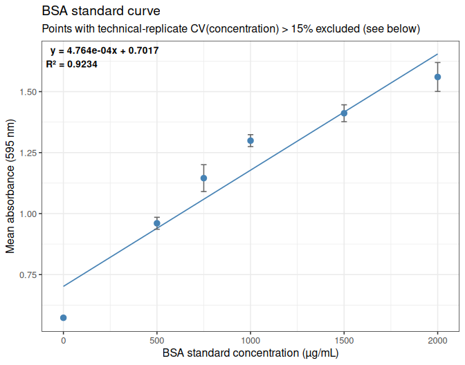
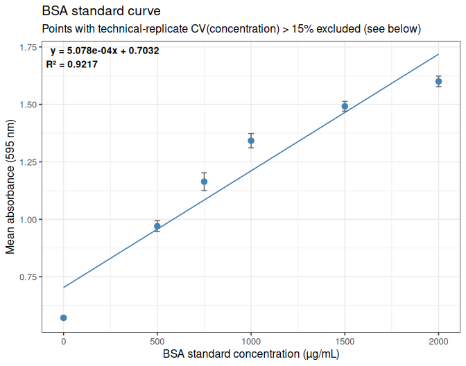
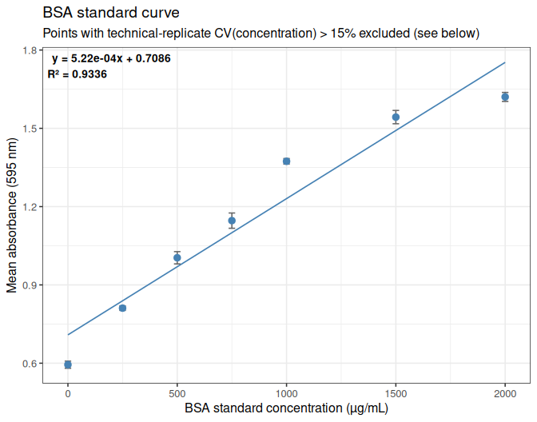
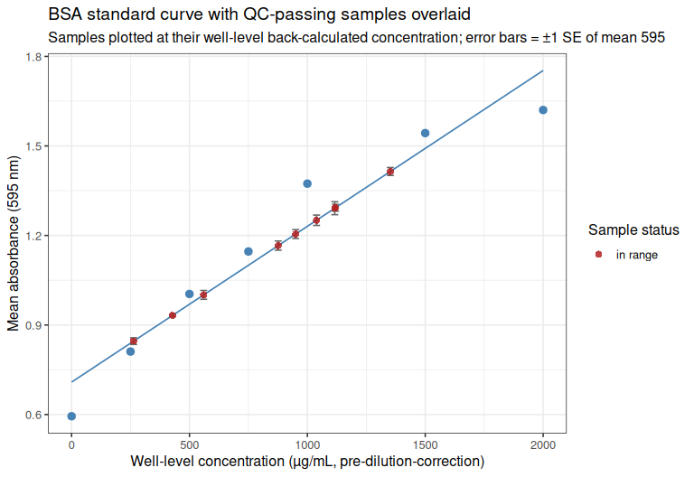

# INTRO

As part of the [June 2026 SORMI experiment citrate synthase assays](https://github.com/RobertsLab/sormi-assay-development/tree/main/Citrate_synthase) (GitHub repo), protein quantities were needed for proper normalization of the citrate synthase assays. I quantified protein in [ctenidia samples from Families 5 and 7 homozenized on 20260811](../2026-08-11-Homogenization---SORMI-June-2026-M.gigas-Ctenidia-from-Families-5-and-7-for-Citrate-Synthase-Assay/index.qmd) (Notebook entry) using the Quick Start Bradford Protein Assay Kit 1 (Bio-Rad; cat: 5000201).

Families 5 & 7 (Eight samples each family from each temperature treatment) were processed for protein quantification.

Due to poor replicates and/or samples falling outside of the standard curve, the BSA assay was repeated for those samples failing QC on the initial run.


# MATERIALS & METHODS

## BSA Assay
The Bradford Protein Assay was performed according to the manufacturer's instructions (Bio-Rad, cat: 5000201) for microplate format. Clear, flat-bottomed 96-well plates were used for the assay.

Briefly, samples were thawed, spun at 10,000 rpm for 5 minutes, and stored on ice. A series of BSA standards were prepared and used to generate a standard curve. Samples (5uL) were then added to respective wells and 250uL of the Bradford reagent was added to each well (using a multichannel pipette; two rounds of 125uL) and mixed by pipetting. The plates were then incubated for 5 minutes at room temperature, and the absorbance was measured at 595 nm in a Synergy HTX plate reader (Agilent).

## Analysis
Data was analyzed in R. Respective Rmd files are here (GitHub):

- [Gen5-20260813-mgig-sormi-BSA-F05-protein.Rmd](https://github.com/RobertsLab/sormi-assay-development/blob/main/Citrate_synthase/code/Gen5-20260813-mgig-sormi-BSA-F05-protein.Rmd)

- [Gen5-20260813-mgig-sormi-BSA-F07-protein.Rmd](https://github.com/RobertsLab/sormi-assay-development/blob/main/Citrate_synthase/code/Gen5-20260813-mgig-sormi-BSA-F07-protein.Rmd)

- [Gen5-20260813-mgig-sormi-BSA-F05-F07-reassay-protein.Rmd](https://github.com/RobertsLab/sormi-assay-development/blob/main/Citrate_synthase/code/Gen5-20260813-mgig-sormi-BSA-F05-F07-reassay-protein.Rmd)

Knitted markdown from each is below.

## Data files

### Plate reader files
Plate reader files (`*.xpt`)are available here (require Gen5 software to open):

- https://github.com/RobertsLab/sormi-assay-development/tree/main/Citrate_synthase/data/BSA/plate_reader_files

### Raw absorbance data
Raw absorbance data (`*.csv`) are available here:

- https://github.com/RobertsLab/sormi-assay-development/tree/main/Citrate_synthase/data/BSA/raw_absorbance


# RESULTS

Output files with sample concentrations can be found in each of the corresponding output files from the Rmd files above (https://github.com/RobertsLab/sormi-assay-development/tree/main/Citrate_synthase/outputs) in a file named `sample_concentrations.csv`. 


Below is a summary of the protein concentrations (ug/mL) for each sample:

| sample_name    | concentration(ug/mL) |
|----------------|----------------------|
| F05_01_36C     | 953.1                |
| F05_01_ambient | 876.1                |
| F05_02_36C     | 545.8                |
| F05_02_ambient | 1038.9               |
| F05_03_36C     | 667.6                |
| F05_03_ambient | 1900.4               |
| F05_04_36C     | 1062.2               |
| F05_04_ambient | 1129.4               |
| F05_05_36C     | 1666.8               |
| F05_05_ambient | 711.7                |
| F05_06_36C     | 1265.9               |
| F05_06_ambient | 2232.4               |
| F05_07_36C     | 1110.5               |
| F05_07_ambient | 1687.8               |
| F05_08_36C     | 1357.5               |
| F05_08_ambient | 2703.7               |
| F07_01_36C     | 663.3                |
| F07_01_ambient | 263.1                |
| F07_02_36C     | 932.4                |
| F07_02_ambient | 1080.1               |
| F07_03_36C     | 1205.5               |
| F07_03_ambient | 1155.6               |
| F07_04_36C     | 1567.2               |
| F07_04_ambient | 560                  |
| F07_05_36C     | 427.9                |
| F07_05_ambient | 659.3                |
| F07_06_36C     | 496.5                |
| F07_06_ambient | 1119.4               |
| F07_07_36C     | 1038.1               |
| F07_07_ambient | 1644.6               |
| F07_08_36C     | 289.8                |
| F07_08_ambient | 560.2                |


<a href="https://robertslab.github.io/resources/Agentic-Coding-Tools/#five-level-rubric"></a>

---

# FAMILY 5 ANALYSIS


# 1 BACKGROUND

Protein quantification (BCA/Bradford-style, 595 nm) of *Magallana gigas*
(Pacific oyster) SoRMI plate `F05`, 16 samples (`F05_01`-`F05_08`,
ambient and 36°C exposure) plus an 8-point BSA standard curve, each
measured in triplicate wells.

The raw Gen5 export (`Gen5-20260813-mgig-BSA-F05-absorbance.csv`) is a
per-well table where each triplicate group’s first row carries the
sample/standard ID and the instrument’s own pre-computed
mean/SD/CV-of-concentration, and the two replicate rows below it carry
only well-level data. This document ignores the instrument’s
pre-computed summary columns and recomputes mean, SD, and CV
independently in R via `dplyr`, for both the raw absorbance (595 nm) and
the concentration.

**CV QC metric used for exclusion:** the \>15% technical-replicate CV
exclusion rule (including for standard-curve points) is applied to **CV
of concentration** (matching what the instrument’s own `CV (%)` column
already represents for this export – verified against the raw file:
e.g. `SPL1`’s given Mean/SD/CV of 971.656/77.065/7.931 are exactly the
mean/SD/CV of its three `[Concentration]` values, not of its `595`
values). Concentration CV is the more sensitive metric here: several
groups exceed 15% on concentration while none do on raw absorbance,
since back-calculation against a curve with a non-zero intercept
amplifies small absorbance differences into larger relative
concentration differences.

Two edge cases in the raw `[Concentration]` column need explicit
handling:

- **Censored reads.** Wells reading outside the instrument’s own
  internal standard-curve range are reported as `<0.000` or `>2100.000`
  rather than a number. These are parsed to a `_censored` flag plus the
  boundary value, and excluded from concentration mean/SD/CV
  calculations (their true value is unknown, not equal to the boundary).
- **The zero (blank) BSA standard** (`STD8`) is *always* censored
  (`<0.000` on all three wells), by construction – a true-zero
  standard’s back-calculated concentration is not a meaningful quantity
  to compute a CV on, and this is not a data-quality problem. `STD8` is
  therefore exempt from the concentration-CV exclusion rule and is
  retained as the curve’s origin point on the strength of its
  (excellent) 595 CV instead.

Any other group left with fewer than 2 valid (non-censored)
concentration replicates – e.g. `SPL16` / `F05_08_ambient`, where 2 of 3
wells read above the top standard – has an undefined (`NA`)
concentration CV and is treated as failing QC, consistent with the
source file itself being unable to compute a CV there either (`?????`).

# 2 SETUP

## 2.1 Libraries

``` r
library(knitr)
library(ggplot2)
library(dplyr)
```

    ## 
    ## Attaching package: 'dplyr'

    ## The following objects are masked from 'package:stats':
    ## 
    ##     filter, lag

    ## The following objects are masked from 'package:base':
    ## 
    ##     intersect, setdiff, setequal, union

``` r
library(tidyr)

knitr::opts_chunk$set(
  echo = TRUE,         # Display code chunks
  eval = TRUE,         # Evaluate code chunks
  warning = FALSE,     # Hide warnings
  message = FALSE,     # Hide messages
  comment = "",        # Prevents appending '##' to beginning of lines in code output
  results = 'hold'     # Holds output so it's all printed together after code chunk
)
```

## 2.2 Set output directory

``` r
output_dir <- "../outputs/Gen5-20260813-mgig-BSA-F05"
dir.create(output_dir, showWarnings = FALSE, recursive = TRUE)
```

# 3 DATA IMPORT

The raw file is a Gen5 per-well export with non-syntactic column names
(`[Concentration]`, `CV (%)`, etc.) and a UTF-8 byte-order mark on the
first header cell, so columns are renamed by position immediately after
import rather than referenced by their original names.

``` r
data_path <- "../data/BSA/raw_absorbance/Gen5-20260813-mgig-BSA-F05-absorbance.csv"

protein_raw <- read.csv(data_path, stringsAsFactors = FALSE, check.names = FALSE,
                         na.strings = c("", "NA"))
colnames(protein_raw) <- c("well_id", "name", "well", "std_conc_known", "abs_595",
                           "gen5_concentration", "gen5_count", "gen5_mean",
                           "gen5_sd", "gen5_cv")

cat("--- protein_raw: as imported from the Gen5 export ---\n")
str(protein_raw)
```

    --- protein_raw: as imported from the Gen5 export ---
    'data.frame':   72 obs. of  10 variables:
     $ well_id           : chr  "SPL1" NA NA "SPL2" ...
     $ name              : chr  "F05_01_36C" NA NA "F05_02_36C" ...
     $ well              : chr  "A1" "A2" "A3" "A4" ...
     $ std_conc_known    : int  NA NA NA NA NA NA NA NA NA NA ...
     $ abs_595           : num  1.197 1.147 1.123 0.926 0.973 ...
     $ gen5_concentration: chr  "1056.125" "953.667" "905.177" "506.911" ...
     $ gen5_count        : int  3 NA NA 3 NA NA 3 NA NA 3 ...
     $ gen5_mean         : chr  "971.656" NA NA "579.274" ...
     $ gen5_sd           : chr  "77.065" NA NA "64.041" ...
     $ gen5_cv           : chr  "7.931" NA NA "11.055" ...

# 4 RESHAPING

`well_id` and `name` are only populated on the first row of each
triplicate group in the raw export, so they are filled downward. Each
row is also classified as a `standard` (`well_id` starts with `STD`) or
a `sample` (`SPL`), and the instrument’s censored concentration strings
(`<0.000`, `>2100.000`) are parsed into a numeric value plus a
`gen5_concentration_censored` flag.

``` r
protein_long <- protein_raw %>%
  select(well_id, name, well, std_conc_known, abs_595, gen5_concentration) %>%
  fill(well_id, name, .direction = "down") %>%
  mutate(
    type = if_else(grepl("^STD", well_id), "standard", "sample"),
    gen5_concentration_censored = grepl("^[<>]", gen5_concentration),
    gen5_concentration_numeric  = as.numeric(gsub("[<>]", "", gen5_concentration))
  )

cat("--- protein_long: one row per well, group identifiers filled down ---\n")
str(protein_long)
```

    --- protein_long: one row per well, group identifiers filled down ---
    'data.frame':   72 obs. of  9 variables:
     $ well_id                    : chr  "SPL1" "SPL1" "SPL1" "SPL2" ...
     $ name                       : chr  "F05_01_36C" "F05_01_36C" "F05_01_36C" "F05_02_36C" ...
     $ well                       : chr  "A1" "A2" "A3" "A4" ...
     $ std_conc_known             : int  NA NA NA NA NA NA NA NA NA NA ...
     $ abs_595                    : num  1.197 1.147 1.123 0.926 0.973 ...
     $ gen5_concentration         : chr  "1056.125" "953.667" "905.177" "506.911" ...
     $ type                       : chr  "sample" "sample" "sample" "sample" ...
     $ gen5_concentration_censored: logi  FALSE FALSE FALSE FALSE FALSE FALSE ...
     $ gen5_concentration_numeric : num  1056 954 905 507 602 ...

# 5 MEAN VALUES

## 5.1 Mean 595 nm absorbance

``` r
mean_595_by_group <- protein_long %>%
  group_by(well_id, name, type, std_conc_known) %>%
  summarise(n_wells  = n(),
            mean_595 = mean(abs_595),
            .groups  = "drop")

cat("--- mean_595_by_group ---\n")
str(mean_595_by_group)
```

    --- mean_595_by_group ---
    tibble [24 × 6] (S3: tbl_df/tbl/data.frame)
     $ well_id       : chr [1:24] "SPL1" "SPL10" "SPL11" "SPL12" ...
     $ name          : chr [1:24] "F05_01_36C" "F05_02_ambient" "F05_03_ambient" "F05_04_ambient" ...
     $ type          : chr [1:24] "sample" "sample" "sample" "sample" ...
     $ std_conc_known: int [1:24] NA NA NA NA NA NA NA NA NA NA ...
     $ n_wells       : int [1:24] 3 3 3 3 3 3 3 3 3 3 ...
     $ mean_595      : num [1:24] 1.16 1.21 1.56 1.24 1.04 ...

## 5.2 Mean concentration

Censored wells (reading outside the instrument’s own standard-curve
range) are dropped before averaging, since their true concentration is
unknown.

``` r
mean_conc_by_group <- protein_long %>%
  filter(!gen5_concentration_censored) %>%
  group_by(well_id, name, type, std_conc_known) %>%
  summarise(n_wells_valid_conc  = n(),
            mean_concentration  = mean(gen5_concentration_numeric),
            .groups = "drop")

cat("--- mean_conc_by_group ---\n")
str(mean_conc_by_group)
```

    --- mean_conc_by_group ---
    tibble [23 × 6] (S3: tbl_df/tbl/data.frame)
     $ well_id           : chr [1:23] "SPL1" "SPL10" "SPL11" "SPL12" ...
     $ name              : chr [1:23] "F05_01_36C" "F05_02_ambient" "F05_03_ambient" "F05_04_ambient" ...
     $ type              : chr [1:23] "sample" "sample" "sample" "sample" ...
     $ std_conc_known    : int [1:23] NA NA NA NA NA NA NA NA NA NA ...
     $ n_wells_valid_conc: int [1:23] 3 3 3 3 3 3 3 1 3 3 ...
     $ mean_concentration: num [1:23] 972 1073 1796 1143 739 ...

# 6 STANDARD DEVIATION AND COEFFICIENT OF VARIATION

## 6.1 SD and CV of 595 nm absorbance

``` r
sd_cv_595_by_group <- protein_long %>%
  group_by(well_id, name, type, std_conc_known) %>%
  summarise(
    n_wells  = n(),
    mean_595 = mean(abs_595),
    sd_595   = sd(abs_595),
    cv_595   = 100 * sd_595 / mean_595,
    .groups  = "drop"
  )

cat("--- sd_cv_595_by_group ---\n")
str(sd_cv_595_by_group)
```

    --- sd_cv_595_by_group ---
    tibble [24 × 8] (S3: tbl_df/tbl/data.frame)
     $ well_id       : chr [1:24] "SPL1" "SPL10" "SPL11" "SPL12" ...
     $ name          : chr [1:24] "F05_01_36C" "F05_02_ambient" "F05_03_ambient" "F05_04_ambient" ...
     $ type          : chr [1:24] "sample" "sample" "sample" "sample" ...
     $ std_conc_known: int [1:24] NA NA NA NA NA NA NA NA NA NA ...
     $ n_wells       : int [1:24] 3 3 3 3 3 3 3 3 3 3 ...
     $ mean_595      : num [1:24] 1.16 1.21 1.56 1.24 1.04 ...
     $ sd_595        : num [1:24] 0.0378 0.1275 0.0528 0.0188 0.0146 ...
     $ cv_595        : num [1:24] 3.27 10.58 3.38 1.52 1.4 ...

## 6.2 SD and CV of concentration

``` r
sd_cv_conc_by_group <- protein_long %>%
  filter(!gen5_concentration_censored) %>%
  group_by(well_id, name, type, std_conc_known) %>%
  summarise(
    n_wells_valid_conc  = n(),
    mean_concentration  = mean(gen5_concentration_numeric),
    sd_concentration    = sd(gen5_concentration_numeric),
    cv_concentration    = 100 * sd_concentration / mean_concentration,
    .groups = "drop"
  )

cat("--- sd_cv_conc_by_group ---\n")
str(sd_cv_conc_by_group)
```

    --- sd_cv_conc_by_group ---
    tibble [23 × 8] (S3: tbl_df/tbl/data.frame)
     $ well_id           : chr [1:23] "SPL1" "SPL10" "SPL11" "SPL12" ...
     $ name              : chr [1:23] "F05_01_36C" "F05_02_ambient" "F05_03_ambient" "F05_04_ambient" ...
     $ type              : chr [1:23] "sample" "sample" "sample" "sample" ...
     $ std_conc_known    : int [1:23] NA NA NA NA NA NA NA NA NA NA ...
     $ n_wells_valid_conc: int [1:23] 3 3 3 3 3 3 3 1 3 3 ...
     $ mean_concentration: num [1:23] 972 1073 1796 1143 739 ...
     $ sd_concentration  : num [1:23] 77.1 258.7 107.8 38.2 30.1 ...
     $ cv_concentration  : num [1:23] 7.93 24.1 6 3.34 4.07 ...

## 6.3 Combined per-group summary

``` r
group_stats <- sd_cv_595_by_group %>%
  left_join(
    sd_cv_conc_by_group %>%
      select(well_id, mean_concentration, sd_concentration, cv_concentration, n_wells_valid_conc),
    by = "well_id"
  ) %>%
  arrange(type, well_id)

cat("--- group_stats: one row per sample/standard, 595- and concentration-level stats ---\n")
str(group_stats)
kable(group_stats, digits = 3)
```

    --- group_stats: one row per sample/standard, 595- and concentration-level stats ---
    tibble [24 × 12] (S3: tbl_df/tbl/data.frame)
     $ well_id           : chr [1:24] "SPL1" "SPL10" "SPL11" "SPL12" ...
     $ name              : chr [1:24] "F05_01_36C" "F05_02_ambient" "F05_03_ambient" "F05_04_ambient" ...
     $ type              : chr [1:24] "sample" "sample" "sample" "sample" ...
     $ std_conc_known    : int [1:24] NA NA NA NA NA NA NA NA NA NA ...
     $ n_wells           : int [1:24] 3 3 3 3 3 3 3 3 3 3 ...
     $ mean_595          : num [1:24] 1.16 1.21 1.56 1.24 1.04 ...
     $ sd_595            : num [1:24] 0.0378 0.1275 0.0528 0.0188 0.0146 ...
     $ cv_595            : num [1:24] 3.27 10.58 3.38 1.52 1.4 ...
     $ mean_concentration: num [1:24] 972 1073 1796 1143 739 ...
     $ sd_concentration  : num [1:24] 77.1 258.7 107.8 38.2 30.1 ...
     $ cv_concentration  : num [1:24] 7.93 24.1 6 3.34 4.07 ...
     $ n_wells_valid_conc: int [1:24] 3 3 3 3 3 3 3 1 3 3 ...

| well_id | name | type | std_conc_known | n_wells | mean_595 | sd_595 | cv_595 | mean_concentration | sd_concentration | cv_concentration | n_wells_valid_conc |
|:---|:---|:---|---:|---:|---:|---:|---:|---:|---:|---:|---:|
| SPL1 | F05_01_36C | sample | NA | 3 | 1.156 | 0.038 | 3.267 | 971.656 | 77.065 | 7.931 | 3 |
| SPL10 | F05_02_ambient | sample | NA | 3 | 1.206 | 0.128 | 10.575 | 1073.167 | 258.654 | 24.102 | 3 |
| SPL11 | F05_03_ambient | sample | NA | 3 | 1.562 | 0.053 | 3.379 | 1795.714 | 107.767 | 6.001 | 3 |
| SPL12 | F05_04_ambient | sample | NA | 3 | 1.240 | 0.019 | 1.518 | 1142.757 | 38.212 | 3.344 | 3 |
| SPL13 | F05_05_ambient | sample | NA | 3 | 1.041 | 0.015 | 1.400 | 738.878 | 30.098 | 4.074 | 3 |
| SPL14 | F05_06_ambient | sample | NA | 3 | 1.626 | 0.060 | 3.684 | 1925.899 | 121.472 | 6.307 | 3 |
| SPL15 | F05_07_ambient | sample | NA | 3 | 1.506 | 0.076 | 5.036 | 1682.300 | 154.559 | 9.187 | 3 |
| SPL16 | F05_08_ambient | sample | NA | 3 | 1.719 | 0.040 | 2.336 | 2030.183 | NA | NA | 1 |
| SPL2 | F05_02_36C | sample | NA | 3 | 0.962 | 0.032 | 3.282 | 579.274 | 64.041 | 11.055 | 3 |
| SPL3 | F05_03_36C | sample | NA | 3 | 1.020 | 0.025 | 2.411 | 696.136 | 49.535 | 7.116 | 3 |
| SPL4 | F05_04_36C | sample | NA | 3 | 1.208 | 0.008 | 0.643 | 1077.834 | 15.456 | 1.434 | 3 |
| SPL5 | F05_05_36C | sample | NA | 3 | 1.496 | 0.075 | 5.025 | 1661.606 | 153.165 | 9.218 | 3 |
| SPL6 | F05_06_36C | sample | NA | 3 | 1.305 | 0.060 | 4.575 | 1274.228 | 121.807 | 9.559 | 3 |
| SPL7 | F-05_07_36C | sample | NA | 3 | 1.231 | 0.064 | 5.218 | 1123.956 | 129.443 | 11.517 | 3 |
| SPL8 | F05_08_36C | sample | NA | 3 | 1.348 | 0.054 | 4.022 | 1362.619 | 110.153 | 8.084 | 3 |
| SPL9 | F05_01_ambient | sample | NA | 3 | 1.063 | 0.067 | 6.331 | 782.972 | 136.834 | 17.476 | 3 |
| STD1 | BSA | standard | 2000 | 3 | 1.560 | 0.059 | 3.802 | 1792.265 | 120.228 | 6.708 | 3 |
| STD2 | BSA | standard | 1500 | 3 | 1.411 | 0.035 | 2.451 | 1490.640 | 69.690 | 4.675 | 3 |
| STD3 | BSA | standard | 1000 | 3 | 1.299 | 0.025 | 1.887 | 1262.866 | 49.516 | 3.921 | 3 |
| STD4 | BSA | standard | 750 | 3 | 1.145 | 0.055 | 4.809 | 951.300 | 112.197 | 11.794 | 3 |
| STD5 | BSA | standard | 500 | 3 | 0.960 | 0.025 | 2.551 | 575.554 | 49.611 | 8.620 | 3 |
| STD6 | BSA | standard | 250 | 3 | 0.768 | 0.029 | 3.794 | 185.471 | 58.758 | 31.680 | 3 |
| STD7 | BSA | standard | 125 | 3 | 0.715 | 0.010 | 1.402 | 77.197 | 21.167 | 27.419 | 3 |
| STD8 | BSA | standard | 0 | 3 | 0.573 | 0.003 | 0.524 | NA | NA | NA | NA |

# 7 CV-BASED EXCLUSION

Groups with CV(concentration) \> 15% – or an undefined concentration CV
due to insufficient valid (non-censored) replicates – are flagged and
excluded from all downstream analysis, including standard-curve fitting.
The zero BSA standard (`STD8`) is exempt from this rule (see Background)
and is always retained.

``` r
group_stats <- group_stats %>%
  mutate(
    is_zero_standard = type == "standard" & !is.na(std_conc_known) & std_conc_known == 0,
    high_cv = !is_zero_standard & (is.na(cv_concentration) | cv_concentration > 15)
  )

excluded_groups <- group_stats %>% filter(high_cv)

cat("--- excluded_groups: CV(concentration) > 15% (or undefined), dropped from further analysis ---\n")
str(excluded_groups)
kable(excluded_groups %>%
        select(well_id, name, type, std_conc_known, n_wells_valid_conc,
               mean_concentration, sd_concentration, cv_concentration),
      digits = 3)

clean_group_stats <- group_stats %>% filter(!high_cv)

cat("\nRetained after CV exclusion:", nrow(clean_group_stats), "of", nrow(group_stats), "groups\n")
str(clean_group_stats)
```

    --- excluded_groups: CV(concentration) > 15% (or undefined), dropped from further analysis ---
    tibble [5 × 14] (S3: tbl_df/tbl/data.frame)
     $ well_id           : chr [1:5] "SPL10" "SPL16" "SPL9" "STD6" ...
     $ name              : chr [1:5] "F05_02_ambient" "F05_08_ambient" "F05_01_ambient" "BSA" ...
     $ type              : chr [1:5] "sample" "sample" "sample" "standard" ...
     $ std_conc_known    : int [1:5] NA NA NA 250 125
     $ n_wells           : int [1:5] 3 3 3 3 3
     $ mean_595          : num [1:5] 1.206 1.719 1.063 0.768 0.715
     $ sd_595            : num [1:5] 0.1275 0.0401 0.0673 0.0291 0.01
     $ cv_595            : num [1:5] 10.58 2.34 6.33 3.79 1.4
     $ mean_concentration: num [1:5] 1073.2 2030.2 783 185.5 77.2
     $ sd_concentration  : num [1:5] 258.7 NA 136.8 58.8 21.2
     $ cv_concentration  : num [1:5] 24.1 NA 17.5 31.7 27.4
     $ n_wells_valid_conc: int [1:5] 3 1 3 3 3
     $ is_zero_standard  : logi [1:5] FALSE FALSE FALSE FALSE FALSE
     $ high_cv           : logi [1:5] TRUE TRUE TRUE TRUE TRUE

| well_id | name | type | std_conc_known | n_wells_valid_conc | mean_concentration | sd_concentration | cv_concentration |
|:---|:---|:---|---:|---:|---:|---:|---:|
| SPL10 | F05_02_ambient | sample | NA | 3 | 1073.167 | 258.654 | 24.102 |
| SPL16 | F05_08_ambient | sample | NA | 1 | 2030.183 | NA | NA |
| SPL9 | F05_01_ambient | sample | NA | 3 | 782.972 | 136.834 | 17.476 |
| STD6 | BSA | standard | 250 | 3 | 185.471 | 58.758 | 31.680 |
| STD7 | BSA | standard | 125 | 3 | 77.197 | 21.167 | 27.419 |

    Retained after CV exclusion: 19 of 24 groups
    tibble [19 × 14] (S3: tbl_df/tbl/data.frame)
     $ well_id           : chr [1:19] "SPL1" "SPL11" "SPL12" "SPL13" ...
     $ name              : chr [1:19] "F05_01_36C" "F05_03_ambient" "F05_04_ambient" "F05_05_ambient" ...
     $ type              : chr [1:19] "sample" "sample" "sample" "sample" ...
     $ std_conc_known    : int [1:19] NA NA NA NA NA NA NA NA NA NA ...
     $ n_wells           : int [1:19] 3 3 3 3 3 3 3 3 3 3 ...
     $ mean_595          : num [1:19] 1.16 1.56 1.24 1.04 1.63 ...
     $ sd_595            : num [1:19] 0.0378 0.0528 0.0188 0.0146 0.0599 ...
     $ cv_595            : num [1:19] 3.27 3.38 1.52 1.4 3.68 ...
     $ mean_concentration: num [1:19] 972 1796 1143 739 1926 ...
     $ sd_concentration  : num [1:19] 77.1 107.8 38.2 30.1 121.5 ...
     $ cv_concentration  : num [1:19] 7.93 6 3.34 4.07 6.31 ...
     $ n_wells_valid_conc: int [1:19] 3 3 3 3 3 3 3 3 3 3 ...
     $ is_zero_standard  : logi [1:19] FALSE FALSE FALSE FALSE FALSE FALSE ...
     $ high_cv           : logi [1:19] FALSE FALSE FALSE FALSE FALSE FALSE ...

# 8 STANDARD CURVE

Fit using only the retained (CV ≤ 15%) standard points: known BSA
concentration (`Conc/Dil`) on the x-axis, mean 595 nm absorbance on the
y-axis.

``` r
standards_clean <- clean_group_stats %>% filter(type == "standard")

cat("--- standards_clean: standard points retained for curve fitting ---\n")
str(standards_clean)

standard_curve_model <- lm(mean_595 ~ std_conc_known, data = standards_clean)

curve_slope     <- unname(coef(standard_curve_model)[2])
curve_intercept <- unname(coef(standard_curve_model)[1])
curve_r2        <- summary(standard_curve_model)$r.squared

cat("Standard curve fit: 595 =", format(curve_slope, digits = 6), "* concentration +",
    format(curve_intercept, digits = 4), "\n")
cat("R2:", round(curve_r2, 5), "\n")
```

    --- standards_clean: standard points retained for curve fitting ---
    tibble [6 × 14] (S3: tbl_df/tbl/data.frame)
     $ well_id           : chr [1:6] "STD1" "STD2" "STD3" "STD4" ...
     $ name              : chr [1:6] "BSA" "BSA" "BSA" "BSA" ...
     $ type              : chr [1:6] "standard" "standard" "standard" "standard" ...
     $ std_conc_known    : int [1:6] 2000 1500 1000 750 500 0
     $ n_wells           : int [1:6] 3 3 3 3 3 3
     $ mean_595          : num [1:6] 1.56 1.41 1.3 1.15 0.96 ...
     $ sd_595            : num [1:6] 0.0593 0.0346 0.0245 0.0551 0.0245 ...
     $ cv_595            : num [1:6] 3.8 2.45 1.89 4.81 2.55 ...
     $ mean_concentration: num [1:6] 1792 1491 1263 951 576 ...
     $ sd_concentration  : num [1:6] 120.2 69.7 49.5 112.2 49.6 ...
     $ cv_concentration  : num [1:6] 6.71 4.68 3.92 11.79 8.62 ...
     $ n_wells_valid_conc: int [1:6] 3 3 3 3 3 NA
     $ is_zero_standard  : logi [1:6] FALSE FALSE FALSE FALSE FALSE TRUE
     $ high_cv           : logi [1:6] FALSE FALSE FALSE FALSE FALSE FALSE
    Standard curve fit: 595 = 0.000476359 * concentration + 0.7017 
    R2: 0.92345 

## 8.1 Plot standard curve

``` r
eq_label <- paste0("y = ", format(curve_slope, digits = 4, scientific = TRUE), "x + ",
                    sprintf("%.4f", curve_intercept),
                    "\nR² = ", sprintf("%.4f", curve_r2))

standard_curve_plot <- ggplot(standards_clean, aes(x = std_conc_known, y = mean_595)) +
  geom_smooth(method = "lm", formula = y ~ x, se = FALSE, color = "steelblue", linewidth = 0.6) +
  geom_errorbar(aes(ymin = mean_595 - sd_595, ymax = mean_595 + sd_595),
                width = 30, color = "grey40") +
  geom_point(size = 2.6, color = "steelblue") +
  annotate("text", x = -Inf, y = Inf, label = eq_label,
           hjust = -0.08, vjust = 1.3, size = 3.6, fontface = "bold") +
  labs(x = "BSA standard concentration (µg/mL)",
       y = "Mean absorbance (595 nm)",
       title = "BSA standard curve",
       subtitle = "Points with technical-replicate CV(concentration) > 15% excluded (see below)") +
  theme_bw(base_size = 12)

print(standard_curve_plot)
```

<!-- -->

``` r
ggsave(file.path(output_dir, "standard_curve_595.png"), standard_curve_plot,
       width = 7, height = 5.5, dpi = 300)
```

Standard points excluded from the curve:

``` r
excluded_standards <- group_stats %>% filter(type == "standard", high_cv)

cat("--- excluded_standards ---\n")
str(excluded_standards)
kable(excluded_standards %>%
        select(well_id, std_conc_known, mean_concentration, sd_concentration, cv_concentration),
      digits = 3)
```

    --- excluded_standards ---
    tibble [2 × 14] (S3: tbl_df/tbl/data.frame)
     $ well_id           : chr [1:2] "STD6" "STD7"
     $ name              : chr [1:2] "BSA" "BSA"
     $ type              : chr [1:2] "standard" "standard"
     $ std_conc_known    : int [1:2] 250 125
     $ n_wells           : int [1:2] 3 3
     $ mean_595          : num [1:2] 0.768 0.715
     $ sd_595            : num [1:2] 0.0291 0.01
     $ cv_595            : num [1:2] 3.79 1.4
     $ mean_concentration: num [1:2] 185.5 77.2
     $ sd_concentration  : num [1:2] 58.8 21.2
     $ cv_concentration  : num [1:2] 31.7 27.4
     $ n_wells_valid_conc: int [1:2] 3 3
     $ is_zero_standard  : logi [1:2] FALSE FALSE
     $ high_cv           : logi [1:2] TRUE TRUE

| well_id | std_conc_known | mean_concentration | sd_concentration | cv_concentration |
|:--------|---------------:|-------------------:|-----------------:|-----------------:|
| STD6    |            250 |            185.471 |           58.758 |           31.680 |
| STD7    |            125 |             77.197 |           21.167 |           27.419 |

# 9 APPLYING THE STANDARD CURVE TO SAMPLES

Samples that passed CV QC are back-calculated against the fitted curve.
Samples whose mean 595 falls outside the retained standards’ absorbance
range are flagged as extrapolated (e.g. `F05_08_ambient` read above the
top standard on 2 of its 3 wells and was excluded above on CV grounds
already, since only 1 of its wells had a defined, non-censored
concentration).

``` r
samples_clean <- clean_group_stats %>%
  filter(type == "sample") %>%
  mutate(
    se_595                    = sd_595 / sqrt(n_wells),
    calculated_concentration  = (mean_595 - curve_intercept) / curve_slope,
    in_curve_range            = mean_595 >= min(standards_clean$mean_595) &
                                  mean_595 <= max(standards_clean$mean_595)
  ) %>%
  arrange(name)

cat("--- samples_clean: CV-QC-passing samples, quantified against the fitted standard curve ---\n")
str(samples_clean)
```

    --- samples_clean: CV-QC-passing samples, quantified against the fitted standard curve ---
    tibble [13 × 17] (S3: tbl_df/tbl/data.frame)
     $ well_id                 : chr [1:13] "SPL7" "SPL1" "SPL2" "SPL3" ...
     $ name                    : chr [1:13] "F-05_07_36C" "F05_01_36C" "F05_02_36C" "F05_03_36C" ...
     $ type                    : chr [1:13] "sample" "sample" "sample" "sample" ...
     $ std_conc_known          : int [1:13] NA NA NA NA NA NA NA NA NA NA ...
     $ n_wells                 : int [1:13] 3 3 3 3 3 3 3 3 3 3 ...
     $ mean_595                : num [1:13] 1.231 1.156 0.962 1.02 1.562 ...
     $ sd_595                  : num [1:13] 0.0642 0.0378 0.0316 0.0246 0.0528 ...
     $ cv_595                  : num [1:13] 5.22 3.27 3.28 2.41 3.38 ...
     $ mean_concentration      : num [1:13] 1124 972 579 696 1796 ...
     $ sd_concentration        : num [1:13] 129.4 77.1 64 49.5 107.8 ...
     $ cv_concentration        : num [1:13] 11.52 7.93 11.06 7.12 6 ...
     $ n_wells_valid_conc      : int [1:13] 3 3 3 3 3 3 3 3 3 3 ...
     $ is_zero_standard        : logi [1:13] FALSE FALSE FALSE FALSE FALSE FALSE ...
     $ high_cv                 : logi [1:13] FALSE FALSE FALSE FALSE FALSE FALSE ...
     $ se_595                  : num [1:13] 0.0371 0.0218 0.0182 0.0142 0.0305 ...
     $ calculated_concentration: num [1:13] 1111 953 546 668 1805 ...
     $ in_curve_range          : logi [1:13] TRUE TRUE TRUE TRUE FALSE TRUE ...

``` r
cat("Samples with absorbance outside the retained standard curve's range (extrapolated):\n")
kable(samples_clean %>% filter(!in_curve_range) %>%
        select(well_id, name, mean_595, calculated_concentration),
      digits = 3)
```

    Samples with absorbance outside the retained standard curve's range (extrapolated):

| well_id | name           | mean_595 | calculated_concentration |
|:--------|:---------------|---------:|-------------------------:|
| SPL11   | F05_03_ambient |    1.562 |                 1805.383 |
| SPL14   | F05_06_ambient |    1.626 |                 1940.435 |

## 9.1 Plot samples on standard curve

Every QC-passing sample is plotted at its own mean 595 and
back-calculated concentration, with vertical error bars of ±1 standard
error (of mean 595, across its 2-3 retained technical replicates),
overlaid on the standard curve fit line and retained standard points.

``` r
samples_on_curve_plot <- ggplot() +
  geom_smooth(data = standards_clean, aes(x = std_conc_known, y = mean_595),
              method = "lm", formula = y ~ x, se = FALSE,
              color = "steelblue", linewidth = 0.6) +
  geom_point(data = standards_clean, aes(x = std_conc_known, y = mean_595),
             size = 2.6, color = "steelblue") +
  geom_errorbar(data = samples_clean,
                aes(x = calculated_concentration,
                    ymin = mean_595 - se_595, ymax = mean_595 + se_595),
                width = 30, color = "grey40") +
  geom_point(data = samples_clean,
             aes(x = calculated_concentration, y = mean_595, shape = in_curve_range),
             size = 2.4, color = "firebrick", alpha = 0.85) +
  scale_shape_manual(values = c(`TRUE` = 16, `FALSE` = 4),
                      labels = c(`TRUE` = "in range", `FALSE` = "extrapolated"),
                      name = "Sample status") +
  labs(x = "Concentration (µg/mL)",
       y = "Mean absorbance (595 nm)",
       title = "BSA standard curve with QC-passing samples overlaid",
       subtitle = "Samples plotted at their back-calculated concentration; error bars = ±1 SE of mean 595") +
  theme_bw(base_size = 12)

print(samples_on_curve_plot)
```

<!-- -->

``` r
ggsave(file.path(output_dir, "standard_curve_with_samples.png"), samples_on_curve_plot,
       width = 8, height = 5.5, dpi = 300)
```

# 10 RESULTS TABLE

``` r
results_table <- samples_clean %>%
  transmute(
    Sample                              = name,
    `Well ID`                           = well_id,
    `Mean 595`                          = round(mean_595, 3),
    `CV 595 (%)`                        = round(cv_595, 2),
    `CV concentration (%)`              = round(cv_concentration, 2),
    `Calculated concentration (ug/mL)`  = round(calculated_concentration, 1),
    `In standard curve range`           = ifelse(in_curve_range, "yes", "NO - extrapolated")
  ) %>%
  arrange(gsub("[0-9]+$", "", `Well ID`), as.numeric(gsub("^[A-Za-z]+", "", `Well ID`)))

kable(results_table)
```

| Sample | Well ID | Mean 595 | CV 595 (%) | CV concentration (%) | Calculated concentration (ug/mL) | In standard curve range |
|:---|----|---:|----|---:|---:|:---|
| F05_01_36C | SPL1 | 1.156 | 3.27 | 7.93 | 953.1 | yes |
| F05_02_36C | SPL2 | 0.962 | 3.28 | 11.06 | 545.8 | yes |
| F05_03_36C | SPL3 | 1.020 | 2.41 | 7.12 | 667.6 | yes |
| F05_04_36C | SPL4 | 1.208 | 0.64 | 1.43 | 1062.2 | yes |
| F05_05_36C | SPL5 | 1.496 | 5.03 | 9.22 | 1666.8 | yes |
| F05_06_36C | SPL6 | 1.305 | 4.57 | 9.56 | 1265.9 | yes |
| F-05_07_36C | SPL7 | 1.231 | 5.22 | 11.52 | 1110.5 | yes |
| F05_08_36C | SPL8 | 1.348 | 4.02 | 8.08 | 1357.5 | yes |
| F05_03_ambient | SPL11 | 1.562 | 3.38 | 6.00 | 1805.4 | NO - extrapolated |
| F05_04_ambient | SPL12 | 1.240 | 1.52 | 3.34 | 1129.4 | yes |
| F05_05_ambient | SPL13 | 1.041 | 1.40 | 4.07 | 711.7 | yes |
| F05_06_ambient | SPL14 | 1.626 | 3.68 | 6.31 | 1940.4 | NO - extrapolated |
| F05_07_ambient | SPL15 | 1.506 | 5.04 | 9.19 | 1687.8 | yes |

Only samples passing *all* QC – CV ≤ 15% and within the retained
standard curve’s range (i.e. not extrapolated) – are written to the CSV
output.

``` r
results_table_export <- results_table %>% filter(`In standard curve range` == "yes")

cat("--- results_table_export: samples passing all QC (CV and in-range), written to CSV ---\n")
str(results_table_export)

write.csv(results_table_export, file.path(output_dir, "sample_protein_concentrations.csv"), row.names = FALSE)
```

    --- results_table_export: samples passing all QC (CV and in-range), written to CSV ---
    tibble [11 × 7] (S3: tbl_df/tbl/data.frame)
     $ Sample                          : chr [1:11] "F05_01_36C" "F05_02_36C" "F05_03_36C" "F05_04_36C" ...
     $ Well ID                         : chr [1:11] "SPL1" "SPL2" "SPL3" "SPL4" ...
     $ Mean 595                        : num [1:11] 1.156 0.962 1.02 1.208 1.496 ...
     $ CV 595 (%)                      : num [1:11] 3.27 3.28 2.41 0.64 5.03 4.57 5.22 4.02 1.52 1.4 ...
     $ CV concentration (%)            : num [1:11] 7.93 11.06 7.12 1.43 9.22 ...
     $ Calculated concentration (ug/mL): num [1:11] 953 546 668 1062 1667 ...
     $ In standard curve range         : chr [1:11] "yes" "yes" "yes" "yes" ...

# 11 SUMMARY

- 24 sample/standard triplicate groups were imported (8 BSA standards,
  16 samples).
- 5 group(s) exceeded 15% technical-replicate CV(concentration), or had
  an undefined CV from insufficient valid replicates, and were excluded
  from all downstream analysis: SPL10 (F05_02_ambient), SPL16
  (F05_08_ambient), SPL9 (F05_01_ambient), STD6 (BSA), STD7 (BSA).
- The BSA standard curve was fit on the 6 remaining standard points:
  slope = 0.0004764, intercept = 0.7017, R² = 0.9234.
- 2 CV-QC-passing sample(s) fell outside the retained standard curve’s
  absorbance range and are flagged as extrapolated in the results table
  above.

## 11.1 Samples passing QC

Sample names are sorted naturally (e.g. `F05_02_ambient` before
`F05_10_ambient`, and ignoring stray punctuation like the `F-05_07_36C`
typo) rather than by plain lexicographic string order.

``` r
natural_sort_key <- function(x) gsub("[^A-Za-z0-9]", "", x)
```

``` r
passing_samples_table <- samples_clean %>%
  transmute(sample_name = name,
            `concentration(ug/mL)` = round(calculated_concentration, 1)) %>%
  arrange(natural_sort_key(sample_name))

cat("--- passing_samples_table: samples passing CV QC, name + calculated concentration ---\n")
str(passing_samples_table)

kable(passing_samples_table)
```

    --- passing_samples_table: samples passing CV QC, name + calculated concentration ---
    tibble [13 × 2] (S3: tbl_df/tbl/data.frame)
     $ sample_name         : chr [1:13] "F05_01_36C" "F05_02_36C" "F05_03_36C" "F05_03_ambient" ...
     $ concentration(ug/mL): num [1:13] 953 546 668 1805 1062 ...

| sample_name    | concentration(ug/mL) |
|:---------------|---------------------:|
| F05_01_36C     |                953.1 |
| F05_02_36C     |                545.8 |
| F05_03_36C     |                667.6 |
| F05_03_ambient |               1805.4 |
| F05_04_36C     |               1062.2 |
| F05_04_ambient |               1129.4 |
| F05_05_36C     |               1666.8 |
| F05_05_ambient |                711.7 |
| F05_06_36C     |               1265.9 |
| F05_06_ambient |               1940.4 |
| F-05_07_36C    |               1110.5 |
| F05_07_ambient |               1687.8 |
| F05_08_36C     |               1357.5 |

## 11.2 Samples recommended for re-assay

``` r
failed_qc_samples    <- excluded_groups %>% filter(type == "sample") %>% arrange(name)
extrapolated_samples <- samples_clean %>% filter(!in_curve_range) %>% arrange(name)

cat("--- failed_qc_samples: samples excluded from analysis on CV grounds ---\n")
str(failed_qc_samples)
cat("\n--- extrapolated_samples: QC-passing samples outside the retained standard curve's range ---\n")
str(extrapolated_samples)
```

    --- failed_qc_samples: samples excluded from analysis on CV grounds ---
    tibble [3 × 14] (S3: tbl_df/tbl/data.frame)
     $ well_id           : chr [1:3] "SPL9" "SPL10" "SPL16"
     $ name              : chr [1:3] "F05_01_ambient" "F05_02_ambient" "F05_08_ambient"
     $ type              : chr [1:3] "sample" "sample" "sample"
     $ std_conc_known    : int [1:3] NA NA NA
     $ n_wells           : int [1:3] 3 3 3
     $ mean_595          : num [1:3] 1.06 1.21 1.72
     $ sd_595            : num [1:3] 0.0673 0.1275 0.0401
     $ cv_595            : num [1:3] 6.33 10.58 2.34
     $ mean_concentration: num [1:3] 783 1073 2030
     $ sd_concentration  : num [1:3] 137 259 NA
     $ cv_concentration  : num [1:3] 17.5 24.1 NA
     $ n_wells_valid_conc: int [1:3] 3 3 1
     $ is_zero_standard  : logi [1:3] FALSE FALSE FALSE
     $ high_cv           : logi [1:3] TRUE TRUE TRUE

    --- extrapolated_samples: QC-passing samples outside the retained standard curve's range ---
    tibble [2 × 17] (S3: tbl_df/tbl/data.frame)
     $ well_id                 : chr [1:2] "SPL11" "SPL14"
     $ name                    : chr [1:2] "F05_03_ambient" "F05_06_ambient"
     $ type                    : chr [1:2] "sample" "sample"
     $ std_conc_known          : int [1:2] NA NA
     $ n_wells                 : int [1:2] 3 3
     $ mean_595                : num [1:2] 1.56 1.63
     $ sd_595                  : num [1:2] 0.0528 0.0599
     $ cv_595                  : num [1:2] 3.38 3.68
     $ mean_concentration      : num [1:2] 1796 1926
     $ sd_concentration        : num [1:2] 108 121
     $ cv_concentration        : num [1:2] 6 6.31
     $ n_wells_valid_conc      : int [1:2] 3 3
     $ is_zero_standard        : logi [1:2] FALSE FALSE
     $ high_cv                 : logi [1:2] FALSE FALSE
     $ se_595                  : num [1:2] 0.0305 0.0346
     $ calculated_concentration: num [1:2] 1805 1940
     $ in_curve_range          : logi [1:2] FALSE FALSE

``` r
reassay_candidates <- bind_rows(
  failed_qc_samples %>%
    transmute(`Sample name` = name,
              `Rationale for re-assay` = as.character(ifelse(
                is.na(cv_concentration),
                "CV undefined (< 2 valid replicates)",
                "CV > 15%"
              ))),
  extrapolated_samples %>%
    transmute(`Sample name` = name,
              `Rationale for re-assay` = "outside standard curve range")
) %>%
  arrange(natural_sort_key(`Sample name`))

cat("--- reassay_candidates: all samples flagged for re-assay, with rationale ---\n")
str(reassay_candidates)

kable(reassay_candidates)
```

    --- reassay_candidates: all samples flagged for re-assay, with rationale ---
    tibble [5 × 2] (S3: tbl_df/tbl/data.frame)
     $ Sample name           : chr [1:5] "F05_01_ambient" "F05_02_ambient" "F05_03_ambient" "F05_06_ambient" ...
     $ Rationale for re-assay: chr [1:5] "CV > 15%" "CV > 15%" "outside standard curve range" "outside standard curve range" ...

| Sample name    | Rationale for re-assay               |
|:---------------|:-------------------------------------|
| F05_01_ambient | CV \> 15%                            |
| F05_02_ambient | CV \> 15%                            |
| F05_03_ambient | outside standard curve range         |
| F05_06_ambient | outside standard curve range         |
| F05_08_ambient | CV undefined (\< 2 valid replicates) |


---

# FAMILY 7 ANALYSIS

# 1 BACKGROUND

Protein quantification (BCA/Bradford-style, 595 nm) of *Magallana gigas*
(Pacific oyster) SoRMI plate `F07`, 16 samples (`F07_01`-`F07_08`,
ambient and 36°C exposure) plus an 8-point BSA standard curve, each
measured in triplicate wells.

The raw Gen5 export (`Gen5-20260813-mgig-BSA-F07-absorbance.csv`) is a
per-well table where each triplicate group’s first row carries the
sample/standard ID and the instrument’s own pre-computed
mean/SD/CV-of-concentration, and the two replicate rows below it carry
only well-level data. This document ignores the instrument’s
pre-computed summary columns and recomputes mean, SD, and CV
independently in R via `dplyr`, for both the raw absorbance (595 nm) and
the concentration.

**CV QC metric used for exclusion:** the \>15% technical-replicate CV
exclusion rule (including for standard-curve points) is applied to **CV
of concentration** (matching what the instrument’s own `CV (%)` column
already represents for this export – verified against the raw file:
e.g. `SPL1`’s given Mean/SD/CV of 694.467/49.577/7.139 are exactly the
mean/SD/CV of its three `[Concentration]` values, not of its `595`
values). Concentration CV is the more sensitive metric here: several
groups exceed 15% on concentration while none do on raw absorbance,
since back-calculation against a curve with a non-zero intercept
amplifies small absorbance differences into larger relative
concentration differences.

Two edge cases in the raw `[Concentration]` column need explicit
handling:

- **Censored reads.** Wells reading outside the instrument’s own
  internal standard-curve range are reported as `<0.000` or `>2100.000`
  rather than a number. These are parsed to a `_censored` flag plus the
  boundary value, and excluded from concentration mean/SD/CV
  calculations (their true value is unknown, not equal to the boundary).
- **The zero (blank) BSA standard** (`STD8`) is *always* censored
  (`<0.000` on all three wells), by construction – a true-zero
  standard’s back-calculated concentration is not a meaningful quantity
  to compute a CV on, and this is not a data-quality problem. `STD8` is
  therefore exempt from the concentration-CV exclusion rule and is
  retained as the curve’s origin point on the strength of its
  (excellent) 595 CV instead.

Any other group left with fewer than 2 valid (non-censored)
concentration replicates has an undefined (`NA`) concentration CV and is
treated as failing QC, consistent with the source file itself being
unable to compute a CV there either (`?????`). In this plate’s data,
every sample well yields a numeric (non-censored) concentration, so this
case only arises for the zero BSA standard (which is exempted, above).

# 2 SETUP

## 2.1 Libraries

``` r
library(knitr)
library(ggplot2)
library(dplyr)
```

    ## 
    ## Attaching package: 'dplyr'

    ## The following objects are masked from 'package:stats':
    ## 
    ##     filter, lag

    ## The following objects are masked from 'package:base':
    ## 
    ##     intersect, setdiff, setequal, union

``` r
library(tidyr)

knitr::opts_chunk$set(
  echo = TRUE,         # Display code chunks
  eval = TRUE,         # Evaluate code chunks
  warning = FALSE,     # Hide warnings
  message = FALSE,     # Hide messages
  comment = "",        # Prevents appending '##' to beginning of lines in code output
  results = 'hold'     # Holds output so it's all printed together after code chunk
)
```

## 2.2 Set output directory

``` r
output_dir <- "../outputs/Gen5-20260813-mgig-BSA-F07"
dir.create(output_dir, showWarnings = FALSE, recursive = TRUE)
```

# 3 DATA IMPORT

The raw file is a Gen5 per-well export with non-syntactic column names
(`[Concentration]`, `CV (%)`, etc.) and a UTF-8 byte-order mark on the
first header cell, so columns are renamed by position immediately after
import rather than referenced by their original names.

``` r
data_path <- "../data/BSA/raw_absorbance/Gen5-20260813-mgig-BSA-F07-absorbance.csv"

protein_raw <- read.csv(data_path, stringsAsFactors = FALSE, check.names = FALSE,
                         na.strings = c("", "NA"))
colnames(protein_raw) <- c("well_id", "name", "well", "std_conc_known", "abs_595",
                           "gen5_concentration", "gen5_count", "gen5_mean",
                           "gen5_sd", "gen5_cv")

cat("--- protein_raw: as imported from the Gen5 export ---\n")
str(protein_raw)
```

    --- protein_raw: as imported from the Gen5 export ---
    'data.frame':   72 obs. of  10 variables:
     $ well_id           : chr  "SPL1" NA NA "SPL2" ...
     $ name              : chr  "F07_01_36C" NA NA "F07_02_36C" ...
     $ well              : chr  "A1" "A2" "A3" "A4" ...
     $ std_conc_known    : int  NA NA NA NA NA NA NA NA NA NA ...
     $ abs_595           : num  1.01 1.04 1.07 1.15 1.15 ...
     $ gen5_concentration: chr  "645.965" "692.383" "745.053" "909.883" ...
     $ gen5_count        : int  3 NA NA 3 NA NA 3 NA NA 3 ...
     $ gen5_mean         : chr  "694.467" NA NA "953.017" ...
     $ gen5_sd           : chr  "49.577" NA NA "81.025" ...
     $ gen5_cv           : chr  "7.139" NA NA "8.502" ...

# 4 RESHAPING

`well_id` and `name` are only populated on the first row of each
triplicate group in the raw export, so they are filled downward. Each
row is also classified as a `standard` (`well_id` starts with `STD`) or
a `sample` (`SPL`), and the instrument’s censored concentration strings
(`<0.000`, `>2100.000`) are parsed into a numeric value plus a
`gen5_concentration_censored` flag.

``` r
protein_long <- protein_raw %>%
  select(well_id, name, well, std_conc_known, abs_595, gen5_concentration) %>%
  fill(well_id, name, .direction = "down") %>%
  mutate(
    type = if_else(grepl("^STD", well_id), "standard", "sample"),
    gen5_concentration_censored = grepl("^[<>]", gen5_concentration),
    gen5_concentration_numeric  = as.numeric(gsub("[<>]", "", gen5_concentration))
  )

cat("--- protein_long: one row per well, group identifiers filled down ---\n")
str(protein_long)
```

    --- protein_long: one row per well, group identifiers filled down ---
    'data.frame':   72 obs. of  9 variables:
     $ well_id                    : chr  "SPL1" "SPL1" "SPL1" "SPL2" ...
     $ name                       : chr  "F07_01_36C" "F07_01_36C" "F07_01_36C" "F07_02_36C" ...
     $ well                       : chr  "A1" "A2" "A3" "A4" ...
     $ std_conc_known             : int  NA NA NA NA NA NA NA NA NA NA ...
     $ abs_595                    : num  1.01 1.04 1.07 1.15 1.15 ...
     $ gen5_concentration         : chr  "645.965" "692.383" "745.053" "909.883" ...
     $ type                       : chr  "sample" "sample" "sample" "sample" ...
     $ gen5_concentration_censored: logi  FALSE FALSE FALSE FALSE FALSE FALSE ...
     $ gen5_concentration_numeric : num  646 692 745 910 903 ...

# 5 MEAN VALUES

## 5.1 Mean 595 nm absorbance

``` r
mean_595_by_group <- protein_long %>%
  group_by(well_id, name, type, std_conc_known) %>%
  summarise(n_wells  = n(),
            mean_595 = mean(abs_595),
            .groups  = "drop")

cat("--- mean_595_by_group ---\n")
str(mean_595_by_group)
```

    --- mean_595_by_group ---
    tibble [24 × 6] (S3: tbl_df/tbl/data.frame)
     $ well_id       : chr [1:24] "SPL1" "SPL10" "SPL11" "SPL12" ...
     $ name          : chr [1:24] "F07_01_36C" "F07_02_ambient" "F07_03_ambient" "F07_04_ambient" ...
     $ type          : chr [1:24] "sample" "sample" "sample" "sample" ...
     $ std_conc_known: int [1:24] NA NA NA NA NA NA NA NA NA NA ...
     $ n_wells       : int [1:24] 3 3 3 3 3 3 3 3 3 3 ...
     $ mean_595      : num [1:24] 1.04 1.25 1.29 1.02 1.04 ...

## 5.2 Mean concentration

Censored wells (reading outside the instrument’s own standard-curve
range) are dropped before averaging, since their true concentration is
unknown.

``` r
mean_conc_by_group <- protein_long %>%
  filter(!gen5_concentration_censored) %>%
  group_by(well_id, name, type, std_conc_known) %>%
  summarise(n_wells_valid_conc  = n(),
            mean_concentration  = mean(gen5_concentration_numeric),
            .groups = "drop")

cat("--- mean_conc_by_group ---\n")
str(mean_conc_by_group)
```

    --- mean_conc_by_group ---
    tibble [23 × 6] (S3: tbl_df/tbl/data.frame)
     $ well_id           : chr [1:23] "SPL1" "SPL10" "SPL11" "SPL12" ...
     $ name              : chr [1:23] "F07_01_36C" "F07_02_ambient" "F07_03_ambient" "F07_04_ambient" ...
     $ type              : chr [1:23] "sample" "sample" "sample" "sample" ...
     $ std_conc_known    : int [1:23] NA NA NA NA NA NA NA NA NA NA ...
     $ n_wells_valid_conc: int [1:23] 3 3 3 3 3 3 3 3 3 3 ...
     $ mean_concentration: num [1:23] 694 1096 1168 652 691 ...

# 6 STANDARD DEVIATION AND COEFFICIENT OF VARIATION

## 6.1 SD and CV of 595 nm absorbance

``` r
sd_cv_595_by_group <- protein_long %>%
  group_by(well_id, name, type, std_conc_known) %>%
  summarise(
    n_wells  = n(),
    mean_595 = mean(abs_595),
    sd_595   = sd(abs_595),
    cv_595   = 100 * sd_595 / mean_595,
    .groups  = "drop"
  )

cat("--- sd_cv_595_by_group ---\n")
str(sd_cv_595_by_group)
```

    --- sd_cv_595_by_group ---
    tibble [24 × 8] (S3: tbl_df/tbl/data.frame)
     $ well_id       : chr [1:24] "SPL1" "SPL10" "SPL11" "SPL12" ...
     $ name          : chr [1:24] "F07_01_36C" "F07_02_ambient" "F07_03_ambient" "F07_04_ambient" ...
     $ type          : chr [1:24] "sample" "sample" "sample" "sample" ...
     $ std_conc_known: int [1:24] NA NA NA NA NA NA NA NA NA NA ...
     $ n_wells       : int [1:24] 3 3 3 3 3 3 3 3 3 3 ...
     $ mean_595      : num [1:24] 1.04 1.25 1.29 1.02 1.04 ...
     $ sd_595        : num [1:24] 0.0265 0.0505 0.073 0.0835 0.0481 ...
     $ cv_595        : num [1:24] 2.55 4.03 5.66 8.2 4.64 ...

## 6.2 SD and CV of concentration

``` r
sd_cv_conc_by_group <- protein_long %>%
  filter(!gen5_concentration_censored) %>%
  group_by(well_id, name, type, std_conc_known) %>%
  summarise(
    n_wells_valid_conc  = n(),
    mean_concentration  = mean(gen5_concentration_numeric),
    sd_concentration    = sd(gen5_concentration_numeric),
    cv_concentration    = 100 * sd_concentration / mean_concentration,
    .groups = "drop"
  )

cat("--- sd_cv_conc_by_group ---\n")
str(sd_cv_conc_by_group)
```

    --- sd_cv_conc_by_group ---
    tibble [23 × 8] (S3: tbl_df/tbl/data.frame)
     $ well_id           : chr [1:23] "SPL1" "SPL10" "SPL11" "SPL12" ...
     $ name              : chr [1:23] "F07_01_36C" "F07_02_ambient" "F07_03_ambient" "F07_04_ambient" ...
     $ type              : chr [1:23] "sample" "sample" "sample" "sample" ...
     $ std_conc_known    : int [1:23] NA NA NA NA NA NA NA NA NA NA ...
     $ n_wells_valid_conc: int [1:23] 3 3 3 3 3 3 3 3 3 3 ...
     $ mean_concentration: num [1:23] 694 1096 1168 652 691 ...
     $ sd_concentration  : num [1:23] 49.6 95.8 138.6 157.5 91.5 ...
     $ cv_concentration  : num [1:23] 7.14 8.74 11.87 24.15 13.24 ...

## 6.3 Combined per-group summary

``` r
group_stats <- sd_cv_595_by_group %>%
  left_join(
    sd_cv_conc_by_group %>%
      select(well_id, mean_concentration, sd_concentration, cv_concentration, n_wells_valid_conc),
    by = "well_id"
  ) %>%
  arrange(type, well_id)

cat("--- group_stats: one row per sample/standard, 595- and concentration-level stats ---\n")
str(group_stats)
kable(group_stats, digits = 3)
```

    --- group_stats: one row per sample/standard, 595- and concentration-level stats ---
    tibble [24 × 12] (S3: tbl_df/tbl/data.frame)
     $ well_id           : chr [1:24] "SPL1" "SPL10" "SPL11" "SPL12" ...
     $ name              : chr [1:24] "F07_01_36C" "F07_02_ambient" "F07_03_ambient" "F07_04_ambient" ...
     $ type              : chr [1:24] "sample" "sample" "sample" "sample" ...
     $ std_conc_known    : int [1:24] NA NA NA NA NA NA NA NA NA NA ...
     $ n_wells           : int [1:24] 3 3 3 3 3 3 3 3 3 3 ...
     $ mean_595          : num [1:24] 1.04 1.25 1.29 1.02 1.04 ...
     $ sd_595            : num [1:24] 0.0265 0.0505 0.073 0.0835 0.0481 ...
     $ cv_595            : num [1:24] 2.55 4.03 5.66 8.2 4.64 ...
     $ mean_concentration: num [1:24] 694 1096 1168 652 691 ...
     $ sd_concentration  : num [1:24] 49.6 95.8 138.6 157.5 91.5 ...
     $ cv_concentration  : num [1:24] 7.14 8.74 11.87 24.15 13.24 ...
     $ n_wells_valid_conc: int [1:24] 3 3 3 3 3 3 3 3 3 3 ...

| well_id | name | type | std_conc_known | n_wells | mean_595 | sd_595 | cv_595 | mean_concentration | sd_concentration | cv_concentration | n_wells_valid_conc |
|:---|:---|:---|---:|---:|---:|---:|---:|---:|---:|---:|---:|
| SPL1 | F07_01_36C | sample | NA | 3 | 1.040 | 0.027 | 2.549 | 694.467 | 49.577 | 7.139 | 3 |
| SPL10 | F07_02_ambient | sample | NA | 3 | 1.252 | 0.051 | 4.035 | 1095.807 | 95.759 | 8.739 | 3 |
| SPL11 | F07_03_ambient | sample | NA | 3 | 1.290 | 0.073 | 5.658 | 1168.307 | 138.620 | 11.865 | 3 |
| SPL12 | F07_04_ambient | sample | NA | 3 | 1.018 | 0.083 | 8.203 | 652.091 | 157.509 | 24.154 | 3 |
| SPL13 | F07_05_ambient | sample | NA | 3 | 1.038 | 0.048 | 4.637 | 690.741 | 91.456 | 13.240 | 3 |
| SPL14 | F07_06_ambient | sample | NA | 3 | 1.296 | 0.099 | 7.647 | 1178.349 | 187.114 | 15.879 | 3 |
| SPL15 | F07_07_ambient | sample | NA | 3 | 1.538 | 0.060 | 3.922 | 1638.927 | 114.400 | 6.980 | 3 |
| SPL16 | F07_08_ambient | sample | NA | 3 | 0.988 | 0.022 | 2.184 | 595.253 | 41.154 | 6.914 | 3 |
| SPL2 | F07_02_36C | sample | NA | 3 | 1.177 | 0.043 | 3.635 | 953.017 | 81.025 | 8.502 | 3 |
| SPL3 | F07_03_36C | sample | NA | 3 | 1.315 | 0.024 | 1.841 | 1216.746 | 46.107 | 3.789 | 3 |
| SPL4 | F07_04_36C | sample | NA | 3 | 1.499 | 0.016 | 1.048 | 1564.027 | 29.665 | 1.897 | 3 |
| SPL5 | F07_05_36C | sample | NA | 3 | 0.878 | 0.031 | 3.585 | 388.299 | 59.694 | 15.373 | 3 |
| SPL6 | F07_06_36C | sample | NA | 3 | 0.955 | 0.008 | 0.813 | 533.741 | 14.556 | 2.727 | 3 |
| SPL7 | F07_07_36C | sample | NA | 3 | 1.230 | 0.033 | 2.689 | 1054.821 | 63.068 | 5.979 | 3 |
| SPL8 | F07_08_36C | sample | NA | 3 | 0.850 | 0.023 | 2.675 | 334.997 | 42.754 | 12.762 | 3 |
| SPL9 | F07_01_ambient | sample | NA | 3 | 0.805 | 0.059 | 7.285 | 249.551 | 110.645 | 44.338 | 3 |
| STD1 | BSA | standard | 2000 | 3 | 1.600 | 0.023 | 1.442 | 1755.192 | 43.330 | 2.469 | 3 |
| STD2 | BSA | standard | 1500 | 3 | 1.492 | 0.021 | 1.423 | 1549.754 | 40.397 | 2.607 | 3 |
| STD3 | BSA | standard | 1000 | 3 | 1.342 | 0.031 | 2.328 | 1266.321 | 59.723 | 4.716 | 3 |
| STD4 | BSA | standard | 750 | 3 | 1.164 | 0.039 | 3.324 | 930.092 | 73.726 | 7.927 | 3 |
| STD5 | BSA | standard | 500 | 3 | 0.970 | 0.024 | 2.455 | 561.213 | 44.720 | 7.968 | 3 |
| STD6 | BSA | standard | 250 | 3 | 0.796 | 0.030 | 3.726 | 232.689 | 55.661 | 23.921 | 3 |
| STD7 | BSA | standard | 125 | 3 | 0.686 | 0.016 | 2.314 | 23.525 | 29.610 | 125.869 | 3 |
| STD8 | BSA | standard | 0 | 3 | 0.571 | 0.007 | 1.165 | NA | NA | NA | NA |

# 7 CV-BASED EXCLUSION

Groups with CV(concentration) \> 15% – or an undefined concentration CV
due to insufficient valid (non-censored) replicates – are flagged and
excluded from all downstream analysis, including standard-curve fitting.
The zero BSA standard (`STD8`) is exempt from this rule (see Background)
and is always retained.

``` r
group_stats <- group_stats %>%
  mutate(
    is_zero_standard = type == "standard" & !is.na(std_conc_known) & std_conc_known == 0,
    high_cv = !is_zero_standard & (is.na(cv_concentration) | cv_concentration > 15)
  )

excluded_groups <- group_stats %>% filter(high_cv)

cat("--- excluded_groups: CV(concentration) > 15% (or undefined), dropped from further analysis ---\n")
str(excluded_groups)
kable(excluded_groups %>%
        select(well_id, name, type, std_conc_known, n_wells_valid_conc,
               mean_concentration, sd_concentration, cv_concentration),
      digits = 3)

clean_group_stats <- group_stats %>% filter(!high_cv)

cat("\nRetained after CV exclusion:", nrow(clean_group_stats), "of", nrow(group_stats), "groups\n")
str(clean_group_stats)
```

    --- excluded_groups: CV(concentration) > 15% (or undefined), dropped from further analysis ---
    tibble [6 × 14] (S3: tbl_df/tbl/data.frame)
     $ well_id           : chr [1:6] "SPL12" "SPL14" "SPL5" "SPL9" ...
     $ name              : chr [1:6] "F07_04_ambient" "F07_06_ambient" "F07_05_36C" "F07_01_ambient" ...
     $ type              : chr [1:6] "sample" "sample" "sample" "sample" ...
     $ std_conc_known    : int [1:6] NA NA NA NA 250 125
     $ n_wells           : int [1:6] 3 3 3 3 3 3
     $ mean_595          : num [1:6] 1.018 1.296 0.878 0.805 0.796 ...
     $ sd_595            : num [1:6] 0.0835 0.0991 0.0315 0.0586 0.0297 ...
     $ cv_595            : num [1:6] 8.2 7.65 3.59 7.28 3.73 ...
     $ mean_concentration: num [1:6] 652 1178 388 250 233 ...
     $ sd_concentration  : num [1:6] 157.5 187.1 59.7 110.6 55.7 ...
     $ cv_concentration  : num [1:6] 24.2 15.9 15.4 44.3 23.9 ...
     $ n_wells_valid_conc: int [1:6] 3 3 3 3 3 3
     $ is_zero_standard  : logi [1:6] FALSE FALSE FALSE FALSE FALSE FALSE
     $ high_cv           : logi [1:6] TRUE TRUE TRUE TRUE TRUE TRUE

| well_id | name | type | std_conc_known | n_wells_valid_conc | mean_concentration | sd_concentration | cv_concentration |
|:---|:---|:---|---:|---:|---:|---:|---:|
| SPL12 | F07_04_ambient | sample | NA | 3 | 652.091 | 157.509 | 24.154 |
| SPL14 | F07_06_ambient | sample | NA | 3 | 1178.349 | 187.114 | 15.879 |
| SPL5 | F07_05_36C | sample | NA | 3 | 388.299 | 59.694 | 15.373 |
| SPL9 | F07_01_ambient | sample | NA | 3 | 249.551 | 110.645 | 44.338 |
| STD6 | BSA | standard | 250 | 3 | 232.689 | 55.661 | 23.921 |
| STD7 | BSA | standard | 125 | 3 | 23.525 | 29.610 | 125.869 |

    Retained after CV exclusion: 18 of 24 groups
    tibble [18 × 14] (S3: tbl_df/tbl/data.frame)
     $ well_id           : chr [1:18] "SPL1" "SPL10" "SPL11" "SPL13" ...
     $ name              : chr [1:18] "F07_01_36C" "F07_02_ambient" "F07_03_ambient" "F07_05_ambient" ...
     $ type              : chr [1:18] "sample" "sample" "sample" "sample" ...
     $ std_conc_known    : int [1:18] NA NA NA NA NA NA NA NA NA NA ...
     $ n_wells           : int [1:18] 3 3 3 3 3 3 3 3 3 3 ...
     $ mean_595          : num [1:18] 1.04 1.25 1.29 1.04 1.54 ...
     $ sd_595            : num [1:18] 0.0265 0.0505 0.073 0.0481 0.0603 ...
     $ cv_595            : num [1:18] 2.55 4.03 5.66 4.64 3.92 ...
     $ mean_concentration: num [1:18] 694 1096 1168 691 1639 ...
     $ sd_concentration  : num [1:18] 49.6 95.8 138.6 91.5 114.4 ...
     $ cv_concentration  : num [1:18] 7.14 8.74 11.87 13.24 6.98 ...
     $ n_wells_valid_conc: int [1:18] 3 3 3 3 3 3 3 3 3 3 ...
     $ is_zero_standard  : logi [1:18] FALSE FALSE FALSE FALSE FALSE FALSE ...
     $ high_cv           : logi [1:18] FALSE FALSE FALSE FALSE FALSE FALSE ...

# 8 STANDARD CURVE

Fit using only the retained (CV ≤ 15%) standard points: known BSA
concentration (`Conc/Dil`) on the x-axis, mean 595 nm absorbance on the
y-axis.

``` r
standards_clean <- clean_group_stats %>% filter(type == "standard")

cat("--- standards_clean: standard points retained for curve fitting ---\n")
str(standards_clean)

standard_curve_model <- lm(mean_595 ~ std_conc_known, data = standards_clean)

curve_slope     <- unname(coef(standard_curve_model)[2])
curve_intercept <- unname(coef(standard_curve_model)[1])
curve_r2        <- summary(standard_curve_model)$r.squared

cat("Standard curve fit: 595 =", format(curve_slope, digits = 6), "* concentration +",
    format(curve_intercept, digits = 4), "\n")
cat("R2:", round(curve_r2, 5), "\n")
```

    --- standards_clean: standard points retained for curve fitting ---
    tibble [6 × 14] (S3: tbl_df/tbl/data.frame)
     $ well_id           : chr [1:6] "STD1" "STD2" "STD3" "STD4" ...
     $ name              : chr [1:6] "BSA" "BSA" "BSA" "BSA" ...
     $ type              : chr [1:6] "standard" "standard" "standard" "standard" ...
     $ std_conc_known    : int [1:6] 2000 1500 1000 750 500 0
     $ n_wells           : int [1:6] 3 3 3 3 3 3
     $ mean_595          : num [1:6] 1.6 1.49 1.34 1.16 0.97 ...
     $ sd_595            : num [1:6] 0.0231 0.0212 0.0312 0.0387 0.0238 ...
     $ cv_595            : num [1:6] 1.44 1.42 2.33 3.32 2.45 ...
     $ mean_concentration: num [1:6] 1755 1550 1266 930 561 ...
     $ sd_concentration  : num [1:6] 43.3 40.4 59.7 73.7 44.7 ...
     $ cv_concentration  : num [1:6] 2.47 2.61 4.72 7.93 7.97 ...
     $ n_wells_valid_conc: int [1:6] 3 3 3 3 3 NA
     $ is_zero_standard  : logi [1:6] FALSE FALSE FALSE FALSE FALSE TRUE
     $ high_cv           : logi [1:6] FALSE FALSE FALSE FALSE FALSE FALSE
    Standard curve fit: 595 = 0.000507804 * concentration + 0.7032 
    R2: 0.92166 

## 8.1 Plot standard curve

``` r
eq_label <- paste0("y = ", format(curve_slope, digits = 4, scientific = TRUE), "x + ",
                    sprintf("%.4f", curve_intercept),
                    "\nR² = ", sprintf("%.4f", curve_r2))

standard_curve_plot <- ggplot(standards_clean, aes(x = std_conc_known, y = mean_595)) +
  geom_smooth(method = "lm", formula = y ~ x, se = FALSE, color = "steelblue", linewidth = 0.6) +
  geom_errorbar(aes(ymin = mean_595 - sd_595, ymax = mean_595 + sd_595),
                width = 30, color = "grey40") +
  geom_point(size = 2.6, color = "steelblue") +
  annotate("text", x = -Inf, y = Inf, label = eq_label,
           hjust = -0.08, vjust = 1.3, size = 3.6, fontface = "bold") +
  labs(x = "BSA standard concentration (µg/mL)",
       y = "Mean absorbance (595 nm)",
       title = "BSA standard curve",
       subtitle = "Points with technical-replicate CV(concentration) > 15% excluded (see below)") +
  theme_bw(base_size = 12)

print(standard_curve_plot)
```

<!-- -->

``` r
ggsave(file.path(output_dir, "standard_curve_595.png"), standard_curve_plot,
       width = 7, height = 5.5, dpi = 300)
```

Standard points excluded from the curve:

``` r
excluded_standards <- group_stats %>% filter(type == "standard", high_cv)

cat("--- excluded_standards ---\n")
str(excluded_standards)
kable(excluded_standards %>%
        select(well_id, std_conc_known, mean_concentration, sd_concentration, cv_concentration),
      digits = 3)
```

    --- excluded_standards ---
    tibble [2 × 14] (S3: tbl_df/tbl/data.frame)
     $ well_id           : chr [1:2] "STD6" "STD7"
     $ name              : chr [1:2] "BSA" "BSA"
     $ type              : chr [1:2] "standard" "standard"
     $ std_conc_known    : int [1:2] 250 125
     $ n_wells           : int [1:2] 3 3
     $ mean_595          : num [1:2] 0.796 0.686
     $ sd_595            : num [1:2] 0.0297 0.0159
     $ cv_595            : num [1:2] 3.73 2.31
     $ mean_concentration: num [1:2] 232.7 23.5
     $ sd_concentration  : num [1:2] 55.7 29.6
     $ cv_concentration  : num [1:2] 23.9 125.9
     $ n_wells_valid_conc: int [1:2] 3 3
     $ is_zero_standard  : logi [1:2] FALSE FALSE
     $ high_cv           : logi [1:2] TRUE TRUE

| well_id | std_conc_known | mean_concentration | sd_concentration | cv_concentration |
|:--------|---------------:|-------------------:|-----------------:|-----------------:|
| STD6    |            250 |            232.689 |           55.661 |           23.921 |
| STD7    |            125 |             23.525 |           29.610 |          125.869 |

# 9 APPLYING THE STANDARD CURVE TO SAMPLES

Samples that passed CV QC are back-calculated against the fitted curve.
Samples whose mean 595 falls outside the retained standards’ absorbance
range are flagged as extrapolated.

``` r
samples_clean <- clean_group_stats %>%
  filter(type == "sample") %>%
  mutate(
    se_595                    = sd_595 / sqrt(n_wells),
    calculated_concentration  = (mean_595 - curve_intercept) / curve_slope,
    in_curve_range            = mean_595 >= min(standards_clean$mean_595) &
                                  mean_595 <= max(standards_clean$mean_595)
  ) %>%
  arrange(name)

cat("--- samples_clean: CV-QC-passing samples, quantified against the fitted standard curve ---\n")
str(samples_clean)
```

    --- samples_clean: CV-QC-passing samples, quantified against the fitted standard curve ---
    tibble [12 × 17] (S3: tbl_df/tbl/data.frame)
     $ well_id                 : chr [1:12] "SPL1" "SPL2" "SPL10" "SPL3" ...
     $ name                    : chr [1:12] "F07_01_36C" "F07_02_36C" "F07_02_ambient" "F07_03_36C" ...
     $ type                    : chr [1:12] "sample" "sample" "sample" "sample" ...
     $ std_conc_known          : int [1:12] NA NA NA NA NA NA NA NA NA NA ...
     $ n_wells                 : int [1:12] 3 3 3 3 3 3 3 3 3 3 ...
     $ mean_595                : num [1:12] 1.04 1.18 1.25 1.32 1.29 ...
     $ sd_595                  : num [1:12] 0.0265 0.0428 0.0505 0.0242 0.073 ...
     $ cv_595                  : num [1:12] 2.55 3.63 4.03 1.84 5.66 ...
     $ mean_concentration      : num [1:12] 694 953 1096 1217 1168 ...
     $ sd_concentration        : num [1:12] 49.6 81 95.8 46.1 138.6 ...
     $ cv_concentration        : num [1:12] 7.14 8.5 8.74 3.79 11.87 ...
     $ n_wells_valid_conc      : int [1:12] 3 3 3 3 3 3 3 3 3 3 ...
     $ is_zero_standard        : logi [1:12] FALSE FALSE FALSE FALSE FALSE FALSE ...
     $ high_cv                 : logi [1:12] FALSE FALSE FALSE FALSE FALSE FALSE ...
     $ se_595                  : num [1:12] 0.0153 0.0247 0.0292 0.014 0.0421 ...
     $ calculated_concentration: num [1:12] 663 932 1080 1205 1156 ...
     $ in_curve_range          : logi [1:12] TRUE TRUE TRUE TRUE TRUE TRUE ...

``` r
cat("Samples with absorbance outside the retained standard curve's range (extrapolated):\n")
kable(samples_clean %>% filter(!in_curve_range) %>%
        select(well_id, name, mean_595, calculated_concentration),
      digits = 3)
```

    Samples with absorbance outside the retained standard curve's range (extrapolated):

well_id name mean_595 calculated_concentration ——— —— ———- ————————–

## 9.1 Plot samples on standard curve

Every QC-passing sample is plotted at its own mean 595 and
back-calculated concentration, with vertical error bars of ±1 standard
error (of mean 595, across its 2-3 retained technical replicates),
overlaid on the standard curve fit line and retained standard points.

``` r
samples_on_curve_plot <- ggplot() +
  geom_smooth(data = standards_clean, aes(x = std_conc_known, y = mean_595),
              method = "lm", formula = y ~ x, se = FALSE,
              color = "steelblue", linewidth = 0.6) +
  geom_point(data = standards_clean, aes(x = std_conc_known, y = mean_595),
             size = 2.6, color = "steelblue") +
  geom_errorbar(data = samples_clean,
                aes(x = calculated_concentration,
                    ymin = mean_595 - se_595, ymax = mean_595 + se_595),
                width = 30, color = "grey40") +
  geom_point(data = samples_clean,
             aes(x = calculated_concentration, y = mean_595, shape = in_curve_range),
             size = 2.4, color = "firebrick", alpha = 0.85) +
  scale_shape_manual(values = c(`TRUE` = 16, `FALSE` = 4),
                      labels = c(`TRUE` = "in range", `FALSE` = "extrapolated"),
                      name = "Sample status") +
  labs(x = "Concentration (µg/mL)",
       y = "Mean absorbance (595 nm)",
       title = "BSA standard curve with QC-passing samples overlaid",
       subtitle = "Samples plotted at their back-calculated concentration; error bars = ±1 SE of mean 595") +
  theme_bw(base_size = 12)

print(samples_on_curve_plot)
```

<!-- -->

``` r
ggsave(file.path(output_dir, "standard_curve_with_samples.png"), samples_on_curve_plot,
       width = 8, height = 5.5, dpi = 300)
```

# 10 RESULTS TABLE

``` r
results_table <- samples_clean %>%
  transmute(
    Sample                              = name,
    `Well ID`                           = well_id,
    `Mean 595`                          = round(mean_595, 3),
    `CV 595 (%)`                        = round(cv_595, 2),
    `CV concentration (%)`              = round(cv_concentration, 2),
    `Calculated concentration (ug/mL)`  = round(calculated_concentration, 1),
    `In standard curve range`           = ifelse(in_curve_range, "yes", "NO - extrapolated")
  ) %>%
  arrange(gsub("[0-9]+$", "", `Well ID`), as.numeric(gsub("^[A-Za-z]+", "", `Well ID`)))

kable(results_table)
```

| Sample | Well ID | Mean 595 | CV 595 (%) | CV concentration (%) | Calculated concentration (ug/mL) | In standard curve range |
|:---|----|---:|----|---:|---:|:---|
| F07_01_36C | SPL1 | 1.040 | 2.55 | 7.14 | 663.3 | yes |
| F07_02_36C | SPL2 | 1.177 | 3.63 | 8.50 | 932.4 | yes |
| F07_03_36C | SPL3 | 1.315 | 1.84 | 3.79 | 1205.5 | yes |
| F07_04_36C | SPL4 | 1.499 | 1.05 | 1.90 | 1567.2 | yes |
| F07_06_36C | SPL6 | 0.955 | 0.81 | 2.73 | 496.5 | yes |
| F07_07_36C | SPL7 | 1.230 | 2.69 | 5.98 | 1038.1 | yes |
| F07_08_36C | SPL8 | 0.850 | 2.67 | 12.76 | 289.8 | yes |
| F07_02_ambient | SPL10 | 1.252 | 4.03 | 8.74 | 1080.1 | yes |
| F07_03_ambient | SPL11 | 1.290 | 5.66 | 11.87 | 1155.6 | yes |
| F07_05_ambient | SPL13 | 1.038 | 4.64 | 13.24 | 659.3 | yes |
| F07_07_ambient | SPL15 | 1.538 | 3.92 | 6.98 | 1644.6 | yes |
| F07_08_ambient | SPL16 | 0.988 | 2.18 | 6.91 | 560.2 | yes |

Only samples passing *all* QC – CV ≤ 15% and within the retained
standard curve’s range (i.e. not extrapolated) – are written to the CSV
output.

``` r
results_table_export <- results_table %>% filter(`In standard curve range` == "yes")

cat("--- results_table_export: samples passing all QC (CV and in-range), written to CSV ---\n")
str(results_table_export)

write.csv(results_table_export, file.path(output_dir, "sample_protein_concentrations.csv"), row.names = FALSE)
```

    --- results_table_export: samples passing all QC (CV and in-range), written to CSV ---
    tibble [12 × 7] (S3: tbl_df/tbl/data.frame)
     $ Sample                          : chr [1:12] "F07_01_36C" "F07_02_36C" "F07_03_36C" "F07_04_36C" ...
     $ Well ID                         : chr [1:12] "SPL1" "SPL2" "SPL3" "SPL4" ...
     $ Mean 595                        : num [1:12] 1.04 1.177 1.315 1.499 0.955 ...
     $ CV 595 (%)                      : num [1:12] 2.55 3.63 1.84 1.05 0.81 2.69 2.67 4.03 5.66 4.64 ...
     $ CV concentration (%)            : num [1:12] 7.14 8.5 3.79 1.9 2.73 ...
     $ Calculated concentration (ug/mL): num [1:12] 663 932 1206 1567 496 ...
     $ In standard curve range         : chr [1:12] "yes" "yes" "yes" "yes" ...

# 11 SUMMARY

- 24 sample/standard triplicate groups were imported (8 BSA standards,
  16 samples).
- 6 group(s) exceeded 15% technical-replicate CV(concentration), or had
  an undefined CV from insufficient valid replicates, and were excluded
  from all downstream analysis: SPL12 (F07_04_ambient), SPL14
  (F07_06_ambient), SPL5 (F07_05_36C), SPL9 (F07_01_ambient), STD6
  (BSA), STD7 (BSA).
- The BSA standard curve was fit on the 6 remaining standard points:
  slope = 0.0005078, intercept = 0.7032, R² = 0.9217.
- 0 CV-QC-passing sample(s) fell outside the retained standard curve’s
  absorbance range and are flagged as extrapolated in the results table
  above.

## 11.1 Samples passing QC

Sample names are sorted naturally (e.g. `F07_02_ambient` before
`F07_10_ambient`, and ignoring any stray punctuation), rather than by
plain lexicographic string order.

``` r
natural_sort_key <- function(x) gsub("[^A-Za-z0-9]", "", x)
```

``` r
passing_samples_table <- samples_clean %>%
  transmute(sample_name = name,
            `concentration(ug/mL)` = round(calculated_concentration, 1)) %>%
  arrange(natural_sort_key(sample_name))

cat("--- passing_samples_table: samples passing CV QC, name + calculated concentration ---\n")
str(passing_samples_table)

kable(passing_samples_table)
```

    --- passing_samples_table: samples passing CV QC, name + calculated concentration ---
    tibble [12 × 2] (S3: tbl_df/tbl/data.frame)
     $ sample_name         : chr [1:12] "F07_01_36C" "F07_02_36C" "F07_02_ambient" "F07_03_36C" ...
     $ concentration(ug/mL): num [1:12] 663 932 1080 1206 1156 ...

| sample_name    | concentration(ug/mL) |
|:---------------|---------------------:|
| F07_01_36C     |                663.3 |
| F07_02_36C     |                932.4 |
| F07_02_ambient |               1080.1 |
| F07_03_36C     |               1205.5 |
| F07_03_ambient |               1155.6 |
| F07_04_36C     |               1567.2 |
| F07_05_ambient |                659.3 |
| F07_06_36C     |                496.5 |
| F07_07_36C     |               1038.1 |
| F07_07_ambient |               1644.6 |
| F07_08_36C     |                289.8 |
| F07_08_ambient |                560.2 |

## 11.2 Samples recommended for re-assay

``` r
failed_qc_samples    <- excluded_groups %>% filter(type == "sample") %>% arrange(name)
extrapolated_samples <- samples_clean %>% filter(!in_curve_range) %>% arrange(name)

cat("--- failed_qc_samples: samples excluded from analysis on CV grounds ---\n")
str(failed_qc_samples)
cat("\n--- extrapolated_samples: QC-passing samples outside the retained standard curve's range ---\n")
str(extrapolated_samples)
```

    --- failed_qc_samples: samples excluded from analysis on CV grounds ---
    tibble [4 × 14] (S3: tbl_df/tbl/data.frame)
     $ well_id           : chr [1:4] "SPL9" "SPL12" "SPL5" "SPL14"
     $ name              : chr [1:4] "F07_01_ambient" "F07_04_ambient" "F07_05_36C" "F07_06_ambient"
     $ type              : chr [1:4] "sample" "sample" "sample" "sample"
     $ std_conc_known    : int [1:4] NA NA NA NA
     $ n_wells           : int [1:4] 3 3 3 3
     $ mean_595          : num [1:4] 0.805 1.018 0.878 1.296
     $ sd_595            : num [1:4] 0.0586 0.0835 0.0315 0.0991
     $ cv_595            : num [1:4] 7.28 8.2 3.59 7.65
     $ mean_concentration: num [1:4] 250 652 388 1178
     $ sd_concentration  : num [1:4] 110.6 157.5 59.7 187.1
     $ cv_concentration  : num [1:4] 44.3 24.2 15.4 15.9
     $ n_wells_valid_conc: int [1:4] 3 3 3 3
     $ is_zero_standard  : logi [1:4] FALSE FALSE FALSE FALSE
     $ high_cv           : logi [1:4] TRUE TRUE TRUE TRUE

    --- extrapolated_samples: QC-passing samples outside the retained standard curve's range ---
    tibble [0 × 17] (S3: tbl_df/tbl/data.frame)
     $ well_id                 : chr(0) 
     $ name                    : chr(0) 
     $ type                    : chr(0) 
     $ std_conc_known          : int(0) 
     $ n_wells                 : int(0) 
     $ mean_595                : num(0) 
     $ sd_595                  : num(0) 
     $ cv_595                  : num(0) 
     $ mean_concentration      : num(0) 
     $ sd_concentration        : num(0) 
     $ cv_concentration        : num(0) 
     $ n_wells_valid_conc      : int(0) 
     $ is_zero_standard        : logi(0) 
     $ high_cv                 : logi(0) 
     $ se_595                  : num(0) 
     $ calculated_concentration: num(0) 
     $ in_curve_range          : logi(0) 

``` r
reassay_candidates <- bind_rows(
  failed_qc_samples %>%
    transmute(`Sample name` = name,
              `Rationale for re-assay` = as.character(ifelse(
                is.na(cv_concentration),
                "CV undefined (< 2 valid replicates)",
                "CV > 15%"
              ))),
  extrapolated_samples %>%
    transmute(`Sample name` = name,
              `Rationale for re-assay` = "outside standard curve range")
) %>%
  arrange(natural_sort_key(`Sample name`))

cat("--- reassay_candidates: all samples flagged for re-assay, with rationale ---\n")
str(reassay_candidates)

kable(reassay_candidates)
```

    --- reassay_candidates: all samples flagged for re-assay, with rationale ---
    tibble [4 × 2] (S3: tbl_df/tbl/data.frame)
     $ Sample name           : chr [1:4] "F07_01_ambient" "F07_04_ambient" "F07_05_36C" "F07_06_ambient"
     $ Rationale for re-assay: chr [1:4] "CV > 15%" "CV > 15%" "CV > 15%" "CV > 15%"

| Sample name    | Rationale for re-assay |
|:---------------|:-----------------------|
| F07_01_ambient | CV \> 15%              |
| F07_04_ambient | CV \> 15%              |
| F07_05_36C     | CV \> 15%              |
| F07_06_ambient | CV \> 15%              |

---

# SAMPLE REASSAYS


# 1 BACKGROUND

Protein quantification (BCA/Bradford-style, 595 nm) of *Magallana gigas*
(Pacific oyster) SoRMI re-assay plate, 9 samples plus an 8-point BSA
standard curve, each measured in triplicate wells. All 9 samples are
re-assays of samples previously flagged for re-assay in the `F05` and
`F07` analyses (5 from `F05` – CV or standard-curve-range failures – and
4 from `F07` – CV failures), now run together on a single plate against
a fresh standard curve.

The raw Gen5 export
(`Gen5-20260813-mgig-BSA-F05-F07-reassay-absorbance.csv`) has the same
per-well layout as the earlier `F05`/`F07` exports (see those documents
for detail), but with one new wrinkle: sample names carry a
dilution-factor suffix, `<sample>-df.<N>`, e.g. `F05_01_ambient-df.0` or
`F05_03_ambient-df.2`. `df.0` means the well was read on **undiluted**
material; `df.N` (N \> 0) means the material was diluted **N-fold**
before reading, so the well’s back-calculated concentration must be
multiplied by `N` to recover the sample’s true (pre-dilution)
concentration – `df.0` is therefore treated as a multiplier of 1, not 0.
This multiplication is kept as a distinct, explicit step (see “Applying
the standard curve to samples” below) so the well-level (as-measured)
and final (dilution-corrected) concentrations both remain visible.

As before, this document ignores the instrument’s pre-computed summary
columns and recomputes mean, SD, and CV independently in R via `dplyr`,
for both the raw absorbance (595 nm) and the concentration.

**CV QC metric used for exclusion:** the \>15% technical-replicate CV
exclusion rule (including for standard-curve points) is applied to **CV
of concentration** (matching what the instrument’s own `CV (%)` column
already represents for this export – verified against the raw file:
e.g. `SPL1`’s given Mean/SD/CV of 883.966/50.075/5.665 are exactly the
mean/SD/CV of its three `[Concentration]` values, not of its `595`
values, and this holds regardless of that sample’s dilution factor since
the raw `[Concentration]` column reflects the as-measured,
pre-correction well concentration).

Two edge cases in the raw `[Concentration]` column need explicit
handling:

- **Censored reads.** Wells reading outside the instrument’s own
  internal standard-curve range are reported as `<0.000` or `>2100.000`
  rather than a number. These are parsed to a `_censored` flag plus the
  boundary value, and excluded from concentration mean/SD/CV
  calculations (their true value is unknown, not equal to the boundary).
- **The zero (blank) BSA standard** (`STD8`) is *always* censored
  (`<0.000` on all three wells), by construction – a true-zero
  standard’s back-calculated concentration is not a meaningful quantity
  to compute a CV on, and this is not a data-quality problem. `STD8` is
  therefore exempt from the concentration-CV exclusion rule and is
  retained as the curve’s origin point on the strength of its
  (excellent) 595 CV instead.

Any other group left with fewer than 2 valid (non-censored)
concentration replicates has an undefined (`NA`) concentration CV and is
treated as failing QC, consistent with the source file itself being
unable to compute a CV there either (`?????`). In this plate’s data,
every sample well yields a numeric (non-censored) concentration, so this
case only arises for the zero BSA standard (which is exempted, above).

# 2 SETUP

## 2.1 Libraries

``` r
library(knitr)
library(ggplot2)
library(dplyr)
```

    ## 
    ## Attaching package: 'dplyr'

    ## The following objects are masked from 'package:stats':
    ## 
    ##     filter, lag

    ## The following objects are masked from 'package:base':
    ## 
    ##     intersect, setdiff, setequal, union

``` r
library(tidyr)

knitr::opts_chunk$set(
  echo = TRUE,         # Display code chunks
  eval = TRUE,         # Evaluate code chunks
  warning = FALSE,     # Hide warnings
  message = FALSE,     # Hide messages
  comment = "",        # Prevents appending '##' to beginning of lines in code output
  results = 'hold'     # Holds output so it's all printed together after code chunk
)
```

## 2.2 Set output directory

``` r
output_dir <- "../outputs/Gen5-20260813-mgig-BSA-F05-F07-reassay"
dir.create(output_dir, showWarnings = FALSE, recursive = TRUE)
```

# 3 DATA IMPORT

The raw file is a Gen5 per-well export with non-syntactic column names
(`[Concentration]`, `CV (%)`, etc.) and a UTF-8 byte-order mark on the
first header cell, so columns are renamed by position immediately after
import rather than referenced by their original names.

``` r
data_path <- "../data/BSA/raw_absorbance/Gen5-20260813-mgig-BSA-F05-F07-reassay-absorbance.csv"

protein_raw <- read.csv(data_path, stringsAsFactors = FALSE, check.names = FALSE,
                         na.strings = c("", "NA"))
colnames(protein_raw) <- c("well_id", "name", "well", "std_conc_known", "abs_595",
                           "gen5_concentration", "gen5_count", "gen5_mean",
                           "gen5_sd", "gen5_cv")

cat("--- protein_raw: as imported from the Gen5 export ---\n")
str(protein_raw)
```

    --- protein_raw: as imported from the Gen5 export ---
    'data.frame':   51 obs. of  10 variables:
     $ well_id           : chr  "SPL1" NA NA "SPL2" ...
     $ name              : chr  "F05_01_ambient-df.0" NA NA "F05_02_ambient-df.0" ...
     $ well              : chr  "B1" "B2" "B3" "B4" ...
     $ std_conc_known    : int  NA NA NA NA NA NA NA NA NA NA ...
     $ abs_595           : num  1.14 1.18 1.19 1.22 1.28 ...
     $ gen5_concentration: chr  "827.572" "901.105" "923.221" "989.193" ...
     $ gen5_count        : int  3 NA NA 3 NA NA 3 NA NA 3 ...
     $ gen5_mean         : chr  "883.966" NA NA "1044.327" ...
     $ gen5_sd           : chr  "50.075" NA NA "56.98" ...
     $ gen5_cv           : chr  "5.665" NA NA "5.456" ...

# 4 RESHAPING

`well_id` and `name` are only populated on the first row of each
triplicate group in the raw export, so they are filled downward. Each
row is also classified as a `standard` (`well_id` starts with `STD`) or
a `sample` (`SPL`), and the instrument’s censored concentration strings
(`<0.000`, `>2100.000`) are parsed into a numeric value plus a
`gen5_concentration_censored` flag. For sample rows, the `-df.<N>`
suffix is parsed off `name` into a clean `base_sample_name`, plus
`dilution_code` (the raw `N`) and `dilution_multiplier` (1 when
`N == 0`, otherwise `N`).

``` r
protein_long <- protein_raw %>%
  select(well_id, name, well, std_conc_known, abs_595, gen5_concentration) %>%
  fill(well_id, name, .direction = "down") %>%
  mutate(
    type = if_else(grepl("^STD", well_id), "standard", "sample"),
    gen5_concentration_censored = grepl("^[<>]", gen5_concentration),
    gen5_concentration_numeric  = as.numeric(gsub("[<>]", "", gen5_concentration)),
    base_sample_name = if_else(type == "sample",
                                sub("-df\\.[0-9]+$", "", name),
                                NA_character_),
    dilution_code = if_else(type == "sample",
                             as.numeric(sub("^.*-df\\.([0-9]+)$", "\\1", name)),
                             NA_real_),
    dilution_multiplier = if_else(type == "sample",
                                   if_else(dilution_code == 0, 1, dilution_code),
                                   NA_real_)
  )

cat("--- protein_long: one row per well, group identifiers filled down, dilution parsed ---\n")
str(protein_long)
```

    --- protein_long: one row per well, group identifiers filled down, dilution parsed ---
    'data.frame':   51 obs. of  12 variables:
     $ well_id                    : chr  "SPL1" "SPL1" "SPL1" "SPL2" ...
     $ name                       : chr  "F05_01_ambient-df.0" "F05_01_ambient-df.0" "F05_01_ambient-df.0" "F05_02_ambient-df.0" ...
     $ well                       : chr  "B1" "B2" "B3" "B4" ...
     $ std_conc_known             : int  NA NA NA NA NA NA NA NA NA NA ...
     $ abs_595                    : num  1.14 1.18 1.19 1.22 1.28 ...
     $ gen5_concentration         : chr  "827.572" "901.105" "923.221" "989.193" ...
     $ type                       : chr  "sample" "sample" "sample" "sample" ...
     $ gen5_concentration_censored: logi  FALSE FALSE FALSE FALSE FALSE FALSE ...
     $ gen5_concentration_numeric : num  828 901 923 989 1103 ...
     $ base_sample_name           : chr  "F05_01_ambient" "F05_01_ambient" "F05_01_ambient" "F05_02_ambient" ...
     $ dilution_code              : num  0 0 0 0 0 0 2 2 2 2 ...
     $ dilution_multiplier        : num  1 1 1 1 1 1 2 2 2 2 ...

# 5 MEAN VALUES

## 5.1 Mean 595 nm absorbance

``` r
mean_595_by_group <- protein_long %>%
  group_by(well_id, name, type, std_conc_known,
           base_sample_name, dilution_code, dilution_multiplier) %>%
  summarise(n_wells  = n(),
            mean_595 = mean(abs_595),
            .groups  = "drop")

cat("--- mean_595_by_group ---\n")
str(mean_595_by_group)
```

    --- mean_595_by_group ---
    tibble [17 × 9] (S3: tbl_df/tbl/data.frame)
     $ well_id            : chr [1:17] "SPL1" "SPL2" "SPL3" "SPL4" ...
     $ name               : chr [1:17] "F05_01_ambient-df.0" "F05_02_ambient-df.0" "F05_03_ambient-df.2" "F05_06_ambient-df.2" ...
     $ type               : chr [1:17] "sample" "sample" "sample" "sample" ...
     $ std_conc_known     : int [1:17] NA NA NA NA NA NA NA NA NA 2000 ...
     $ base_sample_name   : chr [1:17] "F05_01_ambient" "F05_02_ambient" "F05_03_ambient" "F05_06_ambient" ...
     $ dilution_code      : num [1:17] 0 0 2 2 2 0 0 0 0 NA ...
     $ dilution_multiplier: num [1:17] 1 1 2 2 2 1 1 1 1 NA ...
     $ n_wells            : int [1:17] 3 3 3 3 3 3 3 3 3 3 ...
     $ mean_595           : num [1:17] 1.17 1.25 1.2 1.29 1.41 ...

## 5.2 Mean concentration

Censored wells (reading outside the instrument’s own standard-curve
range) are dropped before averaging, since their true concentration is
unknown.

``` r
mean_conc_by_group <- protein_long %>%
  filter(!gen5_concentration_censored) %>%
  group_by(well_id, name, type, std_conc_known,
           base_sample_name, dilution_code, dilution_multiplier) %>%
  summarise(n_wells_valid_conc  = n(),
            mean_concentration  = mean(gen5_concentration_numeric),
            .groups = "drop")

cat("--- mean_conc_by_group ---\n")
str(mean_conc_by_group)
```

    --- mean_conc_by_group ---
    tibble [16 × 9] (S3: tbl_df/tbl/data.frame)
     $ well_id            : chr [1:16] "SPL1" "SPL2" "SPL3" "SPL4" ...
     $ name               : chr [1:16] "F05_01_ambient-df.0" "F05_02_ambient-df.0" "F05_03_ambient-df.2" "F05_06_ambient-df.2" ...
     $ type               : chr [1:16] "sample" "sample" "sample" "sample" ...
     $ std_conc_known     : int [1:16] NA NA NA NA NA NA NA NA NA 2000 ...
     $ base_sample_name   : chr [1:16] "F05_01_ambient" "F05_02_ambient" "F05_03_ambient" "F05_06_ambient" ...
     $ dilution_code      : num [1:16] 0 0 2 2 2 0 0 0 0 NA ...
     $ dilution_multiplier: num [1:16] 1 1 2 2 2 1 1 1 1 NA ...
     $ n_wells_valid_conc : int [1:16] 3 3 3 3 3 3 3 3 3 3 ...
     $ mean_concentration : num [1:16] 884 1044 956 1120 1353 ...

# 6 STANDARD DEVIATION AND COEFFICIENT OF VARIATION

## 6.1 SD and CV of 595 nm absorbance

``` r
sd_cv_595_by_group <- protein_long %>%
  group_by(well_id, name, type, std_conc_known,
           base_sample_name, dilution_code, dilution_multiplier) %>%
  summarise(
    n_wells  = n(),
    mean_595 = mean(abs_595),
    sd_595   = sd(abs_595),
    cv_595   = 100 * sd_595 / mean_595,
    .groups  = "drop"
  )

cat("--- sd_cv_595_by_group ---\n")
str(sd_cv_595_by_group)
```

    --- sd_cv_595_by_group ---
    tibble [17 × 11] (S3: tbl_df/tbl/data.frame)
     $ well_id            : chr [1:17] "SPL1" "SPL2" "SPL3" "SPL4" ...
     $ name               : chr [1:17] "F05_01_ambient-df.0" "F05_02_ambient-df.0" "F05_03_ambient-df.2" "F05_06_ambient-df.2" ...
     $ type               : chr [1:17] "sample" "sample" "sample" "sample" ...
     $ std_conc_known     : int [1:17] NA NA NA NA NA NA NA NA NA 2000 ...
     $ base_sample_name   : chr [1:17] "F05_01_ambient" "F05_02_ambient" "F05_03_ambient" "F05_06_ambient" ...
     $ dilution_code      : num [1:17] 0 0 2 2 2 0 0 0 0 NA ...
     $ dilution_multiplier: num [1:17] 1 1 2 2 2 1 1 1 1 NA ...
     $ n_wells            : int [1:17] 3 3 3 3 3 3 3 3 3 3 ...
     $ mean_595           : num [1:17] 1.17 1.25 1.2 1.29 1.41 ...
     $ sd_595             : num [1:17] 0.0267 0.03 0.0259 0.0375 0.0229 ...
     $ cv_595             : num [1:17] 2.29 2.4 2.15 2.91 1.62 ...

## 6.2 SD and CV of concentration

``` r
sd_cv_conc_by_group <- protein_long %>%
  filter(!gen5_concentration_censored) %>%
  group_by(well_id, name, type, std_conc_known,
           base_sample_name, dilution_code, dilution_multiplier) %>%
  summarise(
    n_wells_valid_conc  = n(),
    mean_concentration  = mean(gen5_concentration_numeric),
    sd_concentration    = sd(gen5_concentration_numeric),
    cv_concentration    = 100 * sd_concentration / mean_concentration,
    .groups = "drop"
  )

cat("--- sd_cv_conc_by_group ---\n")
str(sd_cv_conc_by_group)
```

    --- sd_cv_conc_by_group ---
    tibble [16 × 11] (S3: tbl_df/tbl/data.frame)
     $ well_id            : chr [1:16] "SPL1" "SPL2" "SPL3" "SPL4" ...
     $ name               : chr [1:16] "F05_01_ambient-df.0" "F05_02_ambient-df.0" "F05_03_ambient-df.2" "F05_06_ambient-df.2" ...
     $ type               : chr [1:16] "sample" "sample" "sample" "sample" ...
     $ std_conc_known     : int [1:16] NA NA NA NA NA NA NA NA NA 2000 ...
     $ base_sample_name   : chr [1:16] "F05_01_ambient" "F05_02_ambient" "F05_03_ambient" "F05_06_ambient" ...
     $ dilution_code      : num [1:16] 0 0 2 2 2 0 0 0 0 NA ...
     $ dilution_multiplier: num [1:16] 1 1 2 2 2 1 1 1 1 NA ...
     $ n_wells_valid_conc : int [1:16] 3 3 3 3 3 3 3 3 3 3 ...
     $ mean_concentration : num [1:16] 884 1044 956 1120 1353 ...
     $ sd_concentration   : num [1:16] 50.1 57 48.4 71.7 43.2 ...
     $ cv_concentration   : num [1:16] 5.66 5.46 5.06 6.4 3.19 ...

## 6.3 Combined per-group summary

``` r
group_stats <- sd_cv_595_by_group %>%
  left_join(
    sd_cv_conc_by_group %>%
      select(well_id, mean_concentration, sd_concentration, cv_concentration, n_wells_valid_conc),
    by = "well_id"
  ) %>%
  arrange(type, well_id)

cat("--- group_stats: one row per sample/standard, 595- and concentration-level stats ---\n")
str(group_stats)
kable(group_stats, digits = 3)
```

    --- group_stats: one row per sample/standard, 595- and concentration-level stats ---
    tibble [17 × 15] (S3: tbl_df/tbl/data.frame)
     $ well_id            : chr [1:17] "SPL1" "SPL2" "SPL3" "SPL4" ...
     $ name               : chr [1:17] "F05_01_ambient-df.0" "F05_02_ambient-df.0" "F05_03_ambient-df.2" "F05_06_ambient-df.2" ...
     $ type               : chr [1:17] "sample" "sample" "sample" "sample" ...
     $ std_conc_known     : int [1:17] NA NA NA NA NA NA NA NA NA 2000 ...
     $ base_sample_name   : chr [1:17] "F05_01_ambient" "F05_02_ambient" "F05_03_ambient" "F05_06_ambient" ...
     $ dilution_code      : num [1:17] 0 0 2 2 2 0 0 0 0 NA ...
     $ dilution_multiplier: num [1:17] 1 1 2 2 2 1 1 1 1 NA ...
     $ n_wells            : int [1:17] 3 3 3 3 3 3 3 3 3 3 ...
     $ mean_595           : num [1:17] 1.17 1.25 1.2 1.29 1.41 ...
     $ sd_595             : num [1:17] 0.0267 0.03 0.0259 0.0375 0.0229 ...
     $ cv_595             : num [1:17] 2.29 2.4 2.15 2.91 1.62 ...
     $ mean_concentration : num [1:17] 884 1044 956 1120 1353 ...
     $ sd_concentration   : num [1:17] 50.1 57 48.4 71.7 43.2 ...
     $ cv_concentration   : num [1:17] 5.66 5.46 5.06 6.4 3.19 ...
     $ n_wells_valid_conc : int [1:17] 3 3 3 3 3 3 3 3 3 3 ...

| well_id | name | type | std_conc_known | base_sample_name | dilution_code | dilution_multiplier | n_wells | mean_595 | sd_595 | cv_595 | mean_concentration | sd_concentration | cv_concentration | n_wells_valid_conc |
|:---|:---|:---|---:|:---|---:|---:|---:|---:|---:|---:|---:|---:|---:|---:|
| SPL1 | F05_01_ambient-df.0 | sample | NA | F05_01_ambient | 0 | 1 | 3 | 1.166 | 0.027 | 2.287 | 883.966 | 50.075 | 5.665 | 3 |
| SPL2 | F05_02_ambient-df.0 | sample | NA | F05_02_ambient | 0 | 1 | 3 | 1.251 | 0.030 | 2.402 | 1044.327 | 56.980 | 5.456 | 3 |
| SPL3 | F05_03_ambient-df.2 | sample | NA | F05_03_ambient | 2 | 2 | 3 | 1.205 | 0.026 | 2.149 | 956.302 | 48.370 | 5.058 | 3 |
| SPL4 | F05_06_ambient-df.2 | sample | NA | F05_06_ambient | 2 | 2 | 3 | 1.291 | 0.038 | 2.907 | 1120.380 | 71.728 | 6.402 | 3 |
| SPL5 | F05_08_ambient-df.2 | sample | NA | F05_08_ambient | 2 | 2 | 3 | 1.414 | 0.023 | 1.619 | 1353.329 | 43.195 | 3.192 | 3 |
| SPL6 | F07_05_36C-df.0 | sample | NA | F07_05_36C | 0 | 1 | 3 | 0.932 | 0.008 | 0.810 | 441.760 | 13.784 | 3.120 | 3 |
| SPL7 | F07_01_ambient-df.0 | sample | NA | F07_01_ambient | 0 | 1 | 3 | 0.846 | 0.019 | 2.280 | 278.438 | 35.812 | 12.862 | 3 |
| SPL8 | F07_04_ambient-df.0 | sample | NA | F07_04_ambient | 0 | 1 | 3 | 1.001 | 0.026 | 2.551 | 571.561 | 48.935 | 8.562 | 3 |
| SPL9 | F07_06_ambient-df.0 | sample | NA | F07_06_ambient | 0 | 1 | 3 | 1.293 | 0.020 | 1.545 | 1123.972 | 37.008 | 3.293 | 3 |
| STD1 | BSA | standard | 2000 | NA | NA | NA | 3 | 1.620 | 0.017 | 1.059 | 1742.543 | 32.899 | 1.888 | 3 |
| STD2 | BSA | standard | 1500 | NA | NA | NA | 3 | 1.543 | 0.026 | 1.654 | 1596.044 | 48.516 | 3.040 | 3 |
| STD3 | BSA | standard | 1000 | NA | NA | NA | 3 | 1.374 | 0.011 | 0.772 | 1276.142 | 19.343 | 1.516 | 3 |
| STD4 | BSA | standard | 750 | NA | NA | NA | 3 | 1.146 | 0.029 | 2.553 | 845.908 | 55.390 | 6.548 | 3 |
| STD5 | BSA | standard | 500 | NA | NA | NA | 3 | 1.004 | 0.024 | 2.342 | 577.674 | 44.343 | 7.676 | 3 |
| STD6 | BSA | standard | 250 | NA | NA | NA | 3 | 0.811 | 0.009 | 1.054 | 212.656 | 16.562 | 7.788 | 3 |
| STD7 | BSA | standard | 125 | NA | NA | NA | 3 | 0.736 | 0.031 | 4.209 | 71.197 | 58.999 | 82.867 | 3 |
| STD8 | BSA | standard | 0 | NA | NA | NA | 3 | 0.594 | 0.014 | 2.297 | NA | NA | NA | NA |

# 7 CV-BASED EXCLUSION

Groups with CV(concentration) \> 15% – or an undefined concentration CV
due to insufficient valid (non-censored) replicates – are flagged and
excluded from all downstream analysis, including standard-curve fitting.
The zero BSA standard (`STD8`) is exempt from this rule (see Background)
and is always retained.

``` r
group_stats <- group_stats %>%
  mutate(
    is_zero_standard = type == "standard" & !is.na(std_conc_known) & std_conc_known == 0,
    high_cv = !is_zero_standard & (is.na(cv_concentration) | cv_concentration > 15)
  )

excluded_groups <- group_stats %>% filter(high_cv)

cat("--- excluded_groups: CV(concentration) > 15% (or undefined), dropped from further analysis ---\n")
str(excluded_groups)
kable(excluded_groups %>%
        select(well_id, name, type, std_conc_known, n_wells_valid_conc,
               mean_concentration, sd_concentration, cv_concentration),
      digits = 3)

clean_group_stats <- group_stats %>% filter(!high_cv)

cat("\nRetained after CV exclusion:", nrow(clean_group_stats), "of", nrow(group_stats), "groups\n")
str(clean_group_stats)
```

    --- excluded_groups: CV(concentration) > 15% (or undefined), dropped from further analysis ---
    tibble [1 × 17] (S3: tbl_df/tbl/data.frame)
     $ well_id            : chr "STD7"
     $ name               : chr "BSA"
     $ type               : chr "standard"
     $ std_conc_known     : int 125
     $ base_sample_name   : chr NA
     $ dilution_code      : num NA
     $ dilution_multiplier: num NA
     $ n_wells            : int 3
     $ mean_595           : num 0.736
     $ sd_595             : num 0.031
     $ cv_595             : num 4.21
     $ mean_concentration : num 71.2
     $ sd_concentration   : num 59
     $ cv_concentration   : num 82.9
     $ n_wells_valid_conc : int 3
     $ is_zero_standard   : logi FALSE
     $ high_cv            : logi TRUE

| well_id | name | type | std_conc_known | n_wells_valid_conc | mean_concentration | sd_concentration | cv_concentration |
|:---|:---|:---|---:|---:|---:|---:|---:|
| STD7 | BSA | standard | 125 | 3 | 71.197 | 58.999 | 82.867 |

    Retained after CV exclusion: 16 of 17 groups
    tibble [16 × 17] (S3: tbl_df/tbl/data.frame)
     $ well_id            : chr [1:16] "SPL1" "SPL2" "SPL3" "SPL4" ...
     $ name               : chr [1:16] "F05_01_ambient-df.0" "F05_02_ambient-df.0" "F05_03_ambient-df.2" "F05_06_ambient-df.2" ...
     $ type               : chr [1:16] "sample" "sample" "sample" "sample" ...
     $ std_conc_known     : int [1:16] NA NA NA NA NA NA NA NA NA 2000 ...
     $ base_sample_name   : chr [1:16] "F05_01_ambient" "F05_02_ambient" "F05_03_ambient" "F05_06_ambient" ...
     $ dilution_code      : num [1:16] 0 0 2 2 2 0 0 0 0 NA ...
     $ dilution_multiplier: num [1:16] 1 1 2 2 2 1 1 1 1 NA ...
     $ n_wells            : int [1:16] 3 3 3 3 3 3 3 3 3 3 ...
     $ mean_595           : num [1:16] 1.17 1.25 1.2 1.29 1.41 ...
     $ sd_595             : num [1:16] 0.0267 0.03 0.0259 0.0375 0.0229 ...
     $ cv_595             : num [1:16] 2.29 2.4 2.15 2.91 1.62 ...
     $ mean_concentration : num [1:16] 884 1044 956 1120 1353 ...
     $ sd_concentration   : num [1:16] 50.1 57 48.4 71.7 43.2 ...
     $ cv_concentration   : num [1:16] 5.66 5.46 5.06 6.4 3.19 ...
     $ n_wells_valid_conc : int [1:16] 3 3 3 3 3 3 3 3 3 3 ...
     $ is_zero_standard   : logi [1:16] FALSE FALSE FALSE FALSE FALSE FALSE ...
     $ high_cv            : logi [1:16] FALSE FALSE FALSE FALSE FALSE FALSE ...

# 8 STANDARD CURVE

Fit using only the retained (CV ≤ 15%) standard points: known BSA
concentration (`Conc/Dil`) on the x-axis, mean 595 nm absorbance on the
y-axis. Dilution correction (below) has no bearing on the curve fit
itself, since standards are not diluted.

``` r
standards_clean <- clean_group_stats %>% filter(type == "standard")

cat("--- standards_clean: standard points retained for curve fitting ---\n")
str(standards_clean)

standard_curve_model <- lm(mean_595 ~ std_conc_known, data = standards_clean)

curve_slope     <- unname(coef(standard_curve_model)[2])
curve_intercept <- unname(coef(standard_curve_model)[1])
curve_r2        <- summary(standard_curve_model)$r.squared

cat("Standard curve fit: 595 =", format(curve_slope, digits = 6), "* concentration +",
    format(curve_intercept, digits = 4), "\n")
cat("R2:", round(curve_r2, 5), "\n")
```

    --- standards_clean: standard points retained for curve fitting ---
    tibble [7 × 17] (S3: tbl_df/tbl/data.frame)
     $ well_id            : chr [1:7] "STD1" "STD2" "STD3" "STD4" ...
     $ name               : chr [1:7] "BSA" "BSA" "BSA" "BSA" ...
     $ type               : chr [1:7] "standard" "standard" "standard" "standard" ...
     $ std_conc_known     : int [1:7] 2000 1500 1000 750 500 250 0
     $ base_sample_name   : chr [1:7] NA NA NA NA ...
     $ dilution_code      : num [1:7] NA NA NA NA NA NA NA
     $ dilution_multiplier: num [1:7] NA NA NA NA NA NA NA
     $ n_wells            : int [1:7] 3 3 3 3 3 3 3
     $ mean_595           : num [1:7] 1.62 1.54 1.37 1.15 1 ...
     $ sd_595             : num [1:7] 0.0172 0.0255 0.0106 0.0293 0.0235 ...
     $ cv_595             : num [1:7] 1.059 1.654 0.772 2.553 2.342 ...
     $ mean_concentration : num [1:7] 1743 1596 1276 846 578 ...
     $ sd_concentration   : num [1:7] 32.9 48.5 19.3 55.4 44.3 ...
     $ cv_concentration   : num [1:7] 1.89 3.04 1.52 6.55 7.68 ...
     $ n_wells_valid_conc : int [1:7] 3 3 3 3 3 3 NA
     $ is_zero_standard   : logi [1:7] FALSE FALSE FALSE FALSE FALSE FALSE ...
     $ high_cv            : logi [1:7] FALSE FALSE FALSE FALSE FALSE FALSE ...
    Standard curve fit: 595 = 0.000522028 * concentration + 0.7086 
    R2: 0.93363 

## 8.1 Plot standard curve

``` r
eq_label <- paste0("y = ", format(curve_slope, digits = 4, scientific = TRUE), "x + ",
                    sprintf("%.4f", curve_intercept),
                    "\nR² = ", sprintf("%.4f", curve_r2))

standard_curve_plot <- ggplot(standards_clean, aes(x = std_conc_known, y = mean_595)) +
  geom_smooth(method = "lm", formula = y ~ x, se = FALSE, color = "steelblue", linewidth = 0.6) +
  geom_errorbar(aes(ymin = mean_595 - sd_595, ymax = mean_595 + sd_595),
                width = 30, color = "grey40") +
  geom_point(size = 2.6, color = "steelblue") +
  annotate("text", x = -Inf, y = Inf, label = eq_label,
           hjust = -0.08, vjust = 1.3, size = 3.6, fontface = "bold") +
  labs(x = "BSA standard concentration (µg/mL)",
       y = "Mean absorbance (595 nm)",
       title = "BSA standard curve",
       subtitle = "Points with technical-replicate CV(concentration) > 15% excluded (see below)") +
  theme_bw(base_size = 12)

print(standard_curve_plot)
```

<!-- -->

``` r
ggsave(file.path(output_dir, "standard_curve_595.png"), standard_curve_plot,
       width = 7, height = 5.5, dpi = 300)
```

Standard points excluded from the curve:

``` r
excluded_standards <- group_stats %>% filter(type == "standard", high_cv)

cat("--- excluded_standards ---\n")
str(excluded_standards)
kable(excluded_standards %>%
        select(well_id, std_conc_known, mean_concentration, sd_concentration, cv_concentration),
      digits = 3)
```

    --- excluded_standards ---
    tibble [1 × 17] (S3: tbl_df/tbl/data.frame)
     $ well_id            : chr "STD7"
     $ name               : chr "BSA"
     $ type               : chr "standard"
     $ std_conc_known     : int 125
     $ base_sample_name   : chr NA
     $ dilution_code      : num NA
     $ dilution_multiplier: num NA
     $ n_wells            : int 3
     $ mean_595           : num 0.736
     $ sd_595             : num 0.031
     $ cv_595             : num 4.21
     $ mean_concentration : num 71.2
     $ sd_concentration   : num 59
     $ cv_concentration   : num 82.9
     $ n_wells_valid_conc : int 3
     $ is_zero_standard   : logi FALSE
     $ high_cv            : logi TRUE

| well_id | std_conc_known | mean_concentration | sd_concentration | cv_concentration |
|:--------|---------------:|-------------------:|-----------------:|-----------------:|
| STD7    |            125 |             71.197 |           58.999 |           82.867 |

# 9 APPLYING THE STANDARD CURVE TO SAMPLES

Samples that passed CV QC are back-calculated against the fitted curve
to give a **well-level** concentration (`calculated_concentration_well`)
– the concentration of whatever material was actually in the well,
diluted or not. Multiplying by each sample’s `dilution_multiplier` then
gives the **final** concentration (`calculated_concentration`) – the
true concentration of the original, pre-dilution sample, which is the
value reported in the results below. Samples whose mean 595 falls
outside the retained standards’ absorbance range are flagged as
extrapolated; this range check is done on the as-measured 595 value and
is unaffected by dilution.

``` r
samples_clean <- clean_group_stats %>%
  filter(type == "sample") %>%
  mutate(
    se_595                         = sd_595 / sqrt(n_wells),
    calculated_concentration_well  = (mean_595 - curve_intercept) / curve_slope,
    calculated_concentration       = calculated_concentration_well * dilution_multiplier,
    in_curve_range                 = mean_595 >= min(standards_clean$mean_595) &
                                       mean_595 <= max(standards_clean$mean_595)
  ) %>%
  arrange(base_sample_name)

cat("--- samples_clean: CV-QC-passing samples, quantified against the fitted standard curve ---\n")
cat("    (calculated_concentration_well = as-measured; calculated_concentration = dilution-corrected)\n")
str(samples_clean)
```

    --- samples_clean: CV-QC-passing samples, quantified against the fitted standard curve ---
        (calculated_concentration_well = as-measured; calculated_concentration = dilution-corrected)
    tibble [9 × 21] (S3: tbl_df/tbl/data.frame)
     $ well_id                      : chr [1:9] "SPL1" "SPL2" "SPL3" "SPL4" ...
     $ name                         : chr [1:9] "F05_01_ambient-df.0" "F05_02_ambient-df.0" "F05_03_ambient-df.2" "F05_06_ambient-df.2" ...
     $ type                         : chr [1:9] "sample" "sample" "sample" "sample" ...
     $ std_conc_known               : int [1:9] NA NA NA NA NA NA NA NA NA
     $ base_sample_name             : chr [1:9] "F05_01_ambient" "F05_02_ambient" "F05_03_ambient" "F05_06_ambient" ...
     $ dilution_code                : num [1:9] 0 0 2 2 2 0 0 0 0
     $ dilution_multiplier          : num [1:9] 1 1 2 2 2 1 1 1 1
     $ n_wells                      : int [1:9] 3 3 3 3 3 3 3 3 3
     $ mean_595                     : num [1:9] 1.17 1.25 1.2 1.29 1.41 ...
     $ sd_595                       : num [1:9] 0.0267 0.03 0.0259 0.0375 0.0229 ...
     $ cv_595                       : num [1:9] 2.29 2.4 2.15 2.91 1.62 ...
     $ mean_concentration           : num [1:9] 884 1044 956 1120 1353 ...
     $ sd_concentration             : num [1:9] 50.1 57 48.4 71.7 43.2 ...
     $ cv_concentration             : num [1:9] 5.66 5.46 5.06 6.4 3.19 ...
     $ n_wells_valid_conc           : int [1:9] 3 3 3 3 3 3 3 3 3
     $ is_zero_standard             : logi [1:9] FALSE FALSE FALSE FALSE FALSE FALSE ...
     $ high_cv                      : logi [1:9] FALSE FALSE FALSE FALSE FALSE FALSE ...
     $ se_595                       : num [1:9] 0.0154 0.0173 0.0149 0.0217 0.0132 ...
     $ calculated_concentration_well: num [1:9] 876 1039 950 1116 1352 ...
     $ calculated_concentration     : num [1:9] 876 1039 1900 2232 2704 ...
     $ in_curve_range               : logi [1:9] TRUE TRUE TRUE TRUE TRUE TRUE ...

``` r
cat("Samples with absorbance outside the retained standard curve's range (extrapolated):\n")
kable(samples_clean %>% filter(!in_curve_range) %>%
        select(well_id, base_sample_name, mean_595, calculated_concentration),
      digits = 3)
```

    Samples with absorbance outside the retained standard curve's range (extrapolated):

well_id base_sample_name mean_595 calculated_concentration ——— ——————
———- ————————–

## 9.1 Plot samples on standard curve

Every QC-passing sample is plotted at its own mean 595 and
**well-level** back-calculated concentration (i.e. before dilution
correction, since that is what is directly comparable to the curve’s own
x/y relationship), with vertical error bars of ±1 standard error (of
mean 595, across its 2-3 retained technical replicates), overlaid on the
standard curve fit line and retained standard points.

``` r
samples_on_curve_plot <- ggplot() +
  geom_smooth(data = standards_clean, aes(x = std_conc_known, y = mean_595),
              method = "lm", formula = y ~ x, se = FALSE,
              color = "steelblue", linewidth = 0.6) +
  geom_point(data = standards_clean, aes(x = std_conc_known, y = mean_595),
             size = 2.6, color = "steelblue") +
  geom_errorbar(data = samples_clean,
                aes(x = calculated_concentration_well,
                    ymin = mean_595 - se_595, ymax = mean_595 + se_595),
                width = 30, color = "grey40") +
  geom_point(data = samples_clean,
             aes(x = calculated_concentration_well, y = mean_595, shape = in_curve_range),
             size = 2.4, color = "firebrick", alpha = 0.85) +
  scale_shape_manual(values = c(`TRUE` = 16, `FALSE` = 4),
                      labels = c(`TRUE` = "in range", `FALSE` = "extrapolated"),
                      name = "Sample status") +
  labs(x = "Well-level concentration (µg/mL, pre-dilution-correction)",
       y = "Mean absorbance (595 nm)",
       title = "BSA standard curve with QC-passing samples overlaid",
       subtitle = "Samples plotted at their well-level back-calculated concentration; error bars = ±1 SE of mean 595") +
  theme_bw(base_size = 12)

print(samples_on_curve_plot)
```

<!-- -->

``` r
ggsave(file.path(output_dir, "standard_curve_with_samples.png"), samples_on_curve_plot,
       width = 8, height = 5.5, dpi = 300)
```

# 10 RESULTS TABLE

``` r
results_table <- samples_clean %>%
  transmute(
    Sample                                   = base_sample_name,
    `Well ID`                                = well_id,
    `Dilution factor`                        = dilution_multiplier,
    `Mean 595`                               = round(mean_595, 3),
    `CV 595 (%)`                             = round(cv_595, 2),
    `CV concentration (%)`                   = round(cv_concentration, 2),
    `Well concentration (ug/mL)`             = round(calculated_concentration_well, 1),
    `Calculated concentration (ug/mL)`       = round(calculated_concentration, 1),
    `In standard curve range`                = ifelse(in_curve_range, "yes", "NO - extrapolated")
  ) %>%
  arrange(gsub("[0-9]+$", "", `Well ID`), as.numeric(gsub("^[A-Za-z]+", "", `Well ID`)))

kable(results_table)
```

| Sample | Well ID | Dilution factor | Mean 595 | CV 595 (%) | CV concentration (%) | Well concentration (ug/mL) | Calculated concentration (ug/mL) | In standard curve range |
|:---|:---|---:|---:|----|---:|---:|---:|:---|
| F05_01_ambient | SPL1 | 1 | 1.166 | 2.29 | 5.66 | 876.1 | 876.1 | yes |
| F05_02_ambient | SPL2 | 1 | 1.251 | 2.40 | 5.46 | 1038.9 | 1038.9 | yes |
| F05_03_ambient | SPL3 | 2 | 1.205 | 2.15 | 5.06 | 950.2 | 1900.4 | yes |
| F05_06_ambient | SPL4 | 2 | 1.291 | 2.91 | 6.40 | 1116.2 | 2232.4 | yes |
| F05_08_ambient | SPL5 | 2 | 1.414 | 1.62 | 3.19 | 1351.8 | 2703.7 | yes |
| F07_05_36C | SPL6 | 1 | 0.932 | 0.81 | 3.12 | 427.9 | 427.9 | yes |
| F07_01_ambient | SPL7 | 1 | 0.846 | 2.28 | 12.86 | 263.1 | 263.1 | yes |
| F07_04_ambient | SPL8 | 1 | 1.001 | 2.55 | 8.56 | 560.0 | 560.0 | yes |
| F07_06_ambient | SPL9 | 1 | 1.293 | 1.54 | 3.29 | 1119.4 | 1119.4 | yes |

Only samples passing *all* QC – CV ≤ 15% and within the retained
standard curve’s range (i.e. not extrapolated) – are written to the CSV
output.

``` r
results_table_export <- results_table %>% filter(`In standard curve range` == "yes")

cat("--- results_table_export: samples passing all QC (CV and in-range), written to CSV ---\n")
str(results_table_export)

write.csv(results_table_export, file.path(output_dir, "sample_protein_concentrations.csv"), row.names = FALSE)
```

    --- results_table_export: samples passing all QC (CV and in-range), written to CSV ---
    tibble [9 × 9] (S3: tbl_df/tbl/data.frame)
     $ Sample                          : chr [1:9] "F05_01_ambient" "F05_02_ambient" "F05_03_ambient" "F05_06_ambient" ...
     $ Well ID                         : chr [1:9] "SPL1" "SPL2" "SPL3" "SPL4" ...
     $ Dilution factor                 : num [1:9] 1 1 2 2 2 1 1 1 1
     $ Mean 595                        : num [1:9] 1.17 1.25 1.21 1.29 1.41 ...
     $ CV 595 (%)                      : num [1:9] 2.29 2.4 2.15 2.91 1.62 0.81 2.28 2.55 1.54
     $ CV concentration (%)            : num [1:9] 5.66 5.46 5.06 6.4 3.19 ...
     $ Well concentration (ug/mL)      : num [1:9] 876 1039 950 1116 1352 ...
     $ Calculated concentration (ug/mL): num [1:9] 876 1039 1900 2232 2704 ...
     $ In standard curve range         : chr [1:9] "yes" "yes" "yes" "yes" ...

# 11 SUMMARY

- 17 sample/standard triplicate groups were imported (8 BSA standards, 9
  samples).
- 1 group(s) exceeded 15% technical-replicate CV(concentration), or had
  an undefined CV from insufficient valid replicates, and were excluded
  from all downstream analysis: STD7 (BSA).
- The BSA standard curve was fit on the 7 remaining standard points:
  slope = 0.000522, intercept = 0.7086, R² = 0.9336.
- 0 CV-QC-passing sample(s) fell outside the retained standard curve’s
  absorbance range and are flagged as extrapolated in the results table
  above.

## 11.1 Samples passing QC

Sample names are sorted naturally (ignoring stray punctuation) rather
than by plain lexicographic string order. Concentrations shown are the
final, dilution-corrected values.

``` r
natural_sort_key <- function(x) gsub("[^A-Za-z0-9]", "", x)
```

``` r
passing_samples_table <- samples_clean %>%
  transmute(sample_name = base_sample_name,
            `concentration(ug/mL)` = round(calculated_concentration, 1)) %>%
  arrange(natural_sort_key(sample_name))

cat("--- passing_samples_table: samples passing CV QC, name + calculated concentration ---\n")
str(passing_samples_table)

kable(passing_samples_table)
```

    --- passing_samples_table: samples passing CV QC, name + calculated concentration ---
    tibble [9 × 2] (S3: tbl_df/tbl/data.frame)
     $ sample_name         : chr [1:9] "F05_01_ambient" "F05_02_ambient" "F05_03_ambient" "F05_06_ambient" ...
     $ concentration(ug/mL): num [1:9] 876 1039 1900 2232 2704 ...

| sample_name    | concentration(ug/mL) |
|:---------------|---------------------:|
| F05_01_ambient |                876.1 |
| F05_02_ambient |               1038.9 |
| F05_03_ambient |               1900.4 |
| F05_06_ambient |               2232.4 |
| F05_08_ambient |               2703.7 |
| F07_01_ambient |                263.1 |
| F07_04_ambient |                560.0 |
| F07_05_36C     |                427.9 |
| F07_06_ambient |               1119.4 |

## 11.2 Samples recommended for re-assay

``` r
failed_qc_samples    <- excluded_groups %>% filter(type == "sample") %>% arrange(base_sample_name)
extrapolated_samples <- samples_clean %>% filter(!in_curve_range) %>% arrange(base_sample_name)

cat("--- failed_qc_samples: samples excluded from analysis on CV grounds ---\n")
str(failed_qc_samples)
cat("\n--- extrapolated_samples: QC-passing samples outside the retained standard curve's range ---\n")
str(extrapolated_samples)
```

    --- failed_qc_samples: samples excluded from analysis on CV grounds ---
    tibble [0 × 17] (S3: tbl_df/tbl/data.frame)
     $ well_id            : chr(0) 
     $ name               : chr(0) 
     $ type               : chr(0) 
     $ std_conc_known     : int(0) 
     $ base_sample_name   : chr(0) 
     $ dilution_code      : num(0) 
     $ dilution_multiplier: num(0) 
     $ n_wells            : int(0) 
     $ mean_595           : num(0) 
     $ sd_595             : num(0) 
     $ cv_595             : num(0) 
     $ mean_concentration : num(0) 
     $ sd_concentration   : num(0) 
     $ cv_concentration   : num(0) 
     $ n_wells_valid_conc : int(0) 
     $ is_zero_standard   : logi(0) 
     $ high_cv            : logi(0) 

    --- extrapolated_samples: QC-passing samples outside the retained standard curve's range ---
    tibble [0 × 21] (S3: tbl_df/tbl/data.frame)
     $ well_id                      : chr(0) 
     $ name                         : chr(0) 
     $ type                         : chr(0) 
     $ std_conc_known               : int(0) 
     $ base_sample_name             : chr(0) 
     $ dilution_code                : num(0) 
     $ dilution_multiplier          : num(0) 
     $ n_wells                      : int(0) 
     $ mean_595                     : num(0) 
     $ sd_595                       : num(0) 
     $ cv_595                       : num(0) 
     $ mean_concentration           : num(0) 
     $ sd_concentration             : num(0) 
     $ cv_concentration             : num(0) 
     $ n_wells_valid_conc           : int(0) 
     $ is_zero_standard             : logi(0) 
     $ high_cv                      : logi(0) 
     $ se_595                       : num(0) 
     $ calculated_concentration_well: num(0) 
     $ calculated_concentration     : num(0) 
     $ in_curve_range               : logi(0) 

``` r
reassay_candidates <- bind_rows(
  failed_qc_samples %>%
    transmute(`Sample name` = base_sample_name,
              `Rationale for re-assay` = as.character(ifelse(
                is.na(cv_concentration),
                "CV undefined (< 2 valid replicates)",
                "CV > 15%"
              ))),
  extrapolated_samples %>%
    transmute(`Sample name` = base_sample_name,
              `Rationale for re-assay` = "outside standard curve range")
) %>%
  arrange(natural_sort_key(`Sample name`))

cat("--- reassay_candidates: all samples flagged for re-assay, with rationale ---\n")
str(reassay_candidates)

if (nrow(reassay_candidates) == 0) {
  cat("None -- every sample on this plate passed all QC.\n")
} else {
  kable(reassay_candidates)
}
```

    --- reassay_candidates: all samples flagged for re-assay, with rationale ---
    tibble [0 × 2] (S3: tbl_df/tbl/data.frame)
     $ Sample name           : chr(0) 
     $ Rationale for re-assay: chr(0) 
    None -- every sample on this plate passed all QC.

