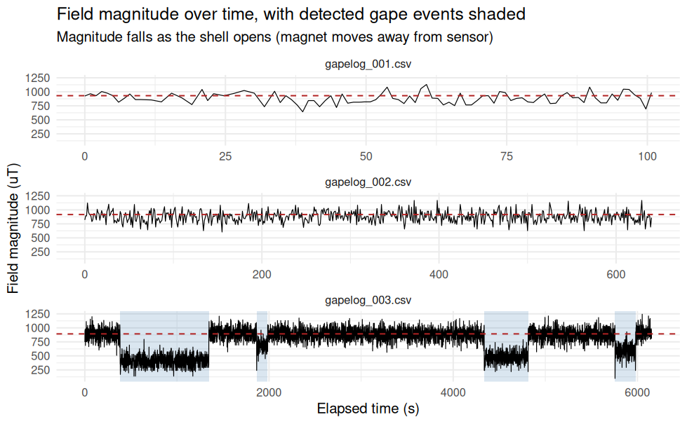

# INTRO
A while ago, [Steven asked me to spec out a gape monitoring system](https://github.com/RobertsLab/resources/issues/2327) (GitHub Issue). The idea was based on the [valve gape monitoring system](https://www.sciencedirect.com/science/article/pii/S1470160X24005429) (ScienceDirect) described in the paper by H. M. Stokes et al., 2024. In that paper, they set up a small Arduino-based system to monitor the valve gape of bivalves. The system used a small data logger, magnets and a three-axis magnetometer to measure assess frequency, duration, and the amplitude of the gape movements. 

A primary advantage of this system is that it is relatively inexpensive (for example, the Arduino units only cost ~$13 each) and can be easily deployed in the field.

We've purchased something similar to the system described in the paper, and I was tasked with setting up the initial configuration and running some simulations to test the system's performance.

# MATERIALS & METHODS

I used the following materials to set up the initial configuration of the gape monitoring system:

- Adafruit RP2040 Feather Adalogger (Arduino-based data logger)

- Adafruit TLV493D 3-Axis Magnetometer

- 4mm x 2mm neodymium magnets

- one dead oyster

## Initial Configuration

First, I installed the CircuitPython extension for VS Code. The primary advantage of this is being able to view/use the Serial console directly in VS Code, which makes it easier to debug and test the code.

The CircuitPython extension for VS Code is available in the VS Code marketplace. Briefly, once it's installed, connect the Adafruit RP2040 Feather Adalogger to your computer via USB, and then Open the the CICRUITPY folder in VS Code. The CircuitPython extension will automatically detect the Adafruit RP2040 Feather Adalogger. Then, you can open the Serial console in VS Code by clicking on the "CircuitPython: Open Serial Console" button in the bottom right corner of VS Code. This will open a terminal window that allows you to view the output from the Adafruit RP2040 Feather Adalogger.

The Adfruit website has a [great tutorial](https://learn.adafruit.com/adafruit-feather-rp2040-adalogger/install-circuitpython) (Adafruit website) on how to set up the Adafruit RP2040 Feather Adalogger with CircuitPython. I followed the steps in that tutorial to get the data logger up and running.

The initial configuration involved the following steps:

1. [Initialize the Adafruit RP2040 Feather Adalogger with CircuitPython](https://learn.adafruit.com/adafruit-feather-rp2040-adalogger/install-circuitpython) (Adafruit website).

2. Install the CircuitPython libraries, using the [entire Adafruit CircuitPython Bundle for Version 10.x](https://circuitpython.org/libraries), on the Adafruit RP2040 Feather Adalogger.

3. Attach the Adafruit TLV493D 3-Axis Magnetometer to the Adafruit RP2040 Feather Adalogger via the STEMMA QT connection.

After that was setup, I used some [basic code provided by Adafruit](https://learn.adafruit.com/adafruit-tlv493-triple-axis-magnetometer?view=all#example-code-3039148) to test the magnetometer and ensure that I could get readings. The code was able to read the magnetic field values from the magnetometer and print them to the console.

## Code

With the assistance Claude Science, I was able to modify the code to log the magnetic field values to a CSV file on the Adafruit RP2040 Feather Adalogger. The code is available in [`code.py`](https://github.com/RobertsLab/code/blob/master/gape_monitoring/time-elapsed/code.py) (GitHub). The code logs the magnetic field values to a CSV file every 1 second. The CSV file is saved to the Adafruit RP2040 Feather Adalogger's SD card. Currently, the code only logs cumulative time elapsed since the start of the program (e.g. when the Adafruit RP2040 Feather Adalogger is powered on) due to the fact that the Adafruit RP2040 Feather Adalogger does not have a real-time clock. However, I plan to add a real-time clock to the system in the future, which will allow me to log the actual date and time of each reading.

::: {.callout-important}

The code will be continually updated and improved over time. Please check the GitHub repository for the latest version of the code. For example, currently the code does not perform any calibration adjustments for the magnetometer and does not assess gape distance. Additionally, the code does not assess whether or not the changes in the magnetic field values identified as gape events are statistically significantly different from the background noise. These are all things that will be added in the future.

:::

## Simulations

I used masking tape to attache the magnetometer to the leading edge of the bottom valve of the dead oyster. Initially, I attached a single magnet to the leading edge of the top valve of the dead oyster. The magnetic field that was able to be detected from a single magnet was very weak and had me concerned that they would be indistinguishable from the background noise. I then _stacked_ (side-by-side seemed to cancel out the magnetic field) a second magnet to the leading edge of the top valve of the dead oyster, and this increased the magnetic field strength that was detected by the magnetometer.

I used small piece of plastic to keep the shell open ~5mm for various durations and recorded the data from the magnetometer. The data was logged to a CSV file on the Adafruit RP2040 Feather Adalogger's SD card. I then used R to read in the CSV file and plot the magnetic field values over time.

## Analysis

Using Claude Science, [I produced an R Markdown file](https://github.com/RobertsLab/code/blob/master/gape_monitoring/time-elapsed/gaping_analysis-time-elapsed.Rmd) (GitHub) was able to analyze the data from the CSV file and plot the magnetic field values over time, while also highlighting the periods of time when the shell was open.

# RESULTS

Data analysis seems to work as desired. The magnetic field values are clearly distinguishable from the background noise, and the periods of time when the shell was open are clearly visible in the plots.

# SUMMARY

Overall, this is a promising start to the gape monitoring system. The initial configuration and simulations have shown that the system is capable of detecting the valve gape of bivalves, and the data analysis has been successful in identifying the periods of time when the shell was open.

Next, I plan to add a real-time clock to the system, which will allow me to log the actual date and time of each reading. Additionally, I plan to determine calibration values (e.g. correlate magnetic field values with known gape measurements) for all three magnetometers, which will allow me to convert the magnetic field values to actual gape measurements. Once these are completed, I'll test out on live oysters in the lab.

