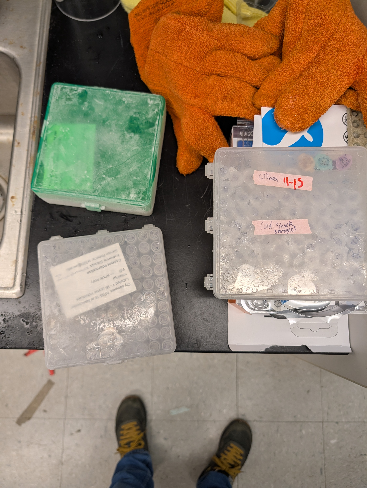
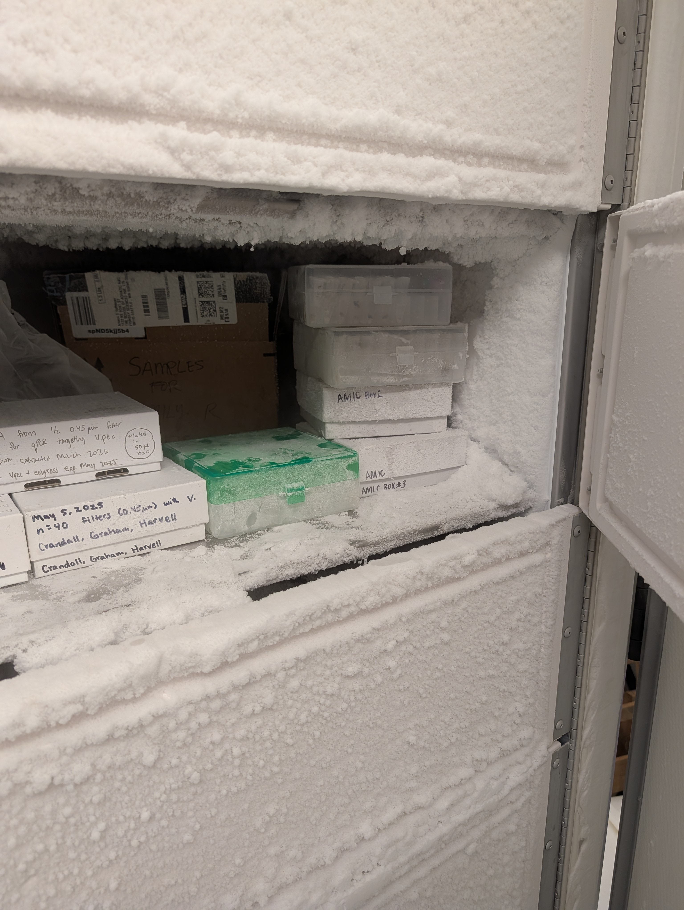

# INTRO

[Katherine Silliman (NOAA - Atlantic Oceanographic and Meteorological Laboratory)](https://www.aoml.noaa.gov/people/katherine-silliman/) needed some help storing -80oC samples from her Ph.D. research. We received the boxes of samples, still frozen on dry ice.

Samples were transferred to our -80oC freezer for long-term storage.

Most were transferred to our primary -80oC freezer and logged in our [-80oC freezer inventory](https://docs.google.com/spreadsheets/d/1Qsvz3QTURlPF_hX05BQxjom3484WuMfqQ1ILl9LEljU/edit?usp=sharing) (Google Sheet), but a few were transferred to our secondary -80oC freezer for storage due to the use of large plastic boxes which do not fit in our primary -80oC freezer racks.

::: {layout-ncol="2"}

:::

Box contents can be accessed here: [Freezer Box Contents](https://docs.google.com/spreadsheets/d/1Qsvz3QTURlPF_hX05BQxjom3484WuMfqQ1ILl9LEljU/edit?usp=sharing) (Google Sheet).