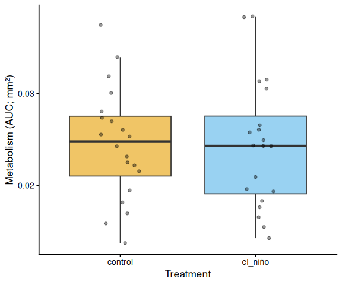
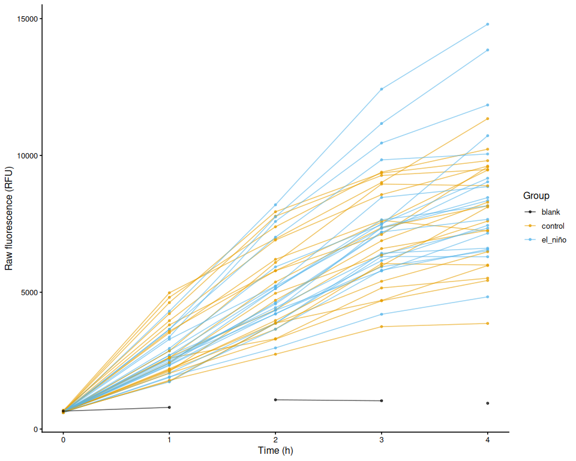
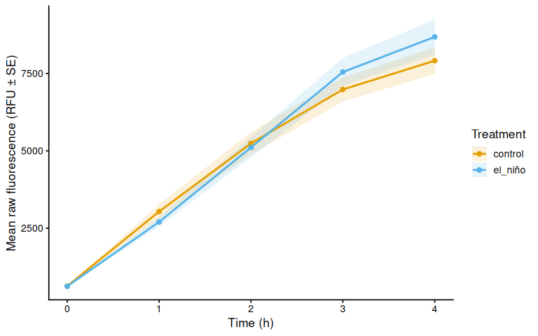
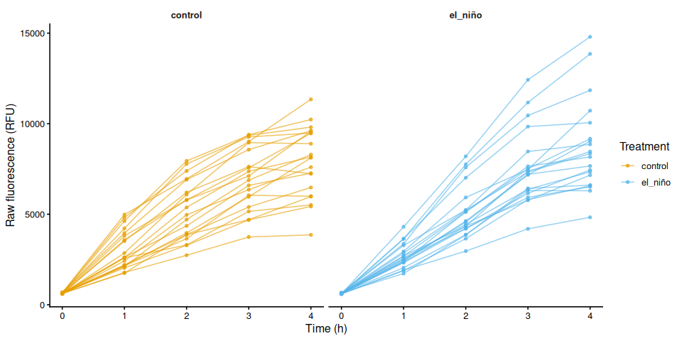
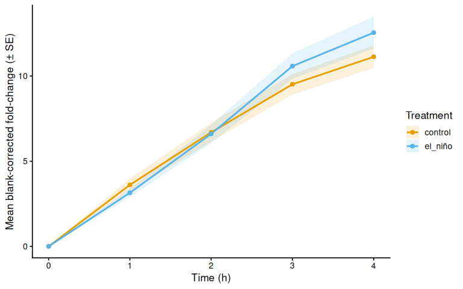
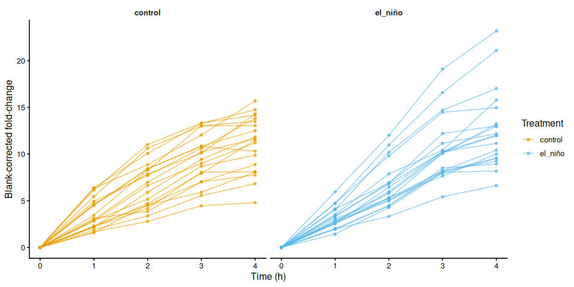
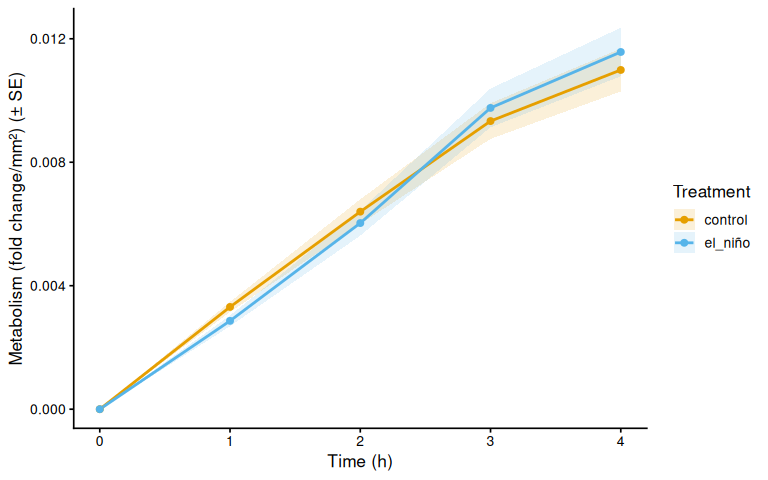
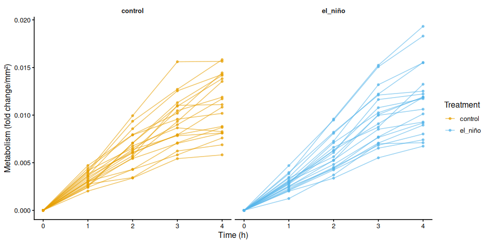

# INTRO

Steven wanted to assess metabolism of adult *Magallana gigas* (Pacific oyster) that had previously been subjected to an "El Niño" conditioning treatment, relative to untreated controls, during an acute 36°C heat stress. The goal was to determine whether "El Niño" conditioning altered the metabolic response to heat stress.

# MATERIALS & METHODS

Adult *Magallana gigas* were previously subjected to an "El Niño" treatment (parameters/duration still needed from Steven Roberts) and then held at 10°C (duration still needed from Steven Roberts) in artificial seawater (Instant Ocean).

Today, control (n = 20) and "El Niño" (n = 20) oysters were transferred to 12oz plastic cups containing 125mL of resazurin working solution and subjected to a four hour heat stress at 36°C in a floor-standing incubator.

Every hour (0, 1, 2, 3, and 4hrs), 200µL of resazurin was transferred from each cup to a well in a clear, 96-well plate. The plates (`plate-D`, `plate-E`, `plate-F`) were stored overnight at 4°C, covered in foil. The following morning, resazurin fluorescence was measured using a Synergy HTX (Agilent) plate reader.

Because each well holds a single read (rather than a well being re-read across the time series), individual oysters were tracked across timepoints using `sample_ID.group` in the layout file.

## Area Measurements

Oyster shell areas (mm²) were measured in ImageJ and used to size-normalize metabolic rates. Images and ImageJ outputs are in [`resazurin/data/20260921-mgig-36C/images/`](https://github.com/RobertsLab/project-SENO/tree/main/resazurin/data/20260921-mgig-36C/images) (GitHub).


## Data Analysis


Analysis was performed with [`01.00-resazurin-20260921-mgig-36C.Rmd`](https://github.com/RobertsLab/project-SENO/blob/main/resazurin/code/01.00-resazurin-20260921-mgig-36C.Rmd) (GitHub).


See [`resazurin/data/20260921-mgig-36C/README.md`](https://github.com/RobertsLab/project-SENO/blob/main/resazurin/data/20260921-mgig-36C/README.md) (GitHub) for full experimental notes.


# RESULTS

"El Niño" conditioning had no detectable effect on size-normalized metabolic rate during the 36°C heat stress.

Area under the curve (AUC) of size-normalized metabolism was essentially identical between the two treatments (ANOVA: F = 0.0025, p = 0.9604; Tukey: estimate = 0.0001, p = 0.9604):

| Treatment | n   | Mean AUC | SD      | SE      | Median  |
|:----------|----:|---------:|--------:|--------:|--------:|
| control   | 20  | 0.0245   | 0.00610 | 0.00136 | 0.0248  |
| el_niño   | 20  | 0.0244   | 0.00697 | 0.00156 | 0.0243  |

The same pattern held in the time-series mixed model. Time was a very strong predictor of metabolism (F = 384.04, p < 0.0001), as expected for resazurin reduction accumulating over the assay, but neither treatment (F = 0.0053, p = 0.9423) nor the time × treatment interaction (F = 0.9640, p = 0.4291) was significant. No individual timepoint showed a significant difference between treatments (all Tukey p ≥ 0.38).

All 40 oysters were retained — no wells were excluded from analysis.





Markdown below was knitted from [01.00-resazurin-20260921-mgig-36C.Rmd](https://github.com/RobertsLab/project-SENO/blob/main/resazurin/code/01.00-resazurin-20260921-mgig-36C.Rmd) (GitHub).

<a href="https://robertslab.github.io/resources/Agentic-Coding-Tools/#five-level-rubric"></a>

---
# 1 Background

Adult *M. gigas* (Pacific oyster) previously subjected to an “El Niño”
treatment, alongside untreated controls (n = 20 per treatment), were
placed in 12 oz plastic cups containing 125 mL of resazurin working
solution and held at 36°C in a floor-standing incubator for four hours.
Every hour, 200 µL of resazurin was transferred from each cup to a well
of a clear 96-well plate. Plates were stored overnight at 4°C covered in
foil, and fluorescence was read the following morning on a Synergy HTX
(Agilent) plate reader.

See `resazurin/data/20260921-mgig-36C/README.md` for full experimental
notes.

## 1.1 Where the timepoint comes from

Two layouts are supported, and the script auto-detects which one
applies:

| Design | Timepoint source | Example |
|:---|:---|:---|
| One file per plate **per timepoint** | Plate export **filename**, e.g. `<date>_<plate>_T<hr>.txt` | `20260624_round1_T3.txt` |
| One file per plate, **several timepoints per plate** | A `timepoint` column in **`layout.csv`** | `plate-D.txt` + `timepoint` = `T0`/`T1` |

This experiment uses the second design: `plate-D.txt`, `plate-E.txt` and
`plate-F.txt` each hold one or two hourly reads, and `layout.csv`
records which well belongs to which timepoint. Because a well is then
read only once, `sample_ID.group` is **required** — it is the only thing
linking the same animal across timepoints — and the script stops with an
explanatory error if it is missing. Timepoint labels may be bare numbers
(`0`, `1.5`), `T`-prefixed (`T0`, `T3`) or unit-suffixed (`4h`,
`90min`).

## 1.2 Expected inputs

| Path | Description |
|:---|:---|
| `<data_dir>/*.txt` | Plate reader fluorescence exports (files without a `Results` block are reported and skipped) |
| `<data_dir>/layout.csv` | Well metadata: plate ID, well ID, blank flag, optional `timepoint`, any number of `*.group` columns (e.g. `family_ID.group`, `treatment.group`, `sample_ID.group`) and any number of `*.measurement` columns (e.g. `area_mm2.measurement`, from ImageJ) |

`data_dir` and `analysis_name` are set in the `Variables` chunk under
`Setup`; in normal use those are the only lines that need editing
between experiments (`out_dir` is derived from `analysis_name`).

## 1.3 Expected outputs

All outputs are written to `out_dir`
(`resazurin/outputs/01.00-resazurin-20260921-mgig-36C/`), a directory
named identically to this script. The knitted `.md`/`.html` render and
its `*_files/` figure folder are written separately by knitr, next to
this `.Rmd` in `resazurin/code/`.

| File | Description |
|:---|:---|
| `figures/` | All plots generated by this script |
| `auc_all_metrics.csv` | Per-individual AUC values for every active measurement metric |
| `auc_summary.csv` | Group-level AUC summary statistics (mean, SD, SE, median) |
| `metabolism.csv` | Full per-well per-timepoint metabolism data frame |
| `pairwise_stats.csv` | Tukey-adjusted pairwise comparisons from AUC linear models |

# 2 Setup

## 2.1 Knitr options

``` r
knitr::opts_chunk$set(
  echo = TRUE,         # Display code chunks
  eval = TRUE,        # Evaluate code chunks
  warning = FALSE,     # Hide warnings
  message = FALSE,     # Hide messages
  comment = "",         # Prevents appending '##' to beginning of lines in code output
  results = 'hold'     # Holds output so it's all printed together after code chunk
)
```

## 2.2 Variables

The values below are the only ones that normally need editing when this
script is reused for another experiment or project. Everything
downstream is derived from them.

| Variable | Purpose |
|:---|:---|
| `proj_root` | Repository root, located automatically from the `.Rproj` file |
| `analysis_name` | This script’s name; also names the outputs directory |
| `data_dir` | Directory holding the plate exports and `layout.csv` |
| `out_dir` | Directory for generated figures and data tables |
| `fig_dir` | Figures subdirectory of `out_dir` |
| `plate_file_pattern` | Which files in `data_dir` are plate reader exports |

``` r
# Repository root, so every path below is absolute and independent of the
# working directory a chunk happens to run in.
proj_root <- rprojroot::find_rstudio_root_file()

# This script's own name. Per lab convention the outputs directory is named
# identically to the .Rmd that writes it. (The knitted .md/.html and its
# `*_files/` folder are written next to the .Rmd in `code/` by knitr itself,
# and are unrelated to `out_dir`.)
analysis_name <- "01.00-resazurin-20260921-mgig-36C"

# INPUT: plate reader exports and layout.csv for this experiment.
data_dir <- file.path(proj_root, "resazurin", "data", "20260921-mgig-36C")

# OUTPUT: generated figures and data tables.
out_dir <- file.path(proj_root, "resazurin", "outputs", analysis_name)
fig_dir <- file.path(out_dir, "figures")

# Which files in `data_dir` are plate reader exports. The default accepts any
# .txt; anything without a "Results" block is reported and skipped.
plate_file_pattern <- "(?i)\\.txt$"

dir.create(out_dir, recursive = TRUE, showWarnings = FALSE)
dir.create(fig_dir, recursive = TRUE, showWarnings = FALSE)
```

## 2.3 Load libraries

``` r
library(tidyverse)
library(pracma)       # trapz()
library(lme4)
library(lmerTest)
library(emmeans)
library(multcompView)
library(cowplot)
library(colorspace)   # qualitative_hcl() for large palettes
```

## 2.4 Helper Functions

Small, self-contained functions used throughout the script. Each is
defined in its own chunk so it can be re-run in isolation while
developing.

### 2.4.1 Normalise well IDs

Converts a well label to a canonical `<row><unpadded column>` form so
that `A01` from `layout.csv` and `A1` from the plate reader export
compare equal. Returns `NA` for anything that is not a well label.

``` r
normalize_well_id <- function(x) {
  x <- toupper(trimws(x))
  valid <- str_detect(x, "^[A-Z]+[0-9]+$")
  out <- rep(NA_character_, length(x))
  if (!any(valid)) return(out)
  m <- str_match(x[valid], "^([A-Z]+)([0-9]+)$")
  out[valid] <- paste0(m[, 2], as.integer(m[, 3]))
  out
}
```

### 2.4.2 Timepoint from a plate export filename

Reads the timepoint encoded in the filename, e.g. `..._T3.txt` gives
`3`. Returns `NA` when the filename carries no timepoint token, in which
case the timepoint is taken from the layout file instead (see
`timepoint_source`).

``` r
parse_time_hr <- function(path) {
  hit <- str_match(basename(path),
                   "(?i)[_-]T([0-9]+(?:\\.[0-9]+)?)\\.[^.]+$")
  as.numeric(hit[, 2])
}
```

### 2.4.3 Plate ID from a plate export filename

Must resolve to the same value as `plate_id` in `layout.csv`, which is
lower-cased and has any `plate-`/`plate_` prefix stripped. Handles both
file naming conventions:

| Filename                 | Plate ID                        |
|:-------------------------|:--------------------------------|
| `20260624_round1_T3.txt` | `round1` (date_plate_timepoint) |
| `plate-D.txt`            | `d` (one file per plate)        |

``` r
parse_plate_id <- function(path) {
  base     <- str_remove(basename(path), "\\.[^.]+$")
  has_time <- !is.na(parse_time_hr(path))
  dated    <- str_match(
    base, "(?i)^[0-9]{8}[_-](.+?)[_-]T[0-9]+(?:\\.[0-9]+)?$")[, 2]
  id <- if (!is.na(dated)) {
    dated
  } else if (has_time) {
    str_remove(base, "(?i)[_-]T[0-9]+(?:\\.[0-9]+)?$")
  } else {
    base
  }
  id <- str_remove(str_to_lower(trimws(id)), "^plate[_-]")
  if (is.na(id) || id == "") "unknown" else id
}
```

### 2.4.4 Timepoint from a layout label

Converts a layout timepoint label to numeric hours. Accepts bare numbers
(`0`, `1.5`), T-prefixed labels (`T0`, `t3`) and unit suffixes (`4h`,
and `90min` which becomes `1.5`). Returns `NA` when no number can be
recovered.

``` r
parse_timepoint_hr <- function(x) {
  x      <- trimws(as.character(x))
  num    <- suppressWarnings(as.numeric(str_extract(x, "[0-9]+(?:\\.[0-9]+)?")))
  is_min <- str_detect(str_to_lower(replace_na(x, "")), "min")
  if_else(is_min & !is.na(num), num / 60, num)
}
```

### 2.4.5 Locate the results block in a plate export

Plate reader exports begin with a long instrument header. This finds the
`Results` marker and returns the column IDs and the raw data lines that
follow it, stopping at the first blank or non-data line. Errors if the
file has no `Results` section, which is how non-plate `.txt` files get
skipped.

``` r
extract_results_block <- function(lines) {
  results_idx <- which(trimws(lines) == "Results")
  if (length(results_idx) == 0) stop("No Results section found")
  idx <- results_idx[1]
  header_tokens <- str_split(lines[idx + 1], "\\t")[[1]] |> trimws()
  col_ids <- header_tokens[
    header_tokens != "" & str_detect(header_tokens, "^[0-9]+$")]
  j <- idx + 2
  data_lines <- character()
  while (j <= length(lines)) {
    line <- lines[j]
    if (trimws(line) == "") break
    if (!str_detect(line, "^[A-Za-z]\\t")) break
    data_lines <- c(data_lines, line)
    j <- j + 1
  }
  list(col_ids = col_ids, data_lines = data_lines)
}
```

### 2.4.6 Parse a plate export into a data frame

Turns one plate reader export into a long data frame of one row per
well, carrying the plate ID and (when the filename supplies it) the
timepoint.

``` r
parse_plate_export <- function(path) {
  lines <- readLines(path, warn = FALSE)
  res <- extract_results_block(lines)

  map_dfr(res$data_lines, function(line) {
    tokens <- str_split(line, "\\t")[[1]] |> trimws()
    tokens <- tokens[tokens != ""]
    row_letter <- tokens[1]
    nums <- suppressWarnings(as.numeric(tokens[-1]))
    valid_idx <- which(!is.na(nums))
    if (length(valid_idx) == 0) return(tibble())
    vals <- nums[valid_idx]
    n <- min(length(vals), length(res$col_ids))
    tibble(
      row_id  = toupper(row_letter),
      col_id  = as.integer(res$col_ids[seq_len(n)]),
      well_id = normalize_well_id(
        paste0(toupper(row_letter), res$col_ids[seq_len(n)])),
      value   = vals[seq_len(n)]
    )
  }) %>%
    mutate(
      plate_id = str_to_lower(parse_plate_id(path)),
      time_hr  = parse_time_hr(path)
    )
}
```

### 2.4.7 Identify an individual across timepoints

Produces the `trace_id` used for line traces, fold-change baselines,
repeated-measures random effects and AUC grouping. The correct fallback
depends on where the timepoint comes from:

- **Filename** — the same well is re-read at every timepoint, so plate +
  well already identifies the individual.
- **Layout** — a well holds a single read, so plate + well cannot span
  time and `sample_ID.group` is required (validated when the layout is
  loaded).

Blanks are keyed separately so they never merge with sample traces.

``` r
trace_key <- function(df, timepoint_source = "filename") {
  well_key <- paste(df$plate_id, df$well_id, sep = "_")
  fallback <- if (identical(timepoint_source, "layout")) df$plate_id else well_key

  sid <- if ("sample_id_group" %in% names(df))
    as.character(df$sample_id_group) else rep(NA_character_, nrow(df))
  has_sid <- !is.na(sid) & trimws(sid) != ""

  blank <- if ("is_blank" %in% names(df))
    replace_na(df$is_blank, FALSE) else rep(FALSE, nrow(df))

  if_else(blank,
          paste0("blank_", fallback),
          if_else(has_sid, sid, fallback))
}
```

### 2.4.8 Populated values of a column

Distinct non-empty values of a column, or `character(0)` if the column
is absent. Keeps figure code from failing on layouts that omit a
grouping column.

``` r
col_values <- function(df, col) {
  if (!col %in% names(df)) return(character(0))
  v <- as.character(df[[col]])
  unique(v[!is.na(v) & trimws(v) != ""])
}
```

### 2.4.9 Trapezoidal area under the curve

Integrates a value against time by the trapezoid rule, ignoring
non-finite points. Returns `NA` when fewer than two usable points
remain.

``` r
trapezoid_auc <- function(time_hr, value) {
  ok <- is.finite(time_hr) & is.finite(value)
  t <- time_hr[ok]
  v <- value[ok]
  if (length(t) < 2) return(NA_real_)
  ord <- order(t)
  t <- t[ord]; v <- v[ord]
  sum(diff(t) * (head(v, -1) + tail(v, -1)) / 2)
}
```

### 2.4.10 Measurement unit from a column name

Extracts the display unit from a measurement column name, so axis labels
follow whichever `*.measurement` columns the layout happens to provide.
For example `area_mm2_measurement` gives `mm²` and
`weight_mg_measurement` gives `mg`.

``` r
parse_meas_unit <- function(col_name) {
  unit_raw <- col_name |>
    str_remove("^metabolism_per_") |>
    str_remove("_measurement$") |>
    str_extract("[^_]+$")
  case_when(
    unit_raw == "mm2" ~ "mm²",
    unit_raw == "cm2" ~ "cm²",
    unit_raw == "mm3" ~ "mm³",
    unit_raw == "cm3" ~ "cm³",
    TRUE              ~ unit_raw
  )
}
```

### 2.4.11 Metabolism y-axis label

Builds the y-axis label for metabolism line plots, e.g.
`Metabolism (fold change/mm²)`.

``` r
metabolism_y_label <- function(col_name) {
  paste0("Metabolism (fold change/", parse_meas_unit(col_name), ")")
}
```

### 2.4.12 AUC y-axis label

Builds the y-axis label for AUC box plots, e.g. `Metabolism (AUC; mm²)`.

``` r
auc_y_label <- function(metric_name) {
  paste0("Metabolism (AUC; ", parse_meas_unit(metric_name), ")")
}
```

### 2.4.13 Mean ± SE time-series plot

Mean ± SE time series of `value_col`, one coloured line per level of
`colour_col`, optionally split into linetypes by a second grouping
column. Wells flagged `exclude_from_analysis` are dropped.

``` r
mean_ts_plot <- function(df, value_col, colour_col, colours, legend_name,
                         y_lab, linetype_col = NULL, linetypes = NULL) {
  if (!is.null(linetype_col) && !linetype_col %in% names(df))
    linetype_col <- NULL

  grp <- c(colour_col, linetype_col, "time_hr")
  summ <- df %>%
    filter(!is.na(.data[[colour_col]]), !exclude_from_analysis) %>%
    group_by(across(all_of(grp))) %>%
    summarise(
      mean_val = mean(.data[[value_col]], na.rm = TRUE),
      se_val   = sd(.data[[value_col]], na.rm = TRUE) /
                 sqrt(sum(!is.na(.data[[value_col]]))),
      n        = sum(!is.na(.data[[value_col]])),
      .groups  = "drop"
    ) %>%
    mutate(group_var = if (is.null(linetype_col))
      as.character(.data[[colour_col]])
    else
      paste(.data[[colour_col]], .data[[linetype_col]], sep = "."))

  p <- ggplot(summ, aes(x = time_hr, y = mean_val,
                        colour = .data[[colour_col]], group = group_var)) +
    geom_ribbon(aes(ymin = mean_val - se_val, ymax = mean_val + se_val,
                    fill = .data[[colour_col]]),
                alpha = 0.15, colour = NA) +
    geom_line(mapping = if (!is.null(linetype_col))
                aes(linetype = .data[[linetype_col]]) else NULL,
              linewidth = 1) +
    geom_point(size = 2) +
    scale_colour_manual(values = colours, name = legend_name,
                        breaks = names(colours)) +
    scale_fill_manual(values = colours, name = legend_name,
                      breaks = names(colours)) +
    labs(x = "Time (h)", y = y_lab) +
    theme_classic(base_size = 13)

  if (!is.null(linetype_col))
    p <- p + scale_linetype_manual(values = linetypes, name = "Treatment")
  p
}
```

### 2.4.14 Individual-trace time-series plot

One line per individual (`trace_id`), faceted by `facet_col` and
coloured by `colour_col`.

``` r
individual_ts_plot <- function(df, value_col, facet_col, colour_col,
                               colours, legend_name, y_lab) {
  df %>%
    filter(!is.na(.data[[facet_col]])) %>%
    ggplot(aes(x = time_hr, y = .data[[value_col]], group = trace_id,
               colour = .data[[colour_col]])) +
    geom_line(alpha = 0.6) +
    geom_point(size = 1.2, alpha = 0.7) +
    facet_wrap(vars(.data[[facet_col]])) +
    scale_colour_manual(values = colours, name = legend_name,
                        breaks = names(colours)) +
    labs(x = "Time (h)", y = y_lab) +
    theme_classic(base_size = 12) +
    theme(strip.background = element_blank(),
          strip.text       = element_text(face = "bold"))
}
```

# 3 Load Data

## 3.1 Plate export files

``` r
plate_files <- list.files(data_dir, pattern = plate_file_pattern,
                          full.names = TRUE)

if (length(plate_files) == 0)
  stop("No files matching '", plate_file_pattern, "' found in ", data_dir)

plate_raw <- map_dfr(plate_files, function(path) {
  tryCatch(parse_plate_export(path),
           error = function(e) {
             message("Parse error in ", basename(path), ": ", e$message)
             tibble()
           })
})

str(plate_raw)
```

    tibble [288 × 6] (S3: tbl_df/tbl/data.frame)
     $ row_id  : chr [1:288] "A" "A" "A" "A" ...
     $ col_id  : int [1:288] 1 2 3 4 5 6 7 8 9 10 ...
     $ well_id : chr [1:288] "A1" "A2" "A3" "A4" ...
     $ value   : num [1:288] 597 609 609 631 601 669 655 599 623 614 ...
     $ plate_id: chr [1:288] "d" "d" "d" "d" ...
     $ time_hr : num [1:288] NA NA NA NA NA NA NA NA NA NA ...

## 3.2 Layout file

``` r
layout_path <- file.path(data_dir, "layout.csv")

layout_raw <- read_csv(layout_path,
                       col_types = cols(.default = "c"),
                       show_col_types = FALSE)

# Standardise column names to snake_case
names(layout_raw) <- names(layout_raw) |>
  str_to_lower() |>
  str_replace_all("[^a-z0-9]+", "_") |>
  str_replace_all("_+", "_") |>
  str_replace("_$", "")

# Normalise plate_id to match plate file ids (strip "plate-" prefix)
layout_clean <- layout_raw %>%
  mutate(
    plate_id = str_remove(str_to_lower(plate_id), "^plate-"),
    well_id  = normalize_well_id(plate_well),
    is_blank = if ("is_blank" %in% names(layout_raw))
      toupper(trimws(is_blank)) %in% c("TRUE", "T", "1", "YES", "Y")
    else
      FALSE
  )

# Trailing blank rows are common in hand-edited layout CSVs; drop anything
# without a resolvable plate + well.
layout_clean <- layout_clean %>%
  filter(!is.na(plate_id), plate_id != "", !is.na(well_id))

found_exclude_col <- intersect(
  c("exclude_from_analysis", "exclude", "omit", "not_analyzed"),
  names(layout_clean)
)[1]
layout_clean <- layout_clean %>%
  mutate(
    exclude_from_analysis = if (!is.na(found_exclude_col))
      toupper(trimws(.data[[found_exclude_col]])) %in%
        c("TRUE", "T", "1", "YES", "Y")
    else
      FALSE
  )

# Identify measurement columns and group columns
measurement_cols <- names(layout_clean)[
  str_detect(names(layout_clean), "_measurement$")]
group_cols <- names(layout_clean)[
  str_detect(names(layout_clean), "_group$")]

# Cast measurement columns to numeric
layout_clean <- layout_clean %>%
  mutate(across(all_of(measurement_cols),
                ~ suppressWarnings(as.numeric(.x))))

# Determine which measurement columns actually contain finite data
active_meas_cols <- measurement_cols[
  sapply(measurement_cols, function(col)
    any(is.finite(layout_clean[[col]]), na.rm = TRUE))]

# Normalise group values to lowercase so they match colour scale definitions
layout_clean <- layout_clean %>%
  mutate(across(all_of(group_cols),
                ~ str_to_lower(trimws(as.character(.x)))))

# --- Timepoint source ------------------------------------------------------
# Prefer a timepoint column in the layout (per-well, so one plate file may hold
# several timepoints); fall back to the timepoint parsed from the filename.
timepoint_col <- intersect(
  c("timepoint", "time_point", "timepoint_hr", "time_hr", "time_hrs",
    "time_h", "hours", "hour", "time"),
  names(layout_clean)
)[1]

layout_time_ok <- !is.na(timepoint_col) &&
  any(is.finite(parse_timepoint_hr(layout_clean[[timepoint_col]])))
filename_time_ok <- any(is.finite(plate_raw$time_hr))

timepoint_source <- if (layout_time_ok) "layout" else
  if (filename_time_ok) "filename" else NA_character_

if (is.na(timepoint_source))
  stop("Could not determine a timepoint for any read. Either name plate export ",
       "files '<...>_T<hr>.txt' or add a `timepoint` column to layout.csv.")

if (layout_time_ok && filename_time_ok)
  message("Timepoints found in both the layout and the filenames; ",
          "the layout column `", timepoint_col, "` takes precedence.")

if (timepoint_source == "layout") {
  layout_clean <- layout_clean %>%
    mutate(
      timepoint_label = as.character(.data[[timepoint_col]]),
      time_hr         = parse_timepoint_hr(.data[[timepoint_col]])
    )

  # With layout-supplied timepoints a well is read once, so plate + well cannot
  # follow an individual through the time series - sample IDs are the only link.
  sample_ids_present <- "sample_id_group" %in% names(layout_clean) &&
    any(!is.na(layout_clean$sample_id_group) &
        trimws(layout_clean$sample_id_group) != "")
  if (!sample_ids_present)
    stop("Timepoints come from layout.csv, so each well holds a single read ",
         "and plate + well cannot identify an individual across timepoints. ",
         "Populate a `sample_ID.group` column in layout.csv.")
}

message("Timepoint source: ", timepoint_source,
        if (timepoint_source == "layout")
          paste0(" (layout column `", timepoint_col, "`)") else "")
message("Group columns: ", paste(group_cols, collapse = ", "))
message("Active measurement columns: ",
        paste(active_meas_cols, collapse = ", "))

str(layout_clean)
```

    tibble [205 × 16] (S3: tbl_df/tbl/data.frame)
     $ plate_id             : chr [1:205] "d" "d" "d" "d" ...
     $ plate_well           : chr [1:205] "A01" "A02" "A03" "A04" ...
     $ is_blank             : logi [1:205] FALSE FALSE FALSE FALSE FALSE FALSE ...
     $ family_id_group      : chr [1:205] NA NA NA NA ...
     $ sample_id_group      : chr [1:205] "56" "72" "13" "65" ...
     $ treatment_group      : chr [1:205] "el_niño" "el_niño" "el_niño" "el_niño" ...
     $ timepoint            : chr [1:205] "T0" "T0" "T0" "T0" ...
     $ width_mm_measurement : num [1:205] NA NA NA NA NA NA NA NA NA NA ...
     $ length_mm_measurement: num [1:205] NA NA NA NA NA NA NA NA NA NA ...
     $ weight_mg_measurement: num [1:205] NA NA NA NA NA NA NA NA NA NA ...
     $ area_mm2_measurement : num [1:205] 617 950 1249 1004 1267 ...
     $ imagej_id            : chr [1:205] "8" "5" "2" "4" ...
     $ well_id              : chr [1:205] "A1" "A2" "A3" "A4" ...
     $ exclude_from_analysis: logi [1:205] FALSE FALSE FALSE FALSE FALSE FALSE ...
     $ timepoint_label      : chr [1:205] "T0" "T0" "T0" "T0" ...
     $ time_hr              : num [1:205] 0 0 0 0 0 0 0 0 0 0 ...

# 4 Merge Plate Data with Layout

``` r
dat <- plate_raw %>%
  # When the layout supplies the timepoint, drop the (all-NA) filename-derived
  # column so the layout is the single source of truth for `time_hr`.
  select(-any_of(if (timepoint_source == "layout") "time_hr" else character(0))) %>%
  left_join(
    layout_clean %>%
      select(plate_id, well_id, is_blank, exclude_from_analysis,
             any_of(c("exclude_reason", "timepoint_label", "time_hr")),
             all_of(group_cols), all_of(measurement_cols)),
    by = c("plate_id", "well_id")
  ) %>%
  mutate(
    is_blank              = replace_na(is_blank, FALSE),
    exclude_from_analysis = replace_na(exclude_from_analysis, FALSE)
  )

# Wells present in the plate export but with no usable timepoint cannot be
# placed in the time series: unused wells, or wells missing from layout.csv.
unassigned <- dat %>% filter(!is.finite(time_hr))
if (nrow(unassigned) > 0) {
  message(nrow(unassigned), " well read(s) dropped for having no layout ",
          "timepoint (e.g. ",
          paste(head(paste(unassigned$plate_id, unassigned$well_id, sep = ":"), 5),
                collapse = ", "), ")")
  dat <- dat %>% filter(is.finite(time_hr))
}

# Single definition of individual identity, reused downstream for line traces,
# fold-change baselines, repeated-measures random effects and AUC grouping.
dat$trace_id <- trace_key(dat, timepoint_source)

time_levels <- sort(unique(dat$time_hr))
message("Timepoints (h): ", paste(time_levels, collapse = ", "))

str(dat)
```

    tibble [205 × 17] (S3: tbl_df/tbl/data.frame)
     $ row_id               : chr [1:205] "A" "A" "A" "A" ...
     $ col_id               : int [1:205] 1 2 3 4 5 6 7 8 9 10 ...
     $ well_id              : chr [1:205] "A1" "A2" "A3" "A4" ...
     $ value                : num [1:205] 597 609 609 631 601 669 655 599 623 614 ...
     $ plate_id             : chr [1:205] "d" "d" "d" "d" ...
     $ is_blank             : logi [1:205] FALSE FALSE FALSE FALSE FALSE FALSE ...
     $ exclude_from_analysis: logi [1:205] FALSE FALSE FALSE FALSE FALSE FALSE ...
     $ timepoint_label      : chr [1:205] "T0" "T0" "T0" "T0" ...
     $ time_hr              : num [1:205] 0 0 0 0 0 0 0 0 0 0 ...
     $ family_id_group      : chr [1:205] NA NA NA NA ...
     $ sample_id_group      : chr [1:205] "56" "72" "13" "65" ...
     $ treatment_group      : chr [1:205] "el_niño" "el_niño" "el_niño" "el_niño" ...
     $ width_mm_measurement : num [1:205] NA NA NA NA NA NA NA NA NA NA ...
     $ length_mm_measurement: num [1:205] NA NA NA NA NA NA NA NA NA NA ...
     $ weight_mg_measurement: num [1:205] NA NA NA NA NA NA NA NA NA NA ...
     $ area_mm2_measurement : num [1:205] 617 950 1249 1004 1267 ...
     $ trace_id             : chr [1:205] "56" "72" "13" "65" ...

## 4.1 Plate consistency check

Checks that every plate x timepoint read covers the same number of
wells. The expected well count is the mode across all reads. Any plate
with at least one deviating read is flagged and dropped entirely before
any further analysis — removing only the aberrant read would break the
fold-change baseline calculation.

``` r
well_counts <- dat %>%
  group_by(plate_id, time_hr) %>%
  summarise(n_wells = n_distinct(well_id), .groups = "drop")

expected_n_wells <- as.integer(names(which.max(table(well_counts$n_wells))))

inconsistent_reads <- well_counts %>%
  filter(n_wells != expected_n_wells) %>%
  arrange(plate_id, time_hr)

inconsistent_plate_ids <- unique(inconsistent_reads$plate_id)

if (nrow(inconsistent_reads) > 0) {
  cat("**Plate consistency check FAILED.**",
      "Expected", expected_n_wells, "wells per plate-timepoint read.",
      length(inconsistent_plate_ids),
      "plate(s) have at least one deviating read and are excluded",
      "from all analyses:\n\n")
  cat(knitr::kable(
    inconsistent_reads,
    col.names = c("Plate", "Time (h)", "Wells read"),
    caption   = paste("Expected:", expected_n_wells, "wells per read")
  ), sep = "\n")
  cat("\n")
  dat <- dat %>% filter(!plate_id %in% inconsistent_plate_ids)
  message(length(inconsistent_plate_ids), " plate(s) removed from `dat`: ",
          paste(inconsistent_plate_ids, collapse = ", "))
} else {
  cat("Plate consistency check passed: all",
      n_distinct(well_counts$plate_id), "plate(s) read",
      expected_n_wells, "wells at every timepoint.\n")
}
```

Plate consistency check passed: all 3 plate(s) read 41 wells at every
timepoint.

# 5 Raw Fluorescence

## 5.1 Data frame

``` r
# Wells in the plate reader output that have no layout entry get all-NA group
# columns after the join. Keep only wells assigned to at least one group.
active_gc <- intersect(group_cols, names(dat))

raw_df <- dat %>%
  filter(
    !is_blank,
    if (length(active_gc) > 0)
      if_any(all_of(active_gc), ~ !is.na(.))
    else
      TRUE
  )

families   <- str_sort(col_values(raw_df, "family_id_group"), numeric = TRUE)
treatments <- sort(col_values(raw_df, "treatment_group"))

n_fam <- length(families)
n_trt <- length(treatments)

# Not every layout populates every grouping column — this experiment, for
# instance, has a treatment assignment but no family assignment. Figures and
# models keyed on a grouping column are skipped when that column is empty.
has_fam <- n_fam > 0
has_trt <- n_trt > 0

# Palette strategy:
#   <= 7 groups : Okabe-Ito (gold standard for colorblind-safe figures).
#   >  7 groups : colorspace::qualitative_hcl("Dynamic") scales to any N
#                 using perceptually uniform HCL space — no colour collisions.
# Black (#000000) is excluded from both and reserved for blank wells.
okabe_ito_7 <- c(
  "#E69F00", "#56B4E9", "#009E73", "#F0E442",
  "#0072B2", "#D55E00", "#CC79A7"
)
make_palette <- function(n) {
  if (n == 0L) return(character(0))
  if (n <= length(okabe_ito_7)) return(okabe_ito_7[seq_len(n)])
  colorspace::qualitative_hcl(n, palette = "Dynamic")
}

all_colours   <- make_palette(n_fam + n_trt)
fam_colours   <- setNames(all_colours[seq_len(n_fam)], families)
trt_colours   <- setNames(all_colours[n_fam + seq_len(n_trt)], treatments)

lty_pool <- c("solid", "dashed", "dotted", "dotdash", "longdash")
trt_linetypes <- setNames(
  lty_pool[(seq_len(n_trt) - 1L) %% length(lty_pool) + 1L],
  treatments
)

# QC plot colours: whichever grouping column is populated, plus black blanks.
plate_well_colours <- c(
  blank = "black",
  if (has_fam) fam_colours else if (has_trt) trt_colours else c(sample = "grey40")
)

str(raw_df)
```

    tibble [200 × 17] (S3: tbl_df/tbl/data.frame)
     $ row_id               : chr [1:200] "A" "A" "A" "A" ...
     $ col_id               : int [1:200] 1 2 3 4 5 6 7 8 9 10 ...
     $ well_id              : chr [1:200] "A1" "A2" "A3" "A4" ...
     $ value                : num [1:200] 597 609 609 631 601 669 655 599 623 614 ...
     $ plate_id             : chr [1:200] "d" "d" "d" "d" ...
     $ is_blank             : logi [1:200] FALSE FALSE FALSE FALSE FALSE FALSE ...
     $ exclude_from_analysis: logi [1:200] FALSE FALSE FALSE FALSE FALSE FALSE ...
     $ timepoint_label      : chr [1:200] "T0" "T0" "T0" "T0" ...
     $ time_hr              : num [1:200] 0 0 0 0 0 0 0 0 0 0 ...
     $ family_id_group      : chr [1:200] NA NA NA NA ...
     $ sample_id_group      : chr [1:200] "56" "72" "13" "65" ...
     $ treatment_group      : chr [1:200] "el_niño" "el_niño" "el_niño" "el_niño" ...
     $ width_mm_measurement : num [1:200] NA NA NA NA NA NA NA NA NA NA ...
     $ length_mm_measurement: num [1:200] NA NA NA NA NA NA NA NA NA NA ...
     $ weight_mg_measurement: num [1:200] NA NA NA NA NA NA NA NA NA NA ...
     $ area_mm2_measurement : num [1:200] 617 950 1249 1004 1267 ...
     $ trace_id             : chr [1:200] "56" "72" "13" "65" ...

## 5.2 Raw fluorescence, all wells (including blanks)

Faceted by plate when every plate spans the whole time series; when the
layout assigns timepoints a plate may cover only part of it, so the
panels are dropped and all traces are drawn together.

``` r
# Facet by plate only when every plate spans the whole time series. When the
# layout assigns timepoints, one plate may hold only part of the series and
# faceting would chop each individual's trace across panels.
plate_time_counts <- dat %>%
  group_by(plate_id) %>%
  summarise(n_times = n_distinct(time_hr), .groups = "drop")
plates_span_time <- nrow(plate_time_counts) > 0 &&
  all(plate_time_counts$n_times == length(time_levels))

p_raw_plates <- dat %>%
  filter(is.finite(time_hr), is.finite(value)) %>%
  mutate(colour_group = if_else(
    is_blank,
    "blank",
    if (has_fam) family_id_group else if (has_trt) treatment_group else "sample"
  )) %>%
  ggplot(aes(x = time_hr, y = value,
             group = trace_id, colour = colour_group)) +
  geom_line(alpha = 0.6) +
  geom_point(size = 1, alpha = 0.7) +
  scale_colour_manual(
    values   = plate_well_colours,
    name     = "Group",
    breaks   = names(plate_well_colours),
    na.value = "grey80"
  ) +
  labs(x = "Time (h)", y = "Raw fluorescence (RFU)") +
  theme_classic(base_size = 12) +
  theme(strip.background = element_blank(),
        strip.text       = element_text(face = "bold"))

if (plates_span_time) p_raw_plates <- p_raw_plates + facet_wrap(~ plate_id)

p_raw_plates
```

<!-- -->

``` r
ggsave(file.path(fig_dir, "raw_fluor_by_plate.png"),
       p_raw_plates, width = 10, height = 8)
```

## 5.3 Mean raw fluorescence by group

``` r
if (has_fam) {
  p <- mean_ts_plot(raw_df, "value", "family_id_group", fam_colours, "Family",
                    "Mean raw fluorescence (RFU ± SE)",
                    linetype_col = if (has_trt) "treatment_group" else NULL,
                    linetypes    = trt_linetypes)
  print(p)
  ggsave(file.path(fig_dir, "raw_mean_by_family.png"), p, width = 8, height = 5)
}

if (has_trt) {
  p <- mean_ts_plot(raw_df, "value", "treatment_group", trt_colours, "Treatment",
                    "Mean raw fluorescence (RFU ± SE)")
  print(p)
  ggsave(file.path(fig_dir, "raw_mean_by_treatment.png"), p, width = 8, height = 5)
}
```

<!-- -->

## 5.4 Individual raw fluorescence traces

``` r
if (has_fam) {
  p <- individual_ts_plot(
    raw_df, "value", facet_col = "family_id_group",
    colour_col = if (has_trt) "treatment_group" else "family_id_group",
    colours    = if (has_trt) trt_colours else fam_colours,
    legend_name = if (has_trt) "Treatment" else "Family",
    y_lab = "Raw fluorescence (RFU)")
  print(p)
  ggsave(file.path(fig_dir, "raw_individual_by_family.png"),
         p, width = 10, height = 5)
}

if (has_trt) {
  p <- individual_ts_plot(
    raw_df, "value", facet_col = "treatment_group",
    colour_col = if (has_fam) "family_id_group" else "treatment_group",
    colours    = if (has_fam) fam_colours else trt_colours,
    legend_name = if (has_fam) "Family" else "Treatment",
    y_lab = "Raw fluorescence (RFU)")
  print(p)
  ggsave(file.path(fig_dir, "raw_individual_by_treatment.png"),
         p, width = 10, height = 5)
}
```

<!-- -->

## 5.5 Excluded samples

Wells flagged `exclude_from_analysis = TRUE` appear in the raw
fluorescence plots above but are omitted from all analyses that follow.

``` r
excluded_wells <- dat %>%
  filter(!is_blank, exclude_from_analysis) %>%
  select(plate_id, well_id, sample = trace_id,
         any_of(c("family_id_group", "treatment_group", "exclude_reason"))) %>%
  distinct() %>%
  arrange(plate_id, well_id)

if (nrow(excluded_wells) > 0) {
  cat(knitr::kable(excluded_wells), sep = "\n")
} else {
  cat("No wells are excluded from analysis.\n")
}
```

No wells are excluded from analysis.

# 6 Blank Correction via Fold-Change Normalization

T0 is the earliest timepoint present in the dataset (not necessarily 0
hr). Sample fold-change is expressed relative to each individual’s T0
reading, where the individual is identified by `trace_id` (see
`trace_key()`): the `sample_ID.group` column when populated — allowing
the same animal to be tracked across plates and across wells — or
`plate_id + well_id` for single-plate designs where a well is re-read at
every timepoint. Blank fold-change is the per-plate mean blank RFU at
each timepoint divided by the pooled mean blank RFU at T0. Subtracting
blank fold-change from sample fold-change removes background
fluorescence drift; all samples start at exactly 0 at T0 by
construction.

## 6.1 Step 1 – Identify T0 and compute per-sample fold-change

``` r
# T0 = earliest timepoint present in the dataset
t0_time <- min(dat$time_hr[is.finite(dat$time_hr)], na.rm = TRUE)
message("T0 timepoint: ", t0_time, " hr")

# T0 reference value per individual.
t0_all <- dat %>%
  filter(time_hr == t0_time, !is_blank, is.finite(value)) %>%
  group_by(trace_id) %>%
  summarise(value_t0 = mean(value, na.rm = TRUE), .groups = "drop")

n_missing_t0 <- dat %>%
  filter(!is_blank, !trace_id %in% t0_all$trace_id) %>%
  pull(trace_id) %>%
  n_distinct()
if (n_missing_t0 > 0)
  message(n_missing_t0, " individual(s) have no T0 reading; ",
          "their fold-change will be NA.")

dat_fc <- dat %>%
  left_join(t0_all, by = "trace_id") %>%
  mutate(fold_change = if_else(
    !is_blank & is.finite(value_t0) & value_t0 > 0,
    value / value_t0,
    NA_real_
  ))

str(dat_fc)
```

    tibble [205 × 19] (S3: tbl_df/tbl/data.frame)
     $ row_id               : chr [1:205] "A" "A" "A" "A" ...
     $ col_id               : int [1:205] 1 2 3 4 5 6 7 8 9 10 ...
     $ well_id              : chr [1:205] "A1" "A2" "A3" "A4" ...
     $ value                : num [1:205] 597 609 609 631 601 669 655 599 623 614 ...
     $ plate_id             : chr [1:205] "d" "d" "d" "d" ...
     $ is_blank             : logi [1:205] FALSE FALSE FALSE FALSE FALSE FALSE ...
     $ exclude_from_analysis: logi [1:205] FALSE FALSE FALSE FALSE FALSE FALSE ...
     $ timepoint_label      : chr [1:205] "T0" "T0" "T0" "T0" ...
     $ time_hr              : num [1:205] 0 0 0 0 0 0 0 0 0 0 ...
     $ family_id_group      : chr [1:205] NA NA NA NA ...
     $ sample_id_group      : chr [1:205] "56" "72" "13" "65" ...
     $ treatment_group      : chr [1:205] "el_niño" "el_niño" "el_niño" "el_niño" ...
     $ width_mm_measurement : num [1:205] NA NA NA NA NA NA NA NA NA NA ...
     $ length_mm_measurement: num [1:205] NA NA NA NA NA NA NA NA NA NA ...
     $ weight_mg_measurement: num [1:205] NA NA NA NA NA NA NA NA NA NA ...
     $ area_mm2_measurement : num [1:205] 617 950 1249 1004 1267 ...
     $ trace_id             : chr [1:205] "56" "72" "13" "65" ...
     $ value_t0             : num [1:205] 597 609 609 631 601 669 655 599 623 614 ...
     $ fold_change          : num [1:205] 1 1 1 1 1 1 1 1 1 1 ...

## 6.2 Step 2 – Blank fold-change reference per plate per timepoint

``` r
# Pooled mean blank RFU at T0 across all T0 plates
mean_blank_t0 <- dat %>%
  filter(is_blank, time_hr == t0_time, is.finite(value)) %>%
  pull(value) %>%
  mean(na.rm = TRUE)

if (!is.finite(mean_blank_t0))
  message("No blank readings found at T0 (", t0_time,
          " hr); blank correction will produce NA.")

# Per-plate per-timepoint mean blank expressed as fold-change relative to T0
blank_fc_ref <- dat %>%
  filter(is_blank, is.finite(value)) %>%
  group_by(plate_id, time_hr) %>%
  summarise(mean_blank_rfu = mean(value, na.rm = TRUE), .groups = "drop") %>%
  mutate(mean_blank_fc = mean_blank_rfu / mean_blank_t0)

str(blank_fc_ref)
```

    tibble [5 × 4] (S3: tbl_df/tbl/data.frame)
     $ plate_id      : chr [1:5] "d" "d" "e" "e" ...
     $ time_hr       : num [1:5] 0 1 2 3 4
     $ mean_blank_rfu: num [1:5] 655 792 1067 1033 943
     $ mean_blank_fc : num [1:5] 1 1.21 1.63 1.58 1.44

## 6.3 Step 3 – Subtract blank fold-change from sample fold-change

``` r
samples <- dat_fc %>%
  filter(!is_blank, !exclude_from_analysis) %>%
  left_join(blank_fc_ref, by = c("plate_id", "time_hr")) %>%
  mutate(corrected_fc = fold_change - mean_blank_fc)

str(samples)
```

    tibble [200 × 22] (S3: tbl_df/tbl/data.frame)
     $ row_id               : chr [1:200] "A" "A" "A" "A" ...
     $ col_id               : int [1:200] 1 2 3 4 5 6 7 8 9 10 ...
     $ well_id              : chr [1:200] "A1" "A2" "A3" "A4" ...
     $ value                : num [1:200] 597 609 609 631 601 669 655 599 623 614 ...
     $ plate_id             : chr [1:200] "d" "d" "d" "d" ...
     $ is_blank             : logi [1:200] FALSE FALSE FALSE FALSE FALSE FALSE ...
     $ exclude_from_analysis: logi [1:200] FALSE FALSE FALSE FALSE FALSE FALSE ...
     $ timepoint_label      : chr [1:200] "T0" "T0" "T0" "T0" ...
     $ time_hr              : num [1:200] 0 0 0 0 0 0 0 0 0 0 ...
     $ family_id_group      : chr [1:200] NA NA NA NA ...
     $ sample_id_group      : chr [1:200] "56" "72" "13" "65" ...
     $ treatment_group      : chr [1:200] "el_niño" "el_niño" "el_niño" "el_niño" ...
     $ width_mm_measurement : num [1:200] NA NA NA NA NA NA NA NA NA NA ...
     $ length_mm_measurement: num [1:200] NA NA NA NA NA NA NA NA NA NA ...
     $ weight_mg_measurement: num [1:200] NA NA NA NA NA NA NA NA NA NA ...
     $ area_mm2_measurement : num [1:200] 617 950 1249 1004 1267 ...
     $ trace_id             : chr [1:200] "56" "72" "13" "65" ...
     $ value_t0             : num [1:200] 597 609 609 631 601 669 655 599 623 614 ...
     $ fold_change          : num [1:200] 1 1 1 1 1 1 1 1 1 1 ...
     $ mean_blank_rfu       : num [1:200] 655 655 655 655 655 655 655 655 655 655 ...
     $ mean_blank_fc        : num [1:200] 1 1 1 1 1 1 1 1 1 1 ...
     $ corrected_fc         : num [1:200] 0 0 0 0 0 0 0 0 0 0 ...

# 7 Blank-Corrected Fold-Change

## 7.1 Mean by group

``` r
if (has_fam) {
  p <- mean_ts_plot(samples, "corrected_fc", "family_id_group", fam_colours,
                    "Family", "Mean blank-corrected fold-change (± SE)",
                    linetype_col = if (has_trt) "treatment_group" else NULL,
                    linetypes    = trt_linetypes)
  print(p)
  ggsave(file.path(fig_dir, "blank_corrected_fc_mean_by_family.png"),
         p, width = 8, height = 5)
}

if (has_trt) {
  p <- mean_ts_plot(samples, "corrected_fc", "treatment_group", trt_colours,
                    "Treatment", "Mean blank-corrected fold-change (± SE)")
  print(p)
  ggsave(file.path(fig_dir, "blank_corrected_fc_mean_by_treatment.png"),
         p, width = 8, height = 5)
}
```

<!-- -->

## 7.2 Individual traces

``` r
if (has_fam) {
  p <- individual_ts_plot(
    samples, "corrected_fc", facet_col = "family_id_group",
    colour_col = if (has_trt) "treatment_group" else "family_id_group",
    colours    = if (has_trt) trt_colours else fam_colours,
    legend_name = if (has_trt) "Treatment" else "Family",
    y_lab = "Blank-corrected fold-change")
  print(p)
  ggsave(file.path(fig_dir, "blank_corrected_fc_by_family.png"),
         p, width = 10, height = 5)
}

if (has_trt) {
  p <- individual_ts_plot(
    samples, "corrected_fc", facet_col = "treatment_group",
    colour_col = if (has_fam) "family_id_group" else "treatment_group",
    colours    = if (has_fam) fam_colours else trt_colours,
    legend_name = if (has_fam) "Family" else "Treatment",
    y_lab = "Blank-corrected fold-change")
  print(p)
  ggsave(file.path(fig_dir, "blank_corrected_fc_by_treatment.png"),
         p, width = 10, height = 5)
}
```

<!-- -->

# 8 Metabolism (Size-Normalised Fold-Change)

Blank-corrected fold-change divided by each active measurement column.
This is “metabolism” as defined in Huffmyer et al.

``` r
metab_cols <- paste0("metabolism_per_", active_meas_cols)

if (length(active_meas_cols) == 0) {
  message("No active measurement columns: skipping metabolism calculation.")
  metabolism_df <- tibble()
} else {
  metabolism_df <- samples
  for (mc in active_meas_cols) {
    out_col <- paste0("metabolism_per_", mc)
    metabolism_df <- metabolism_df %>%
      mutate(!!out_col := if_else(
        is.finite(.data[[mc]]) & .data[[mc]] > 0 &
          is.finite(corrected_fc),
        corrected_fc / .data[[mc]],
        NA_real_
      ))
  }
}

str(metabolism_df)
```

    tibble [200 × 23] (S3: tbl_df/tbl/data.frame)
     $ row_id                             : chr [1:200] "A" "A" "A" "A" ...
     $ col_id                             : int [1:200] 1 2 3 4 5 6 7 8 9 10 ...
     $ well_id                            : chr [1:200] "A1" "A2" "A3" "A4" ...
     $ value                              : num [1:200] 597 609 609 631 601 669 655 599 623 614 ...
     $ plate_id                           : chr [1:200] "d" "d" "d" "d" ...
     $ is_blank                           : logi [1:200] FALSE FALSE FALSE FALSE FALSE FALSE ...
     $ exclude_from_analysis              : logi [1:200] FALSE FALSE FALSE FALSE FALSE FALSE ...
     $ timepoint_label                    : chr [1:200] "T0" "T0" "T0" "T0" ...
     $ time_hr                            : num [1:200] 0 0 0 0 0 0 0 0 0 0 ...
     $ family_id_group                    : chr [1:200] NA NA NA NA ...
     $ sample_id_group                    : chr [1:200] "56" "72" "13" "65" ...
     $ treatment_group                    : chr [1:200] "el_niño" "el_niño" "el_niño" "el_niño" ...
     $ width_mm_measurement               : num [1:200] NA NA NA NA NA NA NA NA NA NA ...
     $ length_mm_measurement              : num [1:200] NA NA NA NA NA NA NA NA NA NA ...
     $ weight_mg_measurement              : num [1:200] NA NA NA NA NA NA NA NA NA NA ...
     $ area_mm2_measurement               : num [1:200] 617 950 1249 1004 1267 ...
     $ trace_id                           : chr [1:200] "56" "72" "13" "65" ...
     $ value_t0                           : num [1:200] 597 609 609 631 601 669 655 599 623 614 ...
     $ fold_change                        : num [1:200] 1 1 1 1 1 1 1 1 1 1 ...
     $ mean_blank_rfu                     : num [1:200] 655 655 655 655 655 655 655 655 655 655 ...
     $ mean_blank_fc                      : num [1:200] 1 1 1 1 1 1 1 1 1 1 ...
     $ corrected_fc                       : num [1:200] 0 0 0 0 0 0 0 0 0 0 ...
     $ metabolism_per_area_mm2_measurement: num [1:200] 0 0 0 0 0 0 0 0 0 0 ...

## 8.1 Mean metabolism by group

``` r
if (nrow(metabolism_df) > 0) {
  for (col in metab_cols) {
    if (!col %in% names(metabolism_df)) next
    mc_label <- str_remove(col, "^metabolism_per_")
    y_lab    <- paste0(metabolism_y_label(col), " (± SE)")

    if (has_fam) {
      p <- mean_ts_plot(metabolism_df, col, "family_id_group", fam_colours,
                        "Family", y_lab,
                        linetype_col = if (has_trt) "treatment_group" else NULL,
                        linetypes    = trt_linetypes)
      print(p)
      ggsave(file.path(fig_dir,
                       paste0("metabolism_mean_", mc_label, "_by_family.png")),
             p, width = 8, height = 5)
    }

    if (has_trt) {
      p <- mean_ts_plot(metabolism_df, col, "treatment_group", trt_colours,
                        "Treatment", y_lab)
      print(p)
      ggsave(file.path(fig_dir,
                       paste0("metabolism_mean_", mc_label, "_by_treatment.png")),
             p, width = 8, height = 5)
    }
  }
}
```

<!-- -->

## 8.2 Individual metabolism traces

``` r
if (nrow(metabolism_df) > 0) {
  for (col in metab_cols) {
    if (!col %in% names(metabolism_df)) next
    mc_label <- str_remove(col, "^metabolism_per_")

    if (has_fam) {
      p <- individual_ts_plot(
        metabolism_df, col, facet_col = "family_id_group",
        colour_col = if (has_trt) "treatment_group" else "family_id_group",
        colours    = if (has_trt) trt_colours else fam_colours,
        legend_name = if (has_trt) "Treatment" else "Family",
        y_lab = metabolism_y_label(col))
      print(p)
      ggsave(file.path(fig_dir,
                       paste0("metabolism_individual_", mc_label, "_by_family.png")),
             p, width = 10, height = 5)
    }

    if (has_trt) {
      p <- individual_ts_plot(
        metabolism_df, col, facet_col = "treatment_group",
        colour_col = if (has_fam) "family_id_group" else "treatment_group",
        colours    = if (has_fam) fam_colours else trt_colours,
        legend_name = if (has_fam) "Family" else "Treatment",
        y_lab = metabolism_y_label(col))
      print(p)
      ggsave(file.path(fig_dir,
                       paste0("metabolism_individual_", mc_label, "_by_treatment.png")),
             p, width = 10, height = 5)
    }
  }
}
```

<!-- -->
\# Time-Series Statistical Analysis

Linear mixed effects models test the effect of experimental variables on
metabolism over time. Individual (`sample_id_group`) is included as a
random intercept to account for repeated measures across timepoints.
Type III ANOVA with Satterthwaite’s approximation (lmerTest) assesses
significance; post-hoc pairwise comparisons use estimated marginal means
(emmeans, Tukey adjustment).

``` r
run_ts_stats <- function(df, value_col) {
  has_family    <- "family_id_group" %in% names(df) &&
    length(unique(na.omit(df$family_id_group))) > 1
  has_treatment <- "treatment_group" %in% names(df) &&
    length(unique(na.omit(df$treatment_group))) > 1

  if (!has_family && !has_treatment) return(NULL)

  df <- df %>%
    filter(is.finite(.data[[value_col]]), is.finite(time_hr)) %>%
    mutate(
      time_f     = factor(time_hr),
      individual = factor(trace_id)
    )

  if (nrow(df) == 0) return(NULL)

  if (has_family)    df <- df %>% mutate(family    = factor(family_id_group))
  if (has_treatment) df <- df %>% mutate(treatment = factor(treatment_group))

  if (has_family    && length(unique(na.omit(df$family)))    < 2) return(NULL)
  if (has_treatment && length(unique(na.omit(df$treatment))) < 2) return(NULL)

  fixed <- if (has_family && has_treatment) {
    paste0(value_col, " ~ time_f * family * treatment")
  } else if (has_family) {
    paste0(value_col, " ~ time_f * family")
  } else {
    paste0(value_col, " ~ time_f * treatment")
  }

  model <- lmer(
    as.formula(paste0(fixed, " + (1 | individual)")),
    data = df
  )

  anova_res <- anova(model, type = 3, ddf = "Satterthwaite")

  # Pairwise comparisons of group combinations at each timepoint
  emm_spec <- if (has_family && has_treatment) {
    ~ family * treatment | time_f
  } else if (has_family) {
    ~ family | time_f
  } else {
    ~ treatment | time_f
  }

  emm       <- emmeans(model, emm_spec)
  pairs_res <- as.data.frame(pairs(emm, adjust = "tukey"))

  # Main-effect marginal means (collapsed across time)
  emm_main <- if (has_family && has_treatment) {
    emmeans(model, ~ family * treatment)
  } else if (has_family) {
    emmeans(model, ~ family)
  } else {
    emmeans(model, ~ treatment)
  }

  pairs_main <- as.data.frame(pairs(emm_main, adjust = "tukey"))

  list(
    model         = model,
    anova         = anova_res,
    pairs_by_time = pairs_res,
    pairs_main    = pairs_main,
    has_family    = has_family,
    has_treatment = has_treatment
  )
}

ts_stats <- list()
if (nrow(metabolism_df) > 0) {
  for (mc in active_meas_cols) {
    col <- paste0("metabolism_per_", mc)
    if (col %in% names(metabolism_df))
      ts_stats[[col]] <- run_ts_stats(metabolism_df, col)
  }
}
```

## 8.3 Results

``` r
for (col in names(ts_stats)) {
  res <- ts_stats[[col]]
  if (is.null(res)) next

  cat("\n\n### Metric:", col, "\n\n")

  cat("**Type III ANOVA (Satterthwaite approximation):**\n\n")
  cat(knitr::kable(as.data.frame(res$anova), digits = 4, format = "pipe"), sep = "\n")
  cat("\n")

  cat("**Marginal means – main effects (collapsed across time):**\n\n")
  cat(knitr::kable(as.data.frame(res$pairs_main), digits = 4, format = "pipe"), sep = "\n")
  cat("\n")

  cat("**Pairwise comparisons by timepoint (Tukey):**\n\n")
  cat(knitr::kable(as.data.frame(res$pairs_by_time), digits = 4, format = "pipe"), sep = "\n")
  cat("\n")
}
```

### 8.3.1 Metric: metabolism_per_area_mm2_measurement

**Type III ANOVA (Satterthwaite approximation):**

|                  | Sum Sq | Mean Sq | NumDF | DenDF |  F value | Pr(\>F) |
|------------------|-------:|--------:|------:|------:|---------:|--------:|
| time_f           | 0.0034 |   8e-04 |     4 |   152 | 384.0423 |  0.0000 |
| treatment        | 0.0000 |   0e+00 |     1 |    38 |   0.0053 |  0.9423 |
| time_f:treatment | 0.0000 |   0e+00 |     4 |   152 |   0.9640 |  0.4291 |

**Marginal means – main effects (collapsed across time):**

| contrast          | estimate |    SE |  df | t.ratio | p.value |
|:------------------|---------:|------:|----:|--------:|--------:|
| control - el_niño |        0 | 5e-04 |  38 | -0.0729 |  0.9423 |

**Pairwise comparisons by timepoint (Tukey):**

| contrast          | time_f | estimate |    SE |      df | t.ratio | p.value |
|:------------------|:-------|---------:|------:|--------:|--------:|--------:|
| control - el_niño | 0      |    0e+00 | 7e-04 | 95.0353 |  0.0000 |  1.0000 |
| control - el_niño | 1      |    5e-04 | 7e-04 | 95.0353 |  0.6778 |  0.4996 |
| control - el_niño | 2      |    4e-04 | 7e-04 | 95.0353 |  0.5558 |  0.5796 |
| control - el_niño | 3      |   -4e-04 | 7e-04 | 95.0353 | -0.6404 |  0.5234 |
| control - el_niño | 4      |   -6e-04 | 7e-04 | 95.0353 | -0.8754 |  0.3836 |

# 9 Area Under the Curve (AUC)

AUC computed per individual via the trapezoid rule across all
timepoints. `metabolism_per_*` is the primary metric matching the paper;
`corrected_fc` and `raw_fluorescence` are retained for reference.

``` r
compute_auc <- function(df, value_col, group_vars) {
  df %>%
    filter(is.finite(time_hr), is.finite(.data[[value_col]])) %>%
    group_by(across(all_of(group_vars))) %>%
    summarise(
      AUC          = trapezoid_auc(time_hr, .data[[value_col]]),
      n_timepoints = n(),
      .groups      = "drop"
    ) %>%
    filter(is.finite(AUC))
}

# Only include grouping columns that are actually present in the data
individual_vars <- intersect(
  c("trace_id", "family_id_group", "treatment_group"),
  names(metabolism_df)
)

auc_metab_list <- list()
if (nrow(metabolism_df) > 0) {
  for (mc in active_meas_cols) {
    col <- paste0("metabolism_per_", mc)
    if (col %in% names(metabolism_df)) {
      auc_metab_list[[col]] <-
        compute_auc(metabolism_df, col, individual_vars) %>%
        mutate(metric = col)
    }
  }
}

auc_all <- bind_rows(auc_metab_list)

str(auc_all)
```

    tibble [40 × 6] (S3: tbl_df/tbl/data.frame)
     $ trace_id       : chr [1:40] "1" "10" "11" "13" ...
     $ family_id_group: chr [1:40] NA NA NA NA ...
     $ treatment_group: chr [1:40] "control" "control" "control" "el_niño" ...
     $ AUC            : num [1:40] 0.017 0.0232 0.0225 0.0166 0.0281 ...
     $ n_timepoints   : int [1:40] 5 5 5 5 5 5 5 5 5 5 ...
     $ metric         : chr [1:40] "metabolism_per_area_mm2_measurement" "metabolism_per_area_mm2_measurement" "metabolism_per_area_mm2_measurement" "metabolism_per_area_mm2_measurement" ...

## 9.1 AUC summary tables

``` r
sum_vars <- intersect(
  c("metric", "family_id_group", "treatment_group"),
  names(auc_all)
)
auc_summary <- auc_all %>%
  group_by(across(all_of(sum_vars))) %>%
  summarise(
    n      = n(),
    mean   = mean(AUC, na.rm = TRUE),
    sd     = sd(AUC, na.rm = TRUE),
    se     = sd / sqrt(n),
    median = median(AUC, na.rm = TRUE),
    .groups = "drop"
  )

print(auc_summary)
```

    # A tibble: 2 × 8
      metric     family_id_group treatment_group     n   mean      sd      se median
      <chr>      <chr>           <chr>           <int>  <dbl>   <dbl>   <dbl>  <dbl>
    1 metabolis… <NA>            control            20 0.0245 0.00610 0.00136 0.0248
    2 metabolis… <NA>            el_niño            20 0.0244 0.00697 0.00156 0.0243

# 10 Statistical Analysis

Each individual oyster (`sample_id_group`) is the observational unit.
The model is built from whichever grouping factors are present: both
family and treatment (with interaction) when both exist, or a one-way
model when only one factor is available. Each plate maps to a unique
family × treatment combination, so plate-level and group-level variance
are confounded; interpret accordingly.

``` r
run_auc_stats <- function(auc_df) {
  empty <- tibble()

  has_family    <- "family_id_group" %in% names(auc_df) &&
    length(unique(na.omit(auc_df$family_id_group))) > 1
  has_treatment <- "treatment_group" %in% names(auc_df) &&
    length(unique(na.omit(auc_df$treatment_group))) > 1

  if (!has_family && !has_treatment) {
    return(list(model = NULL, anova = NULL,
                pairs_full = empty, pairs_family = empty,
                pairs_trt = empty,
                has_family = FALSE, has_treatment = FALSE))
  }

  if (has_family)    auc_df <- auc_df %>% mutate(family    = factor(family_id_group))
  if (has_treatment) auc_df <- auc_df %>% mutate(treatment = factor(treatment_group))

  formula_str <- if (has_family && has_treatment) {
    "AUC ~ family * treatment"
  } else if (has_family) {
    "AUC ~ family"
  } else {
    "AUC ~ treatment"
  }
  model     <- lm(as.formula(formula_str), data = auc_df)
  anova_res <- anova(model)

  if (has_family && has_treatment) {
    pairs_full   <- as.data.frame(pairs(emmeans(model, ~ family * treatment),
                                        adjust = "tukey"))
    pairs_family <- as.data.frame(pairs(emmeans(model, ~ family),
                                        adjust = "tukey"))
    pairs_trt    <- as.data.frame(pairs(emmeans(model, ~ treatment),
                                        adjust = "tukey"))
  } else if (has_family) {
    pairs_family <- as.data.frame(pairs(emmeans(model, ~ family),
                                        adjust = "tukey"))
    pairs_full   <- pairs_family
    pairs_trt    <- empty
  } else {
    pairs_trt    <- as.data.frame(pairs(emmeans(model, ~ treatment),
                                        adjust = "tukey"))
    pairs_full   <- pairs_trt
    pairs_family <- empty
  }

  list(
    model         = model,
    anova         = anova_res,
    pairs_full    = pairs_full,
    pairs_family  = pairs_family,
    pairs_trt     = pairs_trt,
    has_family    = has_family,
    has_treatment = has_treatment
  )
}

metrics_to_test <- unique(auc_all$metric)
stats_results   <- map(
  set_names(metrics_to_test),
  ~ run_auc_stats(auc_all %>% filter(metric == .x))
)
```

## 10.1 Results by metric

``` r
for (met in metrics_to_test) {
  stats <- stats_results[[met]]
  cat("\n\n### Metric:", met, "\n\n")
  cat("**ANOVA:**\n\n")
  cat(knitr::kable(as.data.frame(stats$anova), digits = 4, format = "pipe"), sep = "\n")
  cat("\n")
  if (stats$has_family && stats$has_treatment) {
    cat("**Pairwise: family × treatment (Tukey):**\n\n")
    cat(knitr::kable(as.data.frame(stats$pairs_full), digits = 4, format = "pipe"), sep = "\n")
  cat("\n")
    cat("**Pairwise: family main effect:**\n\n")
    cat(knitr::kable(as.data.frame(stats$pairs_family), digits = 4, format = "pipe"), sep = "\n")
  cat("\n")
    cat("**Pairwise: treatment main effect:**\n\n")
    cat(knitr::kable(as.data.frame(stats$pairs_trt), digits = 4, format = "pipe"), sep = "\n")
  cat("\n")
  } else if (stats$has_family) {
    cat("**Pairwise: family (Tukey):**\n\n")
    cat(knitr::kable(as.data.frame(stats$pairs_family), digits = 4, format = "pipe"), sep = "\n")
  cat("\n")
  } else if (stats$has_treatment) {
    cat("**Pairwise: treatment (Tukey):**\n\n")
    cat(knitr::kable(as.data.frame(stats$pairs_trt), digits = 4, format = "pipe"), sep = "\n")
  cat("\n")
  }
}
```

### 10.1.1 Metric: metabolism_per_area_mm2_measurement

**ANOVA:**

|           |  Df | Sum Sq | Mean Sq | F value | Pr(\>F) |
|-----------|----:|-------:|--------:|--------:|--------:|
| treatment |   1 | 0.0000 |       0 |  0.0025 |  0.9604 |
| Residuals |  38 | 0.0016 |       0 |      NA |      NA |

**Pairwise: treatment (Tukey):**

| contrast          | estimate |     SE |  df | t.ratio | p.value |
|:------------------|---------:|-------:|----:|--------:|--------:|
| control - el_niño |    1e-04 | 0.0021 |  38 |  0.0499 |  0.9604 |

# 11 AUC Box Plots with Statistical Annotations

Significance labels: `***` p \< 0.001, `**` p \< 0.01, `*` p \< 0.05.
Brackets are drawn only for significant pairs (p \< 0.05). Plots are
generated for whichever grouping factors are present: treatment-only,
family-only, all-groups, within-family, and within-treatment.

``` r
sig_label <- function(p) {
  case_when(p < 0.001 ~ "***", p < 0.01 ~ "**", p < 0.05 ~ "*",
            TRUE ~ "ns")
}

# Add significance brackets to an existing ggplot.
# pairs_df   : data frame with $contrast and $p.value columns
# group_levels: ordered character vector matching x-axis factor levels
# y_vals     : numeric vector of AUC values used to set bracket heights
add_sig_brackets <- function(p, pairs_df, group_levels, y_vals) {
  sig_pairs <- pairs_df %>%
    mutate(label = sig_label(p.value)) %>%
    filter(label != "ns")
  if (nrow(sig_pairs) == 0) return(p)

  y_max   <- max(y_vals, na.rm = TRUE)
  y_range <- diff(range(y_vals, na.rm = TRUE))
  step    <- y_range * 0.12

  for (i in seq_len(nrow(sig_pairs))) {
    parts <- str_split(as.character(sig_pairs$contrast[i]), " - ", 2)[[1]]
    g1 <- trimws(parts[1])
    g2 <- trimws(parts[2])
    x1 <- match(g1, group_levels)
    x2 <- match(g2, group_levels)
    if (is.na(x1) || is.na(x2)) next
    bar_y <- y_max + i * step
    p <- p +
      annotate("segment", x = x1, xend = x2,
               y = bar_y, yend = bar_y,
               colour = "black", linewidth = 0.6) +
      annotate("segment", x = x1, xend = x1,
               y = bar_y, yend = bar_y - step * 0.3,
               colour = "black", linewidth = 0.6) +
      annotate("segment", x = x2, xend = x2,
               y = bar_y, yend = bar_y - step * 0.3,
               colour = "black", linewidth = 0.6) +
      annotate("text", x = (x1 + x2) / 2,
               y = bar_y + step * 0.15,
               label = sig_pairs$label[i], size = 4.5)
  }
  p
}
```

``` r
for (met in metrics_to_test) {
  df      <- auc_all %>% filter(metric == met)
  stats   <- stats_results[[met]]
  y_lab   <- auc_y_label(met)
  has_fam <- stats$has_family
  has_trt <- stats$has_treatment

  # ── Treatment main effect (x = treatment, tick = treatment name) ───────
  if (has_trt) {
    df_p <- df %>%
      mutate(x = factor(treatment_group, levels = sort(unique(treatment_group))))
    grps <- levels(df_p$x)
    p <- ggplot(df_p, aes(x = x, y = AUC, fill = x)) +
      geom_boxplot(alpha = 0.6, outlier.shape = NA) +
      geom_jitter(width = 0.15, alpha = 0.4, size = 1.5) +
      scale_fill_manual(values = trt_colours[grps], guide = "none") +
      labs(x = "Treatment", y = y_lab) +
      theme_classic(base_size = 13)
    p <- add_sig_brackets(p, stats$pairs_trt, grps, df_p$AUC)
    print(p)
    ggsave(file.path(fig_dir, paste0("auc_treatment_", met, ".png")),
           p, width = 5, height = 5)
  }

  # ── Family main effect (x = family, tick = family name) ───────────────
  if (has_fam) {
    df_p <- df %>%
      mutate(x = factor(family_id_group,
                        levels = str_sort(unique(family_id_group), numeric = TRUE)))
    grps <- levels(df_p$x)
    p <- ggplot(df_p, aes(x = x, y = AUC, fill = x)) +
      geom_boxplot(alpha = 0.6, outlier.shape = NA) +
      geom_jitter(width = 0.15, alpha = 0.4, size = 1.5) +
      scale_fill_manual(values = fam_colours[grps], guide = "none") +
      labs(x = "Family", y = y_lab) +
      theme_classic(base_size = 13)
    p <- add_sig_brackets(p, stats$pairs_family, grps, df_p$AUC)
    print(p)
    ggsave(file.path(fig_dir, paste0("auc_family_", met, ".png")),
           p, width = 5, height = 5)
  }

  # Remaining plots require both factors
  if (!has_fam || !has_trt) next

  # ── All family:treatment groups (x = family:treatment) ─────────────────
  # emmeans contrasts use spaces; convert to colon to match tick labels
  pairs_fc <- stats$pairs_full %>%
    mutate(contrast = str_replace_all(
      contrast,
      "([a-z]+) ([a-z]+)( - )([a-z]+) ([a-z]+)",
      "\\1:\\2\\3\\4:\\5"
    ))
  df_p <- df %>%
    mutate(x = factor(
      paste(family_id_group, treatment_group, sep = ":"),
      levels = str_sort(unique(paste(family_id_group, treatment_group, sep = ":")),
                        numeric = TRUE)
    ))
  grps     <- levels(df_p$x)
  fill_map <- setNames(make_palette(length(grps)), grps)
  p <- ggplot(df_p, aes(x = x, y = AUC, fill = x)) +
    geom_boxplot(alpha = 0.6, outlier.shape = NA) +
    geom_jitter(width = 0.15, alpha = 0.4, size = 1.5) +
    scale_fill_manual(values = fill_map, guide = "none") +
    labs(x = "Family : Treatment", y = y_lab) +
    theme_classic(base_size = 13) +
    theme(axis.text.x = element_text(angle = 20, hjust = 1))
  p <- add_sig_brackets(p, pairs_fc, grps, df_p$AUC)
  print(p)
  ggsave(file.path(fig_dir, paste0("auc_all_groups_", met, ".png")),
         p, width = 6, height = 5)

  # ── Within each family: treatment comparison (x = family:treatment) ────
  # Tick labels are family:treatment so these plots are visually distinct
  # from the treatment main-effect plot above.
  for (fam in str_sort(unique(df$family_id_group), numeric = TRUE)) {
    df_p <- df %>%
      filter(family_id_group == fam) %>%
      mutate(x = factor(
        paste(family_id_group, treatment_group, sep = ":"),
        levels = str_sort(unique(paste(family_id_group, treatment_group, sep = ":")),
                          numeric = TRUE)
      ))
    grps     <- levels(df_p$x)
    pairs_sub <- pairs_fc %>%
      filter(str_count(contrast, paste0(fam, ":")) == 2)
    p <- ggplot(df_p, aes(x = x, y = AUC, fill = x)) +
      geom_boxplot(alpha = 0.6, outlier.shape = NA) +
      geom_jitter(width = 0.15, alpha = 0.4, size = 1.5) +
      scale_fill_manual(values = fill_map[grps], guide = "none") +
      labs(x = "Family : Treatment", y = y_lab) +
      theme_classic(base_size = 13)
    p <- add_sig_brackets(p, pairs_sub, grps, df_p$AUC)
    print(p)
    ggsave(file.path(fig_dir, paste0("auc_", fam, "_trt_", met, ".png")),
           p, width = 5, height = 5)
  }

  # ── Within each treatment: family comparison (x = family:treatment) ────
  # Tick labels are family:treatment so these plots are visually distinct
  # from the family main-effect plot above.
  for (trt in sort(unique(df$treatment_group))) {
    df_p <- df %>%
      filter(treatment_group == trt) %>%
      mutate(x = factor(
        paste(family_id_group, treatment_group, sep = ":"),
        levels = str_sort(unique(paste(family_id_group, treatment_group, sep = ":")),
                          numeric = TRUE)
      ))
    grps      <- levels(df_p$x)
    pairs_sub <- pairs_fc %>%
      filter(str_count(contrast, paste0(":", trt)) == 2)
    p <- ggplot(df_p, aes(x = x, y = AUC, fill = x)) +
      geom_boxplot(alpha = 0.6, outlier.shape = NA) +
      geom_jitter(width = 0.15, alpha = 0.4, size = 1.5) +
      scale_fill_manual(values = fill_map[grps], guide = "none") +
      labs(x = "Family : Treatment", y = y_lab) +
      theme_classic(base_size = 13)
    p <- add_sig_brackets(p, pairs_sub, grps, df_p$AUC)
    print(p)
    ggsave(file.path(fig_dir, paste0("auc_", trt, "_fam_", met, ".png")),
           p, width = 5, height = 5)
  }
}
```

<!-- -->

# 12 Save Output Data

``` r
write_csv(auc_all,      file.path(out_dir, "auc_all_metrics.csv"))
write_csv(auc_summary,  file.path(out_dir, "auc_summary.csv"))

if (nrow(metabolism_df) > 0)
  write_csv(metabolism_df,
            file.path(out_dir, "metabolism.csv"))

stats_compiled <- map_dfr(metrics_to_test, function(met) {
  bind_rows(
    stats_results[[met]]$pairs_full %>%
      mutate(comparison = "family:treatment"),
    stats_results[[met]]$pairs_family %>%
      mutate(comparison = "family"),
    stats_results[[met]]$pairs_trt %>%
      mutate(comparison = "treatment")
  ) %>% mutate(metric = met)
})

write_csv(stats_compiled,
          file.path(out_dir, "pairwise_stats.csv"))

message("Output files written to: ", out_dir)
```
